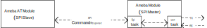
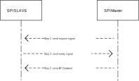
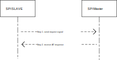

How to Use AT Command with SPI
================================

Introduction
------------
When utilizing an AT Command module via an SPI port, MCU devices act as SPI masters and the AT Command device functions as an SPI slave. 
Data exchange for AT commands between both parties is conducted through the SPI protocol and a specific communication format. 
Compared to the default UART port, the SPI port offers advantages in scenarios requiring high-speed data transfer.

You can refer to :ref:`AT Command MCU Control Mode Configuration <atcmd_mcu_control_mode_configuration>` to enable the SPI port. 
If no pins are configured, the AT Command module will use the default pins, including SPI MOSI, MISO, CLK, CS, as well as two synchronization pins.

Default SPI AT Command Module Pins
----------------------------------
For different chips, the default SPI AT Command module pins are listed in the following table.

.. table:: Default SPI AT Command module pins for chips
   :width: 100%
   :widths: auto

   +-------------+----------+----------+---------+--------+-----------------+----------------+
   | Chip name   | SPI MOSI | SPI MISO | SPI CLK | SPI CS | MASTER SYNC PIN | SLAVE SYNC PIN |
   +=============+==========+==========+=========+========+=================+================+
   | AmebaSmart  | PA_13    | PA_14    | PA_15   | PA_16  |                 |                |
   +-------------+----------+----------+---------+--------+                 +                +
   | AmebaLite   | PA_29    | PA_30    | PA_28   | PA_31  | PA_26           | PA_27          |
   +-------------+----------+----------+---------+--------+                 +                +
   | AmebaDPlus  | PB_24    | PB_25    | PB_23   | PB_26  |                 |                |
   +-------------+----------+----------+---------+--------+-----------------+----------------+

Use AT Command with SPI
------------------------
For example code on using SPI master to communicate with an SPI slave, please refer to ``{SDK}component/example/atcmd_host/spi_master/example_spi_master.c``. 
Before starting development on an MCU, it is highly recommended to run the example code to verify that the wiring and configuration are correct. 
After this, you can refer to our host example to adapt it to the specific MCU platform application you intend to use.

In the example code, we added an UART task to receive AT commands and print the AT responses.The overall data flow diagram is as follows:

   SPI AT Command data flow

Communication Format
~~~~~~~~~~~~~~~~~~~~~
When the SPI AT Command host sends AT commands or transparent data, or receives AT responses from the AT Command module, the following format must be used.

.. table:: SPI AT Command communication format
   :width: 100%
   :widths: auto

   +-----------------------+--------------------+----------------------+--------------------+
   | Magic Number(2 bytes) | Data Len(2 bytes)  | Data(Data Len bytes) | Checksum(4 bytes)  |
   +-----------------------+--------------------+----------------------+--------------------+

Where:

- ``Magic Number``: "AT" in ASCII code.

- ``Data Len``: Data length in bytes.

- ``Checksum``: CRC32 checksum of all except Checksum field.

SPI AT Command Interaction Process
~~~~~~~~~~~~~~~~~~~~~~~~~~~~~~~~~~~
The SPI AT Command exchange process mainly consists of two aspects:

- SPI master sends AT command to slave:

   SPI master sends AT command to slave

The specific instructions for each step are as follows:

   Step 1: SPI master signals the SPI slave to prepare for data reception by pulling down the Master Sync Pin.

   Step 2: SPI slave receives the master’s request through a GPIO interrupt and, upon preparing to receive data, 
   informs the master that it can transmit data by pulling up the Slave Sync Pin.
    
   Step 3:  SPI master begins data transmission, and after the transmission is complete, both the master 
   and the slave reset their respective Sync Pins to their initial states.

- SPI slave sends AT command response to master:

   SPI slave sends AT command response to master

The specific instructions for each step are as follows:

   Step 1: SPI slave signals the master that it is ready to receive the AT command response by pulling up the Slave Sync Pin.

   Step 2: SPI master begins receiving data, and after the transmission is complete, the slave resets the Slave Sync Pin to its initial state.