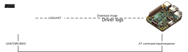
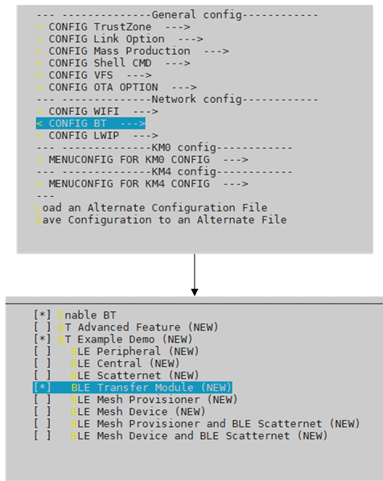
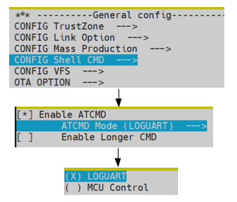
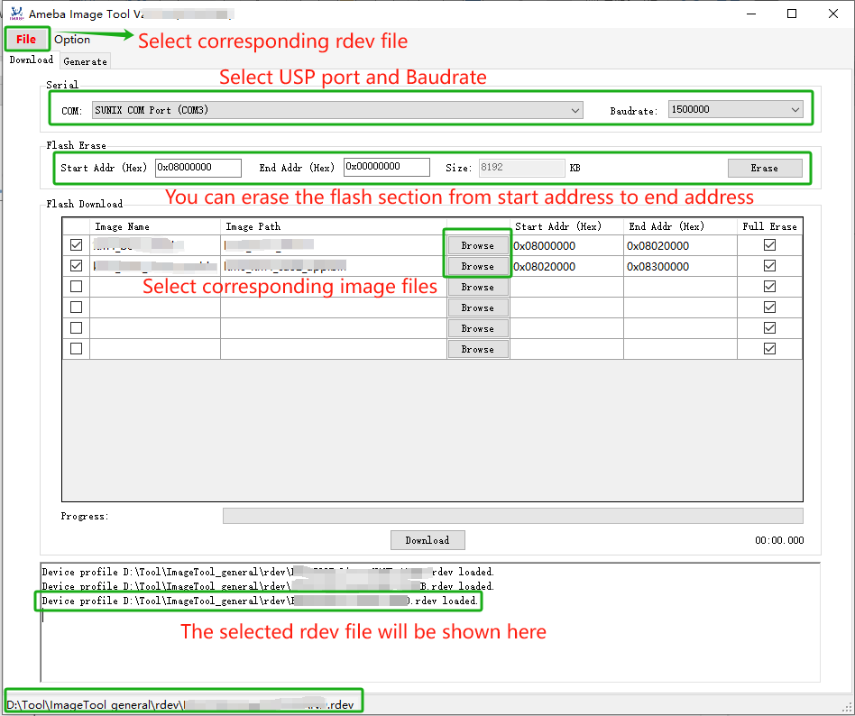

.. _at_command:

Introduction
=============

This article describes the role, usage and version information of AT commands.
There are two currently used AT command modes and scenarios, which can be called LOGUART mode and MCU control mode.

- Scenario 1: LOGUART Mode

  In this mode, users can evaluate the module’s functionality and conduct various tests or demos, such as WiFi or Bluetooth testing.
  It is important to note that in this mode, AT command information will be intermingled with driver logs since both of them will output from LOGUART.

- Scenario 2: MCU Control Mode

  This scenario includes connecting the AT command module via UART/SPI/SDIO for rapid product development by the customer.
  In this mode, AT command information is transmitted and displayed exclusively through UART/SPI/SDIO.

.. table:: AT command modes and scenarios
   :width: 100%
   :widths: auto

   +--------------+-------------------+-------------------+----------------------+
   | Mode         | Connecting Method | Status            | Scenario             |
   +==============+===================+===================+======================+
   | LOGUART      | loguart           | Ready             | Evaluate, Test, Demo |
   +--------------+-------------------+-------------------+----------------------+
   | MCU Control  | uart              | Ready             |                      |
   +              +-------------------+-------------------+                      +
   |              | spi               | Developing        | Product Develop      |
   +              +-------------------+-------------------+                      +
   |              | sdio              | Developing        |                      |
   +--------------+-------------------+-------------------+----------------------+

We set a Ameba module as a slave, and a MCU as a host. The host can send AT commands to the slave and receive the corresponding AT response.
Users can use AmebaLite, AmebaSmart, and AmebaDPlus as slaves for AT commands.
AT commands provides a wide range of command types, such as Wi-Fi commands, MQTT commands, TCP/IP commands and Bluetooth commands.

Hardware Connection
--------------------
Some hardwares are inquired at first.

LOGUART mode
^^^^^^^^^^^^^

- Ameba board: As a slave module.
- PC (or other host device): Input AT commands, observe the response of AT commands.
- LOGUART: Connect module to PC (or other host device), download image, transmit driver and AT command log.

In case of LOGUART mode, the input and response of AT commands are shown in the same port.

   LOGUART mode

MCU Control mode
^^^^^^^^^^^^^^^^^^

- Ameba board: As a slave module.
- Raspberry Pi (or other MCU host device): Input AT commands, observe the response of AT commands.
- LOGUART: Connect module to Raspberry Pi (or other MCU host device), download image, show driver log.
- SPI/UART/SDIO : Connect module to Raspberry Pi (or other MCU host device), transmit AT command, show AT command response.

In case of MCU control mode, the input and response of AT commands can be separated from the driver log, making it easier for users to view the execution results of AT commands more intuitively.

   MCU Control mode

In MCU Control mode, users should prepare the :file:`atcmd_config.json` file in advance, convert it into a bin file (for detailed instructions, please refer to the AN VFS section), and download it to the module’s corresponding flash partition along with the image. If no VFS AT command configuration file is provided, the default configuration of UART will be used.

For different chip types, the default UART input and output ports are shown in the following table.

.. table:: Default UART port and baud rates for chips
   :width: 100%
   :widths: auto

   +-------------+---------+---------+-------------------+
   | IC          | UART TX | UART RX | Default baud rate |
   +=============+=========+=========+===================+
   | AmebaSmart  | PA 3    | PA_2    | 38400             |
   +-------------+---------+---------+-------------------+
   | AmebaLite   | PA_28   | PA_29   | 38400             |
   +-------------+---------+---------+-------------------+
   | AmebaDPlus  | PA_26   | PA_27   | 38400             |
   +-------------+---------+---------+-------------------+

If you want to use Bluetooth AT Commands, you have to run ``$make menuconfig`` to enable BLE transfer module. The procedure is as belows:

.. code-block::

   // Your sdk direction
   cd $<sdk>
   // The chip type you choose, e.g. amebadplus_gcc_project
   cd source/<ameba_type>
   make menuconfig
   // ……

   Enable BLE transfer module

Command Description
--------------------
Command format
~~~~~~~~~~~~~~

The current format of the supported AT command set starts with two capital letters ``AT`` (abbreviation of attention), called the start characters, followed by a ``+``, then by the command name.
If there are several parameters more, it will be followed by an ``=``, then by a parameter list. For example:

.. code-block::

   AT+COMMAND=parameter1, parameter2

In this case, the first two letters ``AT`` are the start characters, indicating that the current string can be recognized as AT command, and ``+`` is used to separate the start characters and subsequent commands.
``COMMAND`` is the specific command name, to be executed right now. 
This command requires some parameters. It contains two parameters in this example: *parameter1* and *parameter2*. 

Sometimes, several parameters in AT command may be ignored, in this case, one or more comma(s) should be input inside parameters.

For example:

.. code-block::

   AT+COMMAND=parameter1, , parameter3

In this command above, there is an invisible *parameter2* between two commas. In this case, the *parameter2* is considered to use default value.

Command Response
~~~~~~~~~~~~~~~~~

After receiving the AT command, the slave judges whether it is a valid command at first.
If it is considered as an invalid command (not in the AT command set), **"unkown command COMMAND"** will be performed.
Otherwise, it will be executed based on the input command and its parameters.
When the command is successfully executed, the command name plus an **OK** mark will generally be returned.
When the command execution fails, the command name plus an **ERROR** mark will generally be returned, followed by an error code.

.. note:: Every AT command has it's corresponding error code number and meaning.

Command Paramter
~~~~~~~~~~~~~~~~~

In this text, when introducing the parameter list of a certain AT command, angle brackets ``< >`` are added to indicate the name of the parameter, and square brackets ``[ ]`` are added to indicate that the parameter is optional.
Different parameters are separated by commas.

For example:

.. code-block::

   AT+COMMAND=<param1>[,<param2>,<param3>]

In this command, the 1st parameter named *param1* is mandatory, the 2nd parameter named *param2*, and the 3rd parameter named *param3* are optional.

Escapes Character
~~~~~~~~~~~~~~~~~~
Especially, in several AT commands, if you really need let one or more comma(s) be part(s) of a parameter, it is recommended to use escapes character ``\`` instead.
Furthermore, the backslash itself is expressed in escapes character ``\\``.

For example:

.. code-block::

   AT+COMMAND=parameter1,head\,tail,head\\tail

In this command, there are 3 parameters at all, the 2nd parameter is a string *head,tail* which includes a comma.
In this case, the comma inside *head,tail* will not be considered as a segmentation of parameters, but as a part of string.
And, the 3rd parameter is a string *head\\tail* including a backslash. Single backslash is illegal here, in other words, single backslash must be followed by a comma or another backslash in these AT commands.
For the other AT commands which do not need use escapes character, the comma will always be considered as a segmentation, and single backslash is allowed as a common character.

.. table:: Commands with escapes character
   :width: 100%
   :widths: auto

   +--------------+-------------------------------------+
   | AT command   | Parameter(s) with escapes character |
   +==============+=====================================+
   | AT+MQTTSUB   | <topic>                             |
   +--------------+-------------------------------------+
   | AT+MQTTUNSUB | <topic>                             |
   +--------------+-------------------------------------+
   | AT+MQTTPUB   | <topic>,<msg>                       |
   +--------------+-------------------------------------+
   | AT+SKTSEND   | <data>                              |
   +--------------+-------------------------------------+

Command Length
~~~~~~~~~~~~~~~

Each AT command must not exceed a length limit, otherwise, the excess part will be ignored.

There are 2 types of length limit. When longer command format is enabled, the length limit is 4095 bytes, otherwise (shorter command format), the length limit is 126 bytes.
When the AT command using escapes character, the escapes characters such as '``\`` or ``\\`` should be regarded as 2 bytes.

You can modify the length limit by ``make menuconfig`` when compiling the SDK. If you select the option ``Enable Longer CMD``, the length limit will be larger.

AT Command List
------------------------------
The AT commands supported now are listed in the following table.

.. table:: AT commands list
   :width: 100%
   :widths: auto

   +------------------------------------------------------+--------------------------------------------------------------+-----------------------------------------------------------+
   | Type                                                 | AT Command                                                   | Description                                               |
   +======================================================+==============================================================+===========================================================+
   | :ref:`Common AT Commands<common_at_commands>`        | :ref:`AT+TEST<common_at_test>`                               | Test AT command ready                                     |
   |                                                      +--------------------------------------------------------------+-----------------------------------------------------------+
   |                                                      | :ref:`AT+LIST<common_at_list>`                               | Print all AT commands                                     |
   |                                                      +--------------------------------------------------------------+-----------------------------------------------------------+
   |                                                      | :ref:`AT+OTACLEAR<common_at_otaclear>`                       | Clear the APP image OTA2 signature                        |
   |                                                      +--------------------------------------------------------------+-----------------------------------------------------------+
   |                                                      | :ref:`AT+OTARECOVER<common_at_otarecover>`                   | Recover the APP image OTA2 signature                      |
   |                                                      +--------------------------------------------------------------+-----------------------------------------------------------+
   |                                                      | :ref:`AT+CPULOAD<common_at_cpuload>`                         | Get the CPU load periodically                             |
   |                                                      +--------------------------------------------------------------+-----------------------------------------------------------+
   |                                                      | :ref:`AT+RST<common_at_rst>`                                 | Restart the module                                        |
   |                                                      +--------------------------------------------------------------+-----------------------------------------------------------+
   |                                                      | :ref:`AT+STATE<common_at_state>`                             | List all running tasks, and current heap                  |
   |                                                      +--------------------------------------------------------------+-----------------------------------------------------------+
   |                                                      | :ref:`AT+GMR<common_at_gmr>`                                 | Show the release version and date                         |
   |                                                      +--------------------------------------------------------------+-----------------------------------------------------------+
   |                                                      | :ref:`AT+LOG<common_at_log>`                                 | Get set or clear the log level                            |
   |                                                      +--------------------------------------------------------------+-----------------------------------------------------------+
   |                                                      | :ref:`AT+RREG<common_at_rreg>`                               | Read the common register value                            |
   |                                                      +--------------------------------------------------------------+-----------------------------------------------------------+
   |                                                      | :ref:`AT+WREG<common_at_wreg>`                               | Write data into register                                  |
   +------------------------------------------------------+--------------------------------------------------------------+-----------------------------------------------------------+
   | :ref:`Wi-Fi AT Commands<wi_fi_at_commands>`          | :ref:`AT+WLCONN<wi_fi_at_wlconn>`                            | Connect to AP (STA mode)                                  |
   |                                                      +--------------------------------------------------------------+-----------------------------------------------------------+
   |                                                      | :ref:`AT+WLDISCONN<wi_fi_at_wldisconn>`                      | Disconnect from AP                                        |
   |                                                      +--------------------------------------------------------------+-----------------------------------------------------------+
   |                                                      | :ref:`AT+WLSTATICIP<wi_fi_at_wlstaticip>`                    | Set static IP for station                                 |
   |                                                      +--------------------------------------------------------------+-----------------------------------------------------------+
   |                                                      | :ref:`AT+PING<wi_fi_at_ping>`                                | PING a domain or IP address                               |
   |                                                      +--------------------------------------------------------------+-----------------------------------------------------------+
   |                                                      | :ref:`AT+IPERF<wi_fi_at_iperf>`                              | IPERF test for TCP or UDP                                 |
   |                                                      +--------------------------------------------------------------+-----------------------------------------------------------+
   |                                                      | :ref:`AT+IPERF3<wi_fi_at_iperf3>`                            | IPERF3 test for TCP                                       |
   |                                                      +--------------------------------------------------------------+-----------------------------------------------------------+
   |                                                      | :ref:`AT+WLSCAN<wi_fi_at_wlscan>`                            | Scan the Wi-Fi                                            |
   |                                                      +--------------------------------------------------------------+-----------------------------------------------------------+
   |                                                      | :ref:`AT+WLRSSI<wi_fi_at_wlrssi>`                            | Get the RSSI of connected AP currently                    |
   |                                                      +--------------------------------------------------------------+-----------------------------------------------------------+
   |                                                      | :ref:`AT+WLSTARTAP<wi_fi_at_wlstartap>`                      | Start this module as a Wi-Fi AP                           |
   |                                                      +--------------------------------------------------------------+-----------------------------------------------------------+
   |                                                      | :ref:`AT+WLSTOPAP<wi_fi_at_wlstopap>`                        | Stop this module as a Wi-Fi AP                            |
   |                                                      +--------------------------------------------------------------+-----------------------------------------------------------+
   |                                                      | :ref:`AT+WLSTATE<wi_fi_at_wlstate>`                          | Get the Wi-Fi state of module, maybe as an AP or a device |
   |                                                      +--------------------------------------------------------------+-----------------------------------------------------------+
   |                                                      | :ref:`AT+WLRECONN<wi_fi_at_wlreconn>`                        | Enable or disable Wi-Fi auto-connection                   |
   |                                                      +--------------------------------------------------------------+-----------------------------------------------------------+
   |                                                      | :ref:`AT+WLPROMISC<wi_fi_at_wlpromisc>`                      | Enable or disable Wi-Fi promisc                           |
   |                                                      +--------------------------------------------------------------+-----------------------------------------------------------+
   |                                                      | :ref:`AT+WLDBG<wi_fi_at_wldbg>`                              | Test Wi-Fi iwpriv command                                 |
   |                                                      +--------------------------------------------------------------+-----------------------------------------------------------+
   |                                                      | :ref:`AT+WLWPS<wi_fi_at_wlwps>`                              | Test Wi-Fi wps command                                    |
   |                                                      +--------------------------------------------------------------+-----------------------------------------------------------+
   |                                                      | :ref:`AT+WLPS<wi_fi_at_wlps>`                                | Enable or disable lps, ips                                |
   +------------------------------------------------------+--------------------------------------------------------------+-----------------------------------------------------------+
   | :ref:`MQTT AT Commands<mqtt_at_commands>`            | :ref:`AT+MQTTOPEN<mqtt_at_mqttopen>`                         | Create an MQTT entity                                     |
   |                                                      +--------------------------------------------------------------+-----------------------------------------------------------+
   |                                                      | :ref:`AT+MQTTCLOSE<mqtt_at_mqttclose>`                       | Delete an MQTT entity                                     |
   |                                                      +--------------------------------------------------------------+-----------------------------------------------------------+
   |                                                      | :ref:`AT+MQTTCONN<mqtt_at_mqttconn>`                         | Connect to host server                                    |
   |                                                      +--------------------------------------------------------------+-----------------------------------------------------------+
   |                                                      | :ref:`AT+MQTTDISCONN<mqtt_at_mqttdisconn>`                   | Disconnect from host server                               |
   |                                                      +--------------------------------------------------------------+-----------------------------------------------------------+
   |                                                      | :ref:`AT+MQTTSUB<mqtt_at_mqttsub>`                           | Subscribe a topic from host server                        |
   |                                                      +--------------------------------------------------------------+-----------------------------------------------------------+
   |                                                      | :ref:`AT+MQTTUNSUB<mqtt_at_mqttunsub>`                       | Unsubscribe a topic from host server                      |
   |                                                      +--------------------------------------------------------------+-----------------------------------------------------------+
   |                                                      | :ref:`AT+MQTTPUB<mqtt_at_mqttpub>`                           | Publish a message for specific topic                      |
   |                                                      +--------------------------------------------------------------+-----------------------------------------------------------+
   |                                                      | :ref:`AT+MQTTCFG<mqtt_at_mqttcfg>`                           | Configure the parameters of MQTT entity                   |
   |                                                      +--------------------------------------------------------------+-----------------------------------------------------------+
   |                                                      | :ref:`AT+MQTTRESET<mqtt_at_mqttreset>`                       | Reset all MQTT entities                                   |
   +------------------------------------------------------+--------------------------------------------------------------+-----------------------------------------------------------+
   | :ref:`TCP/IP AT Commands<tcp_ip_at_commands>`        | :ref:`AT+SKTSERVER<tcp_ip_at_sktserver>`                     | Start as a socket server                                  |
   |                                                      +--------------------------------------------------------------+-----------------------------------------------------------+
   |                                                      | :ref:`AT+SKTCLIENT<tcp_ip_at_sktclient>`                     | Start as a socket client                                  |
   |                                                      +--------------------------------------------------------------+-----------------------------------------------------------+
   |                                                      | :ref:`AT+SKTDEL<tcp_ip_at_sktdel>`                           | Stop a (all) socket server(s) or client(s)                |
   |                                                      +--------------------------------------------------------------+-----------------------------------------------------------+
   |                                                      | :ref:`AT+SKTTT<tcp_ip_at_skttt>`                             | Enable transparent transfer mode                          |
   |                                                      +--------------------------------------------------------------+-----------------------------------------------------------+
   |                                                      | :ref:`AT+SKTSEND<tcp_ip_at_sktsend>`                         | Send socket message                                       |
   |                                                      +--------------------------------------------------------------+-----------------------------------------------------------+
   |                                                      | :ref:`AT+SKTREAD<tcp_ip_at_sktread>`                         | Receive socket message                                    |
   |                                                      +--------------------------------------------------------------+-----------------------------------------------------------+
   |                                                      | :ref:`AT+SKTRECVCFG<tcp_ip_at_sktrecvcfg>`                   | Configure socket receiving                                |
   |                                                      +--------------------------------------------------------------+-----------------------------------------------------------+
   |                                                      | :ref:`AT+SKTSTATE<tcp_ip_at_sktstate>`                       | Get the socket state currently                            |
   +------------------------------------------------------+--------------------------------------------------------------+-----------------------------------------------------------+
   | :ref:`Bluetooth AT Commands<bluetooth_at_commands>`  |                                                              |                                                           |
   +------------------------------------------------------+--------------------------------------------------------------+-----------------------------------------------------------+

AT Command Version
----------------------
Users can query the current firmware’s AT command version by executing the AT+GMR command. The version number employs a semantic versioning system, and its format is as follows:

.. code-block::

    <major>.<minor>.<patch>

where:

- <major>is the major version. Represents major updates, typically including the introduction of new chip support, new features, etc.

- <minor>is the minor version. Represents important updates, typically including new commands, bug fixes, etc.

- <patch>is the patch version. Represents fixing some issues without adding any new features.

For example:

.. code-block::

	// send ATCMD
	AT+GMR
	// receive ATCMD response
	+GMR:
	ATCMD VERSION: v2.2.1
	SDK VERSION: v3.5

Build image
----------------------
Preparation
~~~~~~~~~~~~~~~~~~~~~~
Besides obtaining the release version from GitHub, users can also build images with ``{sdk}`` by self. For detailed building procedure, please refer to the AN documents for different type of chips.

Building
~~~~~~~~~~~~~~~~
After preparations above, users can build images in the ``{sdk}`` directory.

Users can run ``make menuconfig`` to choice MCU Control mode or LOGUART mode. The procedure is as follows:

.. code-block::

   // Your SDK direction
   cd $<sdk>
   // The chip type you choose, e.g. amebasmart
   cd source/<ameba_type>
   make menuconfig
   // ……

   Choice mode

After ``make menuconfig``, users can run ``make all`` to rebuild the project.

After building successfully, the image files can be found at ``{ameba_type}`` directory.

Downloading Image
----------------------------
There are two ways to download image to Flash:

(1) Image Tool, a software provided by Realtek (recommended).

(2) GDB Server, mainly used for GDB debug user case.

In this section, we will introduce the first one.

The Image Tool is the official image download tool developed by Realtek for Ameba series SoC. It can be used to download images to the Flash of device through the UART download interface.

When you open the image tool, it is shown as the following figure.

   Image Tool

Device profiles provide the necessary device information required for image download, with the naming rules:

.. code-block::

   <SoC name>_<OS type>_<Flash type>[_<Extra info>].rdev

For different type of chips, you should select the corresponding rdev file before downloading image to flash. You can click the :menuselection:`File > Open` to select corresponding rdev file. Then, select the corresponding image files.

Before downloading image, the chip should enter download mode at first.
You can press and hold the :guilabel:`DOWNLOAD` button on chip, then press the :guilabel:`CHIP_EN` button, the chip will enter download mode after you loosen them both.

Then connect the chip module to PC with USB cable, and press the :guilabel:`DOWNLOAD` button of Image Tool to start downloading the image files.

