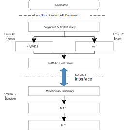

.. _fullmac:

Introduction
------------------------
The FullMAC solution provides a standard wireless network interface for the host, allowing Wi-Fi and Bluetooth applications (such as wpa_supplicant, TCP/IP stack, etc.) to run smoothly on the operating system.

Transport Interface
~~~~~~~~~~~~~~~~~~~
The transport interfaces supported by FullMAC are listed below:

.. table::
   :width: 100%
   :widths: auto

   +------------+--------------------------+-------------------------+-------+-----------+------------------------------------------------------+
   | Ameba SoC  | Interface                | Host (Operating system) | Wi-Fi | Bluetooth | Transport description                                |
   |            |                          +----------+--------------+       |           |                                                      |
   |            |                          | Linux    | FreeRTOS     |       |           |                                                      |
   +============+==========================+==========+==============+=======+===========+======================================================+
   | AmebaDPlus | SDIO                     | Y        | Y            | Y     | Y         | Wi-Fi and Bluetooth, traffic for both runs over SDIO |
   |            +--------------------------+----------+--------------+-------+-----------+------------------------------------------------------+
   |            | SPI                      | Y        | Y            | Y     | Y         | Wi-Fi and Bluetooth, traffic for both runs over SPI  |
   |            +--------------------------+----------+--------------+-------+-----------+------------------------------------------------------+
   |            | USB                      | Y        | X            | Y     | Y         | Wi-Fi and Bluetooth, traffic for both runs over USB  |
   |            +--------------------------+----------+--------------+-------+-----------+------------------------------------------------------+
   |            | UART                     | TBD      | TBD          | X     | Y         | Bluetooth only runs over UART                        |
   |            +--------------------------+----------+--------------+-------+-----------+------------------------------------------------------+
   |            | SDIO (Wi-Fi) + UART (BT) | Y        | Y            | Y     | Y         | Wi-Fi runs over SDIO, and Bluetooth runs over UART   |
   |            +--------------------------+----------+--------------+-------+-----------+------------------------------------------------------+
   |            | SPI (Wi-Fi) + UART (BT)  | Y        | Y            | Y     | Y         | Wi-Fi runs over SPI, and Bluetooth runs over UART    |
   |            +--------------------------+----------+--------------+-------+-----------+------------------------------------------------------+
   |            | USB (Wi-Fi) + UART (BT)  | TBD      | TBD          | Y     | Y         | Wi-Fi runs over USB, and Bluetooth runs over UART    |
   +------------+--------------------------+----------+--------------+-------+-----------+------------------------------------------------------+
   | AmebaLite  | SDIO                     |          |              |       |           |                                                      |
   |            +--------------------------+----------+--------------+-------+-----------+------------------------------------------------------+
   |            | SPI                      |          |              |       |           |                                                      |
   |            +--------------------------+----------+--------------+-------+-----------+------------------------------------------------------+
   |            | USB                      |          |              |       |           |                                                      |
   |            +--------------------------+----------+--------------+-------+-----------+------------------------------------------------------+
   |            | UART                     |          |              |       |           |                                                      |
   |            +--------------------------+----------+--------------+-------+-----------+------------------------------------------------------+
   |            | SDIO (Wi-Fi) + UART (BT) |          |              |       |           |                                                      |
   |            +--------------------------+----------+--------------+-------+-----------+------------------------------------------------------+
   |            | SPI (Wi-Fi) + UART (BT)  |          |              |       |           |                                                      |
   |            +--------------------------+----------+--------------+-------+-----------+------------------------------------------------------+
   |            | USB (Wi-Fi) + UART (BT)  |          |              |       |           |                                                      |
   +------------+--------------------------+----------+--------------+-------+-----------+------------------------------------------------------+
   | AmebaSmart | SDIO                     |          |              |       |           |                                                      |
   |            +--------------------------+----------+--------------+-------+-----------+------------------------------------------------------+
   |            | SPI                      |          |              |       |           |                                                      |
   |            +--------------------------+----------+--------------+-------+-----------+------------------------------------------------------+
   |            | USB                      |          |              |       |           |                                                      |
   |            +--------------------------+----------+--------------+-------+-----------+------------------------------------------------------+
   |            | UART                     |          |              |       |           |                                                      |
   |            +--------------------------+----------+--------------+-------+-----------+------------------------------------------------------+
   |            | SDIO (Wi-Fi) + UART (BT) |          |              |       |           |                                                      |
   |            +--------------------------+----------+--------------+-------+-----------+------------------------------------------------------+
   |            | SPI (Wi-Fi) + UART (BT)  |          |              |       |           |                                                      |
   |            +--------------------------+----------+--------------+-------+-----------+------------------------------------------------------+
   |            | USB (Wi-Fi) + UART (BT)  |          |              |       |           |                                                      |
   +------------+--------------------------+----------+--------------+-------+-----------+------------------------------------------------------+

Architecture
~~~~~~~~~~~~~
The FullMAC driver implements the following modules:

- Provide a data transmission path between the host and the device based on a private transmission protocol via the SDIO/SPI interface
- Adapt the cfg80211 layer and register the wireless network interface (wlan0/1) in the kernel to enable network data packet interaction between the Linux kernel and the |CHIP_NAME|
- Provide commonly-used and proprietary commands to configure the parameters of Wi-Fi interface

To clarify, in the following sections, the term ``host`` refers to the Linux PC acting as the host, and the term ``device`` refers to the |CHIP_NAME| serving as the device.

   FullMAC architecture

Features
~~~~~~~~~~
.. table::
   :width: 100%
   :widths: auto

   +-------------------------------+----------------------------+------------------------------+
   | Features                      | Linux host                 | FreeRTOS host                |
   +===============================+============================+==============================+
   | Supported platforms           | Y                          | Y                            |
   +-------------------------------+----------------------------+------------------------------+
   | Wi-Fi configuration mechanism | Standard Linux APIs        | FreeRTOS Wi-Fi APIs          |
   +-------------------------------+----------------------------+------------------------------+
   | Recommended host type         | Y                          | X                            |
   +-------------------------------+----------------------------+------------------------------+
   | Wi-Fi features                | 802.11 a/b/g/n/ax                                         |
   +-------------------------------+-----------------------------------------------------------+
   | Transport interface           | - SDIO                                                    |
   |                               | - SPI                                                     |
   |                               | - USB                                                     |
   |                               | - UART                                                    |
   +-------------------------------+-----------------------------------------------------------+
   | Transport combinations        | - SDIO only                                               |
   |                               | - SPI only                                                |
   |                               | - USB only                                                |
   |                               | - SDIO + UART                                             |
   |                               | - SPI + UART                                              |
   |                               | - USB + UART                                              |
   +-------------------------------+----------------------------+------------------------------+
   | Wi-Fi mode                    | - Station                  | - Station                    |
   |                               | - SoftAP                   | - SoftAP                     |
   |                               | - NAN                      |                              |
   |                               | - P2P GO                   |                              |
   +-------------------------------+----------------------------+------------------------------+
   | Wi-Fi security                | - Open                                                    |
   |                               | - WPA                                                     |
   |                               | - WPA2                                                    |
   |                               | - WPA3                                                    |
   +-------------------------------+-----------------------------------------------------------+
   | Power saving                  | Wowlan                                                    |
   |                               +----------------------------+------------------------------+
   |                               | Proxy Offload:             | \-                           |
   |                               |                            |                              |
   |                               | - ARP Response             |                              |
   |                               | - mDNS                     |                              |
   |                               | - ICMP Response (TODO)     |                              |
   |                               | - SNMP (TODO)              |                              |
   |                               | - LLMNR (TODO)             |                              |
   |                               | - SSDP/SLP/WSD/LLTD (TODO) |                              |
   +-------------------------------+----------------------------+------------------------------+
   | Bluetooth features            | - BLE 4.0                                                 |
   |                               | - BLE 5.0                                                 |
   |                               | - BLE 5.3                                                 |
   +-------------------------------+----------------------------+------------------------------+
   | SoC supported                 | AmebaDPlus                 | AmebaDPlus                   |
   +-------------------------------+----------------------------+------------------------------+

File Tree
----------
Wi-Fi
~~~~~~

.. tabs::

   .. tab:: FreeRTOS

      The FullMAC driver of FreeRTOS in the SDK is located at 

      ::

         Low-level hardware driver
         └── common
             ├── rtw_ioctl.c
             ├── rtw_ioctl.h
             ├── rtw_llhw_event.h
             ├── rtw_llhw_event_rx.c
             ├── rtw_llhw_event_tx.c
             ├── rtw_llhw_hci.c
             ├── rtw_llhw_hci.h
             ├── rtw_llhw_hci_memory.c
             ├── rtw_llhw_ops.c
             ├── rtw_llhw_pkt_rx.c
             ├── rtw_llhw_pkt_tx.c
             ├── rtw_llhw_trx.h
             └── rtw_protocal_offload.c
         └── sdio
             ├── Kbuild
             ├── rtw_sdio.h
             ├── rtw_sdio_drvio.c
             ├── rtw_sdio_drvio.h
             ├── rtw_sdio_fwdl.c
             ├── rtw_sdio_init.c
             ├── rtw_sdio_ops.c
             ├── rtw_sdio_ops.h
             ├── rtw_sdio_probe.c
             └── rtw_sdio_reg.h
         └── spi
             ├── Kbuild
             ├── rtw_spi.h
             ├── rtw_spi_ops.c
             ├── rtw_spi_probe.c
             └── spidev-overlay.dts
         └── usb
             ├── Kbuild
             ├── rtw_usb.h
             ├── rtw_usb_ops.c
             └── rtw_usb_probe.c

         FullMAC driver
         ├── rtw_acs.c
         ├── rtw_acs.h
         ├── rtw_cfg80211_fullmac.h
         ├── rtw_cfg80211_ops.c
         ├── rtw_cfg80211_ops_ap.c
         ├── rtw_cfg80211_ops_key.c
         ├── rtw_cfg80211_ops_nan.c
         ├── rtw_cfg80211_ops_p2p.c
         ├── rtw_cfgvendor.c
         ├── rtw_cfgvendor.h
         ├── rtw_drv_probe.c
         ├── rtw_drv_probe.h
         ├── rtw_ethtool_ops.c
         ├── rtw_ethtool_ops.h
         ├── rtw_functions.h
         ├── rtw_netdev_ops.c
         ├── rtw_netdev_ops.h
         ├── rtw_netdev_ops_p2p.c
         ├── rtw_proc.c
         ├── rtw_proc.h
         ├── rtw_promisc.c
         ├── rtw_promisc.h
         ├── rtw_regd.c
         ├── rtw_regd.h
         ├── rtw_wiphy.c
         └── rtw_wiphy.h

   .. tab:: Linux

      The FullMAC driver of Linux in the SDK is located at ``{SDK}/component/wifi/cfg80211_fullmac``. The main focus should be on the files below.

      ::

         Low-level hardware driver
         └── common
             ├── rtw_ioctl.c
             ├── rtw_ioctl.h
             ├── rtw_llhw_event.h
             ├── rtw_llhw_event_rx.c
             ├── rtw_llhw_event_tx.c
             ├── rtw_llhw_hci.c
             ├── rtw_llhw_hci.h
             ├── rtw_llhw_hci_memory.c
             ├── rtw_llhw_ops.c
             ├── rtw_llhw_pkt_rx.c
             ├── rtw_llhw_pkt_tx.c
             ├── rtw_llhw_trx.h
             └── rtw_protocal_offload.c
         └── sdio
             ├── Kbuild
             ├── rtw_sdio.h
             ├── rtw_sdio_drvio.c
             ├── rtw_sdio_drvio.h
             ├── rtw_sdio_fwdl.c
             ├── rtw_sdio_init.c
             ├── rtw_sdio_ops.c
             ├── rtw_sdio_ops.h
             ├── rtw_sdio_probe.c
             └── rtw_sdio_reg.h
         └── spi
             ├── Kbuild
             ├── rtw_spi.h
             ├── rtw_spi_ops.c
             ├── rtw_spi_probe.c
             └── spidev-overlay.dts
         └── usb
             ├── Kbuild
             ├── rtw_usb.h
             ├── rtw_usb_ops.c
             └── rtw_usb_probe.c

         FullMAC driver
         ├── rtw_acs.c
         ├── rtw_acs.h
         ├── rtw_cfg80211_fullmac.h
         ├── rtw_cfg80211_ops.c
         ├── rtw_cfg80211_ops_ap.c
         ├── rtw_cfg80211_ops_key.c
         ├── rtw_cfg80211_ops_nan.c
         ├── rtw_cfg80211_ops_p2p.c
         ├── rtw_cfgvendor.c
         ├── rtw_cfgvendor.h
         ├── rtw_drv_probe.c
         ├── rtw_drv_probe.h
         ├── rtw_ethtool_ops.c
         ├── rtw_ethtool_ops.h
         ├── rtw_functions.h
         ├── rtw_netdev_ops.c
         ├── rtw_netdev_ops.h
         ├── rtw_netdev_ops_p2p.c
         ├── rtw_proc.c
         ├── rtw_proc.h
         ├── rtw_promisc.c
         ├── rtw_promisc.h
         ├── rtw_regd.c
         ├── rtw_regd.h
         ├── rtw_wiphy.c
         └── rtw_wiphy.h

Bluetooth
~~~~~~~~~~

.. tabs::

   .. tab:: FreeRTOS

   .. tab:: Linux

Porting Guide
----------------
FreeRTOS
~~~~~~~~~
Hardware Configuration
^^^^^^^^^^^^^^^^^^^^^^^
The FullMAC can be used on FreeRTOS with different interfaces, with different pins used for FullMAC function.

Software Configuration
^^^^^^^^^^^^^^^^^^^^^^^
Wi-Fi
******
Device Driver
#############

1. Execute ``./menuconfig.py`` under the path ``{SDK}/amebadplus_gcc_project``

   a. Click :menuselection:`CONFIG Link Option > IMG2(Application) running on FLASH or PSRAM?`, and select :menuselection:`PSRAM`

      .. figure:: ../figures/sdio_config_flash_or_psram.png
         :scale: 80%
         :align: center

   b. Click :menuselection:`CONFIG INIC ITNF > INIC Mode`, select :menuselection:`SDIO_FULLMAC` for SDIO interface or :menuselection:`SPI_FULLMAC` for SPI interface.

      .. figure:: ../figures/wifi_sdio_spi_selection.png
         :scale: 100%
         :align: center

2. Execute the make command to generate :file:`km4_boot_all.bin` and :file:`km0_km4_app.bin` after the build is successfully complete.

3. Use the ImageTool to flash the bin files to |CHIP_NAME| and resst the device.

Host Driver
#############

Bluetooth
**********
Device Driver
#############

Host Driver
#############

Linux
~~~~~~~~~
Hardware Configuration
^^^^^^^^^^^^^^^^^^^^^^^
The FullMAC can be used on Linux PC or Raspberry Pi with different interfaces, with different pins used for FullMAC function.

.. table:: FullMAC used pins of different interfaces
   :width: 100%
   :widths: auto
   :name: fullmac_pins

   +------------+-----------------+------------------+---------------+-----------------------------------------------------------------+
   | Interface  | AmebaDPlus pin  | Raspberry Pi pin | Function      | Description                                                     |
   +============+=================+==================+===============+=================================================================+
   | SDIO       | PB6             | GPIO 26          | SDIO_DAT2     | SDIO pins                                                       |
   |            +-----------------+------------------+---------------+                                                                 |
   |            | PB7             | GPIO 27          | SDIO_DAT3     |                                                                 |
   |            +-----------------+------------------+---------------+                                                                 |
   |            | PB8             | GPIO 23          | SDIO_CMD      |                                                                 |
   |            +-----------------+------------------+---------------+                                                                 |
   |            | PB9             | GPIO 22          | SDIO_CLK      |                                                                 |
   |            +-----------------+------------------+---------------+                                                                 |
   |            | PB13            | GPIO 24          | SDIO_DAT0     |                                                                 |
   |            +-----------------+------------------+---------------+                                                                 |
   |            | PB14            | GPIO 25          | SDIO_DAT1     |                                                                 |
   +------------+-----------------+------------------+---------------+-----------------------------------------------------------------+
   | SPI        | PB24            | GPIO 10          | SPI_MOSI      | SPI pins                                                        |
   |            +-----------------+------------------+---------------+                                                                 |
   |            | PB25            | GPIO 9           | SPI_MISO      |                                                                 |
   |            +-----------------+------------------+---------------+                                                                 |
   |            | PB23            | GPIO 11          | SPI_CLK       |                                                                 |
   |            +-----------------+------------------+---------------+                                                                 |
   |            | PB26            | GPIO 8           | SPI_CS        |                                                                 |
   |            +-----------------+------------------+---------------+-----------------------------------------------------------------+
   |            | PB8             | GPIO 23          | DEV_TX_REQ    | An output pin for |CHIP_NAME|, used to indicate to the host     |
   |            |                 |                  |               |                                                                 |
   |            |                 |                  |               | that it has a data packet to send with a rising edge.           |
   |            +-----------------+------------------+---------------+-----------------------------------------------------------------+
   |            | PB9             | GPIO 22          | DEV_READY     | An output pin for |CHIP_NAME|, used to indicate its readiness   |
   |            |                 |                  |               |                                                                 |
   |            |                 |                  |               | for SPI transcation to host.                                    |
   |            |                 |                  |               |                                                                 |
   |            |                 |                  |               | - 1: Device is ready.                                           |
   |            |                 |                  |               | - 0: Device is busy.                                            |
   +------------+-----------------+------------------+---------------+-----------------------------------------------------------------+
   | USB???     | PB6             | GPIO 26          | SDIO_DAT2     | SDIO_DAT2                                                       |
   |            +-----------------+------------------+---------------+-----------------------------------------------------------------+
   |            | PB7             | GPIO 27          | SDIO_DAT3     | SDIO_DAT3                                                       |
   |            +-----------------+------------------+---------------+-----------------------------------------------------------------+
   |            | PB8             | GPIO 23          | SDIO_CMD      | SDIO_CMD                                                        |
   |            +-----------------+------------------+---------------+-----------------------------------------------------------------+
   |            | PB9             | GPIO 22          | SDIO_CLK      | SDIO_CLK                                                        |
   |            +-----------------+------------------+---------------+-----------------------------------------------------------------+
   |            | PB13            | GPIO 24          | SDIO_DAT0     | SDIO_DAT0                                                       |
   |            +-----------------+------------------+---------------+-----------------------------------------------------------------+
   |            | PB14            | GPIO 25          | SDIO_DAT1     | SDIO_DAT1                                                       |
   +------------+-----------------+------------------+---------------+-----------------------------------------------------------------+
   | UART???    | PB14            | GPIO 25          | SDIO_DAT1     | SDIO_DAT1                                                       |
   +------------+-----------------+------------------+---------------+-----------------------------------------------------------------+

.. tabs::

   .. tab:: Linux PC

      For the Linux PC, an SDIO host peripheral is required. Please connect to the |CHIP_NAME| with corresponding pins according to :ref:`fullmac_pins`.

      The |CHIP_NAME| can also use a gold finger adapter to convert the SDIO pins into a standard SD card, as the following figure shows, and supports the hardware platform only with an SD card slot.
      Note that in this case, you need to contact us to modify the demo board circuit.

      .. This figure is located at ../../wifi_bridge/figures.
         If the figure name has been changed, make sure to update sdio_fullmac.rst accordingly.

      .. figure:: ../../wifi/wifi_bridge/figures/sdio_adapter_board.jpg
         :align: center
         :scale: 50%

         |CHIP_NAME| SDIO adapter board

   .. tab:: Raspberry Pi

      The pin location of |CHIP_NAME| demo board corresponds to the pin location of Raspberry Pi.
      In order to run at high speed, it's strongly recommended to plug the demo board directly into Raspberry Pi, as the following figure shows.

      The pins used for SDIO FullMAC on Raspberry Pi are listed in :ref:`fullmac_pins`.

      .. figure:: ../../wifi/wifi_bridge/figures/connection_with_raspberry_pi.jpg
         :align: center
         :scale: 50%

         |CHIP_NAME| connection with Raspberry Pi

Software Configuration
^^^^^^^^^^^^^^^^^^^^^^^
Wi-Fi
***************
Host Driver
#############

The FullMAC driver has been tested and verified to work on Linux kernel versions 5.4 and 5.10.
If you encounter any compilation errors on other kernel versions, please contact us.

.. admonition:: Prerequisites

   Install the following software packages on Linux system first.

   .. code-block:: sh

      sudo apt-get install build-essential
      sudo apt install dhcpcd
      sudo apt install hostapd
      sudo apt install dhcpd

1. Enable the SDIO, SPI, or USB function.

   - For Linux PC, skip this step.

   - For Raspberry Pi:

   .. tabs::

      .. tab:: SDIO

         Use ``dtoverlay`` command to configure SDIO.

         For Raspberry Pi 4, type the following command:

         .. code-block:: sh

            sudo dtoverlay sdio poll_once=off

      .. tab:: SPI

         i. Enable the SPI peripheral.

            .. code-block:: sh

               sudo raspi-config

         ii. Select :menuselection:`Interface Options > SPI > Yes`

            .. figure:: ../figures/raspberry_pi_spi_config.png
               :scale: 100%
               :align: center

         iii. Generate and apply Device Tree Overlay

            .. code-block:: sh

               sudo su
               cd {driver_path}/cfg80211_fullmac/rtl8730e/spi
               dtc -@ -Hepapr -I dts -O dtb -o inic_spidev.dtbo spidev-overlay.dts
               cp inic_spidev.dtbo /boot/overlays/
               dtoverlay inic_spidev

      .. tab:: USB

2. Build the module.

   a. In the path ``/component/wifi/cfg80211_fullmac``, execute the following script with an interface parameter to configure the host driver.

   .. tabs::

      .. tab:: SDIO

         .. code-block::

            ./fullmac_setup.sh sdio

      .. tab:: SPI

         .. code-block::

            ./fullmac_setup.sh spi

      .. tab:: USB

         .. code-block::

            ./fullmac_setup.sh usb

   b. Copy the folder of ``cfg80211_fullmac`` to the Linux system.

   c. Open the terminal and execute the following command:

      .. code-block::

         cd {driver_path}/cfg80211_fullmac;make

.. _load_the_module_step:

3. Load the module.

   .. tabs::

      .. tab:: SDIO

         :file:`fullmac_sdio.ko` is generated in ``/cfg80211_fullmac/sdio``.

         .. code-block:: sh

            sudo su
            cp sdio/fullmac_sdio.ko /lib/modules/XXX/
            depmod
            modprobe fullmac_sdio

      .. tab:: SPI

         :file:`fullmac_spi.ko` is generated in ``/cfg80211_fullmac/spi``.

         .. code-block::

            sudo su
            cp spi/fullmac_spi.ko /lib/modules/XXX/
            depmod
            modprobe fullmac_spi

      .. tab:: USB

         :file:`fullmac_spi.ko` is generated in ``/cfg80211_fullmac/usb``.

         .. code-block::

            sudo su
            cp usb/fullmac_spi.ko /lib/modules/XXX/
            depmod
            modprobe fullmac_usb

   When loading module is successful, use ``ifconfig`` command to get the information of net device.
   The net device whose MAC address starts with ``00:e0:4c`` is STA, and the net device whose MAC address starts with ``00:e1:4c is`` softAP.

   The following is an example, in which **wlan1** is STA and **wlan2** is softAP.

   .. figure:: ../figures/ifconfig_sta_softap.png
      :scale: 100%
      :align: center   

4. Connect to STA.

   a. Create :file:`wpa_supplicant.conf` under the path ``/etc/wpa_supplicant/`` and add AP information.

      There is an example configuration for WPA2.

      .. code-block::

         ctrl_interface=/var/run/wpa_supplicant
         network={
                  ssid="HUAWEI-JX2UX5_HiLink_5G"
                  psk="12345678"
         }

   b. Connect with the following command:

      .. code-block::

         Wpa_supplicant -D nl80211 -i wlanX -c /etc/wpa_supplicant/wpa_supplicant.conf -dd > /var/wifi_log

   c. Obtain the IP address with the following command:

      .. code-block::

         dhcpcd wlanX

   .. note::
      - The *wlanX* in the above command refers to the name of STA obtained from :ref:`Step 3 <load_the_module_step>`.
      - The configuration files of OPEN and WPA3 are different, please refer to the official supplicant documentation for details.
      - For Ubuntu system, if you want to manually connect using command ``wpa_supplicant`` and obtain an IP address, first stop NetworkManager and DHCP service to avoid the influence of NetworkManager on *wpa_supplicant*.

        .. code-block:: sh

           sudo su
           systemctl stop NetworkManager
           systemctl disable NetworkManager
           systemctl stop dhcpcd.service

5. Setup the softAP.

   a. Create :file:`hostapd.conf` under the path ``/etc/hostapd/`` and add the configuration information.

      Take WPA2 as an example, you can add the following information:

      .. code-block::

         driver=nl80211

         logger_syslog=-1
         logger_syslog_level=2
         logger_stdout=-1
         logger_stdout_level=2

         ctrl_interface=/var/run/hostapd

         hw_mode=g
         channel=6
         ssid=aaa_test
         beacon_int=100
         dtim_period=1
         max_num_sta=8
         rts_threshold=2347
         fragm_threshold=2346

         ieee80211n=1

         erp_send_reauth_start=1

         wpa=2
         wpa_key_mgmt=WPA-PSK
         wpa_pairwise=CCMP
         wpa_passphrase=12345678

      .. note::

         This configuration file is applicable for WPA2 softAP.
         If you want to use OPEN or WPA3, please refer to the official hostapd documentation to set the parameters.

   b. Create :file:`udhcpd_wlanX.conf` under the path ``/etc/`` and add the following information:

      .. code-block::

         # The start and end of the IP lease block
         start		192.168.43.20
         end		192.168.43.254

         # The interface that udhcpd will use
         interface	wlanX

         opt	dns	192.168.43.1 129.219.13.81
         option	subnet	255.255.255.0
         opt	router	192.168.43.1
         option	domain	local
         option	lease	864000		# default: 10 days
         option	msstaticroutes	10.0.0.0/8 10.127.0.1		# single static route
         option	staticroutes	10.0.0.0/8 10.127.0.1, 10.11.12.0/24 10.11.12.1
         option	0x08	01020304	# option 8: "cookie server IP addr: 1.2.3.4"

   c. Start the softAP.

      .. code-block::

         hostapd /etc/hostapd/hostapd.conf -i wlanX

   d. Set the IP address.

      .. code-block::

         ifconfig wlanX 192.168.43.1

   e. Start the DHCP server.

      .. code-block::

         udhcpd -f /etc/udhcpd_wlanX.conf

   .. note::
      The *wlanX* in the above command refers to the name of softAP obtained from :ref:`Step 3 <load_the_module_step>`.

Bluetooth
***************
Host Driver
#############

Throughput
--------------

.. table::
   :width: 100%
   :widths: auto

   +----------------+-----------------------+--------+---------------+---------------+
   | Interface      | Wi-Fi driver location | Item   | BW 20M (Mbps) | BW 40M (Mbps) |
   +================+=======================+========+===============+===============+
   | SDIO :sup:`[1]`| KM0                   | TCP RX | 36            | 42            |
   |                |                       +--------+---------------+---------------+
   |                |                       | TCP TX | 46            | 54            |
   |                |                       +--------+---------------+---------------+
   |                |                       | UDP RX | 50            | 60            |
   |                |                       +--------+---------------+---------------+
   |                |                       | UDP TX | 55            | 62            |
   |                +-----------------------+--------+---------------+---------------+
   |                | KM4 (331MHz)          | TCP RX | 41            | 58            |
   |                |                       +--------+---------------+---------------+
   |                |                       | TCP TX | 46            | 80            |
   |                |                       +--------+---------------+---------------+
   |                |                       | UDP RX | 53            | 74            |
   |                |                       +--------+---------------+---------------+
   |                |                       | UDP TX | 53            | 90            |
   +----------------+-----------------------+--------+---------------+---------------+
   | SPI :sup:`[2]` | KM0                   | TCP RX | 14.5          |               |
   |                |                       +--------+---------------+---------------+
   |                |                       | TCP TX | 16            |               |
   |                |                       +--------+---------------+---------------+
   |                |                       | UDP RX | 17.4          |               |
   |                |                       +--------+---------------+---------------+
   |                |                       | UDP TX | 17.8          |               |
   +----------------+-----------------------+--------+---------------+---------------+
   | USB :sup:`[3]` |                       | TCP RX |               |               |
   |                |                       +--------+---------------+---------------+
   |                |                       | TCP TX |               |               |
   |                |                       +--------+---------------+---------------+
   |                |                       | UDP RX |               |               |
   |                |                       +--------+---------------+---------------+
   |                |                       | UDP TX |               |               |
   +----------------+-----------------------+--------+---------------+---------------+

.. note::

   - [1] The data is the test result of device code running in PSRAM, host driver running on Dell Optiplex 3080 MT.
   - [2] The data is the test result of device code running in PSRAM, host driver running on Raspberry Pi 4.
   - [3] The data is the test result of device code running in

Memory Size Requirement
--------------------------
Device
~~~~~~~~
Take the Wi-Fi driver running on KM0 for an example:

.. table::
   :width: 100%
   :widths: auto

   +----------+-------+--------+
   | Item     | KM0   | KM4    |
   +==========+=======+========+
   | txt      | 270KB | 31KB   |
   +----------+-------+--------+
   | rodata   | 51KB  | 9KB    |
   +----------+-------+--------+
   | data+bss | 17KB  | 4KB    |
   +----------+-------+--------+
   | heap     | ~68KB | ~2.5KB |
   +----------+-------+--------+

Host
~~~~~~~~

.. table::
   :width: 100%
   :widths: auto

   +---------+------+-----------------+
   | Host    | Item | fullmac_xxx.ko  |
   +=========+======+=================+
   | SDIO    | txt  | 88KB            |
   |         +------+-----------------+
   |         | data | 65KB            |
   |         +------+-----------------+
   |         | bss  | 18KB            |
   +---------+------+-----------------+
   | SPI     | txt  | 73KB            |
   |         +------+-----------------+
   |         | data | 54KB            |
   |         +------+-----------------+
   |         | bss  | 18KB            |
   +---------+------+-----------------+
   | USB     | txt  |                 |
   |         +------+-----------------+
   |         | data |                 |
   |         +------+-----------------+
   |         | bss  |                 |
   +---------+------+-----------------+

.. note:: The characters before **.ko** are **sdio**, **spi** or **usb**, corresponding to different hosts.