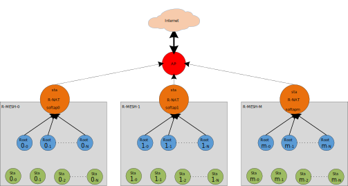
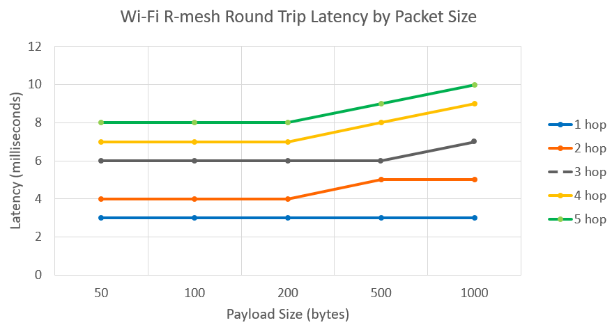
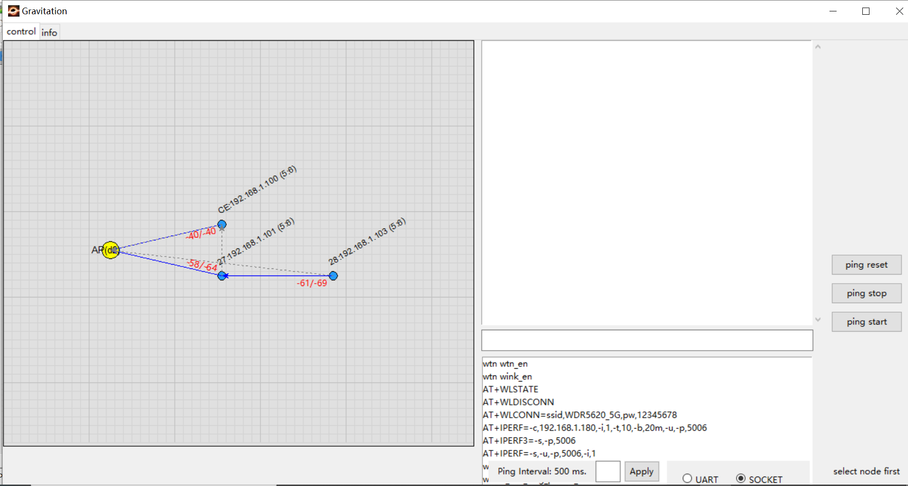

.. _wifi_R-Mesh:

Wi-Fi R-Mesh Topology
------------------------------------------
As shown in the figure below, Wi-Fi R-Mesh is a mesh network with tree topology used to extend the transmission distance of Wi-Fi, allowing stations that are relatively far from the AP to maintain a stable online status.

.. figure:: ../figures/wifi_tunnel_topology_capacity.svg
   :scale: 140%
   :align: center

   Wi-Fi R-Mesh topology

Wi-Fi R-Mesh Advantage
--------------------------------------------
The well-designed Wi-Fi R-Mesh has the following advantages:

- A software-unsensible mesh network:

   - Wi-Fi R-Mesh is implemented entirely through the Wi-Fi driver. Whether it's a root node or its child node, each node regards itself as a regular station connected to the AP.

   - It is no need to upgrade configuration programs or connection programs, and each node can be configured and connected as a regular station.

   - The application development of each station has no difference with that of a regular station, and the application does not need to be concerned with routing information.

- Rapid networking:

   - With an optimized algorithm, nodes can quickly form a mesh network.

   - In the event of a parent node fault (power down or crash), child nodes can quickly switch to a new parent node with nearly no impact on their data communication.

   - Child nodes can also quickly switch to an appropriate parent node as a group, without each child node switching individually.

- High througput for child nodes:

   - Data forwarding is directly implemented through the Wi-Fi driver, utilizing less RAM and CPU resources.

   - Compared to a traditional mesh network, Wi-Fi R-Mesh requires minimal software processing, so even nodes several hops away can achieve a good throughput.

- Network stability:

   - Due to minimal software processing and the upper layer not needing to be concerned with routing, the entire mesh network is highly stable.

   - Common mesh network issues like loops do not occur.

Wi-Fi R-Mesh Data Flow
--------------------------------------------
In traditional mesh network, data forwarding typically passes through the application or TCP/IP stack.
In contrast, Wi-Fi R-Mesh handles data forwarding directly via the Wi-Fi driver, requiring minimal software-processing flow, which can significantly save computing power and RAM resources.

As a result of minimal software-processing flow, the software-processing time is also greatly reduced. Consequently, even nodes several hops away communicating with the AP can achieve good throughput.

+------------------------------------------------------+-------------------------------------------------+
| .. image:: ../figures/wifi_traditional_data_flow.svg | .. image:: ../figures/wifi_tunnel_data_flow.svg |
|    :width: 450px                                     |    :width: 450px                                |
+------------------------------------------------------+-------------------------------------------------+
| Wi-Fi traditional data flow                          | Wi-Fi R-Mesh data flow                          |
+------------------------------------------------------+-------------------------------------------------+

Wi-Fi R-Mesh Capacity
------------------------------------------
Wi-Fi R-Mesh capacity refers to the number of child nodes that each root node connected to the AP can accommodate. Note that it is the total number of child nodes across all layers, regardless of the number of the layer.

The diagram below illustrates an example where the capacity is 4.

- Topology 0: All four nodes are directly connected to the root node

- Topology 3: The four nodes form a 4-hop network

- Can also be any intermediate topology between Topology 0 and Topology 3

.. figure:: ../figures/wifi_tunnel_topology_capacity.svg
   :scale: 140%
   :align: center

   Wi-Fi R-Mesh capacity

Wi-Fi R-Mesh NAT (R-NAT)
------------------------------------------

The diagram below illustrates an example where the NAT is used to expand the R-MESH station number.

   Wi-Fi R-Mesh NAT

Wi-Fi R-Mesh Throughput
------------------------------
.. table::
   :width: 100%
   :widths: auto

   +---------------+---------+---------------+---------------+---------------+---------------+
   | Test scenario | Layer   | UDP Tx (Mbps) | UDP Rx (Mbps) | TCP Tx (Mbps) | TCP Rx (Mbps) |
   +===============+=========+===============+===============+===============+===============+
   | Single Node   | Layer1  | 54.2          | 39.5          | 17.0          | 15.7          |
   |               +---------+---------------+---------------+---------------+---------------+
   |               | Layer2  | 19.6          | 18.8          | 9.6           | 10.0          |
   |               +---------+---------------+---------------+---------------+---------------+
   |               | Layer3  | 12.8          | 11.6          | 6.9           | 7.0           |
   |               +---------+---------------+---------------+---------------+---------------+
   |               | Layer4  | 9.4           | 8.2           | 5.4           | 5.2           |
   |               +---------+---------------+---------------+---------------+---------------+
   |               | Layer5  | 7.5           | 6.2           | 4.4           | 4.3           |
   +---------------+---------+---------------+---------------+---------------+---------------+
   | L1 + L2       | Layer1  | 21.0          | 21.2          |               |               |
   |               +---------+---------------+---------------+---------------+---------------+
   |               | Layer2  | 12.5          | 14.0          |               |               |
   +---------------+---------+---------------+---------------+---------------+---------------+
   | L1 + L2 + L3  | Layer1  | 14.0          | 13.3          |               |               |
   |               +---------+---------------+---------------+---------------+---------------+
   |               | Layer2  | 7.0           | 7.2           |               |               |
   |               +---------+---------------+---------------+---------------+---------------+
   |               | Layer3  | 5.1           | 6.4           |               |               |
   +---------------+---------+---------------+---------------+---------------+---------------+
   | L1 + L2 + L3  | Layer1  | 10.0          | 12.1          |               |               |
   | + L4          +---------+---------------+---------------+---------------+---------------+
   |               | Layer2  | 4.0           | 8.4           |               |               |
   |               +---------+---------------+---------------+---------------+---------------+
   |               | Layer3  | 3.6           | 6.7           |               |               |
   |               +---------+---------------+---------------+---------------+---------------+
   |               | Layer4  | 3.0           | 4.0           |               |               |
   +---------------+---------+---------------+---------------+---------------+---------------+
   | L1 + L2 + L3  | Layer1  | 9.0           | 10.4          |               |               |
   | + L4 + L5     +---------+---------------+---------------+---------------+---------------+
   |               | Layer2  | 3.2           | 3.7           |               |               |
   |               +---------+---------------+---------------+---------------+---------------+
   |               | Layer3  | 2.5           | 2.9           |               |               |
   |               +---------+---------------+---------------+---------------+---------------+
   |               | Layer4  | 2.3           | 1.8           |               |               |
   |               +---------+---------------+---------------+---------------+---------------+
   |               | Layer5  | 1.8           | 2.1           |               |               |
   +---------------+---------+---------------+---------------+---------------+---------------+

Wi-Fi R-Mesh RTT
------------------------------
The Wi-Fi R-Mesh Round-Trip Latency is illustrated in the following figure.

Wi-Fi R-Mesh Demo Tool
----------------------------
Introduction
~~~~~~~~~~~~~~~~~~~~~~~~
To effectively test and demonstrate Wi-Fi R-Mesh, we have specifically developed a software tool.
R-mesh nodes will periodically communicate with the tool by socket to update the current network status.

   Wi-Fi R-Mesh Demo Tool

Node related information is shown above the node as the format "MAC_Addr : IP (report_time)".
Only the last byte of MAC address is shown, report_time is in "minute:second" format.
For example "CE:192.168.1.100(5:6)" means the last byte of MAC address is 0xCE for this node, and it's IP address is 192.168.1.100.

The main features of this tool are as follows:

- Users can see the real-time network topology.

- Users can do ping test.

User Guide
~~~~~~~~~~~~~~~~~~~~~~~~~~~~~~~~
Prerequisites
^^^^^^^^^^^^^^^^^^^^^^^^^^^^^^^^
Wi-Fi R-Mesh Demo Tool runs on Windows.

The R-Mesh Demo Tool is in below path:

.. code-block::

   sdk/tools/R-Mesh_Demo_Tool

Usage
^^^^^^^^^^^^^^^^^^^^^^^^^^^^^^^^
1. Wi-Fi R-Mesh Demo Tool will obtain the computer's IP address when it starts, so before starting the tool, make sure the computer and the target AP are successfully connected via the network cable.

2. When run gravitation.exe first time, it will generate a file named "config.yaml" in the tool folder, it can be used to config serveral parameters, such as ap mac, ping interval and ping size.

   .. figure:: ../figures/rmesh_demo_tool_config_file.png
      :scale: 70%
      :align: center

      Wi-Fi R-Mesh Demo Tool Config File

   In order to show topology correctly, ap mac of your AP need be configured by editing the "ap_mac_list" entry in config.yaml, after editing config.yaml, please restart the gravitation.exe again:

   .. code-block::

      ap_mac_list:
      - 00:11:22:33:44:55

3. For each R-Mesh node, use AT Command to start connect, the ssid and password in AT Command are the target AP's ssid and password.
   R-Mesh node will automatically decide whether connect to target AP directly or pair with other available R-Mesh node, and then the topology will shown in Wi-Fi R-Mesh Demo Tool.

   .. code-block::

      AT+WLCONN=ssid,rmesh_test,pw,12345678

4. "ping start" and "ping stop" button in tool can be used to do ping test, and the ping interval and ping size can be configured by "config.yaml" as follow:

   .. code-block::

      ping:
      interval: 500
      packet_size: 64

   The ping interval can also be configured directly on the bottom of tool menu:

      .. figure:: ../figures/ping_interval.png
         :scale: 50%
         :align: center

         Ping Interval configuration

Wi-Fi R-Mesh User Config
--------------------------------------------
In R-Mesh, when the signal strength of the actual AP is larger than a threshold, R-Mesh nodes will prefer to connect to AP directly or switch from other R-Mesh node to AP.
This threshold can be configured in "sdk/component/soc/amebadplus/ameba_wificfg.c", and the default value is -50.

.. code-block::

	/*R-mesh*/
	wifi_user_config.wtn_strong_rssi_thresh = -50;

.. note::

   Currently R-Mesh needs special wlan lib to run, please contact us to get the specified version of wlan lib.

