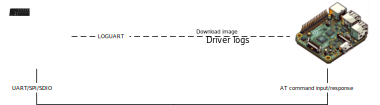
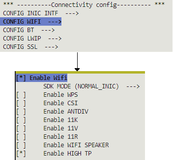
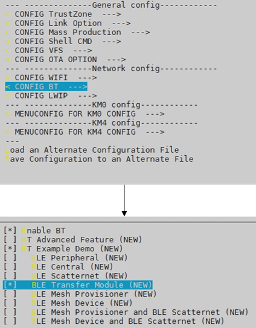

.. _at_command:

Introduction
=============

This article describes the role, usage and version information of AT commands.
There are two currently used AT command modes and scenarios, which can be called LOGUART mode and MCU control mode.

- Scenario 1: LOGUART Mode

  In this mode, users can evaluate the module’s functionality and conduct various tests or demos, such as Wi-Fi or Bluetooth testing.

  .. note::
     AT command information will be intermingled with driver logs as both of them will be output from LOGUART.

- Scenario 2: MCU Control Mode

  This scenario includes connecting the AT command module via UART/SPI/SDIO for rapid product development by the customer.
  In this mode, AT command information is transmitted and displayed exclusively through UART/SPI/SDIO.

.. table:: AT command modes and scenarios
   :width: 100%
   :widths: auto

   +--------------------+-------------------+-------------------+----------------------+
   | Mode               | Connecting method | Status            | Scenario             |
   +====================+===================+===================+======================+
   | LOGUART Mode       | LOGUART           | Ready             | Evaluate/Test/Demo   |
   +--------------------+-------------------+-------------------+----------------------+
   | MCU Control Mode   | UART              | Ready             |                      |
   |                    +-------------------+-------------------+                      |
   |                    | SPI               | Ready             | Product development  |
   |                    +-------------------+-------------------+                      |
   |                    | SDIO              | Developing        |                      |
   +--------------------+-------------------+-------------------+----------------------+

We set the Ameba module as a slave, and the MCU as a host. The host can send AT commands to the slave and receive the corresponding AT response.
The AT commands consist of a wide range of types, such as Wi-Fi commands, MQTT commands, WebSocket commands, TCP/IP commands, and Bluetooth commands.

Hardware Connection
--------------------
Some hardwares are inquired at first.

LOGUART Mode
~~~~~~~~~~~~~~~
- Ameba board: As a slave module.
- PC (or other host device): Input AT commands, observe the response of AT commands.
- LOGUART: Connect the module to PC (or other host device), download image, transmit driver and AT command log.

In case of LOGUART mode, the input and response of AT commands are shown in the same port.

   LOGUART mode

MCU Control Mode
~~~~~~~~~~~~~~~~~
- Ameba board: As a slave module.
- Raspberry Pi (or other MCU host device): Input AT commands, observe the response of AT commands.
- LOGUART: Connect module to Raspberry Pi (or other MCU host device), download image, show driver log.
- SPI/UART/SDIO: Connect module to Raspberry Pi (or other MCU host device), transmit AT command, show AT command response.

In case of MCU control mode, the input and response of AT commands can be separated from the driver log, making it easier for users to view the execution results of AT commands more intuitively.

   MCU Control mode

In MCU Control mode, users should prepare the :file:`atcmd_config.json` file in advance(refer to :ref:`atcmd_mcu_control_mode_configuration` for detailed instructions).
If no VFS AT command configuration file is provided, the default configuration of UART will be used.

.. table:: Default UART port and baud rates
   :width: 100%
   :widths: auto

   +-----------------------+---------+---------+-------------------+
   | Ameba SoC             | UART Tx | UART Rx | Default baud rate |
   +=======================+=========+=========+===================+
   | RTL8721Dx/RTL8711Dx   | PA_26   | PA_27   | 38400             |
   +-----------------------+---------+---------+-------------------+
   | | RTL8726EA/RTL8713EC | PA_28   | PA_29   | 38400             |
   | | RTL8720EA/RTL8710EC |         |         |                   |
   +-----------------------+---------+---------+-------------------+
   | RTL8730E              | PA_3    | PA_2    | 38400             |
   +-----------------------+---------+---------+-------------------+

Command Description
--------------------
Command Format
~~~~~~~~~~~~~~~
The current format of the supported AT command set starts with two capital letters ``AT`` (abbreviation of attention), called the start characters, followed by a ``+``, then by the command name.
If there are several parameters more, it will be followed by an ``=``, then by a parameter list.

.. admonition:: Example

   .. code-block::
   
      AT+COMMAND=parameter1,parameter2
   
   In this example, the first two letters ``AT`` are the start characters, indicating that the current string can be recognized as AT command, and ``+`` is used to separate the start characters and subsequent commands.
   ``COMMAND`` is the specific command name, to be executed right now. This command requires two parameters: `parameter1` and `parameter2`.

Sometimes, several parameters in AT command may be ignored, in this case, one or more comma(s) should be input inside parameters.

.. admonition:: Example

   .. code-block::
   
      AT+COMMAND=parameter1, ,parameter3
   
   In this command, there is an invisible `parameter2` between two commas, and it is considered to use the default value.

Command Response
~~~~~~~~~~~~~~~~~
After receiving the AT command, the slave judges whether it is a valid command at first.
If it is considered as an invalid command (not in the AT command set), ``unkown command COMMAND`` will be performed.
Otherwise, it will be executed based on the input command and its parameters.

- When the command is successfully executed, the command name plus an ``OK`` mark will generally be returned.

- When the command execution fails, the command name plus an ``ERROR`` mark will generally be returned, followed by an error code.

.. note::
   Every AT command has it's corresponding error code number and meaning.

Command Parameter
~~~~~~~~~~~~~~~~~~~
In this section, when introducing the parameter list of an AT command, angle bracket ``< >`` is added to indicate the name of the parameter, and square bracket ``[ ]`` is added to indicate that the parameter is optional.
Different parameters are separated by commas.

.. admonition:: Example

   .. code-block::
   
      AT+COMMAND=<param1>[,<param2>,<param3>]
   
   In this command, the first parameter named `param1` is mandatory, the second parameter named `param2`, and the third parameter named `param3` are optional.

Escapes Character
~~~~~~~~~~~~~~~~~~
Especially, in several AT commands, if you really need to let one or more comma(s) be part(s) of a parameter, it is recommended to use escapes character ``\`` instead.
Furthermore, the backslash itself is expressed in escapes character ``\\``.

.. admonition:: Example

   .. code-block::
   
      AT+COMMAND=parameter1,head\,tail,head\\tail
   
   In this command, there are three parameters at all, the second parameter is a string `head,tail` which includes a comma.
   The comma inside `head,tail` will not be considered as a segmentation of parameters, but as a part of a string.
   And, the third parameter is a string `head\\tail` including a backslash. Single backslash is illegal here, in other words, single backslash must be followed by a comma or another backslash in these AT commands.

For the other AT commands which do not need to use escapes character, the comma will always be considered as a segmentation, and single backslash is allowed as a common character.

.. table:: Commands with escapes character
   :width: 100%
   :widths: auto

   +--------------+-------------------------------------+
   | AT command   | Parameter(s) with escapes character |
   +==============+=====================================+
   | AT+MQTTSUB   | <topic>                             |
   +--------------+-------------------------------------+
   | AT+MQTTUNSUB | <topic>                             |
   +--------------+-------------------------------------+
   | AT+MQTTPUB   | <topic>,<msg>                       |
   +--------------+-------------------------------------+
   | AT+SKTSEND   | <data>                              |
   +--------------+-------------------------------------+

Command Length
~~~~~~~~~~~~~~~
Each AT command must not exceed a length limit, otherwise, the excess part will be ignored.

There are two types of length limit. When longer command format is enabled, the length limit is 4095 bytes, otherwise (shorter command format), the length limit is 126 bytes.
When the AT command using escapes character, the escapes characters such as ``\`` or ``\\`` should be regarded as 2 bytes.

You can modify the length limit by ``make menuconfig`` when compiling the SDK. If you select the option ``Enable Longer CMD``, the length limit will be larger.

.. _transparent_transmission:

Transparent Transmission
~~~~~~~~~~~~~~~~~~~~~~~~~~~~~~
In transparent transmission(tt) mode, the length of data transmitted by commands is limited only by the available heap size. 
The transmitted data is not subject to format checks and will not terminate due to command end characters (``\r\n``). 
After executing a command that supports tt mode, the AT module will return ``>>>`` to indicate that it has entered tt mode. 
The MCU then needs to transmit the data of the length specified in the command. 
Once the specified length of data is received, the AT module will automatically exit tt mode and return the result of the command execution.

.. note::
   TT mode only supports in MCU Control mode.

AT Command List
------------------
The AT commands supported now are listed below.

- :ref:`Common AT Commands <common_at_commands>`

- :ref:`Wi-Fi AT Commands <wi_fi_at_commands>`

- :ref:`MQTT AT Commands <mqtt_at_commands>`

- :ref:`WebSocket AT Commands <websocket_at_commands>`

- :ref:`TCP/IP AT Commands <tcp_ip_at_commands>`

- :ref:`Bluetooth AT Commands <bluetooth_at_commands>`

- :ref:`File system AT Commands <file_system_at_commands>`

Please refer to each section to look for more details about the command information of different AT commands.

AT Command Version
----------------------
Users can query the current firmware’s AT command version by executing ``AT+GMR`` command.
The version number employs a semantic versioning system, and its format is as follows:

.. code-block::

    <major>.<minor>.<patch>

Where:

:<major>: the major version, represents major updates, typically including the introduction of new chip support, new features, etc.

:<minor>: the minor version, represents important updates, typically including new commands, bug fixes, etc.

:<patch>: the patch version, represents fixing some issues without adding any new features.

.. admonition:: Example

   .. code-block::
   
   	// send ATCMD
   	AT+GMR
   	// receive ATCMD response
   	+GMR:
   	ATCMD VERSION: v2.2.1
   	SDK VERSION: v3.5

Building and Downloading
-------------------------
Preparation
~~~~~~~~~~~~~~~
Besides obtaining the release version from GitHub, users can also build images with ``{sdk}`` by self. For detailed building procedure, refer to the Application Note of the specific Ameba chips.

SSL Certificate
~~~~~~~~~~~~~~~~
If an SSL certificate is required during the use of AT Commands, the user has two options to prepare the certificate before executing the command:

- 1. Store the pre-prepared certificate files in the VFS binary file with the names and formats of <client/server>_<ca/cert/key>_<1/2/3>.crt. 
  Then, flash them to the AT module together with the application firmware.

- 2. During the operation of the AT module, use the AT+FS command to write the certificate into the file system. 
  For detailed usage of the AT+FS command to write files, please refer to :ref:`file_system_at_commands`.

.. note::
   When creating the VFS bin file, SSL certificates should be placed in the ``KV`` directory. The operations of the file system AT commands are also conducted in the ``KV`` directory.

.. _atcmd_mcu_control_mode_configuration:

Configuration
~~~~~~~~~~~~~~~
For MCU Control mode, the configuration needs to be implemented via the ``atcmd_config.json`` file. 
The ``atcmd_config.json`` file needs to be converted into a littlefs bin file and placed in the KV directory(refer to :ref:`Example <atcmd_config_example>` for details).
The specific format is as follows:

.. code-block::
   
   {
      "interface":"spi",
      
      "spi":
      {
         "mosi":"PA27",
         "miso":"PA28",
         "clk":"PA26",
         "cs":"PA12",
         "master_sync_pin":"PB30",
         "slave_sync_pin":"PB31"
      },
      
      "uart":
      {
         "baudrate":115200,
         "tx":"PB19",
         "rx":"PB18"
      }
   }

Users can modify the property value of the interface to choose between using UART or SPI. The pins used in UART or SPI mode can also be customized.

For the MCU Control mode of SPI, if you want to achieve better high-speed transmission performance, you need to enable the High TP Mode in menuconfig.
The configuration process is as follows:

   Enable Wifi High TP Mode

.. _atcmd_config_example:

Example
^^^^^^^^
This section demonstrates how to prepare a custom atcmd_config.json file and activate it:

1. Create a new atcmd_config.json file with the following custom content:

   .. code-block::
      
      {
         "interface":"uart",
         
         "uart":
         {
            "baudrate":115200,
            "tx":"PA26",
            "rx":"PA27"
         }
      }

2. Create a TEST/KV directory and place the atcmd_config.json file into the ``KV`` subdirectory.

3. Use the LittleFS binary file creation tool to generate a LittleFS binary file (refer to :ref:`VFS Bin File <vfs_bin_file_generation>` for the specific command parameters).

   .. code-block::
      
      linux@user:~$./mklittlefs -b 4096 -p 256 -s 131072 -c TEST lfs.bin
      /KV/atcmd_config.json

4. Flash the generated lfs.bin file into the VFS1 region of the AT module according to the flash layout(refer to :ref:`VFS on Flash <vfs_on_flash_section>` for the specific address).

5. Flash the application firmware that enables MCU Control Mode (refer to :ref:`atcmd_image_building` for specific instructions).

6. After powering on the AT module, you can observe the custom configuration printouts on the loguart port, indicating that the configuration has taken effect.

   .. code-block::
      
      [AT-I] ATCMD MCU Control Mode : UART, tx:PA26, rx:PA27, baudrate:115200

.. _atcmd_image_building:

Building
~~~~~~~~~~~~~~~~
After preparations above, users can build images in the ``{sdk}`` directory. The procedure is as follows:

1. Run ``make menuconfig`` to choose MCU Control mode or LOGUART mode. 

   .. code-block::
   
      // Your SDK direction
      cd $ {sdk}
      // The chip type you choose, e.g. amebadplus_gcc_project
      cd source/{ameba_name}
      make menuconfig
      // ...
   
   .. figure:: figures/choice_mode.png
      :scale: 90%
      :align: center
   
      Choice mode

2. Run ``make all`` to rebuild the project.

3. After building successfully, the image files can be found under ``{ameba_name}`` directory.

If users want to use Bluetooth AT Commands, run ``$make menuconfig`` to enable BLE transfer module first.

   Enable BLE transfer module

Downloading
~~~~~~~~~~~~~~~~
There are two ways to download image to Flash:

-  Image Tool, a software provided by Realtek (recommended).

-  GDB Server, mainly used for GDB debug user case.

In this section, we will introduce the first one.

The Image Tool is the official image download tool developed by Realtek for Ameba series SoC.
It can be used to download images to the Flash of device through the UART download interface.

When you lanuch the image tool, it is shown as the following figures.

.. tabs::

   .. tab:: RTL8721Dx

      .. figure:: figures/image_tool_21Dx.png
         :scale: 70%
         :align: center

         Image Tool

   .. tab:: RTL8726EA/RTL8720EA

      .. figure:: figures/image_tool_26E20E.png
         :scale: 70%
         :align: center

         Image Tool

   .. tab:: RTL8730E

      .. figure:: figures/image_tool_30E.png
         :scale: 70%
         :align: center

         Image Tool

The device profiles provide the necessary device information required for image download, with the naming rules:

.. code-block::

   <SoC name>_<OS type>_<Flash type>[_<Extra info>].rdev

For different Ameba chips, click the :menuselection:`File > Open` to select the corresponding ``.rdev`` file before downloading image to Flash. Then, select the corresponding image files.

Before downloading image, the chip should enter download mode at first.

1. Press and hold the :guilabel:`DOWNLOAD` button on chip

2. Press the :guilabel:`CHIP_EN` button

3. Release them both to let the chip enter download mode

4. Connect the chip module to PC with USB cable, and press the :guilabel:`DOWNLOAD` button of Image Tool to start downloading the image files

