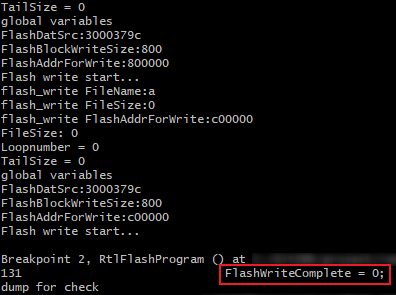
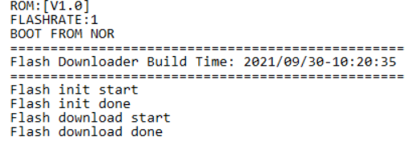
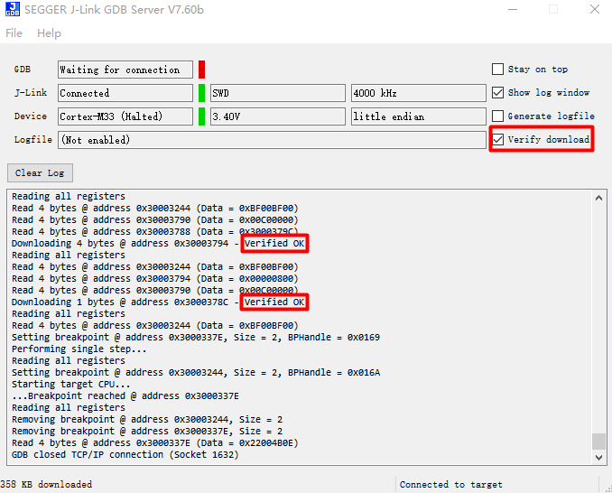

.. _gcc_build_environment:

概述
------------------------
This chapter illustrates how to build Realtek's SDK under GCC environment. It focuses on both Windows platform and Linux distribution. The build and download procedures are quite similar between Windows and Linux operating systems.

- For Windows, Windows 10 64-bit is used as a platform.
- For Linux server, Ubuntu 16.04 64-bit is used as a platform.

准备 GCC 环境
--------------------------------------------------
.. _windows_gcc_environment:

Windows
~~~~~~~~~~~~~~
.. include:: gcc_preparing_environment_windows.rst

Linux
~~~~~~~~~~
.. include:: gcc_preparing_environment_windows.rst

Troubleshooting
~~~~~~~~~~~~~~~~~~~~~~~~~~~~~~
- MSYS2 pacman is responsible for managing and installing software, which is similar to apt-get in ubuntu. When ``bash:XXX:command not found`` appears, you can try instruction ``pacman -S <package_name>`` to install.
- For detailed information of one package, try ``pacman -Si <package_name>``.
- If system head files are not found when building tool, ``No such file or directory`` error will show up. You can try ``pacman -Fy <FILE_NAME>`` to check which package is lost, and install the lost package. If too many packages are lost, look for detailed information about the packages to decide which to install.
- For multi-version python host, command ``update-alternatives --install /usr/bin/python python /usr/bin/python3.x 1`` can be used to select python of specific version 3.x, where x represents a desired version number.
- If the error ``command 'python' not found`` appears during compilation, type command ``ln -s /usr/bin/python3 /usr/bin/python`` first to make sure that python3 is used when running python.

安装工具链
------------------------
The toolchain will be installed automatically when building the project at the first time. And the toolchain will be intalled in ``/opt/rtk-toolchain`` by default.

1. During the compilation, we will check if the toolchain exists and if the version of the toolchain match the lastest version. Once error occurs, you should fix the error according to the prompts on the screen and try again with ``make``.

.. _make_toolchain:

2. The toolchain will be downloaded from github when building the project at the first time. If find the download speed from github is too slow or download failed, please execute command ``make toolchain URL=aliyun`` or ``make toolchain URL=github`` first to get toolchain before building project. We recommend use ``make toolchain URL=aliyun`` to download toolchain from aliyun to improve the download speed.

.. _change_installation_dir:

3. The default directory for the toolchain installation is ``/opt/rtk-toolchain``. If you want to change the installation path, modify the ``TOOLCHAINDIR`` defined in ``Makefile.include.gen`` which is located both in ``project_km0`` and ``project_km4``.

.. note::

   - If an error ``Create Toolchain Dir Failed. May Not Have Permission`` appears, please create the installation directory by manual. If still fails, refer to :ref:`3 <change_installation_dir>` above to change the installtion directory.
   - If an error ``Download Failed`` appears, please check if the network connection is accessible first. If still fails, refer to :ref:`2 <make_toolchain>` above to intall the toolchain again.
   - If an error ``Current Toolchain Version Mismatched`` appears, please delete the current toochain and retry with ``make``, and the latest toolchain will be installed automatically during building the project.

If the installation still fails, try with the manual installation steps shown in below.

Windows
~~~~~~~~~~~~~~
This section introduces the steps to prepare the toolchain environment manually.

1. Acquire the zip files of |CHIP_NAME| toolchain from Realtek.
2. Create a new directory ``rtk-toolchain`` under the path ``{MSYS2_path}\opt``.

   For example, if your MSYS2 installation path is as set in Section :ref:`windows_gcc_environment` **Step 3**, the ``rtk-toolchain`` should be in ``C:\msys64\opt``.

   .. figure:: figures/windows_rtk_toolchain_1.png
      :scale: 100%
      :align: center

3. Unzip ``asdk-10.3.x-mingw32-newlib-build-xxxx.zip`` and place the toolchain folder ``asdk-10.3.x`` to the folder ``rtk-toolchain`` created in **Step 2**.

   .. figure:: figures/windows_rtk_toolchain_2.png
      :scale: 90%
      :align: center

.. note::
   The unzip folders should stay the same with the figure above and do NOT change them, otherwise you need to modify the toolchain directory in makefile to customize the path.

Linux
~~~~~~~~~~
This section introduces the steps to prepare the toolchain environment manually.

1. Acquire the zip files of |CHIP_NAME| toolchain from Realtek.
2. Create a new directory ``rtk-toolchain`` under the path ``/opt``.

   .. figure:: figures/linux_rtk_toolchain_1.png
      :scale: 80%
      :align: center

3. Unzip ``asdk-10.3.x-linux-newlib-build-xxxx.tar.bz2`` to ``/opt/rtk-toolchain`` , then you can get the directory below:

   .. figure:: figures/linux_rtk_toolchain_2.png
      :scale: 75%
      :align: center

.. note::
   The unzip folders should stay the same with the figure above and do NOT change them, otherwise you need to modify the toolchain directory in makefile to customize the path.

.. _configuring_sdk:

配置 SDK
------------------------------
This section illustrates how to change SDK configurations.

.. tabs::

   .. include:: gcc_config_sdk_dplus.rst
   .. include:: gcc_config_sdk_lite.rst
   .. include:: gcc_config_sdk_smart.rst

.. _building_code:

编译代码
----------
This section illustrates how to build SDK for both Windows and Linux. The following table lists all the GCC project directories of SDK.

.. tabs::

   .. tab:: RTL8721Dx

      .. table::
         :width: 100%
         :widths: auto

         +------------------+------------------------------------------------+
         | GCC project      | Directory                                      |
         +==================+================================================+
         | KM4              | {SDK}\\amebadplus_gcc_project\\project_km4     |
         +------------------+------------------------------------------------+
         | KM0              | {SDK}\\amebadplus_gcc_project\\project_km0     |
         +------------------+------------------------------------------------+

   .. tab:: RTL8726EA/RTL8720EA

      .. table::
         :width: 100%
         :widths: auto

         +-------------+--------------------------------------------+
         | GCC project | Directory                                  |
         +=============+============================================+
         | KM4         | {SDK}\\amebalite_gcc_project\\project_km4  |
         +-------------+--------------------------------------------+
         | KR4         | {SDK}\\amebalite_gcc_project\\project_kr4  |
         +-------------+--------------------------------------------+

   .. tab:: RTL8730E

      .. table::
         :width: 100%
         :widths: auto

         +-------------+-------------------------------------------+
         | GCC project | Directory                                 |
         +=============+===========================================+
         | CA32        | {SDK}\\amebasmart_gcc_project\\project_ap |
         +-------------+-------------------------------------------+
         | KM4         | {SDK}\\amebasmart_gcc_project\\project_hp |
         +-------------+-------------------------------------------+
         | KM0         | {SDK}\\amebasmart_gcc_project\\project_lp |
         +-------------+-------------------------------------------+

.. note::

   Replace the ``{SDK}`` with your own SDK directory.

There are two ways to build the SDK, you can choose either of them.

逐一编译
~~~~~~~~~~~
.. tabs::

   .. include:: gcc_build_sdk_1b1_dplus.rst
   .. include:: gcc_build_sdk_1b1_lite.rst
   .. include:: gcc_build_sdk_1b1_smart.rst

同时编译
~~~~~~~~~~
.. tabs::

   .. include:: gcc_build_sdk_together_dplus.rst
   .. include:: gcc_build_sdk_together_lite.rst
   .. include:: gcc_build_sdk_together_smart.rst

.. _setting_debugger:

设置调试器
------------
.. include:: gcc_setting_debugger_probe_internal.rst

J-Link
~~~~~~~~~~~~
The |CHIP_NAME| supports J-Link debugger. Before setting J-Link debugger, you need to do some hardware configuration and download images to the |CHIP_NAME| device first.

1. Connect J-Link to the SWD of |CHIP_NAME|.

   a. Refer to the following figure to connect SWCLK pin of J-Link to SWD CLK pin of |CHIP_NAME|, and SWDIO pin of J-Link to SWD DATA pin of |CHIP_NAME|.
   b. Connect the |CHIP_NAME| device to PC after finishing these configurations.

      .. figure:: figures/connecting_jlink_to_swd.svg
         :scale: 130%
         :align: center

         Wiring diagram of connecting J-Link to SWD

   .. note::
      For |CHIP_NAME|, the J-Link version must be v9 or higher.
      If Virtual Machine (VM) is used as your platform, make sure that the USB connection setting between VM host and client is correct, so that the VM host can detect the device.

2. Download images to the |CHIP_NAME| device via ImageTool.

   ImageTool is a software tool provided by Realtek. For more information, refer to :ref:`Image Tool <image_tool>`.

Windows
^^^^^^^^^^^^^^
Besides the hardware configuration, J-Link GDB server is also required to install.

For Windows, click  and download the software in ``J-Link Software and Documentation Pack``, then install it correctly.

.. note::
   The version of J-Link GDB server below is just an example, you can select the latest version to download.

.. tabs::

   .. include:: gcc_setting_debugger_jlink_windows_dplus.rst
   .. include:: gcc_setting_debugger_jlink_windows_lite.rst
   .. include:: gcc_setting_debugger_jlink_windows_smart.rst

Linux
^^^^^^^^^^
For J-Link GDB server, click  and download the software in ``J-Link Software and Documentation Pack``. It is suggested to use Debian package manager to install the Debian version.

Open a new terminal and type the following command to install GDB server. After the installation of the software pack, there is a tool named “JLinkGDBServer” under the J-Link directory. Take Ubuntu 18.04 as an example, the JLinkGDBServer can be found at ``/opt/SEGGER/JLink``.

.. code::

   $dpkg –i jlink_6.0.7_x86_64.deb

.. note::
   The version of J-Link GDB server below is just an example, you can select the latest version to download.

.. tabs::

   .. include:: gcc_setting_debugger_jlink_linux_dplus.rst
   .. include:: gcc_setting_debugger_jlink_linux_lite.rst
   .. include:: gcc_setting_debugger_jlink_linux_smart.rst

下载固件至 Flash
----------------------------------------------------
有两种方法可以下载固件至 Flash：

- Image Tool, a software provided by Realtek (recommended). For more information, refer to :ref:`Image Tool <image_tool>` for more information.
- GDB Server, mainly used for GDB debug user case.

This section illustrates the second method to download images to Flash.

To download software into Device Board, make sure the steps mentioned in Section :ref:`building_code` are done, and then type ``$make flash`` command on MSYS2 (Windows) or terminal (Linux).

Images are downloaded only under KM4 by this command. This command downloads the software into Flash and it will take several seconds to finish, as shown below.

   Downloading Image to Flash

   Download codes success log

To check whether the image is downloaded correctly into memory, you can select ``verify download`` before downloading images, and during image download process, ``verified OK`` log will be shown.

   Verify download

After download is successful, press ``Reset`` button and you will see that the device boots with the new image.

.. note:: The command is only supported to use in KM4 project, and ``km4_boot_all.bin`` & ``KM0_km4_app.bin`` can be downloaded to Flash.

.. _entering_debug_mode:

进入调试模式
------------------
GDB Server
~~~~~~~~~~~~~~~~~~~~
To enter GDB debugger mode, follow the steps below:

1. Make sure that the steps mentioned in Sections :ref:`Configuring_sdk` to :ref:`setting_debugger` are finished, then reset the device.
2. Change the directory to target project, and type ``$make debug`` on MSYS2 (Windows) or terminal (Linux).

J-Link
~~~~~~~~~~~~
步骤
^^^^^^
1. Press :kbd:`Win+R` on your keyboard, or find and click :guilabel:`Run` on the Start menu.
2. Type ``cmd`` in the Run window and click :guilabel:`OK` to open the Command Prompt terminal in a new window.
3. Copy the J-Link script command below for the specific target:

.. tabs::

   .. include:: gcc_enter_debug_mode_jlink_dplus.rst
   .. include:: gcc_enter_debug_mode_jlink_lite.rst
   .. include:: gcc_enter_debug_mode_jlink_smart.rst

命令
^^^^^^^
The following commands are often used when the program is stuck. All commands are accepted case insensitive.

.. table:: Often used commands
   :width: 100%
   :widths: 15 15 30 40
  
   +----------------+-----------------+--------------------------------------+-------------------------------------------------+
   | Command (long) | Command (short) | Syntax                               | Explanation                                     |
   +================+=================+======================================+=================================================+
   | Halt           | H               |                                      | Halt CPU                                        |
   +----------------+-----------------+--------------------------------------+-------------------------------------------------+
   | Go             | G               |                                      | Start CPU if halted                             |
   +----------------+-----------------+--------------------------------------+-------------------------------------------------+
   | Mem            |                 | Mem <Addr> <NumBytes>                | Read memory and show corresponding ASCII values |
   +----------------+-----------------+--------------------------------------+-------------------------------------------------+
   | SaveBin        |                 | SaveBin <FileName> <Addr> <NumBytes> | Save target memory range into binary file       |
   +----------------+-----------------+--------------------------------------+-------------------------------------------------+
   | Exit           |                 |                                      | Close J-Link connection and quit                |
   +----------------+-----------------+--------------------------------------+-------------------------------------------------+

For more information, you can visit https://wiki.segger.com/J-Link_Commander.

.. note::

   - You can type ``H`` and ``G`` several times and record the PC, then look for the PC in which function in asm file. This function might be where you get stuck.
   - You can also use ``mem`` to dump some address after ``sp``, from these addresses you can find the function call stack.

命令列表
--------------------------
The commands mentioned above are listed in the following table.

.. table:: Command lists
   :width: 100%
   :widths: 10 30 60

   +-------+-----------------------------------+---------------------------------------------+
   | Usage | Command                           | Description                                 |
   +=======+===================================+=============================================+
   | all   | ``$make all``                     | Compile the project to generate ram_all.bin |
   +-------+-----------------------------------+---------------------------------------------+
   | setup | ``$make setup GDB_SERVER= jlink`` | Select GDB_SERVER                           |
   +-------+-----------------------------------+---------------------------------------------+
   | flash | ``$make flash``                   | Download ram_all.bin to Flash               |
   +-------+-----------------------------------+---------------------------------------------+
   | clean | ``$make clean``                   | Remove compile file (xx.bin, xx.o, …)       |
   +-------+-----------------------------------+---------------------------------------------+
   | debug | ``$make debug``                   | Enter debug mode                            |
   +-------+-----------------------------------+---------------------------------------------+

GDB 调试器的基本用法
------------------------------------------------
GDB, the GNU project debugger, allows you to examine the program while it executes, and it helps catch bugs.
Section :ref:`entering_debug_mode` has described how to enter GDB debugger mode, and this section illustrates some basic usage of GDB commands.

For more information on GDB debugger, click https://www.gnu.org/software/gdb/.
The following table describes commonly used instructions and their functions, and specific usage can be found in **GDB User Manual** of website https://www.sourceware.org/gdb/documentation/.

.. table:: GDB debugger command list
   :width: 100%
   :widths: 20 10 70

   +---------------------------------+------------+---------------------------------------------------------------------------------------------------------------------------------------------------------------------------+
   | Usage                           | Command    | Description                                                                                                                                                               |
   +=================================+============+===========================================================================================================================================================================+
   | Breakpoint                      | $break     | Breakpoints are set with the break command (abbreviated b).                                                                                                               |
   |                                 |            |                                                                                                                                                                           |
   |                                 |            | The usage can be found at **Setting Breakpoints** section.                                                                                                                |
   +---------------------------------+------------+---------------------------------------------------------------------------------------------------------------------------------------------------------------------------+
   | Watchpoint                      | $watch     | You can use a watchpoint to stop execution whenever the value of an expression changes. The related commands include watch, rwatch, and awatch.                           |
   |                                 |            |                                                                                                                                                                           |
   |                                 |            | The usage of these commands can be found at **Setting Watchpoints** section.                                                                                              |
   |                                 |            |                                                                                                                                                                           |
   |                                 |            | .. note::                                                                                                                                                                 |
   |                                 |            |    Keep the range of watchpoints less than 20 bytes.                                                                                                                      |
   +---------------------------------+------------+---------------------------------------------------------------------------------------------------------------------------------------------------------------------------+
   | Print breakpoints & watchpoints | $info      | To print a table of all breakpoints, watchpoints set and not deleted, use the info command. You can simply type info to know its usage.                                   |
   +---------------------------------+------------+---------------------------------------------------------------------------------------------------------------------------------------------------------------------------+
   | Delete breakpoints              | $delete    | To eliminate the breakpoints, use the delete command (abbreviated d).                                                                                                     |
   |                                 |            |                                                                                                                                                                           |
   |                                 |            | The usage can be found at **Deleting Breakpoints** section.                                                                                                               |
   +---------------------------------+------------+---------------------------------------------------------------------------------------------------------------------------------------------------------------------------+
   | Continue                        | $continue  | To resume program execution, use the continue command (abbreviated c).                                                                                                    |
   |                                 |            |                                                                                                                                                                           |
   |                                 |            | The usage can be found at **Continue and Stepping** section.                                                                                                              |
   +---------------------------------+------------+---------------------------------------------------------------------------------------------------------------------------------------------------------------------------+
   | Step                            | $step      | To step into a function call, use the step command (abbreviated s). It will continue running your program until the control reaches a different source line.              |
   |                                 |            |                                                                                                                                                                           |
   |                                 |            | The usage can be found at **Continue and Stepping** section.                                                                                                              |
   +---------------------------------+------------+---------------------------------------------------------------------------------------------------------------------------------------------------------------------------+
   | Next                            | $next      | To step through the program, use the next command (abbreviated n). The execution will stop when the control reaches a different line of code at the original stack level. |
   |                                 |            |                                                                                                                                                                           |
   |                                 |            | The usage can be found at **Continue and Stepping** section.                                                                                                              |
   +---------------------------------+------------+---------------------------------------------------------------------------------------------------------------------------------------------------------------------------+
   | Quit                            | $quit      | To exit GDB debugger, use the quit command (abbreviated q), or type an end-of-file character (usually Ctrl-d). The usage can be found at **Quitting GDB** section.        |
   +---------------------------------+------------+---------------------------------------------------------------------------------------------------------------------------------------------------------------------------+
   | Backtrace                       | $backtrace | A backtrace is a summary of how your program got where it is. You can use backtrace command (abbreviated bt) to print a backtrace of the entire stack.                    |
   |                                 |            |                                                                                                                                                                           |
   |                                 |            | The usage can be found at **Backtraces** section.                                                                                                                         |
   +---------------------------------+------------+---------------------------------------------------------------------------------------------------------------------------------------------------------------------------+
   | Print source lines              | $list      | To print lines from a source file, use the list command (abbreviated l).                                                                                                  |
   |                                 |            |                                                                                                                                                                           |
   |                                 |            | The usage can be found at **Printing Source Lines** section.                                                                                                              |
   +---------------------------------+------------+---------------------------------------------------------------------------------------------------------------------------------------------------------------------------+
   | Examine data                    | $print     | To examine data in your program, you can use print command (abbreviated p). It evaluates and prints the value of an expression.                                           |
   |                                 |            |                                                                                                                                                                           |
   |                                 |            | The usage can be found at **Examining Data** section.                                                                                                                     |
   +---------------------------------+------------+---------------------------------------------------------------------------------------------------------------------------------------------------------------------------+

