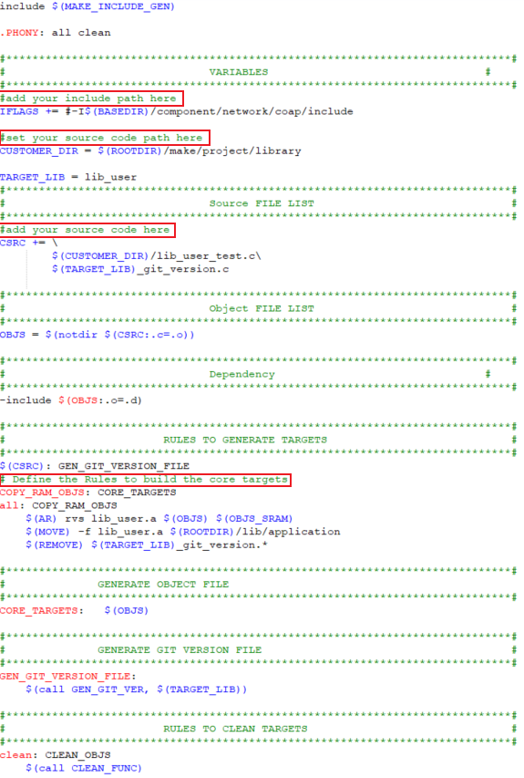

.. _gcc_makefile:

Makefile Architecture
------------------------------------------
The following figures summary the makefile architectures of each project.

.. tabs::

   .. include:: gcc_makefile_arch_21Dx.rst
   .. include:: gcc_makefile_arch_26E20E.rst
   .. include:: gcc_makefile_arch_30E.rst

How to Build Library
----------------------------------------
.. tabs::

   .. include:: gcc_makefile_build_lib_21Dx.rst
   .. include:: gcc_makefile_build_lib_26E20E.rst
   .. include:: gcc_makefile_build_lib_30E.rst

How to Add Library
------------------------------------
.. tabs::

   .. include:: gcc_makefile_add_lib_21Dx.rst
   .. include:: gcc_makefile_add_lib_26E20E.rst
   .. include:: gcc_makefile_add_lib_30E.rst

.. code-block::

   LINK_APP_LIB += $(ROOTDIR)/lib/application/lib_user.a

