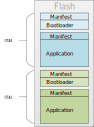
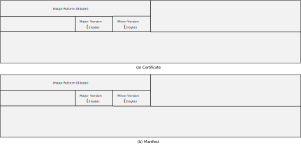
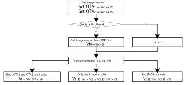
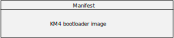
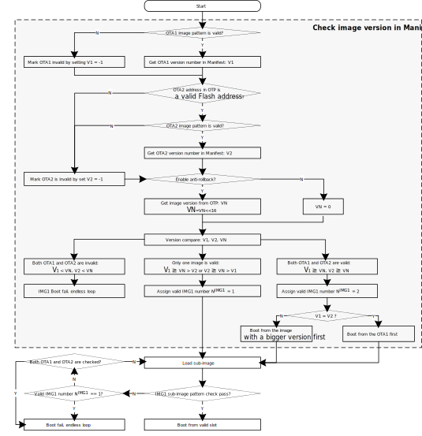
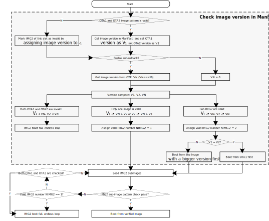
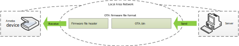
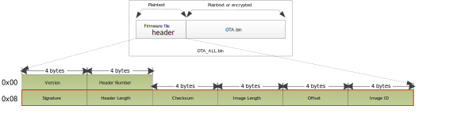
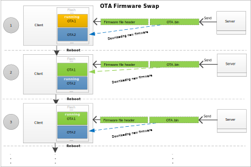

.. _ota_firmware_update:

Introduction
------------------------
Over-the-air (OTA) programming provides a methodology of updating device firmware remotely via TCP/IP network.
For OTA via TCP/IP network, the |CHIP_NAME| provides solutions to implement OTA firmware upgrade from local server or cloud.

.. _image_slot:

Image Slot
~~~~~~~~~~~~~~~~~~~~
There are two slots for all the images in the Flash layout as shown in the figure below, which named OTA1 and OTA2 respectively.
Each image can be chosen to boot from OTA1 or OTA2.

   OTA1 and OTA2 position

.. _version_number:

Version Number
~~~~~~~~~~~~~~~~~~~~~~~~~~~~
The device boot from OTA1 or OTA2 mainly depends on the version number in certificate and manifest.
As shown in the figure below, there is a 2-byte major version and 2-byte minor version in manifest and certificate.

   Major and minor version

The combination of major version and minor version is the 4-byte version number. OTA select flow checks the whole version number.

.. code-block::

   Version number = (Major version << 16) | Minor version

.. note::
   - For bootloader, version number can be 0 to 32767; for application, version number can be 0 to 65535.

As described in :ref:`Image Slot <image_slot>`, there are two slots (OTA1 and OTA2) for all the images in the Flash layout.
When reboot after OTA upgrade finished, the device would check the image to determine to boot from OTA1 or OTA2.

The general principle of the OTA scheme is checking the image pattern first and then comparing the version number of OTA1 and OTA2.

The following items must be checked for each image:

1. Check the image pattern for both OTA1 and OTA2.

   - If only one image pattern is valid, boot from the valid image.
   - If both image patterns are invalid, boot fail.

2. Compare the version number of OTA1 and OTA2.

   - If both OTA1 and OTA2 are valid and with different version numbers, the device will boot from the image with a bigger version.
   - If both OTA1 and OTA2 are valid but with the same version number, the device will boot from OTA1.

   .. figure:: figures/ota_select_diagram.svg
      :scale: 150%
      :align: center

      OTA selection diagram

Anti-rollback
~~~~~~~~~~~~~~~~~~~~~~~~~~
Anti-rollback is the function to prevent version rollback attack.
When the anti-rollback is enabled, the version number in certificate or manifest must not be smaller than the anti-rollback version stored in OTP.
Otherwise, this image will be regarded as invalid and the chip will not boot from invalid image.
Normally, if OTA update is security-related, user can program a bigger anti-rollback version number in OTP and 
update image with a bigger major version at the same time to prevent rollback attack.

The anti-rollback flow is shown below.
Once the anti-rollback is enabled, the device will compare the major version numbers got from OTA1 and OTA2 images respectively with the anti-rollback version number in OTP.
If the major version number in the image is smaller than the anti-rollback version number, this image will be regarded as invalid.

   Anti-rollback flow

Bootloader
--------------------
OTA Image
~~~~~~~~~~~~~~~~~~
The KM4 bootloader image named :file:`km4_boot_all.bin` can be updated through OTA, which can be chosen to boot from OTA1 or OTA2.
The layout of KM4 bootloader image is illustrated below.

   Layout of KM4 bootloader image

OTA Selection Flow
~~~~~~~~~~~~~~~~~~~~~~~~~~~~~~
The KM4 ROM will select OTA image according to the image version number in bootloader manifest.

   KM4 bootloader OTA selection flow

Application
----------------------
OTA Image
~~~~~~~~~~~~~~~~~~
.. tabs::

   .. include:: 21Dx_ota_image.rst
   .. include:: 26E_ota_image.rst
   .. include:: 20E_ota_image.rst
   .. include:: 30E_ota_image.rst

OTA Selection Flow
~~~~~~~~~~~~~~~~~~~~~~~~~~~~~~
The application image OTA selection flow is illustrated below.

   Application image OTA selection flow

.. _ota_compressed_image:

OTA Compressed Image
~~~~~~~~~~~~~~~~~~~~~~~~~~~~~~~~~~~~~~~~~~~~~~~~
When OTA Image Compression is enabled, the OTA image will be compressed and 
image size will be reduced, which can save the flash space effectively.

The OTA Image Compression only compresses the APP image. Once the compressed APP image is download into one OTA slot,
it will be decompressed into another OTA slot and boot from this slot. Which means there is always only one valid APP image between these two slots.

Users can generate OTA Compressed Image by the following steps:

   1. Navigate to project and open configuration menu.

      .. code-block::

         cd project folder
         ./menuconfig.py

   2. Select :menuselection:`CONFIG OTA OPTION > Support Compressed APP Image`, then save and exit.

   3. Build the project by following commands and :file:`ota_all.bin` which is compressed will be found in ``{SDK}\amebadxxx_gcc_project``.

      .. code-block::

         cd project folder
         ./build.py

Building OTA Image
------------------------------------
.. _ota_modifying_configurations:

Modifying Configurations
~~~~~~~~~~~~~~~~~~~~~~~~~~~~~~~~~~~~~~~~~~~~~~~~
1. Modify the version number in configuration file :file:`manifest.json` under project folder.

   .. table:: 
      :width: 100%
      :widths: auto

      +---------------+------+-------------------------------------------------------------------+
      | File          | Tag  | Description                                                       |
      +===============+======+===================================================================+
      | manifest.json | boot | Configure major and minor version for KM4 bootloader              |
      |               +------+-------------------------------------------------------------------+
      |               | app  | Configure major and minor version for certificate and application |
      +---------------+------+-------------------------------------------------------------------+

   a. Modify the version number for bootloader.

      .. code-block:: json
	      :emphasize-lines: 4, 5

	      "boot":
		   {
			  "IMG_ID": "0",
			  "IMG_VER_MAJOR": 1,
			  "IMG_VER_MINOR": 1,

			  "SEC_EPOCH": 1,

			  "HASH_ALG": "sha256",

			  "RSIP_IV": "01020304050607080000000000000000"
		   },

   b. Modify the version number for certificate and application.

      .. code-block:: json
	      :emphasize-lines: 4, 5

	      "app":
		   {
			  "IMG_ID": "1",
			  "IMG_VER_MAJOR": 1,
			  "IMG_VER_MINOR": 1,

			  "SEC_EPOCH": 1,

			  "HASH_ALG": "sha256",

			  "RSIP_IV": "213253647586a7b80000000000000000"
		   },

2. Change the bootloader version of anti-rollback and enable anti-rollback if necessary.

   a. Change the bootloader version of anti-rollback

      By default, all images use the same anti-rollback version in OTP as threshold to prevent anti-rollback attack.

      .. table:: 
         :width: 100%
         :widths: auto

         +--------------------+----------------------+---------+-----------------------------------------+
         | Name               | OTP address          | Length  | Description                             |
         +====================+======================+=========+=========================================+
         | BOOTLOADER_VERSION | Physical 0x36E~0x36F | 16 bits | Bootloader version of anti-rollback     |
         +--------------------+----------------------+---------+-----------------------------------------+

      The bootloader version of anti-rollback is 0 by default. Users can change the number of '0' bit to enlarge the bootloader version.

      For example, users can program the bootloader version of anti-rollback to 1 by the following command:

      .. code-block::

         EFUSE wraw 36E 2 FFFE

   b. Enable anti-rollback

      Users can program OTP by the following command to enable anti-rollback.

      .. code-block::

         EFUSE wraw 368 1 BF

   .. note::
   
      - Once anti-rollback is enabled, it cannot be disabled.
      - If bootloader and application do not use the same anti-rollback version, modify :func:`BOOT_OTA_GetCertRollbackVer()` in ``{SDK}\component\soc\amebaxxx\bootloader\boot_ota_km4.c`` or ``{SDK}\component\soc\amebaxxx\bootloader\boot_ota_hp.c`` and define another anti-rollback version in OTP for the application.

3. Write the bootloader OTA2 address into OTP if users need to upgrade the bootloader, which sets the bootloader OTA2 address according to *Flash_Layout* in ``{SDK}\component\soc\amebaxxx\usrcfg\ameba_flashcfg.c``, refer to :ref:`User Configuration <ota_user_configuration>`.

   .. tabs::

      .. include:: 21Dx_ota2_otp.rst
      .. include:: 26E13E_ota2_otp.rst
      .. include:: 20E10E_ota2_otp.rst
      .. include:: 30E_ota2_otp.rst

   .. note::
   
      - The address of bootloader OTA2 is the value of OTP 0x36C with 12-bit left shifted, or is the value of OTP 0x36C * 4K.

      - If the address of bootloader OTA2 is 0xFFFFFFFF by default, the bootloader won't be upgraded when in OTA upgrade and the device always boots from bootloader OTA1.

      - The above commands are used in the serial terminal tool.

4. Rebuild the project.

5. Download the images into Flash, and reset the board.

   .. code-block::
      :emphasize-lines: 1

      [MODULE_BOOT-LEVEL_INFO]: IMG2 BOOT from OTA 1

Generating OTA Image Automatically
~~~~~~~~~~~~~~~~~~~~~~~~~~~~~~~~~~~~~~~~~~~~~~~~~~~~~~~~~~~~~~~~~~~~
.. tabs::

   .. include:: 21Dx_ota_all_gen.rst
   .. include:: 26E13E_ota_all_gen.rst
   .. include:: 20E10E_ota_all_gen.rst
   .. include:: 30E_ota_all_gen.rst

Updating from Local Server
----------------------------------------------------
This section introduces the design principles and usage of OTA from local server.
It has well-transportability to porting to OTA applications from cloud.

The OTA from local server shows how the device updates the image from a local download server.
The local download server sends the image to the device based on the network socket, as the following figure illustrates.

   OTA update diagram via network

.. note:: Make sure both the device and the PC are connecting to the same local network.

Firmware Format
~~~~~~~~~~~~~~~~~~~~~~~~~~~~~~
The firmware format is illustrated below.

   Firmware format

.. table:: Firmware header
   :width: 100%
   :widths: auto

   +---------------+----------------+---------+-------------------------------------------------------------------+
   | Items         | Address offset | Size    | Description                                                       |
   +===============+================+=========+===================================================================+
   | Version       | 0x00           | 4 bytes | Version of OTA Header, default is 0xFFFFFFFF.                     |
   +---------------+----------------+---------+-------------------------------------------------------------------+
   | Header Number | 0x04           | 4 bytes | Number of OTA Header. value can be 1, 2.                          |
   +---------------+----------------+---------+-------------------------------------------------------------------+
   | Signature     | 0x08           | 4 bytes | OTA signature is string. value is ``OTA``.                        |
   +---------------+----------------+---------+-------------------------------------------------------------------+
   | Header Length | 0x0C           | 4 bytes | Length of OTA header. value is 0x18.                              |
   +---------------+----------------+---------+-------------------------------------------------------------------+
   | Checksum      | 0x10           | 4 bytes | Checksum of OTA image                                             |
   +---------------+----------------+---------+-------------------------------------------------------------------+
   | Image Length  | 0x14           | 4 bytes | Size of OTA image                                                 |
   +---------------+----------------+---------+-------------------------------------------------------------------+
   | Offset        | 0x18           | 4 bytes | Start position of OTA image in current image                      |
   +---------------+----------------+---------+-------------------------------------------------------------------+
   | Image ID      | 0x1C           | 4 bytes | Image ID of current image                                         |
   |               |                |         |                                                                   |
   |               |                |         | - OTA_IMGID_BOOT: 0x0                                             |
   |               |                |         |                                                                   |
   |               |                |         | - OTA_IMGID_APP: 0x1                                              |
   +---------------+----------------+---------+-------------------------------------------------------------------+

OTA Flow
~~~~~~~~~~~~~~~~
The OTA demo is located at ``{SDK}\component\soc\amebaxxx\misc\ameba_ota.c``.
The image upgrade is implemented in the following steps:

1. Connect to the server. The IP address, port and OTA type are needed.

2. Acquire the older firmware address to be upgraded according to the MMU setting.
   
   If the address is re-mapping to OTA1 space by MMU, the OTA2 address would be selected to upgrade. Otherwise, the OTA1 address would be selected.

3. Receive the firmware file header to get the target OTA image information, such as image number, image length and image ID.

4. Download the new firmware from server.

5. Erase the Flash space for new firmware and write it into Flash except Manifest structure.

6. Verify the checksum.

   If the checksum is error, OTA fails.

7. If the checksum is ok, write Manifest structure to the upgraded firmware region to indicate boot from a new firmware next time.

8. OTA is finished. Reset the device, and it would boot from the new firmware.

   .. figure:: figures/ota_operation_flow.svg
      :scale: 140%
      :align: center
   
      OTA operation flow

OTA Demo
----------------
Follow these steps to run the OTA demo to update from local server:

1. Edit ``{SDK}\component\example\ota\example_ota.c``.

   a. Edit the host according to the server IP address.

      .. code-block:: c

         #define PORT   8082
         static const char *host = "192.168.31.193";   //"m-apps.oss-cn-shenzhen.aliyuncs.com"
         static const char *resource = "ota_all.bin"; //"051103061600.bin"

   b. Edit the OTA type to ``OTA_LOCAL``.

      .. code-block::c

         ret = ota_update_init(ctx, (char *)host, PORT, (char *)resource, OTA_LOCAL);

.. _ota_demo_step_2:

2. Rebuild the project with the command ``./build.py -a ota`` and download the images to the device.

3. Modify the major and minor version number in Manifest to a bigger version as described in :ref:`Version Number <version_number>`.

   .. note::
      The bootloader will select OTA image with a bigger version number by default.
      If users don't want to modify the version number, modify *OTA_CLEAR_PATTERN* to 1 defined in :file:`ameba_ota.h` before :ref:`Step 2 <ota_demo_step_2>`.
      It should only be used in the development stage.

4. Rebuild the project and copy ``ota_all.bin`` into ``{SDK}\tools\DownloadServer``.

5. Edit ``{SDK}\tools\DownloadServer\start.bat``.

   - port = 8082

   - file name = ota_all.bin

     .. code-block::
  
        @echo off
        DownloadServer 8082 ota_all.bin
        set /p DUMMY=Press Enter to Continue ...

6. Click :file:`start.bat`, and start the download server program.

7. Reboot the DUT and connect the device to the AP which the OTA server is in.

8. Reboot the DUT to execute the new firmware after finishing image download.

OTA Firmware Swap
----------------------------------
The following figure shows the firmware swap procedure after OTA upgrade.

   OTA firmware swap procedure

.. _ota_user_configuration:

User Configuration
------------------------------------
Modify the memory layout in ``{SDK}\component\soc\amebadxxxx\usrcfg\ameba_flashcfg.c`` if needed.

.. tabs::

   .. include:: 21Dx_ota_usrcfg.rst
   .. include:: 26E13E_ota_usrcfg.rst
   .. include:: 20E10E_ota_usrcfg.rst
   .. include:: 30E_ota_usrcfg.rst

