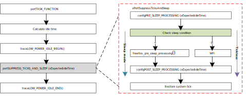

The FreeRTOS supports a low-power feature called tickless. It is implemented in an idle task which has the lowest priority.
That is, it is invoked when there is no other task under running. Note that unlike the original FreeRTOS,
We don't wake up based on the `xEpectedIdleTime`.

   FreeRTOS tickless in an idle task

The  figure above shows idle task code flow. In idle task, it will check sleep conditions (wakelock, sysactive_time, details in Section :ref:`power_saving_wakelock_apis` and :ref:`pmu_set_sysactive_time`) to determine whether needs to enter sleep mode or not.

- If not, the CPU will execute an ARM instruction **WFI** (wait for interrupt) which makes the CPU suspend until the interrupt happens. Normally systick interrupt resumes it. This is the software tickless.

- If yes, it will execute the function :func:`freertos_pre_sleep_processing()` to enter sleep mode or deep-sleep mode.

.. note::

   - Even FreeRTOS time control like software timer or `vTaskDelay` is set, it still enters the sleep mode if meeting the requirement as long as the idle task is executed.

   - `configUSE_TICKLESS_IDLE` must be enabled for power-saving application because sleep mode flow is based on tickless.