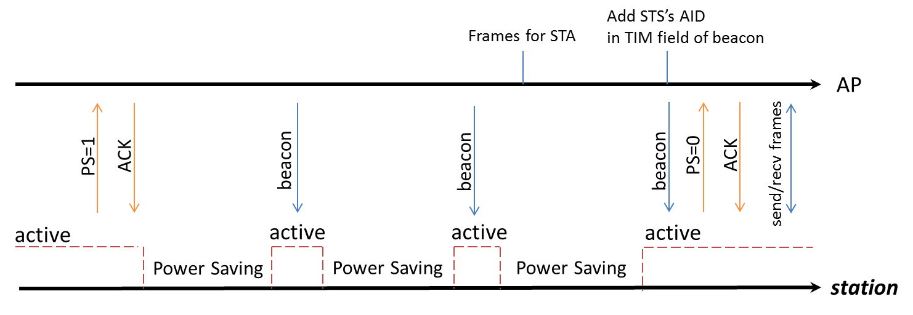

IEEE 802.11 power save management allows the station to enter its own sleep state.
It defines that the station needs to keep awake at a certain timestamp and enter a sleep state otherwise.

WLAN driver acquires the wakelock to avoid the system entering sleep mode when WLAN needs to keep awake.
And it releases the wakelock when it is permitted to enter the sleep state.

IEEE 802.11 power management allows the station to enter power-saving mode.
The station cannot receive any frame during power saving. Thus AP needs to buffer these frames and requires the station to periodically wake up to
check the beacon which has the information of buffered frames.

   Timeline of power saving

In SDK IEEE 802.11 power management is called LPS, and if NP enters sleep mode when Wi-Fi is in LPS mode, we call it WoWLAN mode.

In WoWLAN mode, a timer with a period of about 102ms will be set in the suspend function.
And LP will wake up every 102ms to receive the beacon to maintain the connection.

Except for LPS and WoWLAN, we also have IPS, which can be used when Wi-Fi is not connected.
The following tables list all three power-saving modes for Wi-Fi and the relationship between the system power mode and Wi-Fi power mode.

.. table:: **WiFi power saving mode**
   :width: 100%
   :widths: auto

   +--------+----------------------------------------+-------------------------------------------------------------------+------------------------------------------------------+
   | Mode   | Wi-Fi status                           |  Description                                                      | SDK                                                  |
   +========+========================================+===================================================================+======================================================+
   | IPS    | Not associated:                        | Wi-Fi driver automatically turns Wi-Fi off to save power.         | IPS mode is enabled in SDK by default and is not     |
   |        |                                        |                                                                   |                                                      |
   |        | - RF/BB/MAC OFF                        |                                                                   | recommended to be disabled.                          |
   +--------+----------------------------------------+-------------------------------------------------------------------+------------------------------------------------------+
   | LPS    | Associated:                            | LPS mode is used to implement IEEE 802.11 power management.       | LPS mode is enabled in SDK by default but can be     |
   |        |                                        |                                                                   |                                                      |
   |        | - RF periodically ON/OFF               | NP will control RF ON/OFF based on TSF and TIM IE in the beacon.  | disabled through API :func:`wifi_set_lps_enable()`.  |
   |        |                                        |                                                                   |                                                      |
   |        | - MAC/BB always ON                     |                                                                   |                                                      |
   +--------+----------------------------------------+-------------------------------------------------------------------+------------------------------------------------------+
   | WoWLAN | Associated:                            | NP is waked up at each beacon early interrupt to receive a beacon | WoWLAN mode is enabled in SDK by default.            |
   |        |                                        |                                                                   |                                                      |
   |        | - RF and BB periodically ON/OFF        | from the associated AP.                                           |                                                      |
   |        |                                        |                                                                   |                                                      |
   |        | - MAC periodically enters/ exits CG/PG | NP will wake up AP when receiving a data packet.                  |                                                      |
   +--------+----------------------------------------+-------------------------------------------------------------------+------------------------------------------------------+

.. table:: **Relationship between system and Wi-Fi power mode**
   :width: 100%
   :widths: auto

   +-------------------+------------------+------------------------------------------------------------------------+
   | System power mode | Wi-Fi power mode | Description                                                            |
   +===================+==================+========================================================================+
   | Active            | IPS              | Wi-Fi is on, but not connected                                         |
   +-------------------+------------------+------------------------------------------------------------------------+
   | Active            | LPS              | Wi-Fi is connected and enters IEEE 802.11 power management mechanism   |
   +-------------------+------------------+------------------------------------------------------------------------+
   | Sleep             | Wi-Fi OFF/IPS    |                                                                        |
   +-------------------+------------------+------------------------------------------------------------------------+
   | Sleep             | WoWLAN           | Wi-Fi keeps associating.                                               |
   +-------------------+------------------+------------------------------------------------------------------------+
   | Deep-sleep        | Wi-Fi OFF        | Deep-sleep is not recommended if Wi-Fi needs to keep on or associated. |
   +-------------------+------------------+------------------------------------------------------------------------+

.. table:: **API to enable/disable LPS**
   :width: 100%
   :widths: 40, 60

   +------------------------------------+----------------------+
   | API                                | Parameters           |
   +====================================+======================+
   | int wifi_set_lps_enable(u8 enable) | Parameter: enable    |
   |                                    |                      |
   |                                    | - TRUE: enable LPS   |
   |                                    |                      |
   |                                    | - FALSE: disable LPS |
   +------------------------------------+----------------------+

When Wi-Fi is connected and the system enters sleep mode, WoWLAN mode will be entered automatically.
And KM0 will periodically wake up to receive the beacon to maintain the connection, this will consume some power.
If you are more concerned about the system power consumption during sleep mode, and Wi-Fi is not a necessary function in your application,
it is recommended to set Wi-Fi off or choose Wi-Fi IPS mode.

