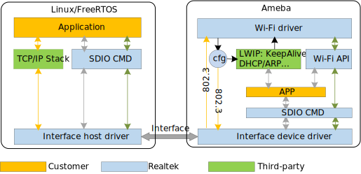

WiFi bridge 架构
------------------------
WiFi bridge 的架构图如下图所示.

   SDIO bridge architecture

WiFi Bridge 的特点
------------------------
.. tabs::

   .. include:: 21Dx11Dx_wifi_bridge_features.rst

WiFi Bridge 传输接口
------------------------

.. tabs::

   .. include:: wifi_bridge_interface.rst

WiFi Bridge 文件目录
--------------------------------
.. tabs::

   .. include:: wifi_bridge_filetree_dev_rtos_cn.rst

   .. include:: wifi_bridge_filetree_rtos_cn.rst

   .. include:: wifi_bridge_filetree_linux_cn.rst

WiFi Bridge 硬件配置
----------------------

接口连接
~~~~~~~~~~~~~~~~~~~~~~

目前经过测试的Host有：Linux @ PC/Linux @ Raspberry Pi/RTOS @ STM32。 下表所示是Ameba 和 Raspberry Pi的pin脚连接。

.. tabs::

   .. include:: 21Dx11Dx_wifi_bridge_hostpins_raspberry.rst

.. note::
   以上Ameba的SDIO pin是 SDK的默认pin脚，如果开发者使用另外的pin脚做SDIO，则需要修改SPDIO_Board_Init 中的SDIO pinmux配置。

   这个文件位于如下位置:

   ::

      component/soc/amebadplus/hal/src/spdio_api.c

   目前Host端的SDIO interrupt实现的是标准SDIO 中断模式, SDIO_DATA1必须配置为SDIO而不是GPIO。如果Host端不支持SDIO 中断，开发者可以考虑使用polling模。

SDIO转接板
~~~~~~~~~~~~~~~~~~~~~~
由于SDIO 飞线可能会导致信号传输质量差，无法使用较高的频率传输。可以购买SDIO转接板连接到Ameba的SDIO pin脚，如下图所示：

   .. This figure is located at figures.
      If the figure name has been changed, make sure to update sdio_fullmac.rst accordingly.

   .. figure:: figures/sdio_adapter_board.jpg
      :align: center
      :scale: 50%

      FullMAC SDIO 转接板

.. note::
   瑞昱的SDIO转接板也即将上线销售，当前可以先直接联系<claire_wang@realsil.com.cn>索取。

树莓派
~~~~~~~~~~~~~~~~~~~~~~
为了实现高速传输，建议将Amaba的Demo板的 SDIO pin脚直接焊接到树莓派对应的pin脚，如下图所示：

   .. figure:: figures/connection_with_raspberry_pi.jpg
      :align: center
      :scale: 50%

      connection with Raspberry Pi

WiFi Bridge Device 驱动移植指南
--------------------------------
.. include:: wifi_bridge_portingguide_wifi_dev_cn.rst

WiFi Bridge Host 驱动移植指南
--------------------------------
.. tabs::

   .. include:: wifi_bridge_portingguide_wifi_rtos_cn.rst

   .. include:: wifi_bridge_portingguide_wifi_linux_cn.rst

   .. include:: wifi_bridge_portingguide_wifi_raspberry_pi_cn.rst

WiFi Bridge Linux 测试
--------------------------

.. include:: wifi_bridge_testapp_linux_cn.rst

WiFi Bridge 吞吐量
--------------------
.. table::
   :width: 100%
   :widths: auto

   +--------+---------------+
   | Item   | Bandwidth 20M |
   +========+===============+
   | TCP TX | 42Mbps        |
   +--------+---------------+
   | TCP RX | 42Mbps        |
   +--------+---------------+
   | UDP TX | 53Mbps        |
   +--------+---------------+
   | UDP RX | 52Mbps        |
   +--------+---------------+

测试场景:

- Image2 running on PSRAM

- AP: xiaomi AX3000

- Host 平台: Linux PC