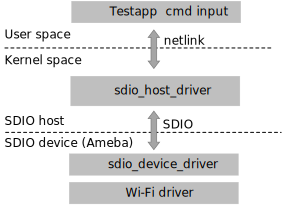

APP Architecture
~~~~~~~~~~~~~~~~~~~~~~~~~~~~~~~~~~~~~~~~
The testapp wraps some Wi-Fi commands, such as Wi-Fi connect, Wi-Fi scan, which can be used to control Ameba from host side.

The testapp uses netlink to communicate with SDIO host driver. When SDIO host driver receives related commands, the testapp will inform SDIO device to perform corresponding operation by SDIO interface. The control flow is illustrated below.

   testapp control flow

APP Commands
~~~~~~~~~~~~~~~~~~~~~~~~~~~~~~~~~~~~
.. table::
   :width: 100%
   :widths: auto

   +----------------------------+----------------------------------------------------------------------------------------------+
   | Command                    | Description                                                                                  |
   +============================+==============================================================================================+
   | wifi_connect param1 param2 | connect to AP.                                                                               |
   |                            |                                                                                              |
   |                            | :param1: SSID                                                                                |
   |                            |                                                                                              |
   |                            | :param2: password (option)                                                                   |
   |                            |                                                                                              |
   +----------------------------+----------------------------------------------------------------------------------------------+
   | disconnect                 | Disconnect to AP                                                                             |
   +----------------------------+----------------------------------------------------------------------------------------------+
   | scan                       | Trigger scan                                                                                 |
   +----------------------------+----------------------------------------------------------------------------------------------+
   | scanres                    | Get and print scan result                                                                    |
   +----------------------------+----------------------------------------------------------------------------------------------+

APP Build and Run
~~~~~~~~~~~~~~~~~~~~~~~~~~
1. Copy ``sdio_bridge/bridge_api`` folder to host

2. Compile and execute as below, then you can input test commands.

   .. code-block:: C

      $cd sdio_bridge/bridge_api/testapp
      $make
      $sudo ./bridge

   .. figure:: figures/bridge_testapp_control_flow.png
      :scale: 60%
      :align: center
      :name: bridge_testapp_control_flow

      testapp control flow

   .. figure:: figures/bridge_ifconfig_result.png
      :scale: 60%
      :align: center
      :name: bridge_ifconfig_result

      ifconfig result

APP Test Flow
~~~~~~~~~~~~~~~~~~~~~~~~~~~~
The following is a simple operation flow. After configuration as below, data communication can be started.

After make and install host driver, and successfully make testapp, enter ``sdio_bridge/testapp folder``.

1. ``sudo ./bridge`` to start.

2. ``scan`` to trigger scan.

3. ``scanres`` to get and print scan result

4. ``wifi_connect target_ssid password`` command to connect your target AP,  The IP address will also be obtained and configured after successfully connected to AP.

5. After successfully connected, use the standard ``ifconfig`` to check the interface, and the IP address will be already configured.

After these steps, data path can be started, you can use the standard ``ping`` command or ``iperf`` command to test the data path.