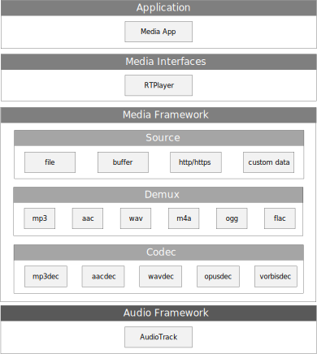
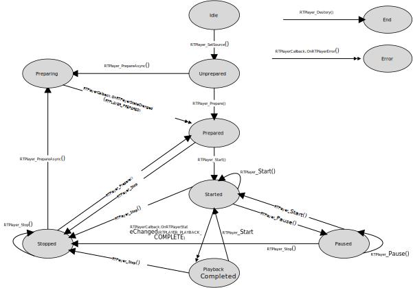
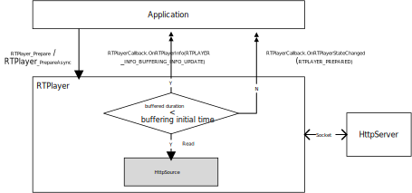
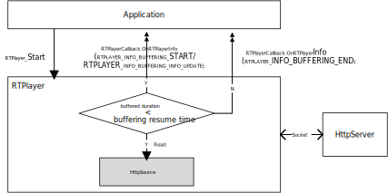

多媒体架构
==========

概述
----------------
The Media refers to a whole media architecture aiming to provide media interfaces for applications to use. It provides a player named RTPlayer. The RTPlayer can be used to control the playback of an audio file.

There are many kinds of audio sources, the RTPlayer supports the following:

- Audio file stored in the flash
- Audio data buffer stored in the memory
- Http/Https streaming
- Custom data source

The RTPlayer supports the following audio formats:

.. table:: 
   :width: 100%
   :widths: auto

   +--------------+-----------------------------------------------------------------------------------+------------------------------+
   | Audio format | Details                                                                           | File types/Container formats |
   +==============+===================================================================================+==============================+
   | AAC          | Support for mono/stereo content with standard sampling rates from 8kHz to 96kHz.  | ADTS raw AAC (.aac)          |
   |              |                                                                                   |                              |
   |              |                                                                                   | MPEG-4 (.m4a)                |
   +--------------+-----------------------------------------------------------------------------------+------------------------------+
   | MP3          | Mono/Stereo 8-320Kbps constant (CBR) or variable bit-rate (VBR).                  | MP3 (.mp3)                   |
   +--------------+-----------------------------------------------------------------------------------+------------------------------+
   | PCM/WAVE     | 8-bit, 16-bit, 24-bit and float linear PCM. Sampling rates for raw PCM recordings | WAVE (.wav)                  |
   |              |                                                                                   |                              |
   |              | from 8kHz to 96kHz.                                                               |                              |
   +--------------+-----------------------------------------------------------------------------------+------------------------------+
   | FLAC         | Mono/Stereo (no multichannel). Sample rates up to 48 kHz, 16-bit recommended;     | FLAC (.flac)                 |
   |              |                                                                                   |                              |
   |              | no dither applied for 24-bit.                                                     |                              |
   +--------------+-----------------------------------------------------------------------------------+------------------------------+
   | Opus         | N/A                                                                               | Ogg (.ogg)                   |
   +--------------+-----------------------------------------------------------------------------------+------------------------------+
   | Vorbis       | N/A                                                                               | Ogg (.ogg)                   |
   +--------------+-----------------------------------------------------------------------------------+------------------------------+

架构
--------
The applications interact with media according to the following figure.

   Media architecture

Playback 状态
~~~~~~~~~~~~~~~~~~~~~~~~~~~~~~
Playback of media is managed through a state machine. The playback state is shown as below.

   Playback states

The supported playback control operations of an RTPlayer object is shown in :ref:`media_playback_states`. The ovals represent the possible state of the RTPlayer object. The arcs with a single arrow head represent synchronous method calls that drive the object state transition. Those with a double arrow head represent asynchronous method calls that drive the object state transition.

As can be seen from the figure, certain operations are only valid when the player is in specific states. If you perform an operation in the wrong state, the system may cause other undesirable behaviors. Calling some functions at some specific states may trigger state transmit, please refer to the following table for details.

.. table:: 
   :width: 100%
   :widths: auto

   +-------------------------+------------------------------+------------------------------------+--------------------------------------------------------+
   | Method                  | Valid states                 | Invalid states                     | Comments                                               |
   +=========================+==============================+====================================+========================================================+
   | RTPlayer_Start          | {Prepared, Started, Paused,  | {Idle, Unprepared, Stopped, Error} | Calling this function in a valid state will switch to  |
   |                         |                              |                                    |                                                        |
   |                         | PlaybackCompleted }          |                                    | the Start state, while calling this function in an     |
   |                         |                              |                                    |                                                        |
   |                         |                              |                                    | invalid state will switch to the Error state.          |
   +-------------------------+------------------------------+------------------------------------+--------------------------------------------------------+
   | RTPlayer_Stop           | {Prepared, Started, Stopped, | {Idle, Unprepared, Error}          | Calling this function in a valid state will switch to  |
   |                         |                              |                                    |                                                        |
   |                         | Paused, PlaybackCompleted}   |                                    | the Stopped state, while calling this function in an   |
   |                         |                              |                                    |                                                        |
   |                         |                              |                                    | invalid state will switch to the Error state.          |
   +-------------------------+------------------------------+------------------------------------+--------------------------------------------------------+
   | RTPlayer_Pause          | {Started, Paused,            | {Idle, Unprepared, Prepared,       | Calling this function in a valid state will switch to  |
   |                         |                              |                                    |                                                        |
   |                         | PlaybackCompleted}           | Stopped, Error}                    | the Paused state, while calling this function in an    |
   |                         |                              |                                    |                                                        |
   |                         |                              |                                    | invalid state will switch to the Error state.          |
   +-------------------------+------------------------------+------------------------------------+--------------------------------------------------------+
   | RTPlayer_Reset          | {Idle, Unprepared, Prepared, | {}                                 | Calling this function will reset the object.           |
   |                         |                              |                                    |                                                        |
   |                         | Started, Paused, Stopped,    |                                    |                                                        |
   |                         |                              |                                    |                                                        |
   |                         | PlaybackCompleted, Error}    |                                    |                                                        |
   +-------------------------+------------------------------+------------------------------------+--------------------------------------------------------+
   | RTPlayer_GetCurrentTime | {Idle, Unprepared, Prepared, | {Error}                            | Calling this function in a valid state does not        |
   |                         |                              |                                    |                                                        |
   |                         | Started, Paused, Stopped,    |                                    | change the state, while calling this function in an    |
   |                         |                              |                                    |                                                        |
   |                         | PlaybackCompleted}           |                                    | invalid state will switch to the Error state.          |
   +-------------------------+------------------------------+------------------------------------+--------------------------------------------------------+
   | RTPlayer_GetDuration    | {Prepared, Started, Paused,  | {Idle, Unprepared, Error}          | Calling this function in a valid state does not        |
   |                         |                              |                                    |                                                        |
   |                         | Stopped, PlaybackCompleted}  |                                    | change the state, while calling this function in an    |
   |                         |                              |                                    |                                                        |
   |                         | PlaybackCompleted}           |                                    | invalid state will switch to the Error state.          |
   +-------------------------+------------------------------+------------------------------------+--------------------------------------------------------+
   | RTPlayer_IsPlaying      | {Idle, Unprepared, Prepared, | {Error}                            | Calling this function in a valid state does not        |
   |                         |                              |                                    |                                                        |
   |                         | Started, Paused, Stopped,    |                                    | change the state, while calling this function in an    |
   |                         |                              |                                    |                                                        |
   |                         | PlaybackCompleted}           |                                    | invalid state will switch to the Error state.          |
   +-------------------------+------------------------------+------------------------------------+--------------------------------------------------------+
   | RTPlayer_SetSource      | {Idle}                       | {Unprepared, Prepared, Started,    | Calling this function in a valid state will switch to  |
   |                         |                              |                                    |                                                        |
   |                         |                              | Paused, Stopped,                   | the Unprepared state, while calling this function in   |
   |                         |                              |                                    |                                                        |
   |                         |                              | PlaybackCompleted, Error}          | an invalid state will switch to the Error state.       |
   +-------------------------+------------------------------+------------------------------------+--------------------------------------------------------+
   | RTPlayer_SetDataSource  | {Idle}                       | {Unprepared, Prepared, Started,    | Calling this function in a valid state will switch to  |
   |                         |                              |                                    |                                                        |
   |                         |                              | Paused, Stopped,                   | the Unprepared state, while calling this function in   |
   |                         |                              |                                    |                                                        |
   |                         |                              | PlaybackCompleted, Error}          | an invalid state will switch to the Error state.       |
   +-------------------------+------------------------------+------------------------------------+--------------------------------------------------------+
   | RTPlayer_Prepare        | {Unprepared, Stopped}        | {Idle, Prepared, Started, Paused,  | Calling this function in a valid state will switch to  |
   |                         |                              |                                    |                                                        |
   |                         |                              | PlaybackCompleted, Error}          | the Prepared state, while calling this function in     |
   |                         |                              |                                    |                                                        |
   |                         |                              |                                    | an invalid state will switch to the Error state.       |
   +-------------------------+------------------------------+------------------------------------+--------------------------------------------------------+
   | RTPlayer_PrepareAsync   | {Unprepared, Stopped}        | {Idle, Prepared, Started, Paused,  | Calling this function in a valid state will switch to  |
   |                         |                              |                                    |                                                        |
   |                         |                              | PlaybackCompleted, Error}          | the Preparing state, while calling this function in    |
   |                         |                              |                                    |                                                        |
   |                         |                              |                                    | an invalid state will switch to the Error state.       |
   +-------------------------+------------------------------+------------------------------------+--------------------------------------------------------+
   | RTPlayer_SetCallbacks   | any                          | {}                                 | Calling this function does not change the state.       |
   +-------------------------+------------------------------+------------------------------------+--------------------------------------------------------+

Callbacks
~~~~~~~~~~~~~~~~~~
The Media provides a registration function :func:`RTPlayer_SetCallback(struct RTPlayer *player, struct RTPlayerCallback *callbacks)` for applications to monitor state change and runtime errors during playback or streaming. Applications need to implement the interfaces defined in struct ``RTPlayerCallback``.

The relevant interfaces are described as below:

- ``void (*OnRTPlayerStateChanged)(const struct RTPlayerCallback *listener, const struct RTPlayer *player, int state)``

   Notify monitors the player status is changed. The parameter state is one of RTPlayerStates. RTPlayerStates is shown as below:

   .. table:: 
      :width: 100%
      :widths: auto

      +----------------------------+-----------------------------------+
      | RTPlayerStates value       | Introduction                      |
      +============================+===================================+
      | RTPLAYER_IDLE              | Indicates an initial state.       |
      +----------------------------+-----------------------------------+
      | RTPLAYER_PREPARING         | Indicates player is preparing.    |
      +----------------------------+-----------------------------------+
      | RTPLAYER_PREPARED          | Indicates player prepared.        |
      +----------------------------+-----------------------------------+
      | RTPLAYER_STARTED           | Indicates player started.         |
      +----------------------------+-----------------------------------+
      | RTPLAYER_PAUSED            | Indicates player paused.          |
      +----------------------------+-----------------------------------+
      | RTPLAYER_STOPPED           | Indicates player stopped.         |
      +----------------------------+-----------------------------------+
      | RTPLAYER_PLAYBACK_COMPLETE | Indicates player played complete. |
      +----------------------------+-----------------------------------+
      | RTPLAYER_ERROR             | Indicates a player error.         |
      +----------------------------+-----------------------------------+

- ``void (*OnRTPlayerInfo)(const struct RTPlayerCallback *listener, const struct RTPlayer *player, int info, int extra)``

   Notify monitors some player information. The parameter info indicates the information type, see RTPlayerInfos. The parameter extra indicates the information code, for example, the value of extra is the percentage of buffered data during a buffering state. RTPlayerInfos is shown as below:

   .. table:: 
      :width: 100%
      :widths: auto

      +-------------------------------------+-----------------------------------------------------------------------------------+
      | RTPlayerInfos Value                 | Introduction                                                                      |
      +=====================================+===================================================================================+
      | RTPLAYER_INFO_BUFFERING_START       | RTPlayer is temporarily pausing playback internally in order to buffer more data. |
      +-------------------------------------+-----------------------------------------------------------------------------------+
      | RTPLAYER_INFO_BUFFERING_END         | RTPlayer is resuming playback after filling buffers.                              |
      +-------------------------------------+-----------------------------------------------------------------------------------+
      | RTPLAYER_INFO_BUFFERING_INFO_UPDATE | RTPlayer buffered data percentage update.                                         |
      +-------------------------------------+-----------------------------------------------------------------------------------+

- ``void (*OnRTPlayerError)(const struct RTPlayerCallback *listener, const struct RTPlayer *player, int error, int extra)``

   Notify monitors some player error occurs. The parameter error indicates the error type. For details, see RTPlayerErrors. RTPlayerErrors is shown as below:

   .. table:: 
      :width: 100%
      :widths: auto

      +------------------------+---------------------------+
      | RTPlayerInfos value    | Introduction              |
      +========================+===========================+
      | RTPLAYER_ERROR_UNKNOWN | Indicates a player error. |
      +------------------------+---------------------------+

RTDataSource
~~~~~~~~~~~~~~~~~~~~~~~~
The Media supports playing a customer implementation data source. Applications need to implement the interfaces defined in struct ``RTDataSource``.

1. Relevant interfaces are described as below.

   .. code-block:: c

      rt_status_t (*CheckPrepared)(const RTDataSource *source);

2. Check whether the data source initialization is successful.

   .. code-block:: c

      ssize_t (*ReadAt)(const RTDataSource *source, off_t offset, void *data, size_t size);

3. Read some data from customer data source, and return the number of bytes read, or error value on failure.

   .. code-block:: c

      rt_status_t (*GetLength)(const RTDataSource *source, off_t *size);

4. Get the whole length of the source.

流缓冲原理
~~~~~~~~~~~~~~~~~~~~~~~~~~~
For http streaming source, the bandwidth of the network will affect the playback effect. A good user experience should contain the following functions:

- When the download speed is too slow, the application needs to pause playback and makes some prompts, such as: pop up some dialog boxes showing the download percentage.
- When a certain data has been downloaded, the application needs to resume playback.

The RTPlayer sets a starting water level for http streaming source, playback will not start until enough audio data is buffered. Application calls :func:`RTPlayer_Prepare()` or :func:`RTPlayer_PrepareAsync(…)` to prepare the streaming source.

- :func:`RTPlayer_Prepare()` is a synchronous function, application can call :func:`RTPlayer_Start()` after it.
- :func:`RTPlayer_PrepareAsync()` is an asynchronous function, application should not call :func:`RTPlayer_Start()` until receiving ``RTPlayerCallback.OnRTPlayerStateChanged(…, …, RTPLAYER_PREPARED)``.

For http source, the RTPlayer will continuously check the downloaded data and update the downloaded percentage to monitors via ``RTPlayerCallback.OnRTPlayerInfo(…, …, RTPLAYER_INFO_BUFFERING_INFO_UPDATE)``. When the downloaded data is enough, the RTPlayer will trigger ``RTPlayerCallback.OnRTPlayerStateChanged (…, …, RTPLAYER_PREPARED)`` and application can start the playback. The detailed principle is shown as below.

   HttpSource stream buffering principle during starting

During playback, if the remaining downloaded data is not enough, the RTPlayer will trigger ``RTPlayerCallback.OnRTPlayerInfo(…, …, RTPLAYER_INFO_BUFFERING_START)``. Application can update user display interfaces to indicate users that the current network status is poor. During this time, the RTPlayer will continuously check the downloaded data and update the downloaded percentage to monitors via ``RTPlayerCallback.OnRTPlayerInfo(…, …, RTPLAYER_INFO_BUFFERING_INFO_UPDATE)``. When the downloaded data is enough, the RTPlayer will trigger ``RTPlayerCallback.OnRTPlayerInfo(…, …, RTPLAYER_INFO_BUFFERING_END)`` and application can resume the playback. The detailed principle is shown as below.

   HttpSource stream buffering principle during playing

接口
--------------------
简介
~~~~~~~~~~~~~~~~
The Media provides one layer of interfaces:

.. table:: 
   :width: 100%
   :widths: auto

   +------------+------------------------------------------------------+
   | API layers | Introduction                                         |
   +============+======================================================+
   | RTPlayer   | High-level API for applications to play audio files. |
   +------------+------------------------------------------------------+

RTPlayer API
~~~~~~~~~~~~~~~~~~~~~~~~~~
The RTPlayer APIs can perform basic operations of a playback, such as starting a playback, pausing audio during playing, querying information about a specified playback, and registering observer to monitor playback status change.

使用 RTPlayer
^^^^^^^^^^^^^^^^^^^^^^^^^^^^
The RTPlayer supports several different media sources such as: local files stored in the flash, media buffer data and streaming. We need to pass an URL which represents the resource path to RTPlayer when creating a playback.

- For a file source file, URL is the storage path, such as: ``char *url = "lfs://1.wav"``.
- For a buffering source, URL starts with **"buffer://"**, such as: ``char *url = "buffer://1611496456"``.

  .. note::
     **1611496456** is an address pointing to buffer data information.

- For an http/https streaming source, URL starts with **"http://"** or **"https://"**, such as: ``char *url = "http://127.0.0.1/2.mp3";`` or ``char *url = "https://127.0.0.1/2.mp3"``.

Here is how you might create a playback for a buffer source:

.. code-block:: c

   // source_buffer represents an audio
   const unsigned char source_buffer[] = {-1, -15, 76, -128, 41, 63, ...};

   char url[64];
   memset(url, 0x00, sizeof(url));
   int buffer[2] = { sizeof(source_buffer), source_buffer };
   sprintf(&url[0], "%s", "buffer://");
   sprintf(&url[strlen(url)], "%d", (int)(&buffer));
   struct RTPlayer *player = RTPlayer_Create();
   RTPlayer_SetSource(player, url);

Here is how you might create a playback for an http source file:

.. code-block:: c

   char *url = "http://127.0.0.1/2.mp3";
   struct RTPlayer *player = RTPlayer_Create();
   RTPlayer_SetSource(player, url);

After :func:`RTPlayer_SetSource`, you need to prepare the RTPlayer by call :func:`RTPlayer_Prepare()` or :func:`RTPlayer_PrepareAsync()`.

- :func:`RPlayer_Prepare(…)` is a synchronous function, you can call :func:`RTPlayer_Start(…)` immediately after it.

  .. code-block:: c

     RTPlayer_Prepare(player);
     RTPlayer_Start(player);

- :func:`RTPlayer_PrepareAsync(…)` is an asynchronous function, you **should not** call :func:`RTPlayer_Start(…)` until receiving ``RTPlayerCallback.OnRTPlayerStateChanged(…, …, RTPLAYER_PREPARED)``.

  .. code-block:: c

     enum PlayingStatus {
        IDLE,
        PREPARING,
        PREPARED,
        ...
     };
     void OnPlayerStateChanged(const struct RTPlayerCallback *listener, const struct RTPlayer *player, int state)
     {
        switch (state) {
        case RTPLAYER_PREPARED: { //entered for async prepare
           g_playing_status = PREPARED;
           break;
        }
        ...
     }
     RTPlayer_PrepareAsync(player);
     g_playing_status = PREPARING;
     while (g_playing_status != PREPARED) {
        OsalMSleep(20);
     }
     RTPlayer_Start(player);

When the RTPlayer is done preparing, it enters the Prepared state, which means you can call :func:`RTPlayer_Start()` to make it play the media. At that point, you can move between the Started, Paused and PlaybackCompleted states by calling such methods as :func:`RTPlayer_Start()` and :func:`RTPlayer_Pause()`, amongst others. When you call :func:`RTPlayer_Stop()`, however, notice that you cannot call :func:`RTPlayer_Start()` again until you prepare the RTPlayer again.

Always keep the state diagram in mind when writing code that interacts with an RTPlayer object, because calling its methods from the wrong state is a common cause of bugs.

Pause playback:

.. code-block:: c

   RTPlayer_Pause(player);

An RTPlayer can consume valuable system resources. Therefore, you should always take extra precautions to make sure you are not hanging on to an RTPlayer instance longer than necessary. When the playback is done, you should always call :func:`RTPlayer_Stop()` and :func:`RTPlayer_Reset()` to release resources and restore the state. After calling :func:`RTPlayer_Reset()`, you will have to initialize it again by setting the source and calling :func:`RTPlayer_Prepare()`.

- Call :func:`RTPlayer_Stop()` when playback complete by receiving ``RTPLAYER_PLAYBACK_COMPLETE`` event.

  .. code-block:: c

     RTPlayer_Stop(player);

- Call :func:`RTPlayer_Reset()` when playback stopped by receiving ``RTPLAYER_STOPPED`` event.

  .. code-block:: c

     RTPlayer_Reset(player);

Besides, you must release the RTPlayer, because it makes little sense to hold on to it while your activity is not interacting with the user (unless you are playing media in the background). When your activity is resumed or restarted, of course, you need to create a new RTPlayer and prepare it again before resuming playback. Here's how you should release and then nullify your RTPlayer:

.. code-block:: c

   RTPlayer_Destory(player);
   player = NULL;

使用 Callback
^^^^^^^^^^^^^^^^^^^^^^^^^^^^
You can create an instance of ``RTPlayerCallback`` and assign it to the player to monitor playback. Here is an example:

.. code-block:: c

   void OnStateChanged(const struct RTPlayerCallback *listener, const struct RTPlayer *player, int state)
   {
      switch (state) {
         case RTPLAYER_PREPARED:
            // Enterred for async prepare
            break;
         case RTPLAYER_PLAYBACK_COMPLETE:
            // Play complete, need to call Stop();
            break;
         case RTPLAYER_STOPPED:
            // Stop complete, need to call Reset();
            break;
         case RTPLAYER_PAUSED:
            break;
      }
   }
   void OnInfo(const struct RTPlayerCallback *listener, const struct RTPlayer *player, int info, int extra)
   {
      switch (info) {
         case RTPLAYER_INFO_BUFFERING_START:
            // The remaining data is lower than the water buffer, applications should pause playback and pop up some prompt dialog.
            break;
         case RTPLAYER_INFO_BUFFERING_END:
            // Continue playing now.
            break;
         case RTPLAYER_INFO_BUFFERING_INFO_UPDATE:
            // Prompt the cached buffer percentage during buffering.
            break;
      }
   }
   void OnError(const struct RTPlayerCallback *listener, const struct RTPlayer *player, int error, int extra)
   {
      // Handle playback error.
   }
   struct RTPlayerCallback *callback = (struct RTPlayerCallback *)OsalMemCalloc(sizeof (struct RTPlayerCallback), LOG_TAG, __LINE__);
   callback->OnRTPlayerStateChanged = OnStateChanged;
   callback->OnRTPlayerInfo = OnInfo;
   callback->OnRTPlayerError = OnError;
   RTPlayer_SetCallback(player, callback);

Remember to release ``RTPlayerCallback`` object to avoid memory leak:

.. code-block:: c

   OsalMemFree(callback);

使用 RTDataSource
^^^^^^^^^^^^^^^^^^^^
If the source does not come from a fixed url, customers can implement their own data source based on ``RTDataSource``.

.. code-block:: c

   typedef struct MyDataSource MyDataSource;
   struct MyDataSource {
      RTDataSource base;
      char *data;
      int data_length; //current total source length; for unknown_data_length source, data_length will change until last_data_gained equals 1
      bool unknown_data_length;
      bool last_data_gained;
   };

Implement ``RTDataSource`` interfaces:

.. code-block:: c

   rt_status_t MyDataSource_CheckPrepared(const RTDataSource *source)
   {
      if (!source) {
         return OSAL_ERR_NO_INIT;
      }
      MyDataSource *data_source = (MyDataSource *)source;
      return data_source->data ? OSAL_OK : OSAL_ERR_NO_INIT;
   }
   ssize_t MyDataSource_ReadAt(const RTDataSource *source, off_t offset, void *data, size_t size)
   {
      if (!source || !data || !size) {
         return (ssize_t)OSAL_ERR_INVALID_OPERATION;
      }
      MyDataSource *data_source = (MyDataSource *)source;
      if (offset >= data_source->data_length) {
         if (data_source->unknown_data_length && !data_source->last_data_gained) {
            return (ssize_t)RTDATA_SOURCE_READ_AGAIN;
         }
         return (ssize_t)RTDATA_SOURCE_EOF;
      }
      if ((data_source->data_length - offset) < size) {
         size = data_source->data_length - offset;
      }
      memcpy(data, data_source->data + offset, (size_t)size);
      return size;
   }
   rt_status_t MyDataSource_GetLength(const RTDataSource *source, off_t *size)
   {
      if (!source) {
         return RTDATA_SOURCE_FAIL;
      }
      MyDataSource *data_source = (MyDataSource *)source;
      *size = data_source->data_length;
      if (data_source->unknown_data_length && !data_source->last_data_gained) {
         return RTDATA_SOURCE_UNKNOWN_LENGTH;
      }
      return OSAL_OK;
   }
   RTDataSource *MyDataSource_Create(char *data, int length)
   {
      MyDataSource *data_source = OsalMemCalloc(sizeof(MyDataSource), LOG_TAG, __LINE__);
      data_source->base.CheckPrepared = MyDataSource_CheckPrepared;
      data_source->base.ReadAt = MyDataSource_ReadAt;
      data_source->base.GetLength = MyDataSource_GetLength;
      data_source->data = data;
      data_source->data_length = length;
      return (RTDataSource *)data_source;
   }
   void MyDataSource_Destroy(MyDataSource *source)
   {
      if (!source) {
         return;
      }
      OsalMemFree((void *)source);
   }

Here is how you might using a player for control the playback of an ``RTDataSource``:

.. code-block:: c

   const unsigned char source_buffer[] = {-1, -15, 76, -128, 41, 63, ...};
     // source_buffer represents an audio
   RTDataSource *data_source = MyDataSource_Create(source_buffer, sizeof(source_buffer));
   struct RTPlayer *player = RTPlayer_Create();
   RTPlayer_SetDataSource(player, data_source);
   RTPlayer_Prepare(player);
   RTPlayer_Start(player);
   ...
   RTPlayer_Stop(player);
   RTPlayer_Reset(player);
   MyDataSource_Destroy((MyDataSource *)data_source);
   RTPlayer_Destory(player);
