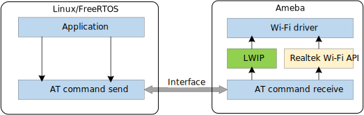

.. _at_commands_solution_cn:

如图所示，Ameba通过UART/SPI等接口和主机MCU连接，主机MCU通过AT指令控制网络设备和传输网络数据。

.. admonition:: 更多信息

   .. hlist::
      :columns: 2

      * |finger_icon| `AT Command SDK <https://github.com/Ameba-AIoT/ameba-rtos>`_
      * |finger_icon| `AT Command DoC <https://ameba-aiot.github.io/ameba-iot-docs/RTL8721Dx/en/latest/ameba/en/at_command/src/index.html>`_
