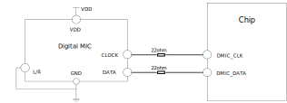
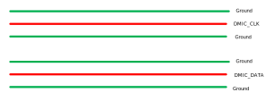
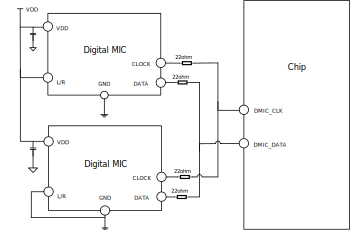
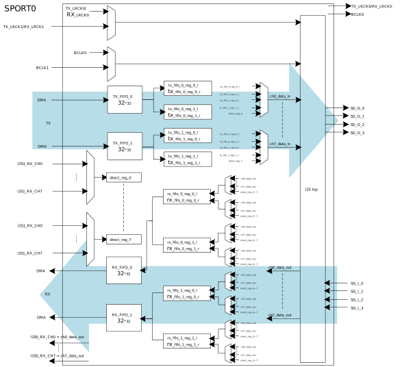
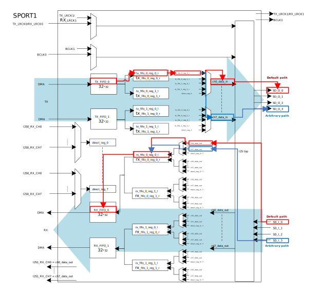
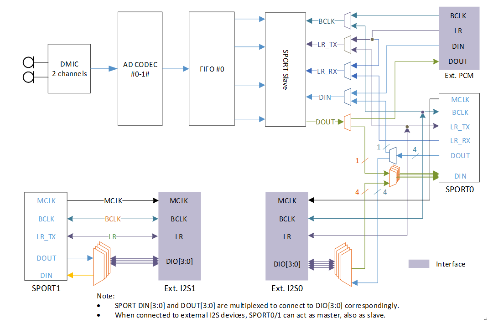
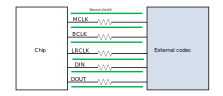

Audio Hardware Application
-----------------------------
DMIC-in
~~~~~~~~~~~~~~
Digital microphone (DMIC) records audio data. It is integrated with ADC internal, and can directly output digital signal. DMIC-in supports mono mode and stereo mode.

DMIC-in Mono Mode
^^^^^^^^^^^^^^^^^^
Tie the L/R of a digital microphone to ground or VDD if only one digital microphone is placed.

   DMIC-in mono mode connection

For layout design, *DMIC_CLK* and *DMIC_DATA* should add ground isolation on both sides of the routing.

   DMIC-in layout

DMIC-in Stereo Mode
^^^^^^^^^^^^^^^^^^^^
Tie the L/R of two digital microphones to ground and VDD respectively if a stereo microphone is needed.
The two microphones share the *DMIC_DATA* according to the rising/falling edge.

   DMIC-in stereo mode connection

I2S Data Pin
~~~~~~~~~~~~~
The data paths of SPORT0 and SPORT1 are shown in :ref:`sport0_data_path` and :ref:`sport1_data_path`.

- For I2S TDM mode: Only *SD_O_0* and *SD_I_0* can be used.

- For I2S Multi-IO mode: *SD_O_0/1/2/3* and *SD_I_0/1/2/3* all can be used. By default, use *SD_O_0/1/2/3* and *SD_I_0/1/2/3* in order according to the number of channels.

   SPORT0 data path

   SPORT1 data path

As shown above, the default path is red line and the arbitrary path is blue line. For arbitrary path, default order can be changed by the following interfaces:

- *SD_O*: AUDIO_SP_TXCHNSrcSel(u32 index, u32 fifo_num, u32 NewState)

- *SD_I*: AUDIO_SP_RXFIFOSrcSel(u32 index, u32 fifo_num, u32 NewState)

SPORT0 Rx with External I2S0
~~~~~~~~~~~~~~~~~~~~~~~~~~~~~
SPORT0 is for internal digital microphone interface or EXT. I2S0, but not both.

   Audio block diagram

When SPORT0 Rx is connected with EXT. I2S0, the internal connection of SPORT Slave and SPORT0 must be disconnected by the interface:

.. code-block:: c

   AUDIO_CODEC_SetI2SSRC(I2S0, EXTERNAL_I2S)

.. note::
   Calling this API can access register of audio codec, so you need to enable the function and clock of audio codec at first:

   .. code-block:: c

      RCC_PeriphClockCmd(APBPeriph_AC, APBPeriph_AC_CLOCK, ENABLE).

I2S layout
~~~~~~~~~~~
Reserve 0R resistors on the clk and data paths of I2S. If layout space allows, increase ground isolation for CLK and DATA as much as possible.

   I2S layout
