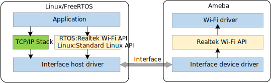

.. _fullmac:

如下图所示, 在Wi-Fi FullMAC 方案中, Ameba作为网卡, 通过UART/SPI/SDIO/USB与主机MCU连接, 为主机MCU提供网络连接功能.

主机MCU负责运行TCPIP协议栈, 用户可以在主机MCU通过scoket接口开发应用程序.

* 主机为linux: 用户可以使用标准的wpa_supplicant 和 标准的 linux WiFi API进行产品开发.

  - 支持P2P 和 NAN

* 主机为rtos: 用户可以使用标准的realtek Wi-Fi APIs进行产品开发.

.. admonition:: 更多信息

   .. hlist::
      :columns: 2

      * |finger_icon| `Wi-Fi FullMAC SDK <https://github.com/Ameba-AIoT/ameba-rtos>`_
      * |finger_icon| `Wi-Fi FullMAC DoC <https://ameba-aiot.github.io/ameba-iot-docs/RTL8721Dx/cn/latest/ameba/cn/fullmac/src/index.html>`_
