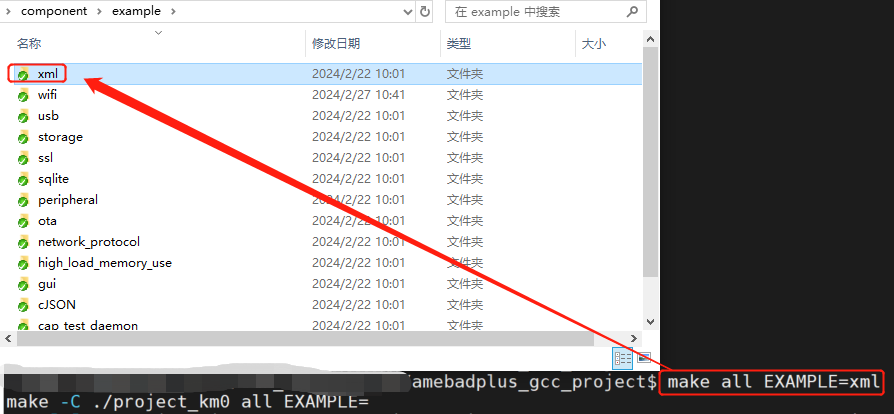

.. _sdk_example:

概述
--------------------------------------
在SDK中，有两种类型的示例：

- 应用示例
- 外设示例

本章介绍两种SDK示例的内容，以及如何编译它们。

下表对这两种示例进行了简要描述。

.. table:: SDK 示例
   :width: 100%
   :widths: auto

   +---------------------+---------------------------------------+-------------------------------+
   | Items               | Path                                  | Description                   |
   +=====================+=======================================+===============================+
   | Application example | {SDK}\\component\\example             | xml, ssl, …                   |
   +---------------------+---------------------------------------+-------------------------------+
   | Peripheral example  | {SDK}\\component\\example\\peripheral | ADC, UART, I2C, SPI, Timer, … |
   +---------------------+---------------------------------------+-------------------------------+

应用示例
--------------------------------------
每个应用示例的文件夹中，包含c代码源文件、头文件和 :file:`README.txt`。请根据 :file:`README.txt` 确认每个示例的详细配置。

.. note::
   所有Realtek Ameba SoC共用同一份应用示例，请参照 :file:`README.txt` 来获取不同Ameba SoC的详细配置信息。

The application examples normally run on KM4. 

The entry function of application example is :func:`app_example()` in :file:`main.c` under ``{SDK}\amebadplus_gcc_project\project_km4\src``.

每个应用示例都有自己的 :func:`app_example()`。当编译该应用示例时， :file:`main.c` 文件中的 :func:`app_example()` 会被自动替换。

.. code-block:: c

   // default main
   int main(void)
   {
      ...
      app_example();
      ...
      /* enable schedule, start kernel */
      vTaskStartSchedule();
   }

请按照以下步骤运行应用示例：

1. Check software and hardware settings in :file:`README.txt` of the example.
2. Add compile options ``EXAMPLE={examplefolder name}`` when building the project, and replace ``{example folder name}`` with the specific folder name of this example.

For example, if you want to build xml example to start an xml example thread, you need to set the macro in SDK according to :file:`README.txt` in ``{SDK}\component\example\xml``, then enter ``make EXAMPLE=xml`` for KM4 on MSYS2 MinGW 64-bit (Windows) or terminal (Linux).

   Building XML application example

外设示例
------------------------------------
The peripheral examples are demos of peripherals. Most examples consist of raw and mbed folders, you can choose raw or mbed demos as you like.

.. table:: Comparison of raw and mbed examples
   :width: 100%
   :widths: auto

   +-------+------------------------------------------------------------+---------------------------------+
   | Items | Path                                                       | Description                     |
   +=======+============================================================+=================================+
   | mbed  | {SDK}\\component\\example\\peripheral\\{peripheral}\\mbed  | mbed APIs are used.             |
   +-------+------------------------------------------------------------+---------------------------------+
   | raw   | {SDK}\\component\\example\\peripheral\\{peripheral}\\raw   | Low-level driver APIs are used. |
   +-------+------------------------------------------------------------+---------------------------------+

Each example folder has :file:`main.c` and :file:`README.txt`. There are example descriptions, required components, HW connection and expected behavior in :file:`README.txt`.

The peripheral examples normally run on KM4. To run peripheral examples, you only need to:

1. Check software and hardware settings in :file:`README.txt` of the example.
2. Replace the original :file:`main.c` under ``{SDK}\amebadplus_gcc_project\project_km4\src`` with :file:`main.c` in the example directory.
3. (Optional) Copy other header files that are depicted in :file:`README.txt` to ``{SDK}\amebadplus_gcc_project\project_km4\src`` if needed.
4. Re-build the project by command ``make``.

