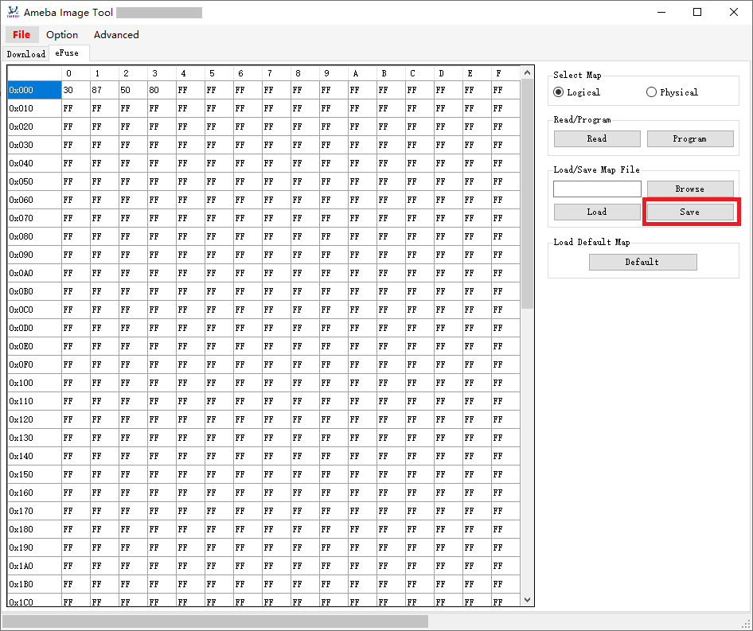
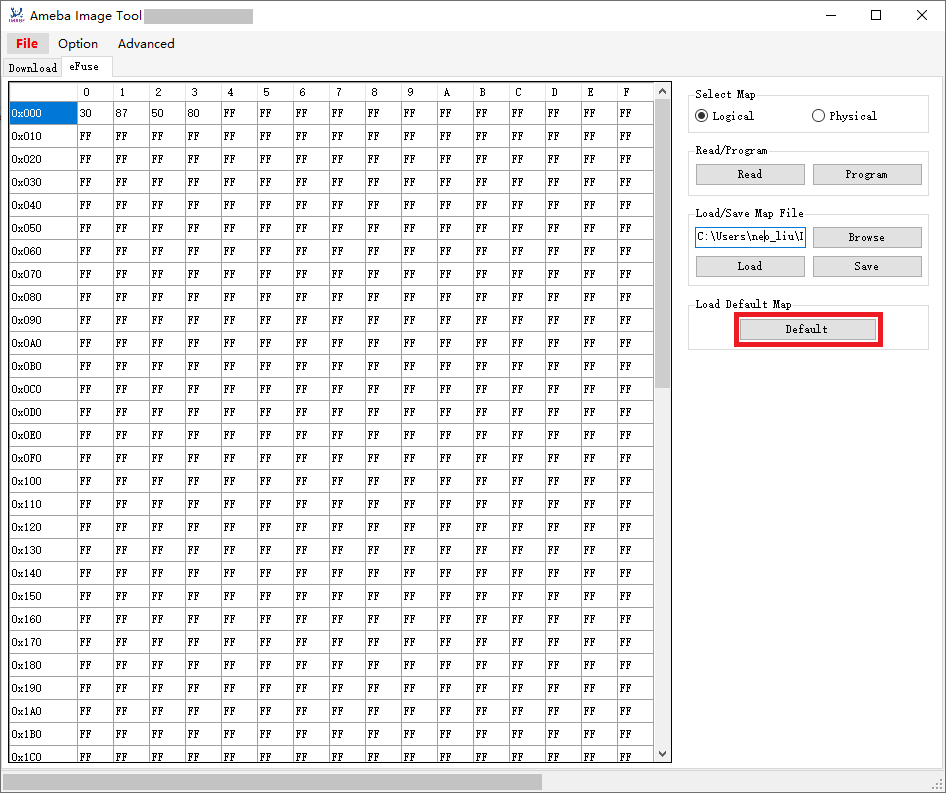

eFuse Access
-------------
This function is for internal usage only and shall not be exported to customers.

Common preparation steps to access eFuse:

1. Make sure Image Tool is closed.
2. Enter **developer mode** as introduced above.
3. Enter into download mode as introduced above.
4. Open Image Tool, click :menuselection:`File > Open` and select the proper device profile.
5. Select the corresponding serial port and baud rate.

   .. note:: The baud rate will be ignored for USB download interface.

6. Switch to eFuse tab.

   .. figure:: figures/efuse_tab.png
      :scale: 90%
      :align: center
   
      eFuse tab

Read
~~~~
Read full eFuse map:

1. Select eFuse type, logical or physical.
2. Click the :guilabel:`Read` button, a pop up dialog will show the read result and the eFuse data will be printed to the left table if read success.

   .. figure:: figures/read_efuse_map.png
      :scale: 90%
      :align: center
   
      Read eFuse map

Program
~~~~~~~~
After the eFuse map has been successfully read out from device of loaded from a map file, user can program the specified bytes of eFuse map as required:

1. Select eFuse type, logical or physical.
2. Edit the eFuse map as required.
3. Click the :guilabel:`Program` button, a pop up dialog will show the program result.

   .. figure:: figures/program_efuse_map.png
      :scale: 90%
      :align: center
   
      Program eFuse map

Save Map File
~~~~~~~~~~~~~~
After the eFuse map has been successfully read out from device of loaded from a map file, user can save the eFuse data to a map file by clicking the :guilabel:`Save` button.

   
   Save map file

Load Map File
~~~~~~~~~~~~~
Load a saved map file to the eFuse table:

1. Click the :guilabel:`Browse` button to select an eFuse map file.
2. Click the :guilabel:`Load` button to load it to the eFuse table.

   .. figure:: figures/load_map_file.png
      :scale: 90%
      :align: center
   
      Load map file

Load Default Map
~~~~~~~~~~~~~~~~
Click the :guilabel:`Default` button to load default logical map.

   
   Load default map