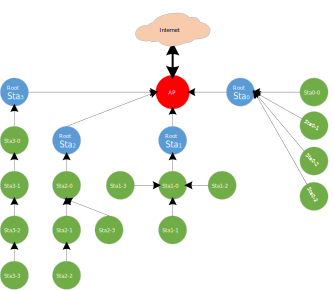
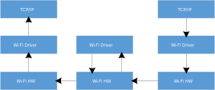
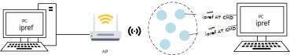

.. _wifi_rmesh_cn:

Wi-Fi R-Mesh 拓扑结构
------------------------------------------
如下图所示, Wi-Fi R-Mesh 是一个树形mesh网络, 用于增加Wi-Fi覆盖范围, 让距离AP比较远的设备也能获得稳定的网络连线。

   Wi-Fi R-Mesh 拓扑结构

Wi-Fi R-Mesh 的特点
--------------------------------------------
Wi-Fi R-Mesh 具有以下突出优势:

- 应用层软件开发无感:

  - 所有的mesh协议都在Wi-Fi驱动层实现，不管是根节点还是子节点，应用层都可以视为当前的节点是一个和AP连接的Wi-Fi Station。
  - Wi-Fi配网程序无需更新。

- 百微妙级别的快速配对和切换:

  - 当检测到信号更好的父节点的时候，子节点可以快速的从旧的父节点切换到新的父节点，而不影响数据通信。
  - 当父节点发生问题时（掉电或挂住），子节点可以迅速检测到并切换到另外一个父节点而不影响数据通信。
  - 一个节点可以携带其所有的子节点一起切换到另外一个父节点，所有节点的数据通信不受影响。

- 经过数跳的设备也具备较高的吞吐量:

  - R-Mesh 转发无需经过TCP/IP协议栈， 数据转发都在底层驱动实现，可以节省 SRAM 和 MCU 算力。
  - 软件处理时间极短，可以获得更好的吞吐量。

- 整个mesh网络具有很高的稳定性:

  - 软件处理极其简单，也不需要算法维护路由表，所以整个网络会非常的稳定。
  - 传统mesh网络的“环路”问题不会发生。

Wi-Fi R-Mesh 的数据流
--------------------------------------------
Wi-Fi R-Mesh直接在Wi-Fi驱动层实现数据转发, 消耗极少的SRAM和MCU算力。

由于需要极少的软件处理过程，所以即使经过几跳的节点也会有很好的吞吐量。

   Wi-Fi R-Mesh 的数据流

Wi-Fi R-Mesh 的网络容量
------------------------------------------
Wi-Fi R-Mesh 中每个根节点下可以连接的子节点个数称为R-Mesh的网络容量。

如下图所示的例子中，网络容量为 4，则每个根节点只可以连接4个节点，不管拓扑的形式是哪一种。

- 拓扑 0: 所有子节点都直接连接到根节点。
- 拓扑 3: 4个节点形成一个4跳的线型网络
- 也可能是拓扑0和拓扑3之间的其它拓扑结构

   Wi-Fi R-Mesh 网络容量

Wi-Fi R-Mesh NAT
------------------------------------------

由于R-Mesh的每个节点都会和AP创建真实的WIFI连线，在AP可以连接的Station数量受限的情况下，R-Mesh可以支持的节点个数也会受限。
基于此，我们可以使用Station + SoftAP基于NAT协议来扩展R-Mesh中节点的数量。此时，根节点及子节点会和SoftAP进行连线，
而不是和AP进行连线。NAT协议用于AP网络和R-Mesh网络之间的数据转发。

在R-Mesh中我们成这样的节点为R-NAT节点。

如下图所示，R-NAT节点放在根节点和AP之间，用于扩展可以接入网络的节点的数量。

.. figure:: figures/wifi_tunnel_nat.svg
   :scale: 140%
   :align: center

   Wi-Fi R-NAT

Wi-Fi R-Mesh 的吞吐量
---------------------------
吞吐量
~~~~~~~~~~~~~~~~
Wi-Fi R-Mesh 的吞吐量数据如下表所示：

.. table::
   :width: 100%
   :widths: auto

   +---------------+---------+---------------+---------------+---------------+---------------+
   | Test scenario | Layer   | UDP Tx (Mbps) | UDP Rx (Mbps) | TCP Tx (Mbps) | TCP Rx (Mbps) |
   +===============+=========+===============+===============+===============+===============+
   | Single Node   | Layer1  | 54.2          | 39.5          | 17.0          | 15.7          |
   |               +---------+---------------+---------------+---------------+---------------+
   |               | Layer2  | 19.6          | 18.8          | 9.6           | 10.0          |
   |               +---------+---------------+---------------+---------------+---------------+
   |               | Layer3  | 12.8          | 11.6          | 6.9           | 7.0           |
   |               +---------+---------------+---------------+---------------+---------------+
   |               | Layer4  | 9.4           | 8.2           | 5.4           | 5.2           |
   |               +---------+---------------+---------------+---------------+---------------+
   |               | Layer5  | 7.5           | 6.2           | 4.4           | 4.3           |
   +---------------+---------+---------------+---------------+---------------+---------------+
   | L1 + L2       | Layer1  | 21.0          | 21.2          |               |               |
   |               +---------+---------------+---------------+---------------+---------------+
   |               | Layer2  | 12.5          | 14.0          |               |               |
   +---------------+---------+---------------+---------------+---------------+---------------+
   | L1 + L2 + L3  | Layer1  | 14.0          | 13.3          |               |               |
   |               +---------+---------------+---------------+---------------+---------------+
   |               | Layer2  | 7.0           | 7.2           |               |               |
   |               +---------+---------------+---------------+---------------+---------------+
   |               | Layer3  | 5.1           | 6.4           |               |               |
   +---------------+---------+---------------+---------------+---------------+---------------+
   | L1 + L2 + L3  | Layer1  | 10.0          | 12.1          |               |               |
   | + L4          +---------+---------------+---------------+---------------+---------------+
   |               | Layer2  | 4.0           | 8.4           |               |               |
   |               +---------+---------------+---------------+---------------+---------------+
   |               | Layer3  | 3.6           | 6.7           |               |               |
   |               +---------+---------------+---------------+---------------+---------------+
   |               | Layer4  | 3.0           | 4.0           |               |               |
   +---------------+---------+---------------+---------------+---------------+---------------+
   | L1 + L2 + L3  | Layer1  | 9.0           | 10.4          |               |               |
   | + L4 + L5     +---------+---------------+---------------+---------------+---------------+
   |               | Layer2  | 3.2           | 3.7           |               |               |
   |               +---------+---------------+---------------+---------------+---------------+
   |               | Layer3  | 2.5           | 2.9           |               |               |
   |               +---------+---------------+---------------+---------------+---------------+
   |               | Layer4  | 2.3           | 1.8           |               |               |
   |               +---------+---------------+---------------+---------------+---------------+
   |               | Layer5  | 1.8           | 2.1           |               |               |
   +---------------+---------+---------------+---------------+---------------+---------------+

通过Iperf测试吞吐量
~~~~~~~~~~~~~~~~~~~~~~~
与普通的Station或者AP模式无异，我们可以通过iperf测试R-Mesh的吞吐量。如下图所示，在AP端和节点端的PC上输入iperf指令即可。

   R-Mesh的吞吐量测试

**UDP Tx 测试**

- 节点端通过UART输入如下AT指令:

  .. code-block::

     AT+IPERF=-c,<server IP>,-i,<periodic>,-u,-b,<bandwidth>,-t,<transtime>,-p,<port>

- AP端通过Terminal输入如下iperf指令:

  .. code-block::

     iperf -s -i <periodic> -u -p <port>

**UDP Rx 测试**

- 节点端通过UART输入如下AT指令:

  .. code-block::

     AT+IPERF=-s,-i,<periodic>,-u,-p,<port>

- AP端通过Terminal输入如下iperf指令:

  .. code-block::

     iperf -c <R-mesh node IP> -i <periodic> -u -b <bandwidth> -t <transtime> -p <port>

**TCP Tx 测试**

- 节点端通过UART输入如下AT指令:

  .. code-block::

     AT+IPERF=-c,<server IP>,-i,<periodic>,-t,<transtime>,-p,<port>

- AP端通过Terminal输入如下iperf指令:

  .. code-block::

     iperf -s -i <periodic> -p <port>

**TCP Rx 测试**

- 节点端通过UART输入如下AT指令:

  .. code-block::

     AT+IPERF=-s,-i,<periodic>,-p,<port>

- AP端通过Terminal输入如下iperf指令:

  .. code-block::

     iperf -c <R-mesh node IP> -i <periodic> -t <transtime> -p <port>

Wi-Fi R-Mesh RTT
------------------------------
不同于BLE和Zigbee，R-Mesh的RTT（Round-Trip Latency）是非常低的，并且不会随着数据包的增大而明显增加。

.. figure:: figures/rmesh_rtt.png
   :scale: 80%
   :align: center

Wi-Fi R-Mesh 可视化演示工具-Gravitation
--------------------------------------------
测试环境
~~~~~~~~~~~~~~~~~~~~~~
AP和PC通过网络连接，Gravitation运行于PC上，如下图所示：

   Wi-Fi R-Mesh 测试环境

简介
~~~~~~~~~~~~~~~
Gravitation可以用于显示所有接入AP的R-Mesh节点极其拓扑结构，其主要特点如下：

- 及时显示网络拓扑及其改变。
- 可以做ping测试。

.. figure:: figures/rmesh_demo_tool.png
   :scale: 50%
   :align: center

   Gravitation

每个节点会显示：``MAC_Addr:IP (更新时间)``.
比如 ``CE:192.168.1.100(5:6)`` 代表MAC地址为XX:XX:XX:XX:0xCE, 其IP地址为 **192.168.1.100**。

Gravitation使用指南
~~~~~~~~~~~~~~~~~~~
**测试工具的位置**

Gravitation的目录为: ``{sdk}/tools/R-Mesh_Demo_Tool``.

**测试步骤**

测试步骤如下：

1. 将AP和PC通过网络连接，执行gravitation.exe

2. 打开gravitation文件夹下的文件 :file:`config.yaml`, 配置所要测试的AP。你可以同时添加多个AP：

   .. code-block::

      ap_mac_list:
      - 00:11:22:33:44:55

3. 配置ping间隔以及ping包长度（不配置则使用默认参数）:

   .. code-block::

      ping:
      interval: 500
      packet_size: 64

  其中ping间隔也可以通过gravitation界面直接配置。

  此时gravitation配置完成，关闭gravitation并重新运行gravitation.exe，所有配置即刻生效。

4. 使用AT指令让每个测试节点连接AP，之后节点会自动进行Mesh组网。你可以在gravitation观察到每个节点的连接状况及网络拓扑。

   .. code-block::

      AT+WLCONN=ssid,rmesh_test,pw,12345678

Wi-Fi R-Mesh 参数配置
--------------------------------
您只需要配置有限的几个参数即可使用R-Mesh（不配置则会使用默认配置）。

打开文件：``{sdk}/component/soc/amebadplus/ameba_wificfg.c``，可以看到如下参数，修改后重新编译SDK即可。

.. code-block::

	/*R-mesh*/
	wifi_user_config.wtn_strong_rssi_thresh：RSSI高于这个阈值，则节点会作为root或者R-NAT直接连接AP。
	wifi_user_config.wtn_father_refresh_timeout：单位为毫秒，超过这个时间如果节点没有收到父节点的beacon，则会切换父节点。
	wifi_user_config.wtn_child_refresh_timeout：单位为毫秒，超过这个时间如果父节点没有收到子节点的beacon，则会删除这个子节点。

R-Mesh SDK获取
--------------------------------

联系 <claire_wang@realsil.com.cn>索取R-Mesh wlan lib，然后通过如下SDK编译image即可使用R-Mesh：`IoT SDK <https://github.com/Ameba-AIoT/ameba-rtos>`_

