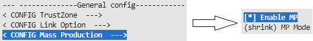
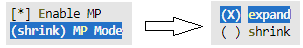
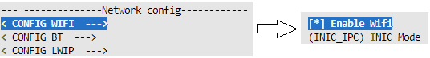
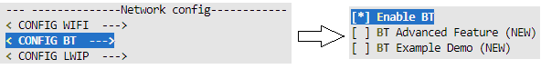

.. _mass_production:

MP Image
----------------
In response to the different needs of user, SDK provides 2 types of MP image: shrink MP image and expand MP image.
Both MP images are capable to run complete MP test. The comparison between them is listed below.

Table -1 MP image comparison

.. table:: Table_Mass_Production_0
   :width: 100%
   :widths: auto
   :name: table_mass_production_0

   +--------+-------+------------------+----------+------------------------+---------------------------------------------------+
   | Image  | Size  | Download Address | Download | Lifetime               | Description                                       |
   |        |       |                  |          |                        |                                                   |
   |        |       |                  | Time     |                        |                                                   |
   +========+=======+==================+==========+========================+===================================================+
   | Shrink | Small | RAM              | Short    | Lost after power off   | 1. Bootloader is different with normal image.     |
   |        |       |                  |          |                        |                                                   |
   |        |       |                  |          |                        | 2. Only include MP test code                      |
   +--------+-------+------------------+----------+------------------------+---------------------------------------------------+
   | Expand | Large | FLASH            | Long     | Retain after power off | 1. Share the same bootloader with normal image.   |
   |        |       |                  |          |                        |                                                   |
   |        |       |                  |          |                        | 2. Besides MP test code, include application code |
   +--------+-------+------------------+----------+------------------------+---------------------------------------------------+

Image Generation
~~~~~~~~~~~~~~~~~~~~~~~~~~~~
The steps of generating MP image are depicted below:

1. Switch to work directory {SDK}\amebadplus_gcc_project.

2. Use command $make menuconfig to modify the configurations.

   a. Enable MP.

   b. For shrink MP image, just keep default shrink MP mode. For expand MP image, change MP mode to expand.

   c. Enable Wi-Fi.

   d. Enable BT.

   e. Save and exit the menuconfig.

3. Use command $make all to build the project.

.. note::
   The MP image consists of bootloader firmware and application firmware, which are generated in {SDK}\amebadplus_gcc_project. Application firmware is km0_km4_app_mp.bin, while the name of bootloader firmware is different. For expand MP image, bootloader firmware is km4_boot_all.bin. For shrink MP image, in order to distinguish with bootloader in normal image, the name of bootloader firmware is modified to km4_boot_all_mp.bin.

Image Download
~~~~~~~~~~~~~~~
There are 2 methods to download MP image to chip:

1. Use image tool to download image directly. The address configuration in image tool is different between shrink MP image and expand MP image. Besides, it is required to click Option menu and select Reset After download before downloading shrink MP image.

Table -2 Image tool download configuration

.. table:: Table_Mass_Production_1
   :width: 100%
   :widths: auto
   :name: table_mass_production_1

   +--------+---------------------+---------------+-------------+
   | Image  | Bin                 | Start Address | End Address |
   +========+=====================+===============+=============+
   | Shrink | km4_boot_all_mp.bin | 0x20012000    | 0x2001A000  |
   +--------+---------------------+---------------+-------------+
   | Shrink | km0_km4_app_mp.bin  | 0x2001A000    | 0x20080000  |
   +--------+---------------------+---------------+-------------+
   | Expand | km4_boot_all.bin    | 0x08000000    | 0x08014000  |
   +--------+---------------------+---------------+-------------+
   | Expand | km0_km4_app_mp.bin  | 0x08014000    | 0x08200000  |
   +--------+---------------------+---------------+-------------+

2. Use image tool to generate Image_All.bin, then use 1-N MP image tool to download Image_All.bin. This method applies to downloading MP image to multiple chips at the same time.

Table -3 Image tool generate configuration

.. table:: Table_Mass_Production_2
   :width: 100%
   :widths: auto
   :name: table_mass_production_2

   +--------+---------------------+---------+
   | Image  | Bin                 | Offset  |
   +========+=====================+=========+
   | Shrink | km4_boot_all_mp.bin | 0       |
   +--------+---------------------+---------+
   | Shrink | km0_km4_app_mp.bin  | 0x8000  |
   +--------+---------------------+---------+
   | Expand | km4_boot_all.bin    | 0       |
   +--------+---------------------+---------+
   | Expand | km0_km4_app_mp.bin  | 0x14000 |
   +--------+---------------------+---------+

Table -4 1-N tool download configuration

.. table:: Table_Mass_Production_3
   :width: 100%
   :widths: auto
   :name: table_mass_production_3

   +--------+---------------+------------+
   | Image  | Bin           | Offset     |
   +========+===============+============+
   | Shrink | Image_All.bin | 0x20012000 |
   +--------+---------------+------------+
   | Expand | Image_All.bin | 0x08000000 |
   +--------+---------------+------------+

MP Test
--------------
Wi-Fi and BT Performance Verification
~~~~~~~~~~~~~~~~~~~~~~~~~~~~~~~~~~~~~~
There are 2 methods to verify the Wi-Fi and BT performance of chip: standard MP test and fast MP test. These 2 methods apply to different test conditions and are included in both shrink MP image and expand MP image.

Table -5 MP test comparison

.. table:: Table_Mass_Production_4
   :width: 100%
   :widths: auto
   :name: table_mass_production_4

   +----------+------+-----------+----------+-------------------------------------------------------------+
   | Method   | Cost | Test Time | Accuracy | Description                                                 |
   +==========+======+===========+==========+=============================================================+
   | Standard | High | Long      |          | Use the professional tester to do wired test                |
   +----------+------+-----------+----------+-------------------------------------------------------------+
   | Fast     | Low  | Short     | High     | Use the golden board offered by realtek to do wireless test |
   +----------+------+-----------+----------+-------------------------------------------------------------+

Standard MP Test
^^^^^^^^^^^^^^^^^^^^^^^^^^^^^^^^
Refer to MP FLOW.pdf for details.

Fast MP Test
^^^^^^^^^^^^^^^^^^^^^^^^
Refer to Fast MP flow.pdf for details

User-defined Function Verification
~~~~~~~~~~~~~~~~~~~~~~~~~~~~~~~~~~~~~~~~~~~~~~~~~~~~~~~~~~~~~~~~~~~~
Besides Wi-Fi and BT performance verification, adding extra function verification in MP image is supported.

For example, to verify the GPIO function of some pins, APIs defined in gpio_api.c are available to implement a test command. Others such as serial_api.c and spi_api.c apply to UART and SPI function verification.

.. note::
   For how to add a custom command in SDK, refer to atcmd.pdf for details.

User data
------------------
Besides image, it is optional to download user data to chip during MP process. According to different circumstances, it is important to select an appropriate way to download user data.

For example, for common data such as audio file, it is recommended to combine it with image into a bin file by image tool and download the combined file to every chip.

While for special data, such as product license, which is unique and corresponds to the mac address of chip, combining data and image before downloading may not be appropriate because data file is different between every chip. It is more acceptable to transmit data to chip through LOGUART after MP image runs, which requires user to implement a command for receiving data file and writing it into FLASH in MP image.

.. note::
   SDK can support transmitting up to 4KB data at a time through LOGUART when Longer CMD in menuconfig is enable. For programing FLASH, flash_api.c provides related APIs.

