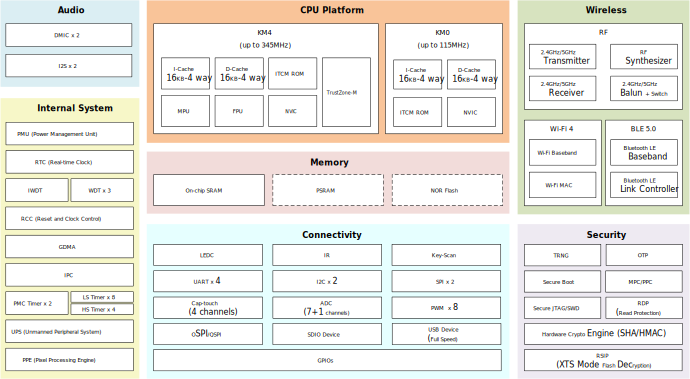

Introduction
-------------------
The |CHIP_NAME| (including RTL8721DAx/RTL8721DCx/RTL8721DGx series) is a low-power dual-band microcontroller integrating a high-performance MCU 
(Armv8.1-M, Cortex-M55 instruction set compatible) called Real-M300 and a low-power MCU (Armv8-M, Cortex-M23 instruction set compatible) called Real-M200.
It is designed to achieve enhanced power and RF performance and low-power consumption, featuring all the characteristics of low-power chips, such as 
fine-grained clock gating, multiple power modes, and dynamic power scaling.
   
The Real-M300 (or KM4 thereafter), acting as application processor (AP), is a 3-staged pipelined 32-bit high-performance processor that bases on Armv8.1-M mainline architecture 
supporting Arm Cortex-M55 instruction set compatible, running at a frequency of up to 345MHz. It offers system enhancements such as enhanced debug features, 
floating-point computation, Digital Signal Processing (DSP) extension instructions, and a high level of support block integration for high-performance, 
deeply embedded applications. The TrustZone-M security technology provides hardware-enforced isolation between the Trusted and Non-Trusted resources 
on the devices, while maintaining efficient exception handling and determinism.

The Real-M200 (or KM0 thereafter), acting as network processor (NP), is a 2-staged pipelined 32-bit low-power processor that bases on Armv8-M baseline architecture 
supporting Cortex-M23 instruction set compatible, running at a frequency of up to 115MHz. It is an energy-efficient and easy-to-use processor with 
a simple instruction set and reduced code size, and is code- and tool-compatible with the KM4 processor. It is intended for operations requiring fast response 
and low power consumption features, such as power management and network protocol processing.

The |CHIP_NAME| is a dual-band (2.4GHz and 5GHz) communication controller that integrates the specifications of Wi-Fi (Wi-Fi 4) and Bluetooth (BLE 5.0). 
It supports 802.11 a/b/g/n wireless LAN (WLAN) network with 40MHz bandwidth. It consists of WLAN MAC, a 1T1R capable WLAN baseband, RF, and Bluetooth, providing complete Wi-Fi and Bluetooth functionalities.

A variety of peripheral interfaces, including UART, SPI, QSPI/OSPI, I2C, LEDC, etc., as well as sensor controllers (such as ADC, Cap-Touch, and Key-Scan) are integrated into |CHIP_NAME| devices. 
High-speed connectivity interfaces, SDIO and USB, are also provided. Besides, the <$$CHIP_NAME> has audio features with a dedicated digital microphone (DMIC) interface and I2S. 
Abundant general-purpose I/O (GPIOs) can be configured to different functions according to different IoT (Internet of Things) applications flexibly. 
The user-friendly development kits (SDK and HDK) are provided to customers for developing applications.

The |CHIP_NAME| also incorporates high-speed memories with on-chip SRAM and stacked Flash or PSRAM. A dedicated SPI Flash controller provides 
a flexible and efficient way to access NOR Flash (e.g., byte and block access). A multilayer AXI bus interconnect supports internal and external memory access.

The |CHIP_NAME| family offers devices in different packages ranging from 48 pins to 100 pins. The included peripherals change with the device.
   
Block Diagram
-------------------
The functional block diagram is illustrated below, which provides a view of the chip's major functional components and core complexes.

   Block diagram

Target Applications
---------------------
With integrated WLAN and Bluetooth, wide range of solutions can be deployed in various fields, such as:

- Smart home

  * Lighting (dimming) control, switch and plugs

  * Home and kitchen appliances

- Industrial 4.0

- Low-power IoT

  * Smart door lock

  * Low-power Wi-Fi camera

- Smart docking and monitor

- Health-care devices

- Wearables

- Portable devices

- Gaming accessories

- Wireless audio

- Smart interactive toys

Package Comparison
-------------------
The following table lists all the series of |CHIP_NAME|.

.. table:: |CHIP_NAME| series
   :width: 100%
   :widths: auto
   
   +------------------+-----------+---------------+--------------+-----------------------+
   | Part number      | Package   | Flash (bytes) | PSRAM (bytes)| Operating voltage (V) |
   +==================+===========+===============+==============+=======================+
   | RTL8721DAF-VA2   | QFN48     | 4M            |              | 2.97 ~ 3.63           |
   +------------------+-----------+---------------+--------------+-----------------------+
   | RTL8721DAF-VT2   | QFN48     | 4M            |              | 2.97 ~ 3.63           |
   +------------------+-----------+---------------+--------------+-----------------------+  
   | RTL8721DAM-VA2   | QFN48     |               | 4M           | 2.97 ~ 3.63           |
   +------------------+-----------+---------------+--------------+-----------------------+
   | RTL8721DCF-VA2   | QFN48     | 4M            |              | 2.97 ~ 3.63           |
   +------------------+-----------+---------------+--------------+-----------------------+
   | RTL8721DCM-VA2   | QFN68     |               | 4M           | 2.97 ~ 3.63           |
   +------------------+-----------+---------------+--------------+-----------------------+
   | RTL8721DCM-VA3   | QFN68     |               | 8M           | 2.97 ~ 3.63           |
   +------------------+-----------+---------------+--------------+-----------------------+
   | RTL8721DGF-VW2   | BGA100    | 4M            |              | 1.71 ~ 3.63           |
   +------------------+-----------+---------------+--------------+-----------------------+
   | RTL8721DGM-VW2   | BGA100    |               | 4M           | 1.71 ~ 3.63           |
   +------------------+-----------+---------------+--------------+-----------------------+

