.. _audio:

Introduction
------------------------
The audio framework is a whole audio architecture aiming to provide different layers of audio interfaces for applications. The interfaces involve Audio HAL and Audio Framework.

- Audio HAL: defines unified audio hardware interfaces. It interacts with audio driver to do audio streaming or audio settings.

- Audio Framework: provides interfaces for audio streaming, volume, and other settings.

The audio framework provides two architectures to meet different needs of audio. Different architectures have different implementations, but the interfaces are the same.

- Audio mixer architecture: supports audio recording, and audio playback. For audio playback, this architecture provides audio mixing functions, and format, rate, channel will be converted to a unified format for mixing.

- Audio passthrough architecture: supports audio recording, and audio playback. This architecture has no audio mixing, only one audio playback is allowed at the same moment.

Mixer Overview
~~~~~~~~~~~~~~~~~~~~~~~~~~~~
The audio interfaces and the entire implementation are shown as below.

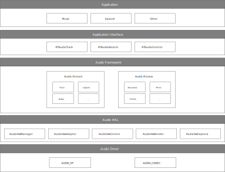

   Audio mixer overview

The whole audio mixer architecture includes the following sub-modules:

- Application Interface

   - **RTAudioTrack** provides interfaces to play sound.

   - **RTAudioRecord** provides interfaces to capture sound.

   - **RTAudioControl** provides interfaces to control sound volumes and so on.

- Audio Framework

   - Audio framework provides audio reformat, resample, volume, and mixer functions for audio stream playback.

- Audio HAL

   - **AudioHwManager** provides interfaces that manage audio adapters through a specific adapter driver program loaded based on the given audio adapter descriptor.

   - **AudioHwAdapter** provides interfaces that manage audio adapter capabilities, including initializing ports, creating rendering and capturing tasks, and obtaining the port capability set.

   - **AudioHwControl** provides interfaces for RTAudioControl, and set commands to audio driver.

   - **AudioHwRender** provides interfaces that get data from the upper layer and render data to audio driver user interfaces.

   - **AudioHwCapture** provides interfaces to capture data from audio driver user interfaces and deliver the data to the upper layer.

- Audio Driver

   - **AUDIO_SP** provides interfaces to configure audio sports.

   - **AUDIO_CODEC** provides interfaces to configure audio codec.

Passthrough Overview
~~~~~~~~~~~~~~~~~~~~~~~~~~~~~~~~~~~~~~~~
The audio interfaces and the entire implementation are shown as below.

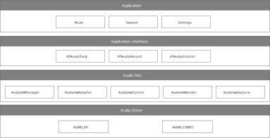

   Audio passthrough overview

The audio passthrough architecture has no Audio Framework layer compared to audio mixer architecture, other layers are nearly the same.

.. _architecture_comparison:

Architecture Comparison
~~~~~~~~~~~~~~~~~~~~~~~~~~~~~~~~~~~~~~~~~~~~~~
The above sections describe two architectures of audio: mixer and passthrough. Users can choose the suitable architecture according to the project's requirements. Here is a comparison table of the two architectures:

.. table:: 
   :width: 100%
   :widths: auto

   +--------------+------------------+-----------+-------------------+-------------------+-------------------+------------------+
   | Architecture | Memory occupancy | Code size | Playback function                                         | Capture function |
   |              |                  |           +-------------------+-------------------+-------------------+                  |
   |              |                  |           | Basic function    | Mixing function   | Playback latency  |                  |
   +==============+==================+===========+===================+===================+===================+==================+
   | Mixer        | More             | More      | Nearly the same   | Support           | More              | Same             |
   +--------------+------------------+-----------+-------------------+-------------------+-------------------+------------------+
   | Passthrough  | Less             | Less      | Nearly the same   | Not support       | Less              | Same             |
   +--------------+------------------+-----------+-------------------+-------------------+-------------------+------------------+

- For record implementation, the two architectures are the same. Both architectures can meet user's record function needs.

- For playback implements, the two architectures are different. If the user has the requirements to play two sounds together at the same time, choose mixer architecture, because only the mixer architecture can do the mixing.

- The mixer architecture takes more memory and has a bigger code size. If the user wants to save memory and code size and has no requirements of audio mixing, choose the passthrough architecture.

Terminology
----------------------
The meanings of some widely-used audio terms in this chapter are listed below.

.. table:: 
   :width: 100%
   :widths: auto

   +-----------------+--------------------------------------------------------------------------------------------------------------------------+
   | Terms           | Introduction                                                                                                             |
   +=================+==========================================================================================================================+
   | PCM             | PCM (Pulse Code Modulation), audio data is a raw stream of uncompressed audio sample data, which is standard             |
   |                 |                                                                                                                          |
   |                 | digital audio data converted from analog signals through sampling, quantization, and encoding.                           |
   +-----------------+--------------------------------------------------------------------------------------------------------------------------+
   | channel         | A channel sound is an independent audio signal captured or played in different spatial positions during recording        |
   |                 |                                                                                                                          |
   |                 | or playing, so the number of channels is the number of sound sources during sound recording or the number of             |
   |                 |                                                                                                                          |
   |                 | speakers during playback.                                                                                                |
   +-----------------+--------------------------------------------------------------------------------------------------------------------------+
   | mono            | Mono means only one single-channel sound.                                                                                |
   +-----------------+--------------------------------------------------------------------------------------------------------------------------+
   | stereo          | Stereo means two channels.                                                                                               |
   +-----------------+--------------------------------------------------------------------------------------------------------------------------+
   | bit depth       | Bit depth (sample depth) represents how finely the sound intensity is recorded in the sample.                            |
   |                 |                                                                                                                          |
   |                 | Sampling depth can be understood as the resolution of processing the sound. The larger the value, the higher the         |
   |                 |                                                                                                                          |
   |                 | resolution, and the more realistic the sound recorded and played.                                                        |
   +-----------------+--------------------------------------------------------------------------------------------------------------------------+
   | sample          | A number representing the audio value of a single channel at a point in time.                                            |
   +-----------------+--------------------------------------------------------------------------------------------------------------------------+
   | sample rate     | The audio sampling rate refers to the number of frames that the signal is sampled per unit time. The higher the          |
   |                 |                                                                                                                          |
   |                 | sampling frequency, the more realistic and natural the waveform will be.                                                 |
   +-----------------+--------------------------------------------------------------------------------------------------------------------------+
   | frame           | A frame is a sound unit whose length is the product of the sample length (number of samples) multiplies the              |
   |                 |                                                                                                                          |
   |                 | number of channels.                                                                                                      |
   +-----------------+--------------------------------------------------------------------------------------------------------------------------+
   | gain            | Audio signal gain control to adjust the signal level.                                                                    |
   +-----------------+--------------------------------------------------------------------------------------------------------------------------+
   | interleaved     | It is a recording method of audio data. In the interleaved mode, the data is stored in a continuous manner, that         | 
   |                 |                                                                                                                          |
   |                 | is, the left channel sample and the right channel sample of frame 1 are first stored, and then the storage of frame      |
   |                 |                                                                                                                          |
   |                 | 2 is started.                                                                                                            |
   +-----------------+--------------------------------------------------------------------------------------------------------------------------+
   | latency         | Time delay when a signal passes through the whole system.                                                                |
   +-----------------+--------------------------------------------------------------------------------------------------------------------------+
   | overrun         | The buffer is too full to let buffer producer write more data.                                                           |
   +-----------------+--------------------------------------------------------------------------------------------------------------------------+
   | underrun        | The buffer producer is too slow to write data to the buffer so that the buffer is empty when the consumer wants          |
   |                 |                                                                                                                          |
   |                 | to consume data.                                                                                                         |
   +-----------------+--------------------------------------------------------------------------------------------------------------------------+
   | xrun            | Overrun or underrun.                                                                                                     |
   +-----------------+--------------------------------------------------------------------------------------------------------------------------+
   | volume          | Volume, also known as sound intensity and loudness, refers to the human ear's subjective perception of the               |
   |                 |                                                                                                                          |
   |                 | intensity of the sound heard, and its objective evaluation scale is the amplitude of the sound.                          |
   +-----------------+--------------------------------------------------------------------------------------------------------------------------+
   | hardware volume | The volume of audio codec.                                                                                               |
   +-----------------+--------------------------------------------------------------------------------------------------------------------------+
   | software volume | The volume set in software algorithm.                                                                                    |
   +-----------------+--------------------------------------------------------------------------------------------------------------------------+
   | resample        | Convert the sample rate.                                                                                                 |
   +-----------------+--------------------------------------------------------------------------------------------------------------------------+
   | reformat        | Convert the bit depth of the sample.                                                                                     |
   +-----------------+--------------------------------------------------------------------------------------------------------------------------+
   | mix             | Mix several audio streaming together. Users can hear several audio streaming playing together.                           |
   +-----------------+--------------------------------------------------------------------------------------------------------------------------+
   | Audio codec     | The DAC and ADC controller inside the chip.                                                                              |
   +-----------------+--------------------------------------------------------------------------------------------------------------------------+

Data Format
----------------------
This section describes the data format that audio framework and audio HAL supports. The common part of audio framework and audio HAL is described here. And the different parts will be described in their own sections.

Both audio framework and audio HAL support interleaved streaming data.

The two-channel interleaved data is illustrated in :ref:`audio_two_channel_interleaved`, and the four-channel interleaved data is illustrated in :ref:`audio_four_channel_interleaved`.

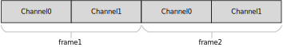

   Two-channel interleaved

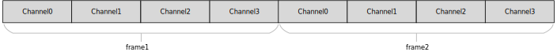

   Four-channel interleaved

Framework Format
~~~~~~~~~~~~~~~~~~~~~~~~~~~~~~~~
This section describes the format that Audio Framework supports. Before playback, or capture, make sure your sound format is supported.

Audio Framework has the following types of bit depth:

- **RTAUDIO_FORMAT_INVALID** - invalid bit depth of audio stream

- **RTAUDIO_FORMAT_PCM_8_BIT** - audio stream has 8-bit depth

- **RTAUDIO_FORMAT_PCM_16_BIT** - audio stream has 16-bit depth

- **RTAUDIO_FORMAT_PCM_32_BIT** - audio stream has 32-bit depth

- **RTAUDIO_FORMAT_PCM_FLOAT** - audio stream has 32-bit float format

- **RTAUDIO_FORMAT_PCM_24_BIT_PACKED** - audio stream has 24-bit depth

- **RTAUDIO_FORMAT_PCM_8_24_BIT** - audio stream has 24-bit + 8-bit depth

The following table describes the supported formats for playback and recording. ``Y`` means the format is supported; ``N`` means the format is not supported.

.. table:: 
   :width: 100%
   :widths: auto

   +----------------------------------+------------------+------------------------+-----------------------------+
   | Bit depth                        | Playback (Mixer) | Playback (Passthrough) | Capture (Mixer/Passthrough) |
   +==================================+==================+========================+=============================+
   | RTAUDIO_FORMAT_PCM_8_BIT         | Y                | Y                      | Y                           |
   +----------------------------------+------------------+------------------------+-----------------------------+
   | RTAUDIO_FORMAT_PCM_16_BIT        | Y                | Y                      | Y                           |
   +----------------------------------+------------------+------------------------+-----------------------------+
   | RTAUDIO_FORMAT_PCM_32_BIT        | Y                | N                      | N                           |
   +----------------------------------+------------------+------------------------+-----------------------------+
   | RTAUDIO_FORMAT_PCM_FLOAT         | Y                | N                      | N                           |
   +----------------------------------+------------------+------------------------+-----------------------------+
   | RTAUDIO_FORMAT_PCM_24_BIT_PACKED | Y                | Y                      | Y                           |
   +----------------------------------+------------------+------------------------+-----------------------------+
   | RTAUDIO_FORMAT_PCM_8_24_BIT      | N                | Y                      | Y                           |
   +----------------------------------+------------------+------------------------+-----------------------------+

The sample rate is another important format of audio streaming. For playback and recording, audio framework supports the following sample rates. ``Y`` means the sample rate is supported; ``N`` means the sample rate is not supported.

.. table:: 
   :width: 100%
   :widths: 50,25,25

   +-------------+------------------------------+-----------------------------+
   | Sample rate | Playback (Mixer/Passthrough) | Capture (Mixer/Passthrough) |
   +=============+==============================+=============================+
   | 8000        | Y                            | Y                           |
   +-------------+------------------------------+-----------------------------+
   | 11025       | Y                            | Y                           |
   +-------------+------------------------------+-----------------------------+
   | 16000       | Y                            | Y                           |
   +-------------+------------------------------+-----------------------------+
   | 22050       | Y                            | Y                           |
   +-------------+------------------------------+-----------------------------+
   | 32000       | Y                            | Y                           |
   +-------------+------------------------------+-----------------------------+
   | 44100       | Y                            | Y                           |
   +-------------+------------------------------+-----------------------------+
   | 48000       | Y                            | Y                           |
   +-------------+------------------------------+-----------------------------+
   | 88200       | Y                            | Y                           |
   +-------------+------------------------------+-----------------------------+
   | 96000       | Y                            | Y                           |
   +-------------+------------------------------+-----------------------------+
   | 192000      | N                            | N                           |
   +-------------+------------------------------+-----------------------------+

To do audio streaming, the channel count parameter setting is necessary, too. For playback and recording, audio framework supports the following channel counts. ``Y`` means the channel count is supported; ``N`` means the channel count is not supported.

.. table:: 
   :width: 100%
   :widths: auto

   +---------------+------------------+------------------------+-----------------------------+
   | Channel count | Playback (Mixer) | Playback (Passthrough) | Capture (Mixer/Passthrough) |
   +===============+==================+========================+=============================+
   | 1             | Y                | Y                      | Y                           |
   +---------------+------------------+------------------------+-----------------------------+
   | 2             | Y                | Y                      | Y                           |
   +---------------+------------------+------------------------+-----------------------------+
   | 4             | N                | Y                      | Y                           |
   +---------------+------------------+------------------------+-----------------------------+
   | 6             | N                | Y                      | Y                           |
   +---------------+------------------+------------------------+-----------------------------+
   | 8             | N                | Y                      | Y                           |
   +---------------+------------------+------------------------+-----------------------------+

HAL Format
~~~~~~~~~~~~~~~~~~~~
Mixer and passthrough architecture have the same audio HAL. Audio Hal has the following types of bit depth:

- **AUDIO_HW_FORMAT_INVALID** - invalid bit depth of audio stream

- **AUDIO_HW_FORMAT_PCM_8_BIT** - audio stream has 8-bit depth

- **AUDIO_HW_FORMAT_PCM_16_BIT** - audio stream has 16-bit depth

- **AUDIO_HW_FORMAT_PCM_32_BIT** - audio stream has 32-bit depth

- **AUDIO_HW_FORMAT_PCM_FLOAT** - audio stream has 32-bit float format

- **AUDIO_HW_FORMAT_PCM_24_BIT_PACKED** - audio stream has 24-bit depth

- **AUDIO_HW_FORMAT_PCM_8_24_BIT** - audio stream has 24-bit + 8-bit depth

If using the Audio HAL interface, please check the bit depth HAL supported for Playback and Capture. ``Y`` means the format is supported; ``N`` means the format is not supported.

.. table:: 
   :width: 100%
   :widths: 50,25,25

   +------------------------------------+----------+---------+
   | Bit depth                          | Playback | Capture |
   +====================================+==========+=========+
   | AUDIO_HW_FORMAT_PCM_8_BIT          | Y        | Y       |
   +------------------------------------+----------+---------+
   | AUDIO_HW_FORMAT_PCM_16_BIT         | Y        | Y       |
   +------------------------------------+----------+---------+
   | AUDIO_HW_FORMAT_PCM_32_BIT         | N        | N       |
   +------------------------------------+----------+---------+
   | AUDIO_HW_FORMAT_PCM_FLOAT          | N        | N       |
   +------------------------------------+----------+---------+
   | AUDIO_HW_FORMAT_PCM_24_BIT_PACKED  | N        | N       |
   +------------------------------------+----------+---------+
   | AUDIO_HW_FORMAT_PCM_8_24_BIT       | Y        | Y       |
   +------------------------------------+----------+---------+

The sample rate is another important format of HAL audio streaming. For playback and recording, audio HAL supports the following sample rates. ``Y`` means the sample rate is supported; ``N`` means the sample rate is not supported.

.. table:: 
   :width: 100%
   :widths: 50,25,25

   +-------------+----------+---------+
   | Sample rate | Playback | Capture |
   +=============+==========+=========+
   | 8000        | Y        | Y       |
   +-------------+----------+---------+
   | 11025       | Y        | Y       |
   +-------------+----------+---------+
   | 16000       | Y        | Y       |
   +-------------+----------+---------+
   | 22050       | Y        | Y       |
   +-------------+----------+---------+
   | 32000       | Y        | Y       |
   +-------------+----------+---------+
   | 44100       | Y        | Y       |
   +-------------+----------+---------+
   | 48000       | Y        | Y       |
   +-------------+----------+---------+
   | 88200       | Y        | Y       |
   +-------------+----------+---------+
   | 96000       | Y        | Y       |
   +-------------+----------+---------+
   | 192000      | N        | N       |
   +-------------+----------+---------+

To do audio streaming, the channel count parameter setting is necessary, too. For playback and recording, audio HAL supports the following channel counts. ``Y`` means the channel count is supported; ``N`` means the channel count is not supported.

.. table:: 
   :width: 100%
   :widths: auto

   +---------------+----------------+--------------+---------+
   | Channel count | Codec playback | I2S playback | Capture |
   +===============+================+==============+=========+
   | 1             | Y              | Y            | Y       |
   +---------------+----------------+--------------+---------+
   | 2             | Y              | Y            | Y       |
   +---------------+----------------+--------------+---------+
   | 4             | N              | Y            | Y       |
   +---------------+----------------+--------------+---------+
   | 6             | N              | Y            | Y       |
   +---------------+----------------+--------------+---------+
   | 8             | N              | Y            | Y       |
   +---------------+----------------+--------------+---------+

Architecture
------------------------
Playback Architecture
~~~~~~~~~~~~~~~~~~~~~~~~~~~~~~~~~~~~~~~~~~
The block diagram of audio mixer playback architecture is shown as below.

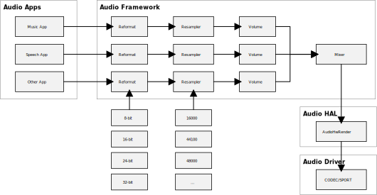

   Playback mixer architecture

The block diagram of audio passthrough playback architecture is shown as below.

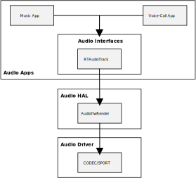

   Playback passthrough architecture

The audio playback architecture includes the following sub-modules:

- Audio Framework (only mixer architecture)

   - Audio framework is responsible for audio playback sound mixing.

   - Audio framework supports at most 32 sound playing together.

   - Before mixing, all sound will be converted to one unified audio format, which is 16-bit, 44100Hz, 2-channel currently. Sub-modules reformat, resampler are responsible to do the conversion. There is also volume sub-module in audio framework to adjust volumes for different audio types, for example, music, speech may have different volumes.

   - Audio framework supports sound rate from 8k-96k, channel mono/stereo, format 8-bit, 16-bit, 24-bit, and 32-bit float.

- Audio HAL

   - Audio HAL gets playback data from audio framework, and sends the data to audio driver.

- Audio Driver

   - Audio Driver gets playback data from audio HAL and sends data to audio hardware.

Record Architecture
~~~~~~~~~~~~~~~~~~~~~~~~~~~~~~~~~~~~~~
Audio mixer and passthrough have the same record architecture. The block diagram of audio record is shown as below.

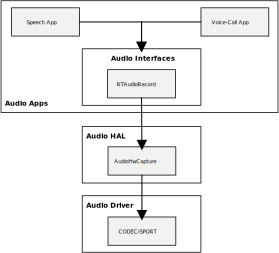

   Record architecture

The audio record architecture includes the following sub-modules:

- **RTAudioRecord**: captures data from Audio HAL, and provides data to audio applications, which want to record data.

- **Audio HAL**: gets record data from Audio driver, and sends the data to RTAudioRecord.

- **Audio Driver**: gets record data from Audio hardware, and sends data to audio HAL.

Control Architecture
~~~~~~~~~~~~~~~~~~~~~~~~~~~~~~~~~~~~~~~~
Audio mixer and passthrough have the same control architecture. The block diagram of audio control is shown as below.

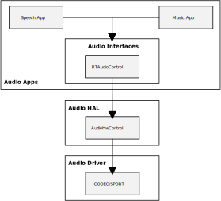

   Control architecture

The audio control architecture includes the following sub-modules:

- **RTAudioControl**: called by Apps, and interacts with HAL to do audio control settings.

- **Audio HAL**: does audio control settings by calling Driver APIs.

- **Audio Driver**: controls audio codec hardware.

Hardware Volume
^^^^^^^^^^^^^^^^^^^^^^^^^^^^^^
RTAudioControl provides interfaces to set and get hardware volume.

.. code-block:: c

   #include "audio/audio_control.h"
   int32_t RTAudioControl_SetHardwareVolume(float left_volume, float right_volume)

Users set the left and right channel volume to 0.0-1.0, linear maps to -65.625-MAXdb.

Configurations
----------------
MenuConfig
~~~~~~~~~~~
If users want to use audio interfaces, select the following audio configurations, and choose the suitable audio architecture according to Section :ref:`architecture_comparison`.

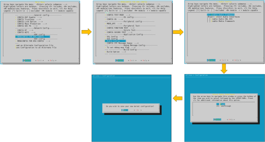

Framework Configuration
~~~~~~~~~~~~~~~~~~~~~~~~~~
Audio Framework configurations lie in ``{SDK}/component/soc/amebalite/usrcfg/ameba_audio_mixer_usrcfg.cpp``.

If users want to change the audio HAL period buffer size, or audio mixer's buffer policy, change *kPrimaryAudioConfig* according to the description of ``{SDK}/component/soc/amebalite/usrcfg/include/ameba_audio_mixer_usrcfg.h``.

The config *out_min_frames_stage* in *kPrimaryAudioConfig* only supports *RTAUDIO_OUT_MIN_FRAMES_STAGE1* and *RTAUDIO_OUT_MIN_ FRAMES_STAGE2*.

- *RTAUDIO_OUT_MIN_FRAMES_STAGE1* means more data output to audio HAL one time.

- *RTAUDIO_OUT_MIN_FRAMES_ STAGE2* means less data output to audio HAL one time.

*RTAUDIO_OUT_MIN_FRAMES_STAGE2* may reduce the framework's latency, but may cause noise. It's the user's choice to set it.

HAL Configuration
~~~~~~~~~~~~~~~~~~
Audio hardware configurations lie in ``{SDK}/component/soc/amebalite/usrcfg/include/ameba_audio_hw_usrcfg.h``.

Different boards have different configurations. For example, some boards need to use an amplifier, while others do not. Different boards may use different pins to enable the amplifier; the start-up time is different for different amplifiers. In addition, the pins used by each board's DMICs may be different, and the stable time of DMICs may be different. All the information needs to be configured in the configuration file.

The :file:`ameba_audio_hw_usrcfg.h` file has the description for each configuration, please set them according to the description.

Interfaces
-------------
The audio component provides two layers of interfaces.

.. table:: 
   :width: 100%
   :widths: 30, 70 

   +----------------------------+----------------------------------------------------------------------------------------+
   | Interface layers           | Introduction                                                                           |
   +============================+========================================================================================+
   | Audio Driver Interfaces    | Audio Hardware Interfaces.                                                             |
   +----------------------------+----------------------------------------------------------------------------------------+
   | Audio HAL Interfaces       | Audio Hardware Abstraction Layer Interfaces.                                           |
   +----------------------------+----------------------------------------------------------------------------------------+
   | Audio Framework Interfaces | High-level Interfaces for applications to render/capture stream, set volume and so on. |
   +----------------------------+----------------------------------------------------------------------------------------+

The interfaces layer is shown as below.

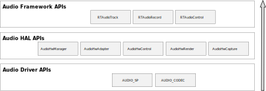

   Audio interfaces

Driver Interfaces
~~~~~~~~~~~~~~~~~~~
Audio Clock and Function APIs
^^^^^^^^^^^^^^^^^^^^^^^^^^^^^^^^
.. table:: 
   :width: 100%
   :widths: 30, 70 

   +----------------------------------+---------------------------------------------------------+
   | API                              | Introduction                                            |
   +==================================+=========================================================+
   | RCC_PeriphClockCmd               | Enable or disable the APB peripheral clock and function |
   +----------------------------------+---------------------------------------------------------+
   | RCC_PeriphClockSource_SPORT      | Configure SPORT clock                                   |
   +----------------------------------+---------------------------------------------------------+
   | RCC_PeriphClockSource_AUDIOCODEC | Select audio codec clock                                |
   +----------------------------------+---------------------------------------------------------+

SPORT APIs
^^^^^^^^^^^^^^^^^^^^
.. table:: 
   :width: 100%
   :widths: 30, 70 

   +------------------------------+---------------------------------------------------------------------------------------------+
   | API                          | Introduction                                                                                |
   +==============================+=============================================================================================+
   | AUDIO_SP_StructInit          | Fill each SP_StructInit member with its default value                                       |
   +------------------------------+---------------------------------------------------------------------------------------------+
   | AUDIO_SP_Register            | Register audio SPORT with its index, direction, and SP_StructInit members.                  |
   +------------------------------+---------------------------------------------------------------------------------------------+
   | AUDIO_SP_Unregister          | Unregister audio SPORT with its index                                                       |
   +------------------------------+---------------------------------------------------------------------------------------------+
   | AUDIO_SP_Reset               | Reset SPORT                                                                                 |
   +------------------------------+---------------------------------------------------------------------------------------------+
   | AUDIO_SP_GetTXChnLen         | Get the audio SPORT Tx channel length                                                       |
   +------------------------------+---------------------------------------------------------------------------------------------+
   | AUDIO_SP_GetRXChnLen         | Get the audio SPORT Rx channel length                                                       |
   +------------------------------+---------------------------------------------------------------------------------------------+
   | AUDIO_SP_SetTXClkDiv         | Set the audio SPORT Tx BCLK and LRCK                                                        |
   +------------------------------+---------------------------------------------------------------------------------------------+
   | AUDIO_SP_SetRXClkDiv         | Set the audio SPORT Rx BCLK and LRCK                                                        |
   +------------------------------+---------------------------------------------------------------------------------------------+
   | AUDIO_SP_SetMClk             | Set the audio SPORT MCLK mode                                                               |
   +------------------------------+---------------------------------------------------------------------------------------------+
   | AUDIO_SP_SetMClkDiv          | Set the audio SPORT MCLK divider                                                            |
   +------------------------------+---------------------------------------------------------------------------------------------+
   | AUDIO_SP_SetFixBclk          | Set the audio SPORT fix BCLK mode                                                           |
   +------------------------------+---------------------------------------------------------------------------------------------+
   | AUDIO_SP_SelFixBclk          | Select audio SPORT fix BCLK                                                                 |
   +------------------------------+---------------------------------------------------------------------------------------------+
   | AUDIO_SP_TXCHNSrcSel         | Select SPORT Tx channel source                                                              |
   +------------------------------+---------------------------------------------------------------------------------------------+
   | AUDIO_SP_RXFIFOSrcSel        | Select SPORT Rx FIFO source                                                                 |
   +------------------------------+---------------------------------------------------------------------------------------------+
   | AUDIO_SP_TXSetFifo           | Set the audio SPORT Tx FIFO                                                                 |
   +------------------------------+---------------------------------------------------------------------------------------------+
   | AUDIO_SP_RXSetFifo           | Set the audio SPORT Rx FIFO                                                                 |
   +------------------------------+---------------------------------------------------------------------------------------------+
   | AUDIO_SP_Init                | Initialize the audio SPORT registers according to the specified parameters in SP_InitStruct |
   +------------------------------+---------------------------------------------------------------------------------------------+
   | AUDIO_SP_TXStart             | Start or stop SPORT Tx path                                                                 |
   +------------------------------+---------------------------------------------------------------------------------------------+
   | AUDIO_SP_RXStart             | Start or stop SPORT Rx path                                                                 |
   +------------------------------+---------------------------------------------------------------------------------------------+
   | AUDIO_SP_DmaCmd              | Enable or disable SPORT DMA handshake                                                       |
   +------------------------------+---------------------------------------------------------------------------------------------+
   | AUDIO_SP_SetSelfLPBK         | Set SPORT self-loopback mode                                                                |
   +------------------------------+---------------------------------------------------------------------------------------------+
   | AUDIO_SP_SetTXWordLen        | Set the audio SPORT Tx word length                                                          |
   +------------------------------+---------------------------------------------------------------------------------------------+
   | AUDIO_SP_SetRXWordLen        | Set the audio SPORT Rx word length                                                          |
   +------------------------------+---------------------------------------------------------------------------------------------+
   | AUDIO_SP_GetTXWordLen        | Get the audio SPORT Tx word length                                                          |
   +------------------------------+---------------------------------------------------------------------------------------------+
   | AUDIO_SP_GetRXWordLen        | Get the audio SPORT Rx word length                                                          |
   +------------------------------+---------------------------------------------------------------------------------------------+
   | AUDIO_SP_SetMonoStereo       | Set the audio SPORT channel number                                                          |
   +------------------------------+---------------------------------------------------------------------------------------------+
   | AUDIO_SP_SetMasterSlave      | Set the audio SPORT master or slave mode                                                    |
   +------------------------------+---------------------------------------------------------------------------------------------+
   | AUDIO_SP_SetPinMux           | Set the audio SPORT pinmux function                                                         |
   +------------------------------+---------------------------------------------------------------------------------------------+
   | AUDIO_SP_TXGDMA_Init         | Initialize GDMA peripheral for Tx data                                                      |
   +------------------------------+---------------------------------------------------------------------------------------------+
   | AUDIO_SP_RXGDMA_Init         | Initialize GDMA peripheral for Rx data                                                      |
   +------------------------------+---------------------------------------------------------------------------------------------+
   | AUDIO_SP_TXGDMA_Restart      | Restart GDMA peripheral for Tx data                                                         |
   +------------------------------+---------------------------------------------------------------------------------------------+
   | AUDIO_SP_RXGDMA_Restart      | Restart GDMA peripheral for Rx data                                                         |
   +------------------------------+---------------------------------------------------------------------------------------------+
   | AUDIO_SP_LLPTXGDMA_Init      | Initialize Link-list mode GDMA peripheral for Tx data                                       |
   +------------------------------+---------------------------------------------------------------------------------------------+
   | AUDIO_SP_LLPRXGDMA_Init      | Initialize Link-list mode GDMA peripheral for Rx data                                       |
   +------------------------------+---------------------------------------------------------------------------------------------+
   | AUDIO_SP_SetTXCounter        | Set SPORT Tx counter                                                                        |
   +------------------------------+---------------------------------------------------------------------------------------------+
   | AUDIO_SP_SetTXCounterCompVal | Set SPORT Tx counter compare value                                                          |
   +------------------------------+---------------------------------------------------------------------------------------------+
   | AUDIO_SP_ClearTXCounterIrq   | Clear SPORT Tx counter IRQ                                                                  |
   +------------------------------+---------------------------------------------------------------------------------------------+
   | AUDIO_SP_SetPhaseLatch       | Set SPORT phase latch                                                                       |
   +------------------------------+---------------------------------------------------------------------------------------------+
   | AUDIO_SP_GetTXCounterVal     | Get SPORT Tx counter value                                                                  |
   +------------------------------+---------------------------------------------------------------------------------------------+
   | AUDIO_SP_GetTXPhaseVal       | Get SPORT Tx phase value: only available when SPORT channel length is 32bit.                |
   +------------------------------+---------------------------------------------------------------------------------------------+
   | AUDIO_SP_SetRXCounter        | Set SPORT Rx counter                                                                        |
   +------------------------------+---------------------------------------------------------------------------------------------+
   | AUDIO_SP_SetRXCounterCompVal | Set SPORT Rx counter compare value                                                          |
   +------------------------------+---------------------------------------------------------------------------------------------+
   | AUDIO_SP_ClearRXCounterIrq   | Clear SPORT Rx counter IRQ                                                                  |
   +------------------------------+---------------------------------------------------------------------------------------------+
   | AUDIO_SP_GetRXCounterVal     | Get SPORT Rx counter value                                                                  |
   +------------------------------+---------------------------------------------------------------------------------------------+
   | AUDIO_SP_GetRXPhaseVal       | Get SPORT Rx phase value: only available when SPORT channel length is 32bit.                |
   +------------------------------+---------------------------------------------------------------------------------------------+
   | AUDIO_SP_SetDirectOutMode    | Set SPORT direct out mode                                                                   |
   +------------------------------+---------------------------------------------------------------------------------------------+
   | AUDIO_SP_Deinit              | De-initialize the audio SPORT index and direction                                           |
   +------------------------------+---------------------------------------------------------------------------------------------+

Codec APIs
^^^^^^^^^^^^^^^^^^^^
.. table:: 
   :width: 100%
   :widths: 30, 70 

   +---------------------------------+-------------------------------------------------------------------------+
   | API                             | Introduction                                                            |
   +=================================+=========================================================================+
   | AUDIO_CODEC_SetAudioIP          | Enable or disable audio codec IP                                        |
   +---------------------------------+-------------------------------------------------------------------------+
   | AUDIO_CODEC_SetI2SIP            | Enable or disable I2S IP                                                |
   +---------------------------------+-------------------------------------------------------------------------+
   | AUDIO_CODEC_SetI2SSRC           | Select I2S master source.                                               |
   +---------------------------------+-------------------------------------------------------------------------+
   | AUDIO_CODEC_SetANAClk           | Enable or disable ADC/DAC analog clock                                  |
   +---------------------------------+-------------------------------------------------------------------------+
   | AUDIO_CODEC_SetI2SRXTDM         | Select I2S Rx and I2S Rx TDM mode                                       |
   +---------------------------------+-------------------------------------------------------------------------+
   | AUDIO_CODEC_I2S_StructInit      | Default I2S initialization parameter                                    |
   +---------------------------------+-------------------------------------------------------------------------+
   | AUDIO_CODEC_SetI2SParameters    | Set I2S initialization parameter                                        |
   +---------------------------------+-------------------------------------------------------------------------+
   | AUDIO_CODEC_SetADCSRSrc         | Select ADC sample rate and source, all ADC share source and sample rate |
   +---------------------------------+-------------------------------------------------------------------------+
   | AUDIO_CODEC_SetDACSRSrc         | Select DAC sample rate and source                                       |
   +---------------------------------+-------------------------------------------------------------------------+
   | AUDIO_CODEC_EnableDACFifo       | Enable or disable DAC fif0                                              |
   +---------------------------------+-------------------------------------------------------------------------+
   | AUDIO_CODEC_EnableADCFifo       | Enable or disable ADC fif0                                              |
   +---------------------------------+-------------------------------------------------------------------------+
   | AUDIO_CODEC_DisPAD              | Disable audio pad according to the work path                            |
   +---------------------------------+-------------------------------------------------------------------------+
   | AUDIO_CODEC_SetLDOMode          | Audio Codec LDO power on or power down                                  |
   +---------------------------------+-------------------------------------------------------------------------+
   | AUDIO_CODEC_EnableADC           | Enable or disable per AD and AD FIFO channel clock                      |
   +---------------------------------+-------------------------------------------------------------------------+
   | AUDIO_CODEC_SetADCVolume        | Set the gain of ADC digital volume                                      |
   +---------------------------------+-------------------------------------------------------------------------+
   | AUDIO_CODEC_SetADCHPF           | Set per ADC channel HPF mode and select HPF FC                          |
   +---------------------------------+-------------------------------------------------------------------------+
   | AUDIO_CODEC_SetADCASRC          | Set ADC ASRC mode                                                       |
   +---------------------------------+-------------------------------------------------------------------------+
   | AUDIO_CODEC_SetADCMute          | Mute ADC path                                                           |
   +---------------------------------+-------------------------------------------------------------------------+
   | AUDIO_CODEC_SetADCMixMute       | Set per ADC mix mute type and state                                     |
   +---------------------------------+-------------------------------------------------------------------------+
   | AUDIO_CODEC_SetADCANASrc        | Select analog ad source for per ad channel                              |
   +---------------------------------+-------------------------------------------------------------------------+
   | AUDIO_CODEC_SetADCANAFilter     | Enable or disable per ADC analog ad filter                              |
   +---------------------------------+-------------------------------------------------------------------------+
   | AUDIO_CODEC_SetMicBiasPowerMode | Audio Codec MICBIAS power on or power down                              |
   +---------------------------------+-------------------------------------------------------------------------+
   | AUDIO_CODEC_SetMicBstPowerMode  | Set MICBST power on or down                                             |
   +---------------------------------+-------------------------------------------------------------------------+
   | AUDIO_CODEC_SetMicBstChnMute    | Set per MICBST mute or unmute                                           |
   +---------------------------------+-------------------------------------------------------------------------+
   | AUDIO_CODEC_SetMicBstInputMode  | Set MICBST single-end or differential mode                              |
   +---------------------------------+-------------------------------------------------------------------------+
   | AUDIO_CODEC_SetMicBstGain       | Set codec MICBST gain                                                   |
   +---------------------------------+-------------------------------------------------------------------------+
   | AUDIO_CODEC_SetADCDmicFilter    | Enable per DIMC channel filter                                          |
   +---------------------------------+-------------------------------------------------------------------------+
   | AUDIO_CODEC_SetDmicClk          | Enable and select DMIC clock                                            |
   +---------------------------------+-------------------------------------------------------------------------+
   | AUDIO_CODEC_SetDmicSrc          | Set DIMC channel source                                                 |
   +---------------------------------+-------------------------------------------------------------------------+
   | AUDIO_CODEC_SetDACSrc           | Set DAC source                                                          |
   +---------------------------------+-------------------------------------------------------------------------+
   | AUDIO_CODEC_EnableDAC           | Enable or disable da and da FIFO channel clock                          |
   +---------------------------------+-------------------------------------------------------------------------+
   | AUDIO_CODEC_SetDACMute          | Mute DAC path                                                           |
   +---------------------------------+-------------------------------------------------------------------------+
   | AUDIO_CODEC_SetDACVolume        | Set the gain of DAC digital volume                                      |
   +---------------------------------+-------------------------------------------------------------------------+
   | AUDIO_CODEC_SetDACHPF           | Set DAC HPF enable                                                      |
   +---------------------------------+-------------------------------------------------------------------------+
   | AUDIO_CODEC_SetDACASRC          | Enable or disable DAC ASRC mode and select ASRC rate                    |
   +---------------------------------+-------------------------------------------------------------------------+
   | AUDIO_CODEC_SetDACPowerMode     | Set DAC power mode                                                      |
   +---------------------------------+-------------------------------------------------------------------------+
   | AUDIO_CODEC_SetLineOutPowerMode | Set lineout power mode                                                  |
   +---------------------------------+-------------------------------------------------------------------------+
   | AUDIO_CODEC_SetLineOutMode      | Set Lineout single-end or differential mode                             |
   +---------------------------------+-------------------------------------------------------------------------+
   | AUDIO_CODEC_SetLineOutMute      | Set Line out mute control: DAC in or analog in                          |
   +---------------------------------+-------------------------------------------------------------------------+
   | AUDIO_CODEC_SetPDMClk           | Enable and select or disable PDM clock                                  |
   +---------------------------------+-------------------------------------------------------------------------+
   | AUDIO_CODEC_SetTesttone         | DAC Test tone mode                                                      |
   +---------------------------------+-------------------------------------------------------------------------+
   | AUDIO_CODEC_SetDAADLPBK         | Set daad loopback mode                                                  |
   +---------------------------------+-------------------------------------------------------------------------+
   | AUDIO_CODEC_SetADDALPBK         | Set adda loopback mode                                                  |
   +---------------------------------+-------------------------------------------------------------------------+
   | AUDIO_CODEC_SetADCDecimationSrc | select ADC path decimation source                                       |
   +---------------------------------+-------------------------------------------------------------------------+
   | AUDIO_CODEC_SetDACZDET          | Set DAC path zero detection function                                    |
   +---------------------------------+-------------------------------------------------------------------------+
   | AUDIO_CODEC_SetDACZDETTimeOut   | Set DAC path zero detection time out selection                          |
   +---------------------------------+-------------------------------------------------------------------------+
   | AUDIO_CODEC_SetADCZDET          | Set ADC path zero detection function                                    |
   +---------------------------------+-------------------------------------------------------------------------+
   | AUDIO_CODEC_SetADCZDETTimeOut   | Set ADC path zero detection function                                    |
   +---------------------------------+-------------------------------------------------------------------------+
   | AUDIO_CODEC_Record              | Audio codec record flow for test                                        |
   +---------------------------------+-------------------------------------------------------------------------+
   | AUDIO_CODEC_Playback            | Audio codec playback flow for test                                      |
   +---------------------------------+-------------------------------------------------------------------------+

VAD APIs
^^^^^^^^^^^^^^^^
.. table:: 
   :width: 100%
   :widths: 30, 70

   +--------------------------------+------------------------------------------------+
   | API                            | Introduction                                   |
   +================================+================================================+
   | AUDIO_CODEC_VADStart           | Enable and start VAD                           |
   +--------------------------------+------------------------------------------------+
   | AUDIO_CODEC_ENVADIRQ           | Enable and select VAD interrupt mode           |
   +--------------------------------+------------------------------------------------+
   | AUDIO_CODEC_DISVADIRQ          | Enable and select VAD interrupt mode           |
   +--------------------------------+------------------------------------------------+
   | AUDIO_CODEC_SetVADDetThr       | Set VAD detection threshold                    |
   +--------------------------------+------------------------------------------------+
   | AUDIO_CODEC_SetVADVoice        | Set VAD voice volume                           |
   +--------------------------------+------------------------------------------------+
   | AUDIO_CODEC_SetVADSrc          | Select the source for voice activity detection |
   +--------------------------------+------------------------------------------------+
   | AUDIO_CODEC _VADBuf_move_one   | Configure VAD buffer operation (1 block)       |
   +--------------------------------+------------------------------------------------+
   | AUDIO_CODEC _VADBuf_move_two   | Configure VAD buffer operation (2 blocks)      |
   +--------------------------------+------------------------------------------------+
   | AUDIO_CODEC _VADBuf_move_three | Configure VAD buffer operation (3 blocks)      |
   +--------------------------------+------------------------------------------------+
   | AUDIO_CODEC _VADBuf_move_four  | Configure VAD buffer operation(4 blocks)       |
   +--------------------------------+------------------------------------------------+

HAL Interfaces
~~~~~~~~~~~~~~~~
Audio HAL provides AudioHwRender/AudioHwCapture/AudioHwControl interfaces to interact with audio hardware. The interfaces lie in ``{SDK}/component/audio/interfaces/hardware/audio``. The interfaces have specific descriptions in them, read them before use.

- **AudioHwRender**: receives PCM data from the upper layer, writes data via audio driver to send PCM data to hardware, and provides information about audio output hardware driver.

- **AudioHwCapture**: receives PCM data via audio driver and sends to the upper layer.

- **AudioHwControl**: receives control calling from the upper layer, and sets control information to the driver.

The AudioHwRender/AudioHwCapture is managed by AudioHwAdapter interface. It is responsible for creating/destroying AudioHwRender/AudioHwCapture instance. AudioHwAdapter is a physical or virtual hardware to process audio stream. It contains a set of ports and pins as shown in :ref:`audio_hw_adapter_example`.

- **Port** – the stream input of audio adapter

- **Pin** – the output stream of audio adapter

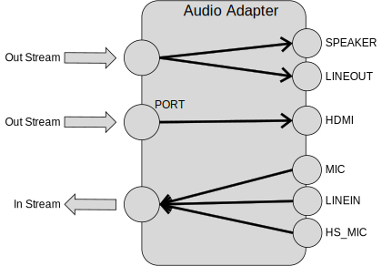

   AudioHwAdapter example

The AudioHwManager manages system's all AudioHwAdapters and loads a specific adapter driver based on the given audio adapter descriptor.

Using AudioHwRender
^^^^^^^^^^^^^^^^^^^^^
Users can check the example of AudioHwRender in ``{SDK}/component/example/audio/audio_hal_render``.

Here is the description showing how to use audio HAL interfaces to play audio raw data (PCM format):

1. Use :func:`GetAudioManagerFuncs()` to get AudioHwManager instance

   .. code-block:: c

      struct AudioHwManager *audio_manager = GetAudioManagerFuncs();

2. Use :func:`GetAllAdapters()` to get all audio adapter descriptors

   .. code-block:: c

      int32_t size = -1;
      struct AudioHwAdapterDescriptor *descs = nullptr;
      audio_manager->GetAllAdapters(audio_manager, &descs, &size);

3. Choose a specific adapter to play (currently audio manager only supports primary audio adapter)

   .. code-block:: c

      for (int index = 0; index < size; index++){
         struct AudioHwAdapterDescriptor *desc = &descs[index];
            for (int port = 0; (desc != nullptr && port < static_cast<int>(desc->portNum)); port++) {
               if (desc->ports[port].dir == PORT_OUT &&
                  (audio_manager->LoadAdapter(audio_manager, desc, &audio_adapter)) == 0) {
                  render_port = desc->ports[port];
                  break;
            }
         }
      }

4. Create *AudioHwSampleAttributes* according to the sample rate, channel, format, and AudioHwDeviceDescriptor, then use :func:`CreateRender()` to create an AudioHwRender based on the specific audio adapter

   .. code-block:: c

      struct AudioHwSampleAttributes  param;
      param.sample_rate = sample_rate;
      param.channel_count = channel_count;
      param.format = AUDIO_FORMAT_PCM_16_BIT;
      param.interleaved = false;
      struct AudioHwDeviceDescriptor device_desc;
      device_desc.port_id = render_port.port_id;
      device_desc.pins = AUDIO_HW_PIN_OUT_SPEAKER;
      device_desc.desc = NULL;
      int32_t ret = audio_adapter->CreateRender(audio_adapter, &device_desc, &param, &audio_render);

5. Use :func:`GetBufferSize()` to get AudioHwRender buffer size

   .. code-block:: c

      ssize_t size = ((struct AudioHalStream *)audio_render)->GetBufferSize((struct AudioHalStream *)audio_render);

6. Write PCM data to AudioHwRender repeatly.

   This size can be defined by users, instead of the size got in the last step. Users need to make sure the *size/frame_size* is integer.

   .. code-block:: c

      int32_t bytes = audio_render->Write(audio_render, buffer, size);

7. Use :func:`DestroyRender()` to close AudioHwRender when finishing playing

   .. code-block:: c

      audio_adapter->DestroyRender(audio_adapter, audio_render);

8. Use :func:`UnloadAdapter()` to unload the AudioHwAdapter and finally call :func:`DestoryAudioManager()` to release AudioHwManager instance

   .. code-block:: c

      audio_manager->UnloadAdapter(audio_manager,desc,&audio_adapter); DestoryAudioManager(&audio_manager);

Using AudioHwCapture
^^^^^^^^^^^^^^^^^^^^^^^
Users can check the example of AudioHwRender in ``{SDK}/component/example/audio/audio_hal_capture``.

Here is the description showing how to use audio HAL interfaces to capture audio raw data:

1. Use :func:`GetAudioManagerFuncs()` to get AudioHwManager instance

   .. code-block:: c

      struct AudioHwManager *audio_manager = GetAudioManagerFuncs();

2. Use :func:`GetAllAdapters()` to get all audio adapter descriptors

   .. code-block:: c

      int32_t size = -1;
      struct AudioHwAdapterDescriptor *descs = nullptr;
      audio_manager->GetAllAdapters(audio_manager, &descs, &size);

3. Choose a specific adapter to capture (currently audio manager only supports primary audio adapter)

   .. code-block:: c

      for (int index = 0; index < size; index++){
         struct AudioHwAdapterDescriptor *desc = &descs[index];
         for (int port = 0; (desc != nullptr && port < static_cast<int>(desc->portNum)); port++) {
            if (desc->ports[port].dir == PORT_IN &&
               (audio_manager->LoadAdapter(audio_manager, desc, &audio_adapter)) == 0) {
               mCapturePort = desc->ports[port];
               break;
            }
         }
      }

4. Construct *AudioHwSampleAttributes* according to the sample rate, channel, format, and AudioHwDeviceDescriptor, then use :func:`CreateCapture()` to create an AudioHwCapture based on the specific audio adapter

   .. code-block:: c

      struct AudioHwSampleAttributes  param;
      param.sample_rate = sample_rate;
      param.channel_count = channel_count;
      param.format = AUDIO_FORMAT_PCM_16_BIT;
      param.interleaved = false;
      struct AudioHwDeviceDescriptor device_desc;
      device_desc.port_id = render_port.port_id;
      device_desc.pins = AUDIO_HW_PIN_IN_MIC;
      device_desc.desc = NULL;
      int32_t ret = audio_adapter->CreateCapture(audio_adapter, &device_desc, &param, &audio_capture);

5. Use :func:`GetBufferSize()` to get AudioHwCapture buffer size:

   .. code-block:: c

      ssize_t size = ((struct AudioHalStream *)audio_capture)->GetBufferSize((struct AudioHalStream *)audio_capture);

6. Read PCM data from AudioHwCapture repeatly. This size can be defined by users, instead of the size got in the last step. Users need to make sure the *size/frame_size* is integer.

   .. code-block:: c

      int32_t bytes = audio_capture->Read(audio_capture, buffer, size);

7. Use :func:`DestroyCapture()` to close AudioHwCapture when finishing recording

   .. code-block:: c

      audio_adapter->DestroyCapture(audio_adapter, audio_capture);

8. Use :func:`UnloadAdapter()` to unload the AudioHwAdapter, and finally call :func:`DestoryAudioManager()` to release AudioHwManager instance

   .. code-block:: c

      audio_manager->UnloadAdapter(audio_manager,desc,&audio_adapter); DestoryAudioManager(&audio_manager);

Using AudioHwControl
^^^^^^^^^^^^^^^^^^^^^^^
Here is an example showing how to use audio HAL interfaces to control audio codec.

AudioHwCotrol is always thread-safe, and the calling is convenient.
To use AudioHwCotrol, the first parameter of the function call should always be :func:`GetAudioHwControl()`. Take the hardware volume setting for example:

.. code-block:: c
   
   GetAudioHwControl()->SetHardwareVolume(GetAudioHwControl(), left_volume, right_volume);

Framework Interfaces
~~~~~~~~~~~~~~~~~~~~~
Streaming Interfaces
^^^^^^^^^^^^^^^^^^^^^
Audio Streaming Interfaces include RTAudioTrack and RTAudioRecord interfaces. The interfaces lie in ``{SDK}/component/audio/interfaces/audio``. The interfaces have specific descriptions in them, please read them before using.

- **RTAudioTrack**: initializes the format of playback data streaming in the framework, receives PCM data from the application, and writes data to Audio Framework (mixer) or Audio HAL (passthrough).

- **RTAudioRecord**: initializes the format of record data streaming in the framework, receives PCM data from Audio HAL, and sends data to applications.

Using RTAudioTrack
*******************
RTAudioTrack includes support for playing variety of common audio raw format types so that audio can be easily integrated into applications. At most 32 RTAudioTracks can play together.

Audio Framework has the following audio playback stream types. Applications can use the types to initialize RTAudioTrack. Framework gets the streaming type and does the volume mixing according to the types.

- **RTAUDIO_CATEGORY_MEDIA** - if the application wants to play music, then its type is **RTAUDIO_CATEGORY_MEDIA**, it can use this type to init RTAudioTrack. Then audio framework will know its type, and mix it with media's volume.

- **RTAUDIO_CATEGORY_COMMUNICATION** - if the application wants to start a phone call, it can output the phone call's sound, the sound's type should be **RTAUDIO_CATEGORY_COMMUNICATION**.

- **RTAUDIO_CATEGORY_SPEECH** - if the application wants to do voice recognition, and output the speech sound.

- **RTAUDIO_CATEGORY_BEEP** - if the sound is key tone, or other beep sound, then its type is **RTAUDIO_CATEGORY_BEEP**.

The test demo of RTAudioTrack lies in ``{SDK}/component/example/audio/audio_track``.

Here is an example showing how to play audio raw data:

1. Before using RTAudioTrack, RTAudioService should be initialized

   .. code-block:: c

      RTAudioService_Init();

2. To use RTAudioTrack to play a sound, create it

   .. code-block:: c

      struct RTAudioTrack* audio_track = RTAudioTrack_Create();

   The application can use the Audio Configs API to provide detailed audio information about a specific audio playback source, including stream type (type of playback source), format, number of channels, sample rate, and RTAudioTrack ringbuffer size. The syntax is as follows:

   .. code-block:: c

      typedef struct {
      uint32_t category_type;
      uint32_t sample_rate;
      uint32_t channel_count;
      uint32_t format;
      uint32_t buffer_bytes;
      } RTAudioTrackConfig;

   Where

      :category_type: defines the stream type of the playback data source.

      :sample_rate: playback source raw data's rate.

      :channel_count: playback source raw data's channel number.

      :format: playback source raw data's bit depth.

      :buffer_bytes: ringbuffer size for RTAudioTrack to avoid xrun.

   .. note::

      The *buffer_bytes* in RTAudioTrackConfig is very important. The buffer size should always be more than the minimum buffer size Audio framework calculated. Otherwise overrun will occur.

3. Use the interface to get minimum RTAudioTrack buffer bytes, and use it as a reference to define RTAudioTrack buffer size.

   For example, you can use minimum buffer size*4 as buffer size.
   The bigger size you use, the smoother playing you will get, yet it may cause more latency. It's your choice to define the size.

   .. code-block:: c

      int track_buf_size = RTAudioTrack_GetMinBufferBytes(audio_track, type, rate, format, channels) * 4;

4. Use this buffer size and other audio parameters to create RTAudioTrackConfig object, here's an example:

   .. code-block:: c

      RTAudioTrackConfig track_config;
      track_config.category_type = RTAUDIO_CATEGORY_MEDIA;
      track_config.sample_rate = rate;
      track_config.format = format;
      track_config.buffer_bytes = track_buf_size;
      track_config.channel_count = channel_count;

   With RTAudioTrackConfig object, we can initialize RTAudioTrack. In this step, a ringbuffer will be created according to the buffer bytes.

   .. code-block:: c

      RTAudioTrack_Init(audio_track, &track_config);

5. When all the preparations are completed, start RTAudioTrack and check if starts success

   .. code-block:: c

      if(RTAudioTrack_Start(audio_track) != 0){
         //track start fail
         return;
      }

   The default volume of RTAudioTrack is maximum 1.0, you can adjust the volume with the following API.

   .. code-block:: c

      RTAudioTrack_SetVolume(audio_track, 1.0, 1.0);

   .. note::
      - In the mixer architecture, this API sets the software volume of the current audio_track.

      - In the passthrough architecture, this API is not supported.

6. Write audio data to the framework. The write_size can be defined by users. Users need to make sure the *write_size/frame_size* is integer.

   .. code-block:: c

      RTAudioTrack_Write(audio_track, buffer, write_size, true);

   - If users want to pause, stop writing data, and then call the following APIs to tell the framework to do pause.

     .. code-block:: c

        RTAudioTrack_Pause(audio_track);
        RTAudioTrack_Flush(audio_track);

   - If users want to stop playing audio, stop writing data, and then call :func:`RTAudioTrack_Stop()`.

     .. code-block:: c

        RTAudioTrack_Stop(audio_track);

7. Delete audio_track pointer when it's no use

   .. code-block:: c

      RTAudioTrack_Destroy(audio_track);

Using RTAudioRecord
**********************
RTAudioRecord supports variety of common audio raw format types, so that you can easily integrate record into applications.

The following audio input sources are supported by RTAudioRecord:

- **RTPIN_IN_MIC** - if the application wants to capture data from microphone, then choose this input source.

- **RTPIN_IN_HS_MIC** - if the application wants to capture data from headset microphone, then choose this input source.

- **RTPIN_IN_HS_MIC** - if the application wants to capture data from LINE-IN, then choose this input source.

The test demo of RTAudioRecord lies in ``{SDK}/component/example/audio/audio_record``.

Here is an example showing how to record audio raw data:

1. Create RTAudioRecord

   .. code-block:: c

      struct RTAudioRecord *audio_record = RTAudioRecord_Create();

2. The application can use the Audio Configs API to provide detailed audio information about a specific audio record source, including record device source, format, number of channels, and sample rate.

   The syntax is as follows:

   .. code-block:: c

      typedef struct {
      uint32_t sample_rate;
      uint32_t channel_count;
      uint32_t format;
      uint32_t device;
        uint32_t buffer_bytes;
      } RTAudioRecordConfig;

   Where

      :sample_rate: record source raw data's rate.

      :channel_count: record source raw data's channel number.

      :format: record source raw data's bit depth.

      :device: audio input device source for data record.

      :buffer_bytes: audio buffer bytes in framework. Set 0 to use default value. User can also set other value, the bigger buffer_bytes means bigger latency.

   Here's an example showing how to create RTAudioRecordConfig object of RTAudioRecord.

   .. code-block:: c

      RTAudioRecordConfig record_config;
      record_config.sample_rate = rate;
      record_config.format = RTAUDIO_FORMAT_PCM_16_BIT;
      record_config.channel_count = channels;
      record_config.device = RTPIN_IN_MIC;
      record_config.buffer_bytes = 0;

3. With RTAudioRecordConfig object created, initialize RTAudioRecord

   In this step, Audio HAL's AudioHwAdapter will be loaded, according to the audio input device source.

   .. code-block:: c

      RTAudioRecord_Init(audio_record, &record_config);

4. When all the preparations are completed, start audio_record

   .. code-block:: c

      RTAudioRecord_Start(audio_record);

5. Read audio microphone data.

   The read size can be defined by users. Users need to make sure *size/frame_size* is integer.

   .. code-block:: c

      RTAudioRecord_Read(audio_record, buffer, size, true);

6. When the record ends, stop the record

   .. code-block:: c

      RTAudioRecord_Stop(audio_record);

7. When audio_record no use, destroy it to avoid memory leak

   .. code-block:: c

      RTAudioRecord_Destroy(audio_record);

Control Interfaces
^^^^^^^^^^^^^^^^^^^^
Audio Control Interfaces include RTAudioControl interfaces to interact with audio control HAL.
RTAudioControl provides interfaces to set and get hardware volume, set output device, and so on. The interfaces lie in :file:`{SDK}/component/audio/interfaces/audio/audio_control.h` The interfaces have specific descriptions, read them before use.

Using RTAudioControl
**********************
For using RTAudioControl, Call RTAudioControl to set audio hardware volume of DAC:

.. code-block:: c

   RTAudioControl_SetHardwareVolume(0.5, 0.5);

For playback and record case, most RTAudioControl APIs can be called at any time, any place, they can work directly. Only :func:`RTAudioControl_SetPlaybackDevice()` can only be called before :func:`RTAudioService_Init` in mixer architecture, and before :func:`RTAudioTrack_Start` in passthrough architecture.