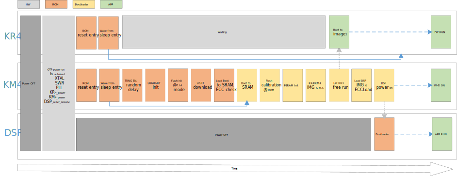

.. _boot_process:

Features
---------
- On-chip boot ROM

- Contains the bootloader with In-System Programming (ISP) facility

- Secure boot process with multiple cryptographic algorithms of hardware or software engine

- Suspend resume process

- Boot from NOR Flash

- PSRAM as a memory
   
Boot Address
--------------
After reset, CPU will boot from the vector table start address, which is fixed by hardware. Both KM4 and KR4 boot from the address ``0x0000_0000``.
   
.. only:: RTL8726EA

   .. table:: Boot address
      :width: 100%
      :widths: auto
   
      +-----+----------------+------------------+
      | CPU | Address        | Type             |
      +=====+================+==================+
      | KM4 | 0x0000_0000    | KM4 ITCM ROM     |
      +-----+----------------+------------------+
      | KR4 | 0x0000_0000    | KR4 ITCM ROM     |
      +-----+----------------+------------------+
      | DSP | User Configure | Flash/SRAM/PSRAM |
      +-----+----------------+------------------+

Pin Description
----------------
The |CHIP_NAME| supports ISP (In-System Programming) via LOGUART (``PA19`` & ``PA20``). The ISP mode is determined by the state of ``PA20`` when boot.

.. table:: ISP mode
   :width: 100%
   :widths: auto

   +-----------+----------------------+---------------------------------------+
   | Boot mode | PA20 (UART_DOWNLOAD) | Description                           |
   +===========+======================+=======================================+
   | No ISP    | HIGH                 | | ISP bypassed.                       |
   |           |                      | | The IC attempts to boot from Flash. |
   +-----------+----------------------+---------------------------------------+
   | ISP       | LOW                  | The IC enters ISP via LOGUART.        |
   +-----------+----------------------+---------------------------------------+

Boot Flow
----------
The boot flow of |CHIP_NAME| is illustrated below. After a power-up or hardware reset, hardware will boot KM4 at clock 150MHz.
The boot process is handled by the on-chip boot ROM and is always executed by the KM4. After the KM4 bootloader code, KM4 will set up the environment for the KR4 and DSP.

1. KM4 boots ROM

2. KM4 secure boot (optional)

3. KM4 boots to SRAM

4. KM4 helps KR4 load images and check the signature (optional)

5. KM4 helps DSP load images and check the signature (optional, if DSP exists)

   Boot flow

The immutable ROM provides ISP service, which could be initial programming of a blank device, erasing and re-programming of a previously programmed device.

When the rising edge on RESET pin is generated, boot pin (``PA20``) will be sampled to determine whether to continue from normal boot process or ISP service.
If the boot pin is sampled ``LOW``, the external hardware request to start the ISP service.
If there is no request for the ISP service execution, a search is made for a valid user program.
If a valid user program is found, the execution control is transferred to it; otherwise, the dead loop is invoked.

Boot API
----------------
The API :func:`BOOT_Reason()` is used to obtain the cause of chip boot, and the function prototype is as follows:

.. code-block:: c

   u32 BOOT_Reason(void);

Default return value of this API is 0 when the chip is initially powered on, and return vaule of re-boot caused by other reasons can be found in the following table.
Users can find macro-definitions about return value in file :file:`sysreg_aon.h`.
   
.. table:: BOOT_Reason() API
   :width: 100%
   :widths: auto

   +--------------+---------------------------------------------------------------------+
   | Items        | Description                                                         |
   +==============+=====================================================================+
   | Introduction | Gets boot reason                                                    |
   +--------------+---------------------------------------------------------------------+
   | Parameter    | None                                                                |
   +--------------+---------------------------------------------------------------------+
   | Return       | Boot reason. It can be any of the following values or combinations: |
   |              |                                                                     |
   |              | - AON_BIT_RSTF_THM: Thermal reset                                   |
   |              |                                                                     |
   |              | - AON_BIT_RSTF_BOR: BOR Reset                                       |
   |              |                                                                     |
   |              | - AON_BIT_RSTF_DSLP: Wakeup from deep-sleep mode                    |
   |              |                                                                     |
   |              | - AON_BIT_RSTF_KR4_SYS: KR4 system reset                            |
   |              |                                                                     |
   |              | - AON_BIT_RSTF_KM4_SYS: KM4 system reset                            |
   |              |                                                                     |
   |              | - AON_BIT_RSTF_HIFI_SYS: HiFi 5 DSP system reset                    |
   |              |                                                                     |
   |              | - AON_BIT_RSTF_IWDG: KM0 Independent watchdog reset                 |
   |              |                                                                     |
   |              | - AON_BIT_RSTF_WDG1: KM4 secure watchdog reset                      |
   |              |                                                                     |
   |              | - AON_BIT_RSTF_WDG2: KM4 non-secure watchdog reset                  |
   |              |                                                                     |
   |              | - AON_BIT_RSTF_WDG3: KR4 watchdog reset                             |
   |              |                                                                     |
   |              | - AON_BIT_RSTF_WDG4: HiFi 5 DSP watchdog reset                      |
   |              |                                                                     |
   |              | - AON_BIT_RSTF_KM4_WARM2PERI: KM4 warm reset                        |
   |              |                                                                     |
   |              | - AON_BIT_RSTF_KR4_WARM2PERI: KR4 warm reset                        |
   |              |                                                                     |
   |              | - AON_BIT_RSTF_HIFI_WARM2PERI: HIFI warm reset                      |
   +--------------+---------------------------------------------------------------------+

