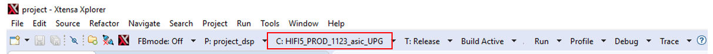
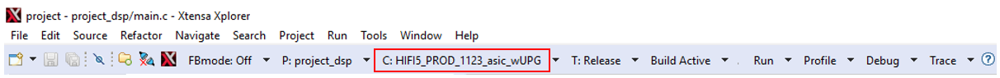
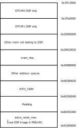
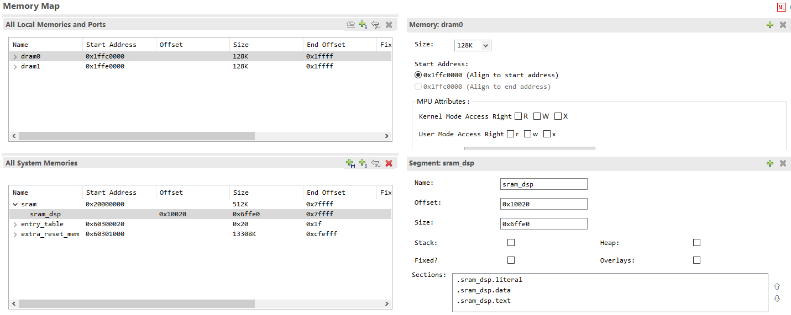
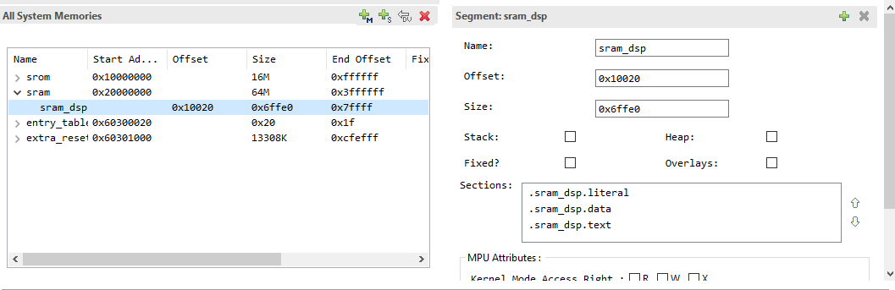
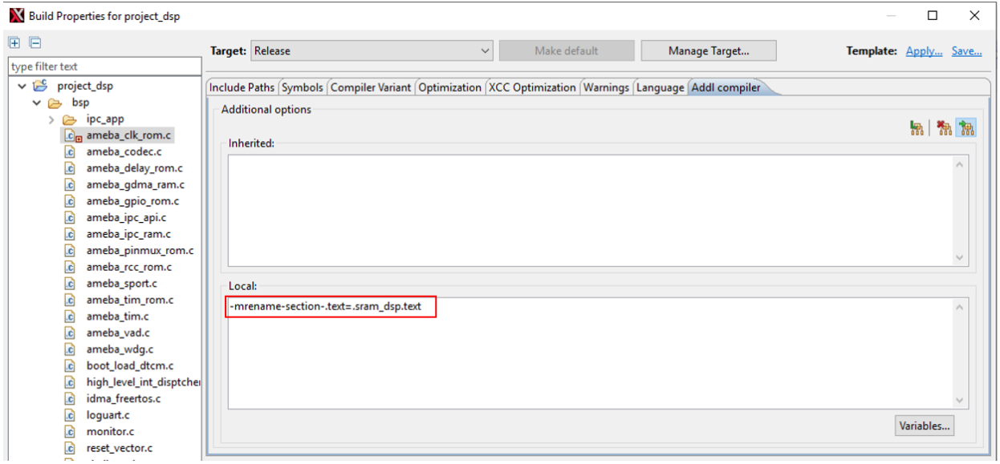
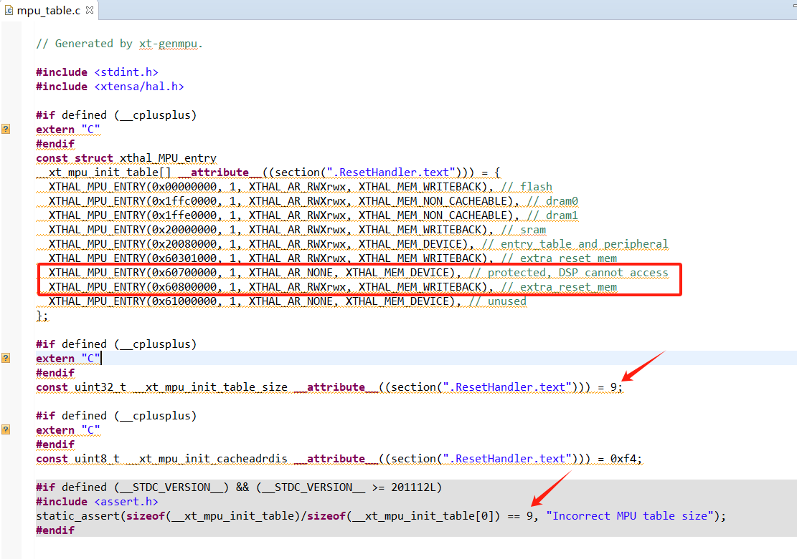
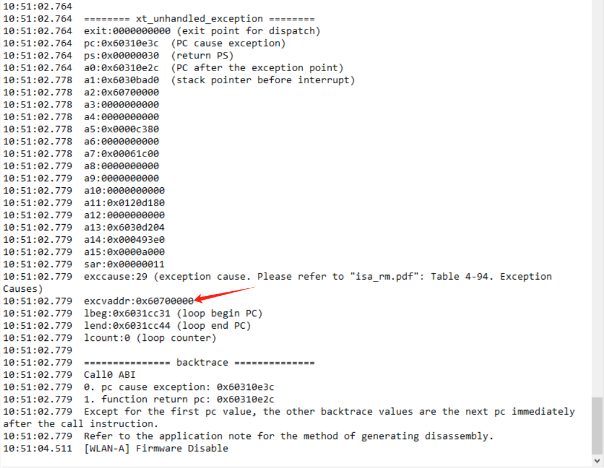

.. _dsp_configuration:

Calling Conventions
--------------------------------------
Xtensa supports two different application binary interfaces (ABI), Windowed register ABI and Call0 ABI, which also include the calling conventions.

A windowed function call and return can only be within the same 1GB aligned region. That is to say, all of the functions must reside in exactly one of the following 4 regions of the 4GB memory space. However, a Call0 function call and return can be within the whole 4GB region. The address range of SRAM is from 0x2000_0000 to 0x2008_0000, and the address range of PSRAM starts from 0x6000_0000 (end address depends on the type of PSRAM). The ranges of SRAM and PSRAM are not in the same 1GB region, so it is impossible to call a function residing in SRAM from a function residing in PSRAM with a windowed register ABI.

Switching between Call0 and Windowed Register ABI
--------------------------------------------------------------------------------------------------
Each configuration is either compatible with Call0 ABI or windowed register ABI. *HIFI5_PROD_1123_asic_UPG* is compatible with Call0 ABI; *HIFI5_PROD_1123_asic_wUPG* is compatible with windowed register ABI.

.. table:: 
   :width: 100%
   :widths: auto

   +---------------------------+-----------------------+
   | Configuration name        | ABI type              |
   +===========================+=======================+
   | HIFI5_PROD_1123_asic_UPG  | Call0 ABI             |
   +---------------------------+-----------------------+
   | HIFI5_PROD_1123_asic_wUPG | Windowed Register ABI |
   +---------------------------+-----------------------+

If Xplorer is used to manage the project, you just need to change the configuration to choose the ABI you use. Be careful, the pre-built libs should be compiled according to the ABI you choose. Here is the configuration chosen for a Call0 ABI:

Here is the configuration chosen for a Windowed register ABI:

.. note::
   1. If your project uses some libs provided by yourself, please re-compile the project according to the ABI you choose.

   2. If use CMD line (:file:`auto_build.sh`) to build the project, the configuration file for the automatic compilation script is: :file:`project/auto_build /dsp_batch.xml` (HIFI5_PROD_1123_asic_wUPG or HIFI5_PROD_1123_asic_UPG).

Placing Libs According to Calling Conventions
------------------------------------------------------------------------------------------
Using Environment Variable to Avoid Changing Search Path
~~~~~~~~~~~~~~~~~~~~~~~~~~~~~~~~~~~~~~~~~~~~~~~~~~~~~~~~~~~~~~~~~~~~~~~~~~~~~~~~~~~~~~~~~~~~~~~~~~~~~~~~~~~~~~~~
It will be tedious to change the location of lib search path when switching between two ABIs. You can create two folders named *HIFI5_PROD_1123_asic_UPG* and *HIFI5_PROD_1123_asic_wUPG* under the path you used to store libs, and place libs compiled with different ABIs into these two folders.

For example, if we used to place libs in ``lib/audio/prebuilts``:

1. Create two folders under the path ``/lib/audio/prebuilts/HIFI5_PROD_1123_asic_UPG`` and ``/lib/audio/prebuilts/HIFI5_PROD_1123_asic_wUPG``.

2. Change the *Library Search Paths* to ``${workspace_loc}/.../lib/audio/prebuilts/$(TARGET_CONFIG)``. Environment variable *$(TARGET_CONFIG)* changes as configuration changes, which assures the right place to find prebuilt libs.

   .. figure:: ../figures/library_search_path.png
      :scale: 90%
      :align: center

Libs Provided by Realtek
~~~~~~~~~~~~~~~~~~~~~~~~~~~~~~~~~~~~~~~~~~~~~~~~
libaudio_base.a and librpc_hal.a
^^^^^^^^^^^^^^^^^^^^^^^^^^^^^^^^^^^^^^^^^^^^^^^^^^^^^^^^^^^^^^^^
Two libs of different flavors are stored under ``dsp/lib/audio/prebuilts/$(TARGET_CONFIG)``.

- :file:`libaudio_base.a` is a RPC framework to synchronize data and signal between MCU and DSP.

- :file:`librpc_hal.a` is a hardware layer to adapt to different RPC platform.

libxa_nnlib.a and libhifi5_dsp.a
^^^^^^^^^^^^^^^^^^^^^^^^^^^^^^^^^^^^^^^^^^^^^^^^^^^^^^^^^^^^^^^^
- :file:`libxa_nnlib.a` can be found under ``dsp/lib/xa_nnlib/v1.7.0/bin/$(TARGET_CONFIG)/Release``. It is the HiFi 5 Neural Network Library.

- :file:`libhifi5_dsp.a` can be found under ``dsp/lib/lib_hifi5/project/hifi5_library/bin/$(TARGET_CONFIG)/Release``. It is the NatureDSP Signal for HiFi 5 DSP.

Layout of DSP
--------------------------
Default Layout of DSP
~~~~~~~~~~~~~~~~~~~~~~~~~~~~~~~~~~~~~~~~~~
We use a linker support package (LSP) to describe the layout of DSP. A LSP specifies object files to pull into an executable using a specific memory map, and is used as a convenient short-hand for telling the linker what it needs for a particular target environment. Refer to \ *Xtensa Linker Support Packages (LSPs) Reference Manual*\  (:file:`dsp\doc\lsp_rm.pdf`) for more information.

Here is the sketch of the default layout:

Here is the LSP seen from Xplorer:

DSP can use sram_dsp,entry_table and extra_reset_mem for system memory, and DRAM 0/1 for local memory. Reset vector address will be placed in entry_table. DRAM 0/1 can only be used to store data.

- For Call0 ABI, code AND data can be stored in sram_dsp and extra_reset_mem.

- For Window ABI: code can only be stored in extra_reset_mem, data can be stored in sram_dsp and extra_reset_mem.

Placing Codes/Data into SRAM
~~~~~~~~~~~~~~~~~~~~~~~~~~~~~~~~~~~~~~~~~~~~~~~~~~~~~~~~
There is a segment called *sram_dsp* in the default LSP: RTK_LSP. Putting codes or data into this area may have an effect on the performance of the whole project.

Using C Language Extensions
^^^^^^^^^^^^^^^^^^^^^^^^^^^^^^^^^^^^^^^^^^^^^^^^^^^^^^
- If the function to be placed into SRAM is:

  .. code-block:: c
  
     void place_into_sram();

  You should do this:

  .. code-block:: c
  
     extern void place_into_sram()__attribute__ ((section(".sram_dsp.text")));
     void place_into_sram(){
       //detailed implentation
        }
  
- If you need to put an array into SRAM, you can do like this:

  .. code-block:: c
  
     __attribute__ ((section(".sram_dsp.data"))) int array_in_psram[100];

Compiler Flags to Rename Sections
^^^^^^^^^^^^^^^^^^^^^^^^^^^^^^^^^^^^^^^^^^^^^^^^^^^^^^^^^^^^^^^^^^
1. If all functions in :file:`ameba_clk_rom.c` needs to be placed in SRAM, right click on this file, and choose ``Build Properties``. And in the new window, set values to *No* for items in the box.

   .. figure:: ../figures/project_explorer_of_project_dsp.png
      :scale: 100%
      :align: center
   
   
   .. figure:: ../figures/set_create_separate_function_sections_no.png
      :scale: 70%
      :align: center

2. Switch to :guilabel:`Addl compiler` tab, add an option as follows:

Changing Default Layout of LSP
~~~~~~~~~~~~~~~~~~~~~~~~~~~~~~~~~~~~~~~~~~~~~~~~~~~~~~~~~~~~
MCU and DSP share the PSRAM and SRAM, but DTCM is exclusive to DSP. When the layout of MCU changes, the LSP of DSP should change accordingly. For DSP memory layout, the memory addresses of DTCM and SRAM generally remain default, and only the start and end addresses of PSRAM need to be adjusted. We only need to use a python script to adjust the PSRAM space of the DSP, and then modify the MCU layout file accordingly according to the output of the script. The specific operation method is as follows:

1. Enter the directory: ``{SDK}\project\img_utility``

   .. code-block:: 
   
      cd {SDK}/project/img_utility
   
   - With the command :file:`python lsp_modify.py`, you can get the current DSP PSRAM address from output:
   
     .. code-block:: 
     
        >> python lsp_modify.py
        Current LSP psram: Start Address: 0x60300000, End Address: 0x61000000, Size: 0xd00000
        Invalid input. Please enter the start and end addresses in hex. Example: "python lsp_modify.py 0x60300000 0x61000000"
        DSP link script change FAIL.
   
   - With the command :file:`python lsp_modify.py <start address in hex> <end address in hex>`, you will get a new lsp:
   
     .. code-block:: 
     
        >> python lsp_modify.py 0x60400000 0x60A00000
        Current LSP psram: Start Address: 0x60300000, End Address: 0x61000000, Size: 0xd00000
        New LSP psram: Start Address: 0x60400000, End Address: 0x60a00000, Size: 0x600000
        Warning : 'entry_table' start address not aligned to MPU min alignment
        (is 0x60400020, min alignment is 0x00001000)
        Warning : MPU region size smaller than min region size
        (0x60400020 - 0x60400040, is 32 must be at least 4096 bytes)
        Warning : 'unused' start address not aligned to MPU min alignment
        (is 0x60400040, min alignment is 0x00001000)
        New linker scripts generated in
        ../../project/RTK_LSP/RI-2021.8/HIFI5_PROD_1123_asic_UPG/RTK_LSP/ldscripts
        Change MCU layout (amebalite_layout.ld) PSRAM_DSP_START to 0x60400000
     
   In the example, we adjust the PSRAM start/end positions to 0x60400000/0x60A00000. Since the MPU table automatically generated by the script, the address alignment warning above can be ignored without any adverse effects.

2. Add *KEEP* in the link script :file:`RTK_LSP\ldscripts\elf32xtensa.x`:

   .. code-block:: c
   
   
      .ipc_table : ALIGN(4)
      {
      _ipc_table_start = ABSOLUTE(.);
      KEEP(*(.ipc_table))
      . = ALIGN (4);
      _ipc_table_end = ABSOLUTE(.);
      } >psram0_seg :psram0_phdr
      .command : ALIGN(4)
      {
      _command_start = ABSOLUTE(.);
      KEEP(*(.command))
      . = ALIGN (4);
      _command_end = ABSOLUTE(.);
      } >psram0_seg :psram0_phdr
   
3. Change the layout file ({SDK}\amebalite_gcc_project\amebalite_layout.ld ) according to the output of the script:

   .. code-block:: c
   
      #define PSRAM_DSP_START        (0x60400000)

4. Recompile the DSP and MCU projects.

.. note::
      - Before using the script, make sure the bin directory of Xtensa tool has been added to the system or user path. Otherwise the executable file cannot be found. This script needs python3.

      - If you changed other MPU properties, please synchronize previous modifications on the newly generated :file:`mpu_table.c`. And compile the new :file:`mpu_table.c` in the project.

Other Precautions
----------------------------------
iDMA
~~~~~~~~
The iDMA can transfer data from PSRAM or SRAM to DTCM. DTCM is a fast data memory in which data can be fetched within one clock cycle. Therefore, using the iDMA to move large blocks of data into DTCM for calculation can often improve performance. However, the use of iDMA has the following restrictions:

Address Restrictions
^^^^^^^^^^^^^^^^^^^^^^^^^^^^^^^^^^^^^^^^
- The iDMA can only move data between system memory (SRAM and PSRAM) and local memory (DRAM 0/1), or within local memory. Only transfers between system memories are not allowed.

- Although the DTCM (DRAM) space is a continuous 256KB, our DTCM is actually composed of two DRAM memories (each with a size of 128K). The iDMA cannot transfer across DRAM boundary (boundary address: 0x1ffe0000), so if the transfer crosses the middle border, then iDMA address error IDMA_ERR_WRITE_ADDR will be reported. You can bypass this limitation by doing two moves. There is also no performance penalty for performing the transfer twice.

Interrupt Registration and Enable
^^^^^^^^^^^^^^^^^^^^^^^^^^^^^^^^^^^^^^^^^^^^^^^^^^^^^^^^^^^^^^^^^^
If you need to use iDMA interrupts, not only need to register and enable interrupts, but also add control descriptor *DESC_NOTIFY_W_INT* when adding start iDMA transfer task. Otherwise, the interrupt will not enter the corresponding handler.

.. code-block:: c

   idma_register_interrupts(0, (os_handler)done_handler,  (os_handler)error_handler);
   idma_copy_desc(dst_data, src_data, DATA_SIZE, DESC_NOTIFY_W_INT);

Refer to the iDMA example in our SDK and Xtensa docs :file:`sys_sw_rm.pdf`.

FreeRTOS Systick
~~~~~~~~~~~~~~~~~~~~~~~~~~~~~~~~
The systick value obtained by calling xTaskGetTickCountFromISR in the interrupt handler is not accurate. This API interface is to obtain the systick value before the system enters WATI. The systick value will not be updated until the interrupt handler finishes executing. We do not recommend using the systick value directly.

Cacheline
~~~~~~~~~~~~~~~~~~
In the :file:`dsp_wrapper.h` file, we wrap three D-Cache operation functions:

.. code-block:: c

   DCache_Clean
   DCache_Invalidate
   DCache_CleanInvalidate

When using DMA, be sure to pay attention to the operation of the cache:

- In DCache_Invalidate operation, if length is not an integer multiple of the cacheline (128 Bytes), it will invalidate the entire cacheline. This will cause data stored in the same cacheline to be lost.

- In DCache_Clean operation, if DMA has refreshed the memory, executing DCache_Clean again will overwrite the old data in the cache to the memory, resulting in invalid DMA fetch.

MPU Entry
~~~~~~~~~~~~~~~~~~
If the user needs to make more detailed memory protection settings, he can add new MPU entries based on the default MPU table. The total available MPU entry number is 16. The default SDK configuration uses 7 entries. Note that the :file:`mpu_table.c` files in the RTK_LSP path and project_dsp path should be modified simultaneously.

An example of the modification method is as follows: For example, we need to reserve a memory area in the memory address (0x60700000 - 0x60800000) in PSRAM that DSP cannot access it:

If the DSP accesses a protected address, the following crash log will be printed:

