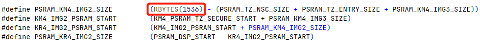
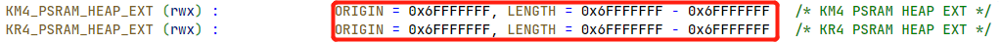

How to Modify Memory Layout
------------------------------------------------------
The following memory size can be modified.

- Bootloader

- BD_RAM

- BD_PSRAM

- Heap

Modifying Bootloader Size
~~~~~~~~~~~~~~~~~~~~~~~~~~~~~~~~~~~~~~~~~~~~~~~~~~
If you need to enlarge the size of `KM4_BOOT_RAM_S`, the modified `KM4_BOOT_RAM_S` size should be 4KB aligned because the MPC protection is protected in unit 4KB.

Follow the steps to modify the size of Bootloader:

1. Modify the :guilabel:`CONFIG Link Option` in menuconfig to choose whether to place the Bootloader (IMG1) on FLASH or SRAM. When SRAM is selected, the size of `KM4_BOOTLOADER_RAM_S` is 24K; when FLASH is selected, the size of `KM4_BOOTLOADER_RAM_S` is 4K.

   .. figure:: ../figures/modify_bootloader_size_step1.png
      :scale: 90%
      :align: center

2. By modifying `KM4_IMG1_SIZE` in ``{SDK}\amebalite_gcc_project\amebalite_layout.ld``, users can change the size of the `KM4_BOOTLOADER_RAM_S`.

   .. figure:: ../figures/modify_bootloader_size_step2.png
      :scale: 90%
      :align: center

3. Re-build the project to generate the Bootloader.

4. Modify the end address of km4_boot_all.bin if Bootloader is too large, and download the new Bootloader.

   .. figure:: ../figures/modify_bootloader_size_step4.png
      :scale: 90%
      :align: center

After that, Boot ROM will load the new Bootloader if the version of new Bootloader is bigger.

Modifying BD_RAM Size
~~~~~~~~~~~~~~~~~~~~~~~~~~~~~~~~~~~~~~~~~~
Follow the steps to modify the size of KM4 BD RAM:

1. If users want to modify the KM4 BD RAM size, first modify the running position of IMG2 in menuconfig. Any option with SRAM is acceptable. Then modify `RAM_KM4_IMG2_SIZE` or `RAM_KR4_IMG2_SIZE` in ``{SDK}\amebalite_gcc_project\amebalite_layout.ld`` to change the end address of `KM4_BD_RAM`.

   .. figure:: ../figures/modify_bd_ram_step1_1.png
      :scale: 90%
      :align: center

   .. figure:: ../figures/modify_bd_ram_step1_2.png
      :scale: 90%
      :align: center

2. Re-build and download the new Bootloader and IMG2 OTA2 as described in Section :ref:`flash_layout_app_ota1` Step :ref:`2 <flash_layout_app_ota1_step2>` ~ :ref:`3 <flash_layout_app_ota1_step3>`.

Modifying BD_PSRAM Size
~~~~~~~~~~~~~~~~~~~~~~~~~~~~~~~~~~~~~~~~~~~~~~
If the user wants to modify the KM4 BD_PSRAM size, please modify the running position of IMG2 in menuconfig first. Any option with PSRAM is acceptable. Then modify `PSRAM_KM4_IMG2_SIZE` in ``{SDK}\amebalite_gcc_project\amebalite_layout.ld`` to change the end address of `KM4_BD_PSRAM`.

Extending Heap Size
~~~~~~~~~~~~~~~~~~~~~~~~~~~~~~~~~~~~~~
The heap size consists of multi-blocks and is passed to the operating system by the :func:`os_heap_init` function in ``{SDK}\component\os\freerto\freertos_heap5_config.c``. By default, `PSRAM_HEAP1_START` is invalid address and `PSRAM_HEAP1_SIZE` is 0.

If the heap of KM4 is not enough, define Heap Start and Heap Size for some unused areas in :file:`amebalite_layout.ld`, and then use the :func:`os_heap_add` function to add the area to the heap array. The address shall be a valid value in PSRAM, then re-build and download the new image to let KM4 use the extended heap.

.. code-block:: c

   bool os_heap_add(u8 *start_addr, size_t heap_size);

.. note::
   The symbols defined in linker script (:file:`amebalite_layout.ld`) need to be declared in :file:`ameba_boot.h` before they can be used.

If the heap of KR4 is not enough, the modification method is similar.

