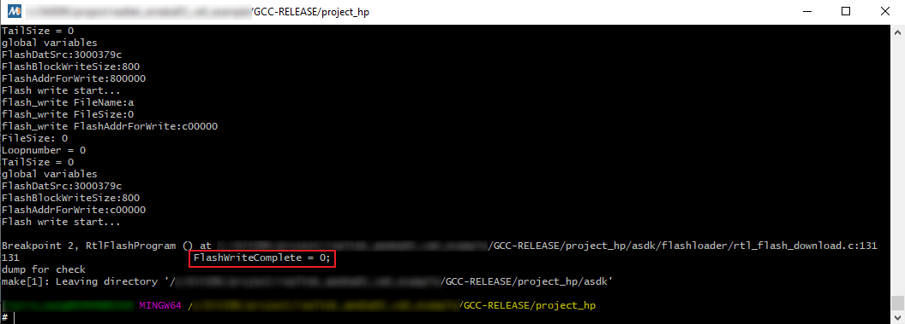
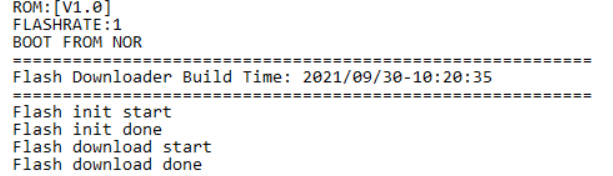
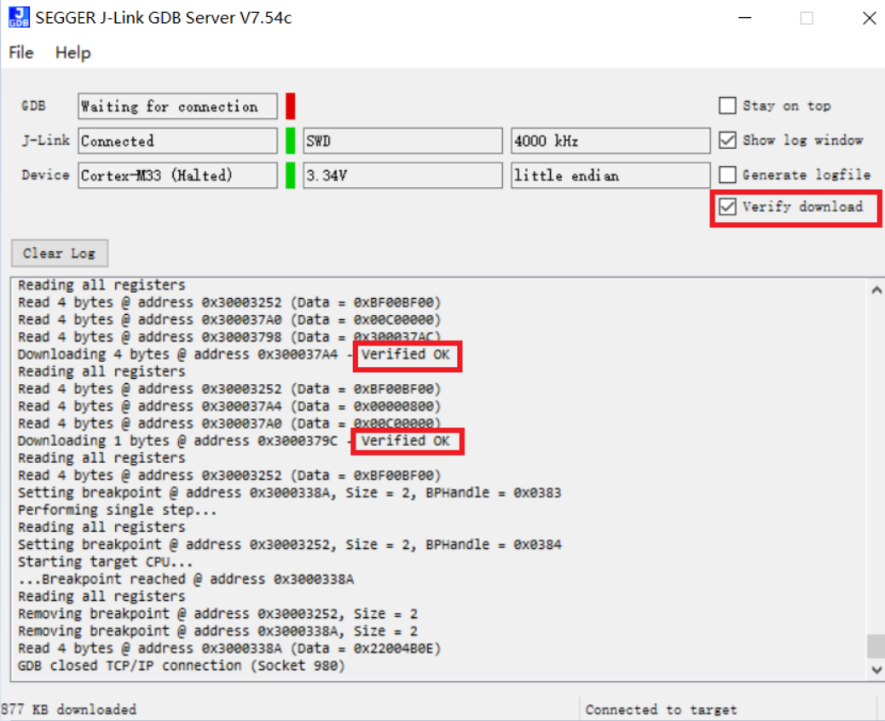

.. _build_environment:

Introduction
------------------------
This chapter illustrates how to build Realtek's SDK under GCC environment. It focuses on both Windows platform and Linux distribution. The build and download procedures are quite similar between Windows and Linux operating systems.

- For Windows, Windows 10 64-bit is used as a platform.

- For Linux server, Ubuntu 16.04 64-bit is used as a platform.

Preparing GCC Environment
--------------------------------------------------
.. _windows_gcc_environment:

Windows
~~~~~~~~~~~~~~
For Windows, use MSYS2 and MinGW as the GCC environment.

- MSYS2 is a collection of tools and libraries providing an easy-to-use environment for building, installing, and running native Windows software.

- MinGW is an advancement of the original mingw.org project. It is created to support the GCC compiler on Windows system.

The steps to prepare GCC environment are as follows:

1. Download MSYS2 from its official website https://www.msys2.org.

2. Run the installer. MSYS2 requires 64-bit Windows 7 or newer.

.. _windows_preparing_gcc_environment_step_3:

3. Enter your desired ``Installation Folder`` (ASCII, no accents, spaces nor symlinks, short path)

4. When done, tick :guilabel:`Run MSYS2 now`.

   .. figure:: ../figures/windows_gcc_msy32_installation.svg
      :scale: 130%
      :align: center

5. Update the package database and base packages with:

   .. code::

      pacman -Syu

   When ``Proceed with installation? [Y/n]`` is displayed, type ``Y`` and continue until the package installation is done.

   .. figure:: ../figures/proceed_with_installation.svg
      :scale: 120%
      :align: center

   .. caution::
      After installation of MSYS2, there will be four start modes:

      - MSYS2 MinGW 32-bit
   
      - MSYS2 MinGW 64-bit
   
      - MSYS2 MinGW UCRT 64-bit
   
      - MSYS2 MSYS

      Because the toolchain release will base on 64-bit MinGW, choose :guilabel:`MSYS2 MinGW 64-bit` when starting the MinGW terminal.

6. Run :guilabel:`MSYS2 MinGW 64-bit` from ``Start`` menu. Update the rest of the base packages with:

   .. code::

      pacman -Syu

   When ``Proceed with installation? [Y/n]`` is displayed, type ``Y`` and continue until the package installation is done.

   .. figure:: ../figures/proceed_with_installation_y.png
      :scale: 90%
      :align: center

7. Install the necessary software packages with the commands below in order:

   .. code::

      pacman –S make
      pacman –S unzip
      pacman –S gcc
      pacman –S python
      pacman –S ncurses-devel
      pacman –S openssl-devel
      pacman -S mingw-w64-x86_64-gcc-libs

   When ``Proceed with installation? [Y/n]`` is displayed, type ``Y`` and continue until each software package installation is done.

8. Remove the file path length limit by editing the registry to allow the file paths longer than 260 characters.

   a. Press :kbd:`Win+R` keys to open the :guilabel:`Run` dialog box, then type ``regedit`` and press :guilabel:`Enter` to open the ``Registry Editor``.

   b. Navigate to the registry key: ``Computer\HKEY_LOCAL_MACHINE\SYSTEM\CurrentControlSet\Control\FileSystem``.

   c. Search and check if the :guilabel:`LongPathsEnabled` item exists. If not, continue to Step :ref:`d <windows_preparing_gcc_environment_step_8_d>`; otherwise, go to Step :ref:`e <windows_preparing_gcc_environment_step_8_e>`.

   .. _windows_preparing_gcc_environment_step_8_d:

   d. Right-click on an empty space in the right pane, then select :menuselection:`New > DWORD (32-bit) Value`, and name it ``LongPathsEnabled``.

   .. _windows_preparing_gcc_environment_step_8_e:

   e. Double-click on :guilabel:`LongPathsEnabled` and set its value to 1, then click :guilabel:`OK` to save.

Linux
~~~~~~~~~~
On Linux, 32-bit Linux is not supported because of the toolchain.

The packages listed below should be installed for the GCC environment:

- ``gcc``

- ``libncurses5``

- ``bash``

- ``make``

- ``libssl-dev``

- ``binutils``

- ``python3``

Some of the packages above may have been pre-installed in your operating system. 
You can either use package manager or type the corresponding version command on terminal to check whether these packages have already existed. If not, make them installed.

- ``$ls -l /bin/sh``

   Starting from Ubuntu 6.10, dash is used by default instead of bash. You can check by using ``$ls -l /bin/sh``  command to check whether the system shell is bash or dash.

   - (Optional) If the system shell is dash, use ``$sudo dpkg-reconfigure dash``  command to switch from dash to bash.

   - If the system shell is bash, continue to do the subsequent operations.

   .. figure:: ../figures/switching_from_dash_to_bash.png
      :scale: 85%
      :align: center

- ``$make -v``

   .. figure:: ../figures/make_v.png
      :scale: 85%
      :align: center

- ``$sudo apt-get install libssl-dev``

   .. figure:: ../figures/libssl_dev.png
      :scale: 85%
      :align: center

- ``binutils``

   Use ``ld -v``  command to check if binutils has been installed. If not, the following error may occur.

   .. figure:: ../figures/binutils.png
      :scale: 70%
      :align: center

Troubleshooting
~~~~~~~~~~~~~~~~
- MSYS2 pacman is responsible for managing and installing software, which is similar to apt-get in ubuntu. When ``bash:XXX:command not found`` appears, you can try instruction ``pacman -S <package_name>`` to install.

- For detailed information of one package, try ``pacman -Si <package_name>``.

- If system head files are not found when building tool, ``No such file or directory`` error will show up. You can try ``pacman -Fy <FILE_NAME>`` to check which package is lost, and install the lost package. If too many packages are lost, look for detailed information about the packages to decide which to install.

- For multi-version python host, command ``update-alternatives --install /usr/bin/python python /usr/bin/python3.x 1`` can be used to select python of specific version 3.x, where x represents a desired version number.

- If the error ``command 'python' not found`` appears during compilation, type command ``ln -s /usr/bin/python3 /usr/bin/python`` first to make sure that python3 is used when running python.

Installing Toolchain
----------------------
Windows
~~~~~~~~~
This section introduces the steps to prepare the toolchain environment.

1. Acquire the zip files of |CHIP_NAME| toolchain from Realtek.

.. _windows_installing_toolchain_step_2:

2. Create a new directory ``rtk-toolchain`` under the path ``{MSYS2_path}\opt``.

   For example, if your MSYS2 installation path is as set in Section :ref:`windows_gcc_environment` :ref:`Step 3 <windows_preparing_gcc_environment_step_3>`, the ``rtk-toolchain`` should be in ``C:\msys64\opt``.

   .. figure:: ../figures/windows_rtk_toolchain_1.png
      :scale: 100%
      :align: center

3. Unzip :file:`asdk-10.3.x-mingw32-newlib-build-xxxx.zip` and :file:`vsdk-10.3.x-mingw32-newlib-build-xxxx.zip`, and place the toolchain folders (``asdk-10.3.x`` and ``vsdk-10.3.x``) to the folder ``rtk-toolchain`` created in :ref:`Step 2 <windows_installing_toolchain_step_2>`.

   .. figure:: ../figures/windows_rtk_toolchain_2.png
      :scale: 80%
      :align: center

.. note::
      - The unzip folders should stay the same with the figure above and do NOT change them, otherwise you need to modify the toolchain directory in makefile to customize the path.

      - If an error of the toolchain, just like the log ``Error: No Toolchain in /opt/rtk-toolchain/vsdk-10.3.1/mingw32/newlib`` appears when building the project, find out if your toolchain files directory are not the same with the directory in the log. Place the toolchain files correctly and try again.

Linux
~~~~~~~~~~
This section introduces the steps to prepare the toolchain environment.

1. Acquire the zip files of |CHIP_NAME| toolchain from Realtek.

2. Create a new directory ``rtk-toolchain`` under ``/opt``.

   .. figure:: ../figures/linux_rtk_toolchain_1.png
      :scale: 80%
      :align: center

3. Unzip :file:`asdk-10.3.x-linux-newlib-build-xxxx.tar.bz2`  and :file:`vsdk-10.x.y-linux-newlib-build-xxxx.tar.bz2`  to ``/opt/rtk-toolchain`` , then you can get the directory below:

   .. figure:: ../figures/linux_rtk_toolchain_2.png
      :scale: 75%
      :align: center

.. note::
   The unzip folders should stay the same with the figure above and do NOT change them, otherwise you need to modify the toolchain directory in makefile to customize the path.

.. _configuring_sdk:

Configuring SDK
------------------------------

.. _building_code:

Building Code
--------------------------
This section illustrates how to build SDK for both Windows and Linux.

.. table:: GCC project directory
   :width: 100%
   :widths: auto

   +-------------+--------------------------------------------+
   | GCC project | Directory                                  |
   +=============+============================================+
   | KM4         | {SDK}\\amebalite_gcc_project\\project_km4  |
   +-------------+--------------------------------------------+
   | KR4         | {SDK}\\amebalite_gcc_project\\project_kr4  |
   +-------------+--------------------------------------------+

.. note::
   Replace the ``{SDK}`` with your own SDK directory.

There are two ways to build the SDK, you can choose either of them.

Building One by One
~~~~~~~~~~~~~~~~~~~~~~~~~~~~~~~~

Building Together
~~~~~~~~~~~~~~~~~~~~~~~~~~~~

.. _setting_debugger:

Setting Debugger
--------------------------------
J-Link
~~~~~~~~~~~~
The |CHIP_NAME| supports J-Link debugger. Before setting J-Link debugger, you need to do some hardware configuration and download images to the |CHIP_NAME| device first.

1. Connect J-Link to the SWD of |CHIP_NAME|.

   a. Refer to the following figure to connect SWCLK pin of J-Link to SWD CLK pin of |CHIP_NAME|, and SWDIO pin of J-Link to SWD DATA pin of |CHIP_NAME|.

   b. Connect the |CHIP_NAME| device to PC after finishing these configurations.

   .. figure:: ../figures/connecting_jlink_to_swd.svg
      :scale: 130%
      :align: center

      Wiring diagram of connecting J-Link to SWD

   .. note::
      The J-Link version must be v9 or higher. If Virtual Machine (VM) is used as your platform, make sure that the USB connection setting between VM host and client is correct, so that the VM host can detect the device.

2. Download images to the |CHIP_NAME| device via ImageTool.

   ImageTool is a software tool provided by Realtek. For more information, refer to :ref:`Image Tool <image_tool>`.

Windows
^^^^^^^^^^^^^^
Besides the hardware configuration, J-Link GDB server is also required to install.

For Windows, click https://www.segger.com/downloads/jlink and download the software in ``J-Link Software and Documentation Pack``, then install it correctly.

.. note::
   The version of J-Link GDB server below is just an example, you can select the latest version to download.

KM4 Setup
******************
1. Execute the :file:`km4_jlink_combination.bat`

   Double-click the :file:`km4_jlink_combination.bat` under ``{SDK}\amebalite_gcc_project\utils\jlink_script``.
   You may have to change the path of :file:`JLinkGDBServer.exe` and :file:`JLink.exe` in the ``km4_jlink_combination.bat`` script according to your own settings.

   The started J-Link GDB server looks like below. This window should NOT be closed if you want to download the image or enter debug mode.

   .. figure:: ../figures/windows_km4_jlink_gdb_server_connection.png
      :scale: 90%
      :align: center

      KM4 J-Link GDB server connection under Windows

   .. caution:: Keep this window active to download the images to target.

2. Setup J-Link for KM4

   a. Change the working directory to project_km4.

   b. On the MSYS2 terminal, type ``$make setup GDB_SERVER=jlink`` command before selecting J-Link debugger.

      .. figure:: ../figures/windows_km4_jlink_setup.png
         :scale: 90%
         :align: center

         KM4 J-Link setup under Windows

KR4 Setup
******************
1. Execute the :file:`kr4_jlink_combination.bat`

   Double-click the :file:`kr4_jlink_combination.bat` under ``{SDK}\amebalite_gcc_project\utils\jlink_script``, the same as executing the :file:`km4_jlink_combination.bat`.

   The started J-Link GDB server looks like below. This window should NOT be closed if you want to download the image or enter debug mode.
   Because KM4 will download all the images, you don't need to connect J-Link to KR4 when downloading images. J-Link can connect to KR4 when debugging.

   .. figure:: ../figures/windows_kr4_jlink_gdb_server_connection.png
      :scale: 90%
      :align: center

      KR4 J-Link GDB server connection under Windows

2. Setup J-Link for KR4

   a. Change working directory to project_kr4.

   b. On the Cygwin terminal, type ``$make setup GDB_SERVER=jlink`` command to select J-Link debugger.

   .. figure:: ../figures/windows_kr4_jlink_setup.png
      :scale: 90%
      :align: center

      KR4 J-Link setup under Windows

Linux
^^^^^^^^^^
For J-Link GDB server, click https://www.segger.com/downloads/jlink and download the software in ``J-Link Software and Documentation Pack``. It is suggested to use Debian package manager to install the Debian version.

Open a new terminal and type the following command to install GDB server.

.. code::

   $dpkg –i jlink_6.0.7_x86_64.deb

After the installation of the software pack, there is a tool named ``JLinkGDBServer`` under the J-Link directory. Take Ubuntu 18.04 as an example, the JLinkGDBServer can be found at ``/opt/SEGGER/JLink`` .

.. note::
   The version of J-Link GDB server below is just an example, you can select the latest version to download.

Downloading Image to Flash
-----------------------------
There are two ways to download image to flash:

1. Image Tool, a software provided by Realtek (recommended). For more information, refer to :ref:`Image Tool <image_tool>`.

2. GDB Server, mainly used for GDB debug user case.

This section illustrates the second method to download images to Flash.

To download software into Device Board, make sure the steps mentioned in section :ref:`building_code` are done, and then type ``$make flash`` command on MSYS2 (Windows) or terminal (Linux).

Images are downloaded only under KM4 by this command. This command downloads the software into Flash and it will take several seconds to finish, as shown below.

   Downloading Image to Flash

   Download codes success log

To check whether the image is downloaded correctly into memory, you can select  :guilabel:`verify download` before downloading images, and during image download process, ``verified OK`` log will be shown.

   Verify download

After download is successful, press the :guilabel:`Reset` button and you will see that the device boots with the new image.

.. note::
   - The command is only supported to use in KM4 project, and ::file:`km4_boot_all.bin` and :file:`kr4_km4_app.bin` can be downloaded to Flash.

   - For :file:`dsp_all.bin`, user needs to download it with Image Tool. For more information, refer to :ref:`Image Tool <image_tool>`.

.. _entering_debug_mode:

Entering Debug Mode
--------------------------------------
GDB Server
~~~~~~~~~~~~~~~~~~~~
To enter GDB debugger mode, follow the steps below:

1. Make sure that the steps mentioned in Sections :ref:`Configuring_sdk` to :ref:`setting_debugger` are finished, then reset the device.

2. Change directory to target project which can be project_km4 or project_kr4, and type ``$make debug`` command on MSYS2 (Windows) or terminal (Linux).

J-Link
~~~~~~~~~~~~
Steps
^^^^^^^^^^
1. Press :kbd:`Win+R` on your keyboard. Hold down the Windows key on your keyboard, and press the :guilabel:`R` button. This will open the ``Run`` tool in a new pop-up window. Alternatively, you can find and click :guilabel:`Run`  on the Start menu.

2. Type ``cmd`` in the Run window. This shortcut will open the Command Prompt terminal.

3. Click :guilabel:`OK` in the Run window. This will run your shortcut command, and open the ``Command Prompt`` terminal in a new window.

4. Copy the J-Link script commad below for specific target:

   - For KM4:
   
     .. code-block::
   
        "{Jlink_path}\JLink.exe" -device Cortex-M33 -if SWD -speed 4000 -autoconnect 1
   
   - For KR4:
   
     First:
   
     .. code-block::
   
        "{Jlink_path}\JLink.exe" -device Cortex-M33 -if SWD -speed 4000 -autoconnect 1 -JLinkScriptFile {script_path}\KM4_SEL.JLinkScript
   
     Then:
   
     .. code-block::
   
        "{Jlink_path}\JLink.exe" -device RV32 -if cjtag -speed 4000 -JTAGConf -1,-1 -autoconnect 1
   
   - From KR4 to KM4:
   
     First:
   
     .. code-block::
   
        "{Jlink_path}\JLink.exe" -device RV32 -if cjtag -speed 4000 -JTAGConf -1,-1 -JLinkScriptFile {script_path}\KR4_DMI.JLinkScript
   
     Then:
   
     .. code-block::
   
        "{Jlink_path}\JLink.exe" -device Cortex-M33 -if SWD -speed 4000 -autoconnect 1
   
.. note::
   The J-Link connection command path mentioned above are:

   - `{Jlink_path}`: the path your Segger J-Link installed, default is ``C:\Program Files (x86)\SEGGER\JLink``.

   - `{script_path}`: ``{SDK}\amebalite_gcc_project\utils\jlink_script``

Commands
^^^^^^^^^^^^^^^^
The following commands are often used when the program is stuck. All commands are accepted case insensitive.

.. table:: Often used commands
   :width: 100%
   :widths: 15 15 25 45

   +----------------+-----------------+--------------------------------------+-------------------------------------------------+
   | Command (long) | Command (short) | Syntax                               | Explanation                                     |
   +================+=================+======================================+=================================================+
   | Halt           | H               |                                      | Halt CPU                                        |
   +----------------+-----------------+--------------------------------------+-------------------------------------------------+
   | Go             | G               |                                      | Start CPU if halted                             |
   +----------------+-----------------+--------------------------------------+-------------------------------------------------+
   | Mem            |                 | Mem <Addr> <NumBytes>                | Read memory and show corresponding ASCII values |
   +----------------+-----------------+--------------------------------------+-------------------------------------------------+
   | SaveBin        |                 | SaveBin <FileName> <Addr> <NumBytes> | Save target memory range into binary file       |
   +----------------+-----------------+--------------------------------------+-------------------------------------------------+
   | Exit           |                 |                                      | Close J-Link connection and quit                |
   +----------------+-----------------+--------------------------------------+-------------------------------------------------+

For more information, visit https://wiki.segger.com/J-Link_Commander.

.. note::

   - You can type ``H`` and ``G`` several times and record the PC, then look for the PC in which function in asm file. This function might be where you get stuck.

   - You can also use ``mem`` to dump some address after ``sp``, from these addresses you can find the function call stack.

Command Lists
---------------
The commands mentioned above are listed in the following table.

.. table:: Command lists
   :width: 100%
   :widths: 10 30 60

   +-------+------------------------------------+---------------------------------------------+
   | Usage | Command                            | Description                                 |
   +=======+====================================+=============================================+
   | all   | ``$make all``                      | Compile the project to generate ram_all.bin |
   +-------+------------------------------------+---------------------------------------------+
   | setup | ``$make setup GDB_SERVER= jlink``  | Select GDB_SERVER                           |
   +-------+------------------------------------+---------------------------------------------+
   | flash | ``$make flash``                    | Download ram_all.bin to Flash               |
   +-------+------------------------------------+---------------------------------------------+
   | clean | ``$make clean``                    | Remove compile file (.bin, .o, …)           |
   +-------+------------------------------------+---------------------------------------------+
   | debug | ``$make debug``                    | Enter debug mode                            |
   +-------+------------------------------------+---------------------------------------------+

GDB Debugger Basic Usage
--------------------------
GDB, the GNU project debugger, allows you to examine the program while it executes, and it helps catch bugs.
Section :ref:`entering_debug_mode` has described how to enter GDB debugger mode, this section illustrates some basic usage of GDB commands.

For further information about GDB debugger, click https://www.gnu.org/software/gdb/.
The following table describes commonly used instructions and their functions, and specific usage can be found in ``GDB User Manual`` of website https://www.sourceware.org/gdb/documentation/.

.. table:: GDB debugger command list
   :width: 100%
   :widths: 20 10 70

   +---------------------------------+------------+---------------------------------------------------------------------------------------------------------------------------------------------------------------------------+
   | Usage                           | Command    | Description                                                                                                                                                               |
   +=================================+============+===========================================================================================================================================================================+
   | Breakpoint                      | $break     | Breakpoints are set with the break command (abbreviated b).                                                                                                               |
   |                                 |            |                                                                                                                                                                           |
   |                                 |            | The usage can be found at ``Setting Breakpoints`` section.                                                                                                                |
   +---------------------------------+------------+---------------------------------------------------------------------------------------------------------------------------------------------------------------------------+
   | Watchpoint                      | $watch     | You can use a watchpoint to stop execution whenever the value of an expression changes. The related commands include watch, rwatch, and awatch.                           |
   |                                 |            |                                                                                                                                                                           |
   |                                 |            | The usage of these commands can be found at ``Setting Watchpoints`` section.                                                                                              |
   |                                 |            |                                                                                                                                                                           |
   |                                 |            | .. note::                                                                                                                                                                 |
   |                                 |            |    Keep the range of watchpoints less than 20 bytes.                                                                                                                      |
   +---------------------------------+------------+---------------------------------------------------------------------------------------------------------------------------------------------------------------------------+
   | Print breakpoints & watchpoints | $info      | To print a table of all breakpoints, watchpoints set and not deleted, use the info command. You can simply type info to know its usage.                                   |
   +---------------------------------+------------+---------------------------------------------------------------------------------------------------------------------------------------------------------------------------+
   | Delete breakpoints              | $delete    | To eliminate the breakpoints, use the delete command (abbreviated d).                                                                                                     |
   |                                 |            |                                                                                                                                                                           |
   |                                 |            | The usage can be found at ``Deleting Breakpoints`` section.                                                                                                               |
   +---------------------------------+------------+---------------------------------------------------------------------------------------------------------------------------------------------------------------------------+
   | Continue                        | $continue  | To resume program execution, use the continue command (abbreviated c).                                                                                                    |
   |                                 |            |                                                                                                                                                                           |
   |                                 |            | The usage can be found at ``Continue and Stepping`` section.                                                                                                              |
   +---------------------------------+------------+---------------------------------------------------------------------------------------------------------------------------------------------------------------------------+
   | Step                            | $step      | To step into a function call, use the step command (abbreviated s). It will continue running your program until the control reaches a different source line.              |
   |                                 |            |                                                                                                                                                                           |
   |                                 |            | The usage can be found at ``Continue and Stepping`` section.                                                                                                              |
   +---------------------------------+------------+---------------------------------------------------------------------------------------------------------------------------------------------------------------------------+
   | Next                            | $next      | To step through the program, use the next command (abbreviated n). The execution will stop when the control reaches a different line of code at the original stack level. |
   |                                 |            |                                                                                                                                                                           |
   |                                 |            | The usage can be found at ``Continue and Stepping`` section.                                                                                                              |
   +---------------------------------+------------+---------------------------------------------------------------------------------------------------------------------------------------------------------------------------+
   | Quit                            | $quit      | To exit GDB debugger, use the quit command (abbreviated q), or type an end-of-file character (usually Ctrl-d). The usage can be found at ``Quitting GDB`` section.        |
   +---------------------------------+------------+---------------------------------------------------------------------------------------------------------------------------------------------------------------------------+
   | Backtrace                       | $backtrace | A backtrace is a summary of how your program got where it is. You can use backtrace command (abbreviated bt) to print a backtrace of the entire stack.                    |
   |                                 |            |                                                                                                                                                                           |
   |                                 |            | The usage can be found a ``Backtraces`` section.                                                                                                                          |
   +---------------------------------+------------+---------------------------------------------------------------------------------------------------------------------------------------------------------------------------+
   | Print source lines              | $list      | To print lines from a source file, use the list command (abbreviated l).                                                                                                  |
   |                                 |            |                                                                                                                                                                           |
   |                                 |            | The usage can be found at ``Printing Source Lines`` section.                                                                                                              |
   +---------------------------------+------------+---------------------------------------------------------------------------------------------------------------------------------------------------------------------------+
   | Examine data                    | $print     | To examine data in your program, you can use print command (abbreviated p). It evaluates and prints the value of an expression.                                           |
   |                                 |            |                                                                                                                                                                           |
   |                                 |            | The usage can be found at ``Examining Data`` section.                                                                                                                     |
   +---------------------------------+------------+---------------------------------------------------------------------------------------------------------------------------------------------------------------------------+

