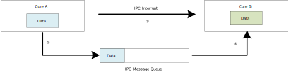

.. _ipc:

.. only:: RTL8726EA

   Introduction
   ------------------------------------------------------
   There are multi-CPUs named KR4, KM4 and DSP integrated into |CHIP_NAME|. The inter-processor communication (IPC) hardware is designed to make these CPUs communicate with each other. Also, a shared SRAM is used to transmit information to each other. The block diagram is shown in the following figure.

   .. figure:: ../figures/ipc_block_diagram_8726EA.svg
      :scale: 130%
      :align: center

      IPC block diagram

.. only:: RTL8726EA

   General Principle
   ----------------------------------------------------------------
   There are six directions for three cores to communicate with each other: KR4 ←→ KM4, KM4 ←→ DSP, KR4 ←→ DSP, and 16 channels for each direction. All the channels are processed independently, which means that one core can send different information to another core through different channels at any time, the channels will not affect each other.

   Each channel has one transmit side and one receive side, the transmit side and the receive side of the same channel is a pair. For example, KR4 sends an IPC to KM4 through channel 4, the transmit side is KR4 channel 4, and the receive side is KM4 channel 4; and information is sent from KR4 channel 4 to KM4 channel 4.

   .. figure:: ../figures/ipc_schematic_diagram_8726EA.svg
      :scale: 130%
      :align: center

      IPC schematic diagram

How to Use IPC
----------------------------
For example, KR4 sends an IPC to KM4 through channel 4.

1. Select IPC channel.

   Uncomment the corresponding channel in :file:`ameba_ipc.h`  and add some description as below. This macro is used in step :ref:`3 <ipc_usage_procedure_step_3>`. In this case, uncomment the macro ``IPC_R2M_Channel4`` which means KR4 to KM4 channel 4.

   .. code-block:: c
      :emphasize-lines: 9

      /** @defgroup IPC_KR4_Tx_Channel
      * @{
      */
      #define IPC_R2M_TICKLESS_INDICATION    0  /*!< KR4 --> KM4 Tickless indicate */
      #define IPC_R2M_WAKE_AP                1  /*!< KR4 --> KM4 Wakeup*/
      #define IPC_R2M_FLASHPG_REQ            2  /*!< KR4 --> KM4 Flash Program REQUEST*/
      #define IPC_R2M_WIFI_FW_INFO           2  /*!< KR4 --> KM4 FW Info*/
      //#define IPC_R2M_Channel3             3
      #define IPC_R2M_Channel4               4  /*Add your Description Here*/
      //#define IPC_R2M_Channel5             5
      #define IPC_R2M_WIFI_TRX_TRAN          6  /*!< NP --> AP WIFI Message Exchange */
      #define IPC_R2M_WIFI_API_TRAN          7  /*!< NP --> AP API WIFI Message Exchange */
      /**
      * @}
      */

2. Register IRQ handler function of the selected channel.

   Add struct ``IPC_INIT_TABLE`` into your code and put this struct in IPC table section by add ``IPC_TABLE_DATA_SECTION``. This struct specifies the direction, channel, mode and IRQ function of IPC as below.

   :<USER_MSG_TYPE>: This parameter can be

      | **IPC_USER_DATA**: The contents of this IPC is data.
      | **IPC_USER_POINT**: The contents of this IPC is pointer which points to address of actual data.

   :<RxFunc>: The callback function that CPU executes after receiving IPC.

   :<RxIrqData>: The parameters that are passed into the rx callback function.

   :<TxFunc>: The callback function that CPU executes after sending IPC.

   :<TxIrqData>: The parameters that are passed into the tx callback function

   :<IPC_Direction>: This parameter can be

      | **IPC_KR4_TO_KM4**: IPC is sent from KR4 to KM4.
      | **IPC_KM4_TO_KR4**: IPC is sent from KM4 to KR4.
      | **IPC_KR4_TO_DSP**: IPC is sent from KR4 to DSP.
      | **IPC_KM4_TO_DSP**: IPC is sent from KM4 to DSP.
      | **IPC_DSP_TO_KR4**: IPC is sent from DSP to KR4.
      | **IPC_DSP_TO_KM4**: IPC is sent from DSP to KM4.

   :<IPC_R2M_Channel4>: IPC channel used, this macro is selected in the previous step.

   The SDK will automatically enable the IPC interrupt and register the corresponding IRQ handler and data for the channel. In this example, KM4 will enter IRQ_function_int after KR4 sends IPC through channel 4.

   .. code-block:: c

      void IRQ_function_int(void)
      {
      /* Add your code here*/
      }

      IPC_TABLE_DATA_SECTION
      const IPC_INIT_TABLE ipc_R2M_CH4_table[] = {
      {IPC_USER_DATA, IRQ_function_int, (VOID *) NULL, IPC_TXHandler, (VOID *)NULL, IPC_KR4_TO_KM4, IPC_R2M_Channel4},
      }

.. _ipc_usage_procedure_step_3:

3. Send IPC request.

   When KR4 sends an IPC request to KM4 through channel 4, it should call :func:`ipc_send_message()`  and specify the channel number and message. If no message is needed, just input ``NULL`` for the third parameter of :func:`ipc_send_message()` .

   .. code-block:: c

      IPC_MSG_STRUCT ipc_msg;
      /*init ipc_msg here*/
      ipc_msg.msg = (u32)&tmp_np_log_ buf;
      /*init ipc_msg end*/
      ipc_send_message(IPC_KR4_TO_KM4, IPC_R2M_Channel4, &ipc_msg);

4. Get IPC message if needed.

   After receiving IPC from KR4 channel 4, KM4 will enter IPC interrupt handler and the corresponding receive IRQ handler will be executed, call :func:`ipc_get_message()` to get the message if needed.

   .. code-block:: c

      PIPC_MSG_STRUCT ipc_msg_temp = (PIPC_MSG_STRUCT)ipc_get_message(IPC_KR4_TO_KM4, IPC_R2M_Channel4);

.. note:: Several channels are already used by Realtek, you can use the remaining channels.

Troubleshooting
-----------------
If ``Channel Conflict for Channel xx!`` log shows up, it means two IRQ functions are registered in the same channel. For example, if IRQFunc1 and IRQFunc2 are both registered in KM4 for KR4 to KM4 channel 1, the log will show up as below.

.. code-block:: c

   14:23:03.905 [MODULE_IPC-LEVEL_ERROR]: Channel Conflict for Channel 25!

IPC Application
------------------------------
Introduction
~~~~~~~~~~~~~~
IPC queue is designed for cores communication. Define an IPC queue between every two cores, and the two cores can send and receive messages through this IPC queue.

IPC Message Queue:

1. Packets send data from Core A to Core B through IPC message queue.

2. Sender copy a complete packet into queue.

3. Receiver copy packet with custom size from queue.

For receiver, IPC interrupt is necessary.

   IPC Message Queue block diagram

How to Use IPC Application
~~~~~~~~~~~~~~~~~~~~~~~~~~~~~
Before use IPC application, users should enable this function and initial it in each core.

- For KM4: :menuselection:`make menuconfig > MENUCONFIG FOR KM4 CONFIG > CONFIG IPC Message Queue > Enable IPC Message Queue`

- For KR4: :menuselection:`make menuconfig > MENUCONFIG FOR KR4 CONFIG > CONFIG IPC Message Queue > Enable IPC Message Queue`

- For DSP: Open project_dsp with Xplorer, then click :menuselection:`project_dsp > Build Properties > Symbols`, and set :guilabel:`CONFIG_RPC_EN` to 1

The procedure will call :func:`ipc_app_init()` in :func:`main()` to initial IPC application when IPC application is enabled. The initialization include IPC queue initialization.

How to Use IPC Queue
^^^^^^^^^^^^^^^^^^^^^^
For example, communication between KM4 and KR4 through ``IPC_ID_KR4_TO_KM4``.

1. ``IPC_ID_KR4_TO_KM4`` definition in enumeration ``IPC_ID`` in :file:`ipc.h` is shown below. This definition is used in :ref:`Stap 2 <how_to_use_ipc_queue_step_2>`.

   .. code-block:: c
      :emphasize-lines: 2

      typedef enum {
         IPC_ID_KR4_TO_KM4 = 0,
         IPC_ID_KM4_TO_KR4 = 1,
         IPC_ID_KR4_TO_DSP = 2,
         IPC_ID_DSP_TO_KR4 = 3,
         IPC_ID_DSP_TO_KM4 = 4,
         IPC_ID_KM4_TO_DSP = 5,
         /*14-19 used for RPC*/
         IPC_ID_NUM        = 20
      } IPC_ID;

.. _how_to_use_ipc_queue_step_2:

2. When KR4 sends a message to KM4 through ``IPC_ID_KR4_TO_KM4``, it should call :func:`IPC_Message_Queue_Send()` and specify the queue ID and message.

   .. code-block:: c

      int32_t ret =  IPC_Message_Queue_Send(IPC_ID_KR4_TO_KM4, buf, IMQ_BUF_SIZE, WAIT_FOREVER);

3. When KM4 receives a message from KR4 through IPC_ID_KR4_TO_KM4, it should call :func:`IPC_Message_Queue_Recv()` and the queue ID and a buffer to receive message.

   .. code-block:: c

      size = IMQ_BUF_SIZE;
      int32_t ret =  IPC_Message_Queue_Recv(IPC_ID_KR4_TO_KM4, buf, &size);

.. note::
      - The memory regions are only defined in AP core, the maximum data region is 40kB.

      - Users can use default test demo to verify IPC queue by command ``test_ipc_message`` in console both in KR4 and KM4.

