.. _ota_firmware_update:

Introduction
------------------------
Over-the-air (OTA) programming provides a methodology of updating device firmware remotely via TCP/IP network.
For OTA via TCP/IP network, the |CHIP_NAME| provides solutions to implement OTA firmware upgrade from local server or cloud.

.. _image_slot:

Image Slot
~~~~~~~~~~~~~~~~~~~~
There are two slots for all the images in the Flash layout as shown in the figure below, which named OTA1 and OTA2 respectively.
Each image can be chosen to boot from OTA1 or OTA2.

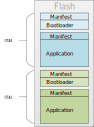

   OTA1 and OTA2 position

.. _version_number:

Version Number
~~~~~~~~~~~~~~~~~~~~~~~~~~~~
The device boot from OTA1 or OTA2 mainly depends on the version number in certificate and manifest. As shown in the figure below,
there is a 2-byte major version and 2-byte minor version in manifest and certificate.

The combination of major version and minor version is the 4-byte version number. OTA select flow checks the whole version number.

.. code-block::

   Version number = (Major version << 16) | Minor version

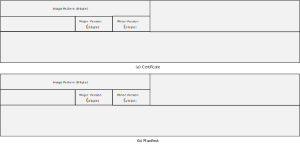

   Major and minor version

.. note::
   - For bootloader, version number can be 0 to 32767; for application, version number can be 0 to 65535.

   - For detailed layouts of manifest and certificate, refer to :ref:`Secure Boot <secure_boot>` .

As described in :ref:`Image Slot <image_slot>`, there are two slots (OTA1 and OTA2) for all the images in the Flash layout.
When reboot after OTA upgrade finished, the device would check the image to determine to boot from OTA1 or OTA2.

The general principle of the OTA scheme is checking the image pattern first and then comparing the version number of OTA1 and OTA2.

The following items must be checked for each image:

1. Check the image pattern for both OTA1 and OTA2.

   - If only one image pattern is valid, boot from the valid image.

   - If both image patterns are invalid, boot fail.

2. Compare the version number of OTA1 and OTA2.

   - If both OTA1 and OTA2 are valid and with different version numbers, the device will boot from the image with a bigger version.

   - If both OTA1 and OTA2 are valid but with the same version number, the device will boot from OTA1.

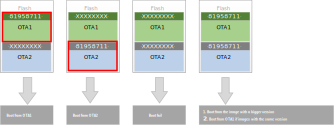

   OTA select diagram

Anti-rollback
~~~~~~~~~~~~~~~~~~~~~~~~~~
Anti-rollback is the function to prevent version rollback attack. When the anti-rollback is enabled,
the version number in certificate or manifest must not be smaller than the anti-rollback version stored in OTP.
Otherwise, this image will be regarded as invalid and the chip will not boot from invalid image. Normally,
if OTA update is security-related, user can program a bigger anti-rollback version number in OTP and update image with
a bigger major version at the same time to prevent rollback attack.

The anti-rollback flow is shown below. Once the anti-rollback is enabled, the device will compare the major version numbers
got from OTA1 and OTA2 images respectively with the anti-rollback version number in OTP. If the major version number in the image
is smaller than the anti-rollback version number, this image will be regarded as invalid.

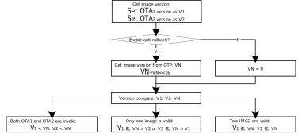

   Anti-rollback flow

Bootloader
--------------------
OTA Image
~~~~~~~~~~~~~~~~~~
The KM4 bootloader image :file:`km4_boot_all.bin` can be updated through OTA, which can be chosen to boot from OTA1 or OTA2.
The layout of KM4 bootloader image is illustrated below.

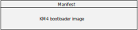

   Layout of bootloader image

OTA Selection Flow
~~~~~~~~~~~~~~~~~~~~~~~~~~~~~~
The KM4 ROM will select OTA image according to the image version number in bootloader manifest.

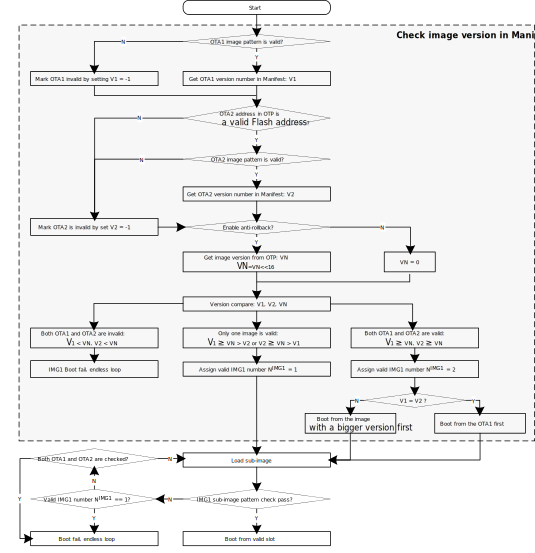

   KM4 bootloader OTA selection flow

Application
----------------------
OTA Image
~~~~~~~~~~~~~~~~~~
The application image (:file:`kr4_km4_app.bin`, including KR4, KM4 non-secure application image and KM4 secure image) can be updated through OTA,
which can be chosen to boot from OTA1 or OTA2. The layout of the whole application image is illustrated below.

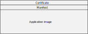

   Layout of application image

.. only:: RTL8726EA
   
   
   The |CHIP_NAME| supports DSP and there are two schemes to load DSP image. Refer to :ref:`DSP Image <dsp_image>` for details.
   

OTA Select Flow
~~~~~~~~~~~~~~~~~~~~~~~~~~~~~~
The application image OTA select flow is illustrated below.

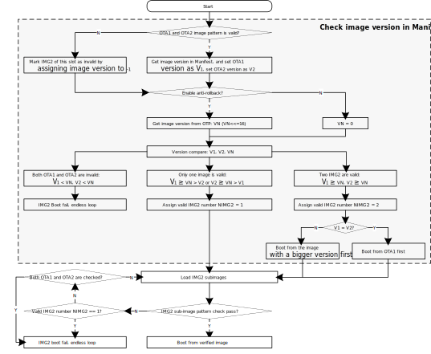

   Application image OTA select flow

.. _dsp_image :
.. only:: RTL8726EA
   
DSP Image
~~~~~~~~~~~~~~~~~~~~~~~~~~~~~~~~~~~~~~~~~~~~~~~~
The |CHIP_NAME| supports DSP and there are two schemes for users to load the DSP image.
   
DSP Image without Application Image
^^^^^^^^^^^^^^^^^^^^^^^^^^^^^^^^^^^^^^^^^^^^^^^^^^^^^^^^^^^^^^^^^^^^^^
In this scheme, there is only one slot in Flash layout called :mod:`IMG_DSP` for the DSP image.
When the DSP application is modified, users only need to re-download the DSP image called ``dsp_all.bin`` to :mod:`IMG_DSP` as shown below.
So when in device DSP-development stage, we recommend this method to develop the DSP application conveniently and efficiently.

   .. figure:: ../figures/download_dsp_image.png
      :scale: 100%
      :align: center

To choose this scheme, users can disable the configuration of ``DSP within APP image`` by the following steps:

   a. Navigate to project and open configuration menu.

      .. code-block::

         cd amebalite_gcc_project
         ./menuconfig.py
   
   b. Remove the selection :menuselection:`CONFIG OTA OPTION > DSP within APP image`.

.. note:: This scheme should be used only in device DSP-development stage.

.. _ota_dsp_image_within_application_image:

DSP Image within Application Image
^^^^^^^^^^^^^^^^^^^^^^^^^^^^^^^^^^^^^^^^^^^^^^^^^^^^^^^^^^^^^^^^^^^^
In this scheme, there are two slots in Flash layout called :mod:`IMG_APP_OTA1` and :mod:`IMG_APP_OTA2` respectively.
Since the DSP image is merged into the application image. In order to avoid issues such as DSP boot fail after the DSP image
is updated through OTA application when there is only one slot for DSP. For MP devices,
the scheme of the DSP image within application image is recommended, which DSP can choose to boot from OTA1 or OTA2.

After choosing this scheme, there is only one application image called ``kr4_km4_dsp_app.bin`` needed to be downloaded as shown below.

   .. figure:: ../figures/download_dsp_application_image.png
      :scale: 90%
      :align: center

.. _steps_set_dsp_path:

Steps of generating ``kr4_km4_dsp_app.bin`` are:

   1. Navigate to project and open configuration menu.

   2. Select :menuselection:`CONFIG OTA OPTION > Enable DSP > DSP within APP image` to enable the configuration of ``DSP within APP image``.

   3. Select :menuselection:`DSP_IMAGE_TARGET_DIR` to set path of :file:`dsp.bin`, click Enter to save.

      .. figure:: ../figures/set_dsp_path.png
         :scale: 90%
         :align: center

      .. note:: The `DSP_IMAGE_TARGET_DIR` is relative to the amebalite_gcc_project.
      
   4. Save and exit.

For example, after DSP SDK is compiled finished, there will be two images generated,
named :file:`dsp.bin` and :file:`dsp_all.bin` respectively under the path of ``{DSP_SDK}/project/image``.

1. Copy the `dsp.bin` into ``{SDK}/component/dsp``, so the path of :file:`dsp.bin` is ``../component/dsp``.

2. Set the path as :ref:`Step 3 <steps_set_dsp_path>` above. Check the path in ``{SDK}/amebalite_gcc_project/menuconfig/.config``.

   .. code-block:: c
      :emphasize-lines: 5

      # CONFIG DSP Enable
      #
      CONFIG_DSP_EN=y
      CONFIG_DSP_WITHIN_APP_IMG=y
      CONFIG_DSP_IMAGE_TARGET_DIR="../component/dsp"
      # end of CONFIG DSP Enable

3. Rebuild the project by the following commands, and :file:`kr4_km4_dsp_app.bin` will be found in ``{SDK}/amebalite_gcc_project``.

   .. code-block::

      cd amebalite_gcc_project
      ./build.py

.. note:: We choose this scheme and use :file:`kr4_km4_dsp_app.bin` in the following operations.

.. _ota_compressed_image:

OTA Compressed Image
~~~~~~~~~~~~~~~~~~~~~~~~~~~~~~~~~~~~~~~~~~~~~~~~
The |CHIP_NAME| supports OTA Image Compression. When OTA Image Compression is enabled, the OTA image will be compressed and 
image size will be reduced, which can save the flash space effectively.

The OTA Image Compression only compresses the APP image. Once the compressed APP image is download into one OTA slot,
it will be decompressed into another OTA slot and boot from this slot. Which means there is always only one valid APP image between these two slots.

Users can generate OTA Compressed Image by the following steps:

   1. Navigate to project and open configuration menu.

   2. Select :menuselection:`CONFIG OTA OPTION > Support Compressed APP Image`, then save and exit.

   3. Build the project and :file:`ota_all.bin` which is compressed will be found in ``{SDK}/amebalite_gcc_project``.

Building OTA Image
---------------------

.. _ota_modifying_configurations:

Modifying Configurations
~~~~~~~~~~~~~~~~~~~~~~~~~~
1. Modify the version number in :file:`manifest.json`.

   .. table:: 
      :width: 100%
      :widths: auto
   
      +---------------+------+-------------------------------------------------------------------+------------------------------+
      | File          | Tag  | Description                                                       | Path                         |
      +===============+======+===================================================================+==============================+
      | manifest.json | boot | Configure major and minor version for KM4 bootloader              | {SDK}\\amebalite_gcc_project |
      |               +------+-------------------------------------------------------------------+                              +
      |               | app  | Configure major and minor version for certificate and application |                              |
      +---------------+------+-------------------------------------------------------------------+------------------------------+

   a. Modify the version number of bootloader.

      .. code-block:: json
	     :emphasize-lines: 4, 5
	     
	     "boot": 
		 {
			"IMG_ID": "0",
			"IMG_VER_MAJOR": 1,
			"IMG_VER_MINOR": 1,

			"SEC_EPOCH": 1,
			
			"HASH_ALG": "sha256",
			
			"RSIP_IV": "01020304050607080000000000000000"
		},

   b. Modify the version number of certificate and application.

      .. code-block:: json
	     :emphasize-lines: 4, 5
	     
	     "app":
		 {
			"IMG_ID": "1",
			"IMG_VER_MAJOR": 1,
			"IMG_VER_MINOR": 1,

			"SEC_EPOCH": 1,
			
			"HASH_ALG": "sha256",
			
			"RSIP_IV": "213253647586a7b80000000000000000"
		},

2. Change the bootloader version and enable anti-rollback if necessary.

   a. Change the bootloader version of anti-rollback

     By default, all images use the bootloader version in OTP as threshold to prevent anti-rollback attack.
     
     .. table:: 
        :width: 100%
        :widths: auto
     
        +--------------------+----------------------+---------+-----------------------------------------+
        | Name               | OTP address          | Length  | Description                             |
        +====================+======================+=========+=========================================+
        | BOOTLOADER_VERSION | Physical 0x36E~0x36F | 16 bits | The bootloader version of anti-rollback |
        +--------------------+----------------------+---------+-----------------------------------------+
     
     The bootloader version of anti-rollback is 0 by default. Users can change the number of '0' bit to enlarge the bootloader version.
     For example, users can program the bootloader version of anti-rollback to 1 by the following command:
     
     .. code-block:: 
     
        EFUSE wraw 36E 2 FFFE

   b. Enable anti-rollback

     Users can program OTP by the following command to enable anti-rollback.

     .. code-block:: 
     
        EFUSE wraw 368 1 BF

   .. note::

      - Once anti-rollback is enabled, it cannot be disabled.

      - If bootloader and application do not use the same anti-rollback version, user shall modify :func:`SYSCFG_OTP_GetRollbackVer` function in ``{SDK}\component\soc\amebalite\bootloader\boot_ota_km4.c`` and define another anti-rollback version in OTP for application.

3. Write the address of bootloader OTA2 into OTP if users need to upgrade the bootloader, which sets the address of bootloader OTA2 according to Flash_Layout in ``{SDK}\component\soc\amebalite\usrcfg\ameba_flashcfg.c``, refer to :ref:`User Configuration <ota_user_configuration>`.

   .. code-block::

      EFUSE wraw 36C 2 0082

   .. note::
      - The address of bootloader OTA2 is the value of OTP 0x36C with 12-bit left shifted, or is the value of OTP 0x36C * 4K.

      - If the address of bootloader OTA2 is 0xFFFFFFFF by default, the bootloader won't be upgraded when in OTA upgrade and the device always boots from bootloader OTA1.

      - The above commands are used in the serial terminal tool.

4. Rebuild the project.

5. Download the images into Flash, and reset the board.

   .. code-block::
      :emphasize-lines: 6
   
      [MODULE_BOOT-LEVEL_INFO]: KR4 PMC[20004c20:160]
      [MODULE_BOOT-LEVEL_INFO]: KM4 XIP IMG[0e000000:5fac0]
      [MODULE_BOOT-LEVEL_INFO]: KM4 PSRAM[60000000:1380]
      [MODULE_BOOT-LEVEL_INFO]: KM4 SRAM[0e060e40:20]
      [MODULE_BOOT-LEVEL_INFO]: KR4 PMC[20004e00:200]
      [MODULE_BOOT-LEVEL_INFO]: IMG2 BOOT from OTA 1
      [MODULE_BOOT-LEVEL_INFO]: PMC_CORE_ROLE: 0 (0 represents AP2NP)

Generating OTA Image Automatically
~~~~~~~~~~~~~~~~~~~~~~~~~~~~~~~~~~~~~~
The OTA image called :file:`ota_all.bin`  will be generated automatically when building the project.

.. only:: RTL8726EA
   
   1. :file:`kr4_km4_dsp_app.bin` is included in :file:`ota_all.bin` by default.
   
   2. If the bootloader is needed to be upgraded,

      a. Navigate to project and open configuration menu.
   
      b. Select :menuselection:`CONFIG OTA OPTION > Upgrade Bootloader`, then save and exit.
   
      c. Modify the bootloader related configurations as described in :ref:`Modifying Configurations <ota_modifying_configurations>`.
   
   3. If ota image compression is needed, follow the steps in :ref:`OTA Compressed Image <ota_compressed_image>`.

   4. Rebuild the project. The OTA image file :file:`ota_all.bin` will be generated in ``{SDK}\amebalite_gcc_project``.

   .. note:: The steps of generating :file:`kr4_km4_dsp_app.bin` can be referred to :ref:`DSP Image within Application Image <ota_dsp_image_within_application_image>`.

Updating from Local Server
----------------------------
This section introduces the design principles and usage of OTA from local server. It has well-transportability to porting to OTA applications from cloud.

The OTA from local server shows how the device updates the image from a local download server. The local download server sends the image to the device based on the network socket, as the following figure shows.

Make sure both the device and the PC are connecting to the same local network.

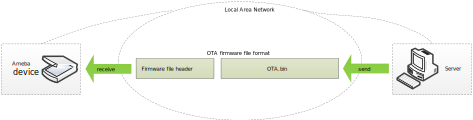
   
   OTA update diagram via network

Firmware Format
~~~~~~~~~~~~~~~~~
The firmware format is illustrated below.

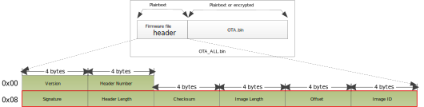

   Firmware format

.. table:: Firmware header
   :width: 100%
   :widths: auto

   +---------------+----------------+---------+---------------------------------------------------------------------+
   | Items         | Address offset | Size    | Description                                                         |
   +===============+================+=========+=====================================================================+
   | Version       | 0x00           | 4 bytes | The version of OTA Header, default 0xFFFFFFFF                       |
   +---------------+----------------+---------+---------------------------------------------------------------------+
   | Header Number | 0x04           | 4 bytes | The number of OTA Header. For |CHIP_NAME|, this value can be 1, 2   |
   +---------------+----------------+---------+---------------------------------------------------------------------+
   | Signature     | 0x08           | 4 bytes | OTA Signature is string. For |CHIP_NAME|, this value is ``OTA``     |
   +---------------+----------------+---------+---------------------------------------------------------------------+
   | Header Length | 0x0C           | 4 bytes | The length of OTA header. For |CHIP_NAME|, this value is 0x18       |
   +---------------+----------------+---------+---------------------------------------------------------------------+
   | Checksum      | 0x10           | 4 bytes | The checksum of OTA image                                           |
   +---------------+----------------+---------+---------------------------------------------------------------------+
   | Image Length  | 0x14           | 4 bytes | The size of OTA image                                               |
   +---------------+----------------+---------+---------------------------------------------------------------------+
   | Offset        | 0x18           | 4 bytes | The start position of OTA image in current image                    |
   +---------------+----------------+---------+---------------------------------------------------------------------+
   | Image ID      | 0x1C           | 4 bytes | The image ID of current image                                       |
   |               |                |         |                                                                     |
   |               |                |         | - OTA_IMGID_BOOT: 0x0                                               |
   |               |                |         |                                                                     |
   |               |                |         | - OTA_IMGID_APP: 0x1                                                |
   +---------------+----------------+---------+---------------------------------------------------------------------+

OTA Flow
~~~~~~~~~
The OTA demo locates in ``{SDK}\component\soc\amebalite\misc\ameba_ota.c``. The image upgrade is implemented in the following steps:

1. Connect to the server. The IP address, port and OTA type are needed.

2. Acquire the older firmware address to be upgraded according to the MMU setting. If the address is re-mapping to OTA1 space by MMU, the OTA2 address would be selected to upgrade. Otherwise, the OTA1 address would be selected.

3. Receive the firmware file header to get the target OTA image information, such as image number, image length and image ID.

4. Download the new firmware from server.

5. Erase the Flash space for new firmware and write it into Flash except Manifest structure.

6. Verify the checksum. If the checksum error, OTA fail.

7. If the checksum is ok, write Manifest structure to the upgraded firmware region to indicate boot from new firmware next time.

8. OTA is finished and reset the device. Then it would boot from the new firmware.

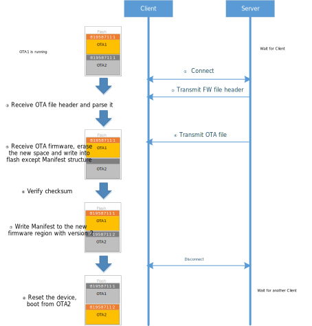

   OTA operation flow

OTA Demo
----------
Follow these steps to run the OTA demo to update from local server:

1. Edit ``{SDK}\component\example\ota\example_ota.c``.

   a. Edit host according to the server IP address.

      .. code-block:: c
      
         #define PORT 8082
         static const char *host = "192.168.31.193";
         static const char *resource = "ota_all.bin";

   b. Edit OTA type to OTA_LOCAL.

      .. code-block:: c
      
         ret = ota_update_init(ctx, (char *)host, PORT, (char *)resource, OTA_LOCAL);

2. Rebuild the project with command ``./build.py -a ota`` and download the images to the device.

3. Modify the major and minor version number in Manifest to a bigger version as described in :ref:`Version Number <version_number>`.

   .. note::
      The bootloader will select OTA image with a bigger version number by default.
      If users don't want to modify the version number, modify :mod:`OTA_CLEAR_PATTERN` to 1 defined in :file:`ameba_ota.h` before step 2.
      It should only be used in the development stage.

4. Rebuild the project and copy :file:`ota_all.bin` into the folder ``{SDK}\tools\DownloadServer``.

5. Edit ``{SDK}\tools\DownloadServer\start.bat``.

   - port = 8082

   - file name = ota_all.bin

   .. code-block::
   
      @echo off
      DownloadServer 8082 ota_all.bin
      Set /p DUMMY=Press Enter to Continue …

6. Click :file:`start.bat`, and start the download server program.

7. Reboot the DUT and connect the device to the AP which the OTA Server in.

8. Reboot DUT to execute the new firmware after finishing image download.

OTA Firmware Swap
--------------------
The following figure shows the firmware swap procedure after OTA upgrade.

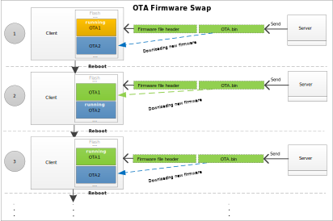

   OTA firmware swap procedure

.. _ota_user_configuration:

User Configuration
--------------------
Modify the memory layout in ``{SDK}\component\soc\amebalite\usrcfg\ameba_flashcfg.c`` if needed.

.. code-block:: c
   :emphasize-lines: 8,11
   :linenos:

   /*
   * @brif	Flash layout is set according to Flash Layout in User Manual
   *  In each entry, the first item is flash regoin type, the second item is start address, the second item is end address */
   const FlashLayoutInfo_TypeDef Flash_Layout[] = {
      /*Region_Type,	[StartAddr,	EndAddr]		*/
      {IMG_BOOT, 	0x08000000, 0x08013FFF}, //Boot Manifest(4K) + KM4 Bootloader(76K)
      //Users should modify below according to their own memory
      {IMG_APP_OTA1, 0x08014000, 0x081F3FFF}, //Certificate(4K) + Manifest(4K) + KR4 & KM4 Application OTA1 + Manifest(4K) + RDP IMG OTA1

      {IMG_BOOT_OTA2, 0x08200000, 0x08213FFF}, //Boot Manifest(4K) + KM4 Bootloader(76K) OTA
      {IMG_APP_OTA2, 0x08214000, 0x083F3FFF}, //Certificate(4K) + Manifest(4K) + KR4 & KM4 Application OTA2 + Manifest(4K) + RDP IMG OTA2
      {IMG_DSP,      0x08400000, 0x086FFFFF}, //Manifest(4K) + DSP IMG, only one DSP region in layout

      {FTL,		0x08700000, 0x08702FFF}, //FTL for BT(>=12K), The start offset of flash pages which is allocated to FTL physical map.
      {VFS1, 		0x08703000, 0x08722FFF}, //VFS region 1 (128K)
      {USER, 		0xFFFFFFFF, 0xFFFFFFFF}, //reserve for user

      /* End */
      {0xFF, 		0xFFFFFFFF, 0xFFFFFFFF},
   };

