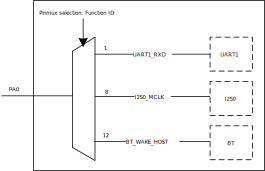
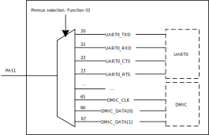

.. _pin_multiplexing_instructions:

Introduction
------------------------
The |CHIP_NAME| provides a pin multiplexing (pinmux) circuit to maximize the user's freedom under limited pin-out conditions. Each pin can be connected to different internal IP circuits through configuration. For the specific correspondence between each pin and IP circuit, refer to the provided pinmux table.

Before using the chip for further development, pay attention to the following precautions about pinmux to avoid inconvenience to your use due to unexpected behavior.

Trap Pins
------------------
During the process of powering on the chip, the internal circuit will latch several pins' conditions to decide whether entering into different modes. The trap pins and descriptions are listed below.

.. table:: Description of trap pins
   :width: 100%
   :widths: auto

   +----------+---------+--------------+----------------------------------------------------------------------------------+
   | Pin name | Symbol  | Active level | Description                                                                      |
   +==========+=========+==============+==================================================================================+
   | PA1      | TM_DIS  | Low          | | Test Mode Disable, default internal pull up                                    |
   |          |         |              | | It is for internal test only and should be logical high for normal operation.  |
   |          |         |              |                                                                                  |
   |          |         |              | - 1: Normal operation mode                                                       |
   |          |         |              |                                                                                  |
   |          |         |              | - 0: Test mode                                                                   |
   +----------+---------+--------------+----------------------------------------------------------------------------------+
   | PA20     | UD_DIS  | Low          | UART Download Disable, default internal pull up                                  |
   |          |         |              |                                                                                  |
   |          |         |              | - 1: Enter into normal boot mode                                                 |
   |          |         |              |                                                                                  |
   |          |         |              | - 0: Enter into UART download mode                                               |
   +----------+---------+--------------+----------------------------------------------------------------------------------+
   | PA22     | PSO_SEL | \-           | Power Supply Option Selection                                                    |
   |          |         |              |                                                                                  |
   |          |         |              | - 1: 1.25V                                                                       |
   |          |         |              |                                                                                  |
   |          |         |              | - 0: 0.9V                                                                        |
   +----------+---------+--------------+----------------------------------------------------------------------------------+

.. note:: The trap pin needs to select the external pull-up and pull-down voltages according to the I/O power supply.

Wake Pins
------------------
``PA0`` and ``PA1`` are directly connected to the wake up circuit which is used to wake up system from deep-sleep state. If you want to use other functions on this pin, disable the wake up function first.

SWD Pins
----------------
``PB0`` and ``PB1`` are forced to SWD/cJTAG function by default. If you want to multiplex these two pins to other functions, call :func:`sys_jtag_off()` or :func:`Pinmux_Swdoff()` before switching.

Function Multiplexing
------------------------------------------
Function ID 0-19
~~~~~~~~~~~~~~~~~~~~~~~~~~~~~~~~
For functions whose ID number is among 0-19, each pin can only be connected to a fixed signal of a certain IP. The functions that can be configured on a pin are very limited, but a dedicated design can maximize the performance of each IP.

.. admonition:: Example
   
   Function ID 6 and function ID 32-35 are both SPI functions. Since function ID 6 is a dedicated pin, the maximum speed of the SPI function reaches 50MHz (master mode); the maximum speed of the pins (full-cross pins) corresponding to function ID 32-35 is only 12.5MHz (master mode).

Taking ``PA0`` as an example, if you configure function ID of ``PA0`` to 1, the pin will be directly connected to the ``UART1_RXD`` signal of the UART1 via pinmux.

Refer to the pinmux table for the specific function distribution available on each pin.

   
   Schematic diagram of pinmux connection of PA0

Function ID 20-67
~~~~~~~~~~~~~~~~~~~~~~~~~~~~~~~~~~
For functions whose ID number is after 20, each pin can be connected to different signals of a certain IP. This method maximizes the freedom of use, but the scope of use and some IPs' performance (maximum transfer speed) is limited.

.. note:: These function IDs can only be configured on ``PA8`` to ``PA31`` and ``PB0`` to ``PB10``.

Taking ``PA11`` as an example, according to the pinmux table, you can connect ``PA11`` with the ``UART0_TXD`` signal of UART0 by configuring the ``PA11`` function ID to 20. You can also configure the ``PA11`` function ID to 21, and connect ``PA11`` with the ``UART0_RXD`` signal of UART0. For details, refer to the pinmux table.

   
   Schematic diagram of pinmux connection of PA11

