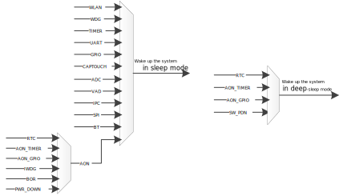

Wakeup Source
--------------------------
A hardware SYSON power management control module (SYSON PMC) is designed to control the clock and power of NP, and then NP controls the clock and power of AP.
When the system enters sleep mode, CPUs can select to enter clock-gating (CG) or power-gating (PG) mode, while SYSON PMC maintained active to wake up NP when wakeup sources are triggered.

.. only:: RTL8726EA

   Sleep and wakeup flow of sleep mode can be described as:

   - In terms of sleep flow, NP helps close the clock or power of AP and DSP, and SYSON PMC helps close the clock or power of NP.

   - In terms of wakeup flow, SYSON PMC helps open the clock or power of NP, and NP helps open the power or clock of AP and DSP.

.. note::

   - Both KM4 and KR4 can be configured as NP. If KR4 is configured as NP, KM4 is considered as AP.

   - The mode of memory is configurable when the system enters sleep mode. The retention mode is recommended for the balance between power saving and data retention.

A hardware AON power management control module (AON PMC) is designed to control the power of SYSON PMC.
When the system enters deep-sleep mode, CPUs and SYSON PMC are powered down while AON PMC maintains active to power on SYSON PMC when wakeup sources are triggered.

In deep-sleep mode, only the memory in AON domain can be maintained, while memory in other domains will be shut down. So CPU cannot restore the stack status.

Various wakeup sources are provided and every wakeup source can be configured to wake up NP or AP according to user's requirement. The following figure shows all the wake-up sources. AON is special because it is mater switch that manages all the wake-up sources in AON domain.

Some peripherals in AON domain can wake up the system both in sleep mode and deep-sleep mode. Only wakeup sources in AON domain can wake up the system from deep-sleep mode.

   Wakeup sources

Entering Sleep Mode
--------------------------------------
Sleep mode is based on FreeRTOS tickless, thus it is recommended to enter sleep mode by releasing the wakelock.

1. Initialize the specific peripheral.

2. Enable and register the peripheral's interrupt.

3. Set ``sleep_wevent_config[]`` in :file:`ambea_sleepcfg.c`, and the interrupt should be registered on the same CPU selected by ``sleep_wevent_config[]``.

4. For peripherals that need special clock settings, set ``ps_config[]`` in :file:`ameba_sleepcfg.c` if needed.

5. Register sleep/wakeup callback if needed.

6. Enter sleep mode by releasing the wakelock in AP (`PMU_OS` needs to be released since it is acquired by default when boot).

7. Clear the peripheral's interrupt when wakeup.

For peripherals that need specific clock settings, such as UART and LOGUART, their setting flows are described in Section :ref:`power_saving_uart` and :ref:`power_saving_loguart`.

.. _power_saving_uart:

UART
~~~~~~~~
.. note::
   When using UART as a wakeup source:
   
   - If the Rx clock source is XTAL40M, do not turn off XTAL during sleep.

   - The portion of the command used to wake up that exceeds the FIFO depth (64B) will be lost.

Configuration:

1. Initialize UART and enable its interrupt.

2. Set the related wakeup source (``WAKE_SRC_UART0/WAKE_SRC_UART1/WAKE_SRC_UART2_BT``) in ``sleep_wevent_config[]`` to `WAKEUP_KM4` or `WAKEUP_KM0` (based on which CPU you want to wake). The interrupt should be registered on the same CPU selected by ``sleep_wevent_config[]``.

3. Set the corresponding entry of ``uart_config[]`` in :file:`ameba_sleepcfg.c` to ``ENABLE``.

4. Set `keep_OSC4M_on` in ``ps_config[]`` to ``TRUE`` to keep OSC4M enabled during sleep mode.

5. Enter sleep mode by releasing the wakelock in KM4 (`PMU_OS` needs to be released since it is acquired by default when boot).

6. Clear the UART interrupt when wakeup.

.. _power_saving_loguart:

LOGUART
~~~~~~~~~~~~~~
.. note::
   When using LOGUART as a wakeup source:
   
   - If the Rx clock source is XTAL40M, do not turn off XTAL during sleep.

   - The portion of the command used to wake up that exceeds the FIFO depth (16B) will be lost.

Configuration:

1. Initialize LOGUART and enable its interrupt.

2. Set ``WAKE_SRC_UART_LOG`` in ``sleep_wevent_config[]`` to `WAKEUP_KM4` or `WAKEUP_KM0` (based on which CPU you want to wake). The interrupt should be registered on the same CPU selected by ``sleep_wevent_config[]``.

3. Set ``xtal_mode_in_sleep`` to `XTAL_Normal` in ``ps_config[]``.

4. Enter sleep mode by releasing the wakelock in KM4 (`PMU_OS` needs to be released since it is acquired by default when boot).

5. Clear the LOGUART interrupt when wakeup.

Entering Deep-Sleep Mode
------------------------------------------------
Deep-sleep can also be entered from FreeRTOS tickless flow.

When the system boots, KM4 holds the deepwakelock PMU_OS, thus :func:`freertos_ready_to_dsleep()` will be checked fail and the system does not enter deep-sleep mode in idle task by default. Since :func:`freertos_ready_to_dsleep()` will be checked only after :func:`freertos_ready_to_sleep()` is checked pass, both the wakelock and deepwakelock need to be released for entering deep-sleep mode.

Configuration:

1. Initialize the related peripheral and enable its interrupt.

2. Set ``sleep_wakepin_config[]`` in :file:`ameba_sleepcfg.c` when using AON wakepin as a wakeup source.

3. Enter deep-sleep mode by releasing the deepwakelock and wakelock in AP.

Power-Saving Configuration
----------------------------------------------------
Wakeup Mask Setup
~~~~~~~~~~~~~~~~~~~~~~~~~~~~~~~~~~
.. only:: RTL8726EA

   To enable a specific wakeup source, the corresponding status in array ``sleep_wevent_config[]`` in :file:`ameba_sleepcfg.c` should be set. Each module can be set to ``WAKEUP_NULL/WAKEUP_NP/WAKEUP_AP/WAKEUP_DSP``. For example, if the :mod:`WAKE_SRC_AON_WAKEPIN` module is set to `WAKEUP_NP`, it means that when the system is in sleep mode, KR4 will be woken up at the time that an aon_wakepin interrupt happens.

.. code-block:: c

   /*wakeup attribute can be set to WAKEUP_NULL/WAKEUP_NP/WAKEUP_AP/WAKEUP_DSP*/
   WakeEvent_TypeDef sleep_wevent_config[] = {
      //  Module                       wakeup
      {WAKE_SRC_VAD,                   WAKEUP_NULL},
      {WAKE_SRC_AON_WAKEPIN,           WAKEUP_NULL},
      {WAKE_SRC_AON_TIM,               WAKEUP_NULL},
      {WAKE_SRC_PWR_DOWN,              WAKEUP_NULL},
      {WAKE_SRC_BOR,                   WAKEUP_NULL},
      {WAKE_SRC_ADC,                   WAKEUP_NULL},
      {WAKE_SRC_AON_RTC,               WAKEUP_NULL},
      {WAKE_SRC_SPI1,                  WAKEUP_NULL},
      {WAKE_SRC_SPI0,                  WAKEUP_NULL},
      {WAKE_SRC_CTOUCH,                WAKEUP_NULL},
      {WAKE_SRC_GPIOB,                 WAKEUP_NULL},
      {WAKE_SRC_GPIOA,                 WAKEUP_NULL},
      {WAKE_SRC_UART_LOG,              WAKEUP_AP},
      {WAKE_SRC_UART3,                 WAKEUP_NULL},
      {WAKE_SRC_UART2,                 WAKEUP_NULL},
      {WAKE_SRC_UART1,                 WAKEUP_NULL},
      {WAKE_SRC_UART0,                 WAKEUP_NULL},
      {WAKE_SRC_Timer7,                WAKEUP_NULL},
      {WAKE_SRC_Timer6,                WAKEUP_NULL},
      {WAKE_SRC_Timer5,                WAKEUP_NULL},
      {WAKE_SRC_Timer4,                WAKEUP_NULL},
      {WAKE_SRC_Timer3,                WAKEUP_NULL},
      {WAKE_SRC_Timer2,                WAKEUP_NULL},
      {WAKE_SRC_Timer1,                WAKEUP_NULL},
      {WAKE_SRC_Timer0,                WAKEUP_NULL},
      {WAKE_SRC_WDG0,                  WAKEUP_NULL},
      {WAKE_SRC_BT_WAKE_HOST,          WAKEUP_NULL},
      {WAKE_SRC_AP_WAKE,               WAKEUP_NULL},
      {WAKE_SRC_WIFI_FTSR_MAILBOX,     WAKEUP_NP},
      {WAKE_SRC_WIFI_FISR_FESR,        WAKEUP_NP},
      {0xFFFFFFFF,                     WAKEUP_NULL},
   };

AON Wakepin Configuration
~~~~~~~~~~~~~~~~~~~~~~~~~~~~~~~~~~~~~~~~~~~~~~~~~~
AON wakepin is one of the peripherals that can be set as a wakeup source. The |CHIP_NAME| has two AON wakepins (PA0 and PA1), which can be configured in ``sleep_wakepin_config[]`` in :file:`ameba_sleepcfg.c`. The config attribute can be set to `DISABLE_WAKEPIN` or `HIGH_LEVEL_WAKEUP` or `LOW_LEVEL_WAKEUP`, meaning not wake up, or GPIO level high will wake up, or GPIO level low will wake up respectively.

.. code-block:: c

   /* can be used by sleep mode & deep sleep mode */
   /* config can be set to DISABLE_WAKEPIN/HIGH_LEVEL_WAKEUP/LOW_LEVEL_WAKEUP */
   WAKEPIN_TypeDef sleep_wakepin_config[] = {
      //   wakepin      config
      {WAKEPIN_0,    DISABLE_WAKEPIN},  /* WAKEPIN_0 corresponding to _PA_0 */
      {WAKEPIN_1,    DISABLE_WAKEPIN},  /* WAKEPIN_1 corresponding to _PA_1 */
      {0xFFFFFFFF,  DISABLE_WAKEPIN},
   };

.. note::
      - By default, `AON_WAKEPIN_IRQ` will not be enabled in ``sleep_wakepin_config[]``, and users need to enable it by themselves.

      - The wakeup mask will not be set in ``sleep_wakepin_config[]``. If wakepin is used for sleep mode, `WAKE_SRC_AON_WAKEPIN` entry needs to be set in ``sleep_wevent_config[]``.

Clock and Voltage Configuration
~~~~~~~~~~~~~~~~~~~~~~~~~~~~~~~~~~~~~~~~~~~~~~~~~~~~~~~~~~~~~~
The XTAL, OSC4M state, and sleep mode voltage are configurable in ``ps_config[]`` in :file:`ameba_sleepcfg.c`. Users can use this configuration for peripherals that need XTAL or OSC4M on in sleep mode.

.. code-block:: c

   PSCFG_TypeDef ps_config = {
      .keep_OSC4M_on = FALSE,       /* keep OSC4M on or off for sleep */
      .xtal_mode_in_sleep = XTAL_OFF,   /* set xtal mode during sleep mode, see enum xtal_mode_sleep for detail */
   };

Sleep Type Configuration
~~~~~~~~~~~~~~~~~~~~~~~~~~~~~~~~~~~~~~~~~~~~~~~~
Users can set sleep mode to CG or PG by calling the function :func:`pmu_set_sleep_type(uint32_t type)`, and users can get CPU's sleep mode by calling the function :func:`pmu_get_sleep_type()`.

.. note::
      - KR4 and KM4 are in the same power domain, so they will have the same sleep type, thus :func:`pmu_set_sleep_type()` should be set to AP, and NP will follow AP's sleep mode type.

      - Sleep mode is set to PG by default. If users want to change the sleep type, :func:`pmu_set_sleep_type()` needs to be called before sleep.

Power Saving Related APIs
------------------------------
Wakelock APIs
~~~~~~~~~~~~~~~~~~~~~~~~~~
In some situations, the system needs to keep awake to receive certain events. Otherwise, event may be missed when the system is in sleep. An idea of wakelock is introduced that the system cannot sleep if some module is holding wakelock.

A wakelock bit map is used to store the wakelock status. Each module has its own bit in wakelock bit map (see enum `PMU_DEVICE`). Users can also add wakelock in enum `PMU_DEVICE`. If the wakelock bit map equals zero, it means that there is no module holding wakelock. If the wakelock bit map is larger than zero, it means that there is some module holding wakelock.

Wakelock is a judging condition in the function :func:`freertos_ready_to_sleep()`. When the system boots on, AP holds wakelock `PMU_OS`, NP holds wakelock `PMU_OS` and `PMU_AP_RUN`. Only if all wakelocks are released, NP or AP are permitted to enter sleep mode. The function :func:`freertos_ready_to_sleep()` will judge the value of wakelock.

.. code-block:: c

   enum PMU_DEVICE {
      PMU_OS        = 0,
      PMU_WLAN_DEVICE,
      PMU_KM4_RUN,
      PMU_KR4_RUN,
      PMU_DSP_RUN,
      PMU_WLAN_FW_DEVICE,
      PMU_BT_DEVICE,
      PMU_DEV_USER_BASE    = 7, /*number 7 ~ 31 is reserved for customer use*/
      PMU_MAX      = 31,
   };

It is recommended to enter sleep mode by releasing wakelock. After `PMU_OS` wakelock of AP is released, AP will enter sleep mode in idle task and send IPC to NP. NP will power-gate or clock-gate AP and then release `PMU_OS` and `PMU_AP_RUN`.

When the system wakes up, it will enter sleep mode again quickly unless it acquires wakelock.

Similar to the wakelock for sleep mode, there is a 32-bit deepwakelock map for deep-sleep mode. If the deepwakelock bit map is larger than zero, it means that some modules are holding the deepwakelock, and the system is not allowed to enter deep-sleep mode. When the system boots, AP holds the deepwakelock `PMU_OS`.

Deepwakelock is a judging condition in the function :func:`freertos_ready_to_dsleep()`. After the deepwakelock `PMU_OS` of AP is released, and all wakelocks of AP are released, AP will be allowed to enter deep-sleep mode and send IPC to NP in idle task. NP will send a deep-sleep request and let the chip finally enter deep-sleep mode.

APIs in the following sections are provided to control the wakelock or deepwakelock.

pmu_acquire_wakelock
^^^^^^^^^^^^^^^^^^^^^^^^^^^^^^^^^^^^^^^^

.. table::
   :width: 100%
   :widths: auto

   +--------------+--------------------------------------------------+
   | Items        | Description                                      |
   +==============+==================================================+
   | Introduction | Acquire the wakelock for one module              |
   +--------------+--------------------------------------------------+
   | Parameter    | nDeviceId: Device ID of the corresponding module |
   |              |                                                  |
   |              | .. code-block:: c                                |
   |              |                                                  |
   |              |    enum DEVICE {                                 |
   |              |       PMU_OS  = 0,                               |
   |              |       ...                                        |
   |              |       PMU_MAX = 31                               |
   |              |    };                                            |
   +--------------+--------------------------------------------------+
   | Return       | None                                             |
   +--------------+--------------------------------------------------+

pmu_release_wakelock
^^^^^^^^^^^^^^^^^^^^^^^^^^^^^^^^^^^^^^^^

.. table::
   :width: 100%
   :widths: auto

   +--------------+--------------------------------------------------+
   | Items        | Description                                      |
   +==============+==================================================+
   | Introduction | Release the wakelock for one module              |
   +--------------+--------------------------------------------------+
   | Parameter    | nDeviceId: Device ID of the corresponding module |
   |              |                                                  |
   |              | .. code-block:: c                                |
   |              |                                                  |
   |              |    enum DEVICE {                                 |
   |              |       PMU_OS  = 0,                               |
   |              |       ...                                        |
   |              |       PMU_MAX = 31                               |
   |              |    };                                            |
   +--------------+--------------------------------------------------+
   | Return       | None                                             |
   +--------------+--------------------------------------------------+

pmu_acquire_deepwakelock
^^^^^^^^^^^^^^^^^^^^^^^^^^^^^^^^^^^^^^^^^^^^^^^^

.. table::
   :width: 100%
   :widths: auto

   +--------------+--------------------------------------------------+
   | Items        | Description                                      |
   +==============+==================================================+
   | Introduction | Acquire the deepwakelock for one module          |
   +--------------+--------------------------------------------------+
   | Parameter    | nDeviceId: Device ID of the corresponding module |
   |              |                                                  |
   |              | .. code-block:: c                                |
   |              |                                                  |
   |              |    enum DEVICE {                                 |
   |              |       PMU_OS  = 0,                               |
   |              |       ...                                        |
   |              |       PMU_MAX = 31                               |
   |              |    };                                            |
   +--------------+--------------------------------------------------+
   | Return       | None                                             |
   +--------------+--------------------------------------------------+

pmu_release_deepwakelock
^^^^^^^^^^^^^^^^^^^^^^^^^^^^^^^^^^^^^^^^^^^^^^^^

.. table::
   :width: 100%
   :widths: auto

   +--------------+--------------------------------------------------+
   | Items        | Description                                      |
   +==============+==================================================+
   | Introduction | Release the deepwakelock for one module          |
   +--------------+--------------------------------------------------+
   | Parameter    | nDeviceId: Device ID of the corresponding module |
   |              |                                                  |
   |              | .. code-block:: c                                |
   |              |                                                  |
   |              |    enum DEVICE {                                 |
   |              |       PMU_OS  = 0,                               |
   |              |       ...                                        |
   |              |       PMU_MAX = 31                               |
   |              |    };                                            |
   +--------------+--------------------------------------------------+
   | Return       | None                                             |
   +--------------+--------------------------------------------------+

pmu_set_sysactive_time
~~~~~~~~~~~~~~~~~~~~~~~~~~~~~~~~~~~~~~~~~~~~
Set the system active time. The system cannot sleep before timeout.

.. table::
   :width: 100%
   :widths: auto

   +--------------+--------------------------------------------------------------+
   | Items        | Description                                                  |
   +==============+==============================================================+
   | Introduction | Set a period of time that the system will keep active        |
   +--------------+--------------------------------------------------------------+
   | Parameter    | timeout: time value, unit is ms.                             |
   |              |                                                              |
   |              | The system will keep active for this time value from now on. |
   +--------------+--------------------------------------------------------------+
   | Return       | 0                                                            |
   +--------------+--------------------------------------------------------------+

.. note::
   *pmu_set_sysactive_time* is not permitted in suspend callback function as it is ineffective, while permitted in the resume callback function.

Sleep/Wake Callback APIs
~~~~~~~~~~~~~~~~~~~~~~~~~~~~~~~~~~~~~~~~~~~~~~~~
These APIs are used to register suspend/resume callback function for *<nDeviceId>*. The suspend callback function will be called in idle task before the system enters sleep mode, and the resume callback function will be called after the system resumes.

It is a good way to use the suspend and resume function if there is something to do before the chip sleeps or after the chip wakes. A typical application of the resume function is to acquire the wakelock to prevent the chip from sleeping again. Also, if the CPU chooses PG, some peripherals will lose power so they need to be reinitialized. This can be implemented in the resume function.

.. note::
   Yield OS is not permitted in the suspend/resume callback functions, thus RTOS APIs which may cause OS yield such as :func:`rtos_task_yield`, :func:`rtos_time_delay_ms`, or mutex, semaphore related APIs are not recommended to use.

pmu_register_sleep_callback
^^^^^^^^^^^^^^^^^^^^^^^^^^^^^^^^^^^^^^^^^^^^^^^^^^^^^^

.. table::
   :width: 100%
   :widths: auto
   :name:

   +--------------+--------------------------------------------------------------+
   | Items        | Description                                                  |
   +==============+==============================================================+
   | Introduction | Register the suspend/resume callback function for one module |
   +--------------+--------------------------------------------------------------+
   | Parameter    | - nDeviceId: Device ID needs suspend/resume callback         |
   |              |                                                              |
   |              |   .. code-block:: c                                          |
   |              |                                                              |
   |              |      enum DEVICE {                                           |
   |              |         PMU_OS  = 0,                                         |
   |              |         ...                                                  |
   |              |         PMU_MAX = 31                                         |
   |              |      };                                                      |
   |              |                                                              |
   |              | - sleep_hook_fun: Suspend callback function                  |
   |              |                                                              |
   |              | - sleep_param_ptr: Suspend callback function parameter       |
   |              |                                                              |
   |              | - wakeup_hook_fun: Resume callback function                  |
   |              |                                                              |
   |              | - wakeup_param_ptr: Resume callback function parameter       |
   +--------------+--------------------------------------------------------------+
   | Return       | None                                                         |
   +--------------+--------------------------------------------------------------+

pmu_unregister_sleep_callback
^^^^^^^^^^^^^^^^^^^^^^^^^^^^^^^^^^^^^^^^^^^^^^^^^^^^^^^^^^

.. table::
   :width: 100%
   :widths: auto

   +--------------+--------------------------------------------------------------+
   | Items        | Description                                                  |
   +==============+==============================================================+
   | Introduction | Register the suspend/resume callback function for one module |
   +--------------+--------------------------------------------------------------+
   | Parameter    | - nDeviceId: Device ID needs suspend/resume callback         |
   |              |                                                              |
   |              |   .. code-block:: c                                          |
   |              |                                                              |
   |              |      enum DEVICE {                                           |
   |              |         PMU_OS  = 0,                                         |
   |              |         ...                                                  |
   |              |         PMU_MAX = 31                                         |
   |              |      };                                                      |
   |              |                                                              |
   |              | - sleep_hook_fun: Suspend callback function                  |
   |              |                                                              |
   |              | - sleep_param_ptr: Suspend callback function parameter       |
   |              |                                                              |
   |              | - wakeup_hook_fun: Resume callback function                  |
   |              |                                                              |
   |              | - wakeup_param_ptr: Resume callback function parameter       |
   +--------------+--------------------------------------------------------------+
   | Return       | None                                                         |
   +--------------+--------------------------------------------------------------+

pmu_set_max_sleep_time
~~~~~~~~~~~~~~~~~~~~~~~~~~~~~~~~~~~~~~~~~~~~
Set the system max sleep time.

.. table::
   :width: 100%
   :widths: auto

   +--------------+-----------------------------------------------------+
   | Items        | Description                                         |
   +==============+=====================================================+
   | Introduction | Set the maximum sleep time                          |
   +--------------+-----------------------------------------------------+
   | Parameter    | timer_ms: system maximum sleep timeout, unit is ms. |
   +--------------+-----------------------------------------------------+
   | Return       | None                                                |
   +--------------+-----------------------------------------------------+

.. note::
      - The system will be woken up after the timeout.

      - The system may be woken up by other wake events before this timer is timeout.

      - This setting only works once. The timer will be cleared after the system wakeup.

Wi-Fi Power Saving
------------------------------------
IEEE 802.11 power-saving management allows the station to enter its own sleep state. It defines that the station needs to keep awake at a certain timestamp and enters a sleep state otherwise.

WLAN driver acquires the wakelock to avoid the system entering sleep mode when WLAN needs to keep awake. And it releases wakelock when it is permitted to enter the sleep state.

IEEE 802.11 power management allows the station to enter power-saving mode. The station cannot receive any frame during power saving. Thus AP needs to buffer these frames and requires the station periodically wake up to check the beacon which has the information of buffered frames.

.. figure:: ../figures/timeline_of_power_saving.png
   :scale: 50%
   :align: center

   Timeline of power saving

In SDK IEEE 802.11 power management is called LPS, and if NP enters sleep mode when Wi-Fi is in LPS mode, we call it WoWLAN mode.

In WoWLAN mode, a timer with a period of about 102ms will be set in the suspend function, and LP will wake up every 102ms to receive the beacon to maintain the connection.

Except for LPS and WoWLAN, we also have IPS, which can be used when Wi-Fi is not connected.
The following tables list all three power-saving modes for Wi-Fi and the relationship between the system power mode and Wi-Fi power mode.

.. table:: WiFi power saving mode
   :width: 100%
   :widths: auto

   +--------+----------------------------------------+-------------------------------------------------------------------+------------------------------------------------------+
   | Mode   | Wi-Fi status                           |  Description                                                      | SDK                                                  |
   +========+========================================+===================================================================+======================================================+
   | IPS    | Not associated:                        | Wi-Fi driver automatically turns Wi-Fi off to save power.         | IPS mode is enabled in SDK by default and is not     |
   |        |                                        |                                                                   |                                                      |
   |        | - RF/BB/MAC OFF                        |                                                                   | recommended to be disabled.                          |
   +--------+----------------------------------------+-------------------------------------------------------------------+------------------------------------------------------+
   | LPS    | Associated:                            | LPS mode is used to implement IEEE 802.11 power management.       | LPS mode is enabled in SDK by default but can be     |
   |        |                                        |                                                                   |                                                      |
   |        | - RF periodically ON/OFF               | NP will control RF ON/OFF based on TSF and TIM IE in the beacon.  | disabled through API :func:`wifi_set_lps_enable()`.  |
   |        |                                        |                                                                   |                                                      |
   |        | - MAC/BB always ON                     |                                                                   |                                                      |
   +--------+----------------------------------------+-------------------------------------------------------------------+------------------------------------------------------+
   | WoWLAN | Associated:                            | NP is waked up at each beacon early interrupt to receive a beacon | WoWLAN mode is enabled in SDK by default.            |
   |        |                                        |                                                                   |                                                      |
   |        | - RF and BB periodically ON/OFF        | from the associated AP.                                           |                                                      |
   |        |                                        |                                                                   |                                                      |
   |        | - MAC periodically enters/ exits CG/PG | NP will wake up AP when receiving a data packet.                  |                                                      |
   +--------+----------------------------------------+-------------------------------------------------------------------+------------------------------------------------------+

.. table:: Relationship between system and Wi-Fi power mode
   :width: 100%
   :widths: 20, 20, 60

   +-------------------+------------------+------------------------------------------------------------------------+
   | System power mode | Wi-Fi power mode | Description                                                            |
   +===================+==================+========================================================================+
   | Active            | IPS              | Wi-Fi is on, but not connected                                         |
   +-------------------+------------------+------------------------------------------------------------------------+
   | Active            | LPS              | Wi-Fi is connected and enters IEEE 802.11 power management mechanism   |
   +-------------------+------------------+------------------------------------------------------------------------+
   | Sleep             | Wi-Fi OFF/IPS    |                                                                        |
   +-------------------+------------------+------------------------------------------------------------------------+
   | Sleep             | WoWLAN           | Wi-Fi keeps associating.                                               |
   +-------------------+------------------+------------------------------------------------------------------------+
   | Deep-sleep        | Wi-Fi OFF        | Deep-sleep is not recommended if Wi-Fi needs to keep on or associated. |
   +-------------------+------------------+------------------------------------------------------------------------+

.. table:: API to enable/disable LPS
   :width: 100%
   :widths: 40, 60

   +--------------------------------------------+--------------------------+
   | API                                        | Parameters               |
   +============================================+==========================+
   | int wifi_set_lps_enable(u8 enable)         | - TRUE: enable LPS       |
   |                                            | - FALSE: disable LPS     |
   +--------------------------------------------+--------------------------+

When Wi-Fi is connected and the system enters sleep mode, WoWLAN mode will be entered automatically, and KM0 will periodically wake up to receive the beacon to maintain the connection, this will consume some power.
If you are more concerned about the system power consumption during sleep mode, and Wi-Fi is not a necessary function in your application, it is recommended to set Wi-Fi off or choose Wi-Fi IPS mode.

