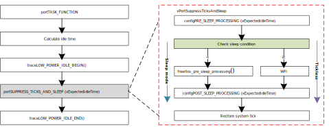

.. _power_saving:

Power Saving Mode
----------------------------------

The |CHIP_NAME| has an advanced Power Management Controller (PMC), which can flexibly power up different power domains of the chip, to achieve the best balance between chip performance and power consumption. AON, SYSON, SOC are three main power domains in digital system. Functions in different power domains will be turned off differently in different power-saving modes.

.. only:: RTL8726EA

   .. figure:: ../figures/power_domains_and_wakeup_sources_dsp.svg
      :scale: 110%
      :align: center
   
      Power domains and wakeup sources

The |CHIP_NAME| supports two low-power modes which are deep-sleep mode and sleep mode.
The deep-sleep mode turns off more power domains than the sleep mode, so it has lower power consumption.
The tickless is a low-power feature of FreeRTOS, which just halts CPU (no clock or power be turned off) when it has nothing to do.
The following table explains power-saving related terms.

.. table:: Power-saving mode
   :width: 100%
   :widths: auto

   +------------+------------+--------------+----------------+--------------------------------------------------------------------------------------------------------------------+
   | Mode       | AON domain | SYSON domain | SOC domain     | Description                                                                                                        |
   +============+============+==============+================+====================================================================================================================+
   | Tickless   | ON         | ON           | ON             | - FreeRTOS low power feature                                                                                       |
   |            |            |              |                |                                                                                                                    |
   |            |            |              |                | - CPU periodically enters WFI, and exits WFI when interrupts happen.                                               |
   |            |            |              |                |                                                                                                                    |
   |            |            |              |                | - Radio status can be configured off/periodically on/always on, which depends on the application.                  |
   +------------+------------+--------------+----------------+--------------------------------------------------------------------------------------------------------------------+
   | Sleep      | ON         | ON           | Clock-gated    | - A power saving mode on chip level, including clock-gating mode and power-gating mode.                            |
   |            |            |              |                |                                                                                                                    |
   |            |            |              | or power-gated | - CPU can restore stack status when the system exits from sleep mode.                                              |
   |            |            |              |                |                                                                                                                    |
   |            |            |              |                | - The system RAM will be retained, and the data in system RAM will not be lost.                                    |
   +------------+------------+--------------+----------------+--------------------------------------------------------------------------------------------------------------------+
   | Deep-sleep | ON         | OFF          | OFF            | - A more power-saving mode on chip-level.                                                                          |
   |            |            |              |                |                                                                                                                    |
   |            |            |              |                | - CPU cannot restore stack status. When the system exits from deep-sleep mode, the CPU follows the reboot process. |
   |            |            |              |                |                                                                                                                    |
   |            |            |              |                | - The system RAM will not be retained.                                                                             |
   +------------+------------+--------------+----------------+--------------------------------------------------------------------------------------------------------------------+

The FreeRTOS supports a low-power feature called tickless. It is implemented in an idle task which has the lowest priority. That is, it is invoked when there is no other task under running. Note that unlike the original FreeRTOS, the |CHIP_NAME| does not wake up based on the ``xEpectedIdleTime``.

   FreeRTOS tickless in an idle task

The figure above shows idle task code flow. In idle task, it will check the wakelock to determine whether CPU needs to enter sleep mode or software tickless or not.

- If not, CPU will execute an ARM instruction ``WFI`` (wait for interrupt), which makes the processor suspend until the interrupt happens. Normally the systick interrupt resumes it. This is software tickless.

- If yes, it will execute the function :func:`freertos_pre_sleep_processing` to enter sleep or deep-sleep mode.

.. note::
   - Even FreeRTOS time control like software timer or :func:`vTaskDelay` is set, it still enters sleep mode if meeting the requirement as long as the idle task is executed.

   - ``configUSE_TICKLESS_IDLE`` must be enabled for power-saving application because sleep mode flow is based on tickless.

