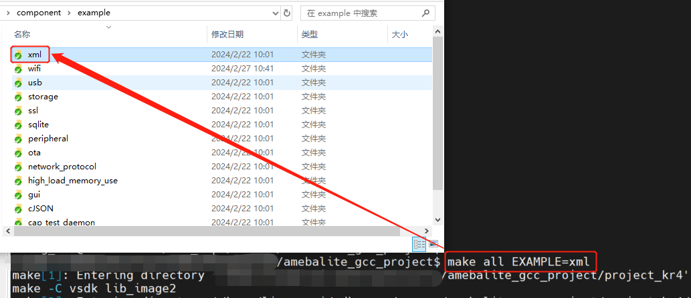

.. _sdk_examples:

Introduction
--------------------------------------
There are two kinds of examples in the SDK of |CHIP_NAME|:

 - Application examples

 - Peripheral examples

This chapter illustrates the contents of examples and how to build example source code. The path and description of SDK examples are listed in following table.

.. table:: Examples in SDK
   :width: 100%
   :widths: auto

   +---------------------+---------------------------------------+-------------------------------+
   | Items               | Path                                  | Description                   |
   +=====================+=======================================+===============================+
   | Application example | {SDK}\\component\\example             | xml, ssl, …                   |
   +---------------------+---------------------------------------+-------------------------------+
   | Peripheral example  | {SDK}\\component\\example\\peripheral | ADC, UART, I2C, SPI, Timer, … |
   +---------------------+---------------------------------------+-------------------------------+

Application Example
--------------------------------------
In each folder of application example, there are C source files, header files and :file:`README.txt`.
You should check for detailed configurations of the example according to :file:`README.txt`.

.. note::

   The application examples are shared by all Realtek SoC, so you need to refer to :file:`README.txt` for detailed information of |CHIP_NAME|.

The application examples normally run on AP (KM4 or KR4). 
The entry function of application example is :func:`app_example()` in :file:`main.c` under ``{SDK}\amebalite_gcc_project\project_km4\src`` or ``{SDK}\amebalite_gcc_project\project_kr4\src``.
Each application example has its own :func:`app_example()`, and :func:`app_example()` in :file:`main.c` will be replaced automatically when the application example is built.

.. code-block:: c

   // default main
   int main(void)
   {
      ...
      app_example();
      ...
      /* enable schedule, start kernel */
      vTaskStartSchedule();
   }

To run application example, you only need to:

1. Check software and hardware settings in :file:`README.txt` of the example.

2. Add compile options ``EXAMPLE={examplefolder name}`` when building project, replace ``{example folder name}`` with the specific folder name of this example.

For example, if you want to build the xml example to start an xml example thread, you need to:

1. Set the macro in SDK according to :file:`README.txt` in ``\component\example\xml``.

2. Enter ``make EXAMPLE=xml`` for AP on MSYS2 MinGW 64-bit (Windows) or terminal (Linux).

   Building xml application example

Peripheral Example
------------------------------------
The peripheral examples are demos of peripherals. Most examples consist of raw and mbed folders, you can choose raw or mbed demos as you like.

.. table:: Comparison of raw and mbed examples
   :width: 100%
   :widths: auto

   +-------+------------------------------------------------------------+---------------------------------+
   | Items | Path                                                       | Description                     |
   +=======+============================================================+=================================+
   | mbed  | {SDK}\\component\\example\\peripheral\\{peripheral}\\mbed  | mbed APIs are used.             |
   +-------+------------------------------------------------------------+---------------------------------+
   | raw   | {SDK}\\component\\example\\peripheral\\{peripheral}\\raw   | Low-level driver APIs are used. |
   +-------+------------------------------------------------------------+---------------------------------+

Each example folder has :file:`main.c` and :file:`README.txt`. There are example descriptions, required components, HW connection and expected behavior in :file:`README.txt`.

The peripheral examples normally run on AP (KM4 or KR4). To run peripheral examples, you only need to:

1. Check software and hardware settings in README.txt of the example.

2. Replace the original :file:`main.c` under ``\amebalite_gcc_project\project_km4\src`` or ``\amebalite_gcc_project\project_kr4\src`` with :file:`main.c` in the example directory.

3. (Optional) Copy other header files that are depicted in :file:`README.txt` to ``\amebalite_gcc_project\project_km4\src`` or ``\amebalite_ gcc_project\project_kr4\src`` if needed.

4. Re-build project using command ``make``.

