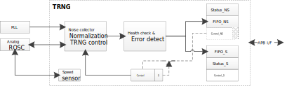

.. _trng:

Introduction
------------------------
The TRNG is a true random number generator that provides full entropy outputs to the application as 32-bit samples. It is composed of a live entropy source (analog) and an internal conditioning component.

The TRNG has been tested under NIST-Random Test.

Features
----------------
- The TRNG delivers 32-bit true random numbers, produced by an analog entropy source.

- The TRNG is embedded with a health test unit and an error management unit.

- Two independent FIFOs: FIFO_NS and FIFO_S, the latter has a higher priority.

- The throughput of the TRNG is up to about 2Mbps.

Block Diagram
--------------------------
The block diagram of TRNG is shown in Figure 1-1.

   Figure 1-1 TRNG block diagram

The TRNG includes the following sub-modules:

- PLL

   - The PLL is a 300MHz~660MHz clock, and will be enabled by hardware.

- Analog ROSC

   - The ROSC is a dedicated OSC, it can generate a random clock of 4MHz ~ 7MHz.

   - Take how to avoid power leakage into consideration when TRNG is power off.

- Speed sensor

   - Use APB clock, 40MHz.

- TRNG control

   - A bit is added to control whether the control register can be accessed from non-secure world.

   - Ensure that the default setting for OSC works. ROM will use it only without configuring ROSC.

   - This area is the real control register, while the Control_S is the access window in the secure world and the Control_NS is the access window in the non-secure world.

- Health check and error detect

   - This block should work with the default setting.

   - Any error can trigger an interrupt, which will be used by software to reset the whole TRNG.

   - This block has an internal 1024 bits FIFO, which guarantees all the output has passed the APT test.

- Control_S

   - This area is the access window in the secure world; the real address is "Control".

- Status_S

   - Indicate the available data in FIFO_S.

   - Indicate whether an error has happened.

- FIFO_S

   - FIFO size is 256 bits.

   - Only have one window register instead of all the registers.

   - All zero is returned after FIFO is read when it is empty.

   - When the available data is less than 128 bits, hardware will fill the FIFO_S to full in a high priority.

- Control_NS

   - This area is the access window in the non-secure world; the real address is "Control".

   - All the registers can be accessed only when ``SECURITY_CONTROL`` filed in Control Register is 0xA.

- Status_NS

   - Indicate the available data in FIFO_NS

   - Indicate whether an error has happened.

- FIFO_NS

   - FIFO size is 128 bits.

   - Only have one window register instead of all the registers.

   - All zero is returned after FIFO is read when it is empty.

   - FIFO_NS has a lower priority than FIFO_S. If available data is less than 128 bits in FIFO_S, hardware will not feed any data to this FIFO.

Usage
----------
- If you need to run the system with security attributes, it is suggested to configure TRNG as secure so that the control register can only be accessed from secure world.

- When a large amount of random data is required both by secure world and non-secure world simultaneously, request from secure world will be satisfied first for the former has a higher priority. After the request from secure world ends, random data will be generated to satisfy non-secure world.

- It is suggested to call :func:`_rand()` function to get a 32-bit random data.

