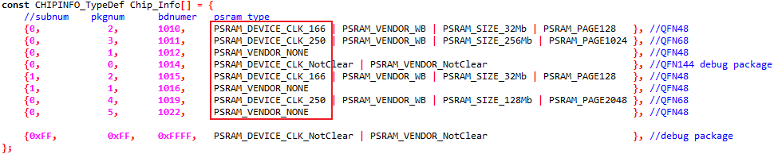
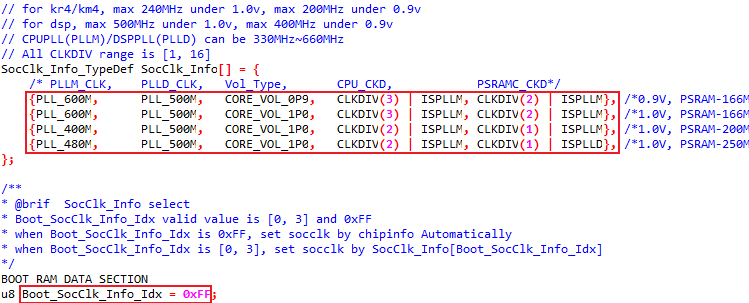
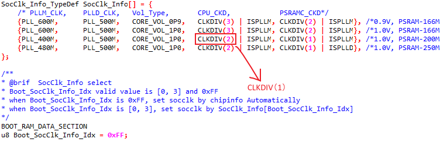
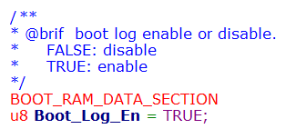
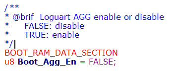

.. _user_configuration:

Introduction
-------------
This chapter describes the user configurations in the SDK. Users can modify any of them according to the application requirements.

Boot
--------
This section introduces the boot-related configurations including SoC clock switch and boot log.

The KM4 in |CHIP_NAME| device boots at 150MHz at the BootROM Stage, and switches to a higher frequency during the Bootloader Stage. There are some limitations when changing the SoC clock.

.. table::
   :width: 100%
   :widths: auto
   :name: table_user_config_0

   +---------+-------+-----------------+--------------+---------------------------------------------------+
   | Clock   | Cut   | Frequency       | Core voltage | Note                                              |
   +=========+=======+=================+==============+===================================================+
   | PLLM    |       | 330MHz ~ 660MHz |              |                                                   |
   +---------+-------+-----------------+--------------+---------------------------------------------------+
   | PLLD    |       | 330MHz ~ 660MHz |              | Can not exceed the maximum frequency of DSP clock |
   +---------+-------+-----------------+--------------+---------------------------------------------------+
   | KM4/KR4 | A-Cut | ≤200MHz         | 0.9V         |                                                   |
   +---------+-------+-----------------+--------------+---------------------------------------------------+
   | KM4/KR4 | A-Cut | ≤240MHz         | 1.0V         |                                                   |
   +---------+-------+-----------------+--------------+---------------------------------------------------+
   | KM4/KR4 | B-Cut | ≤300MHz         | 0.9V         |                                                   |
   +---------+-------+-----------------+--------------+---------------------------------------------------+
   | KM4/KR4 | B-Cut | ≤400MHz         | 1.0V         |                                                   |
   +---------+-------+-----------------+--------------+---------------------------------------------------+
   | DSP     |       | ≤400MHz         | 0.9V         | The same as PLLD                                  |
   +---------+-------+-----------------+--------------+---------------------------------------------------+
   | DSP     |       | ≤500MHz         | 1.0V         | The same as PLLD                                  |
   +---------+-------+-----------------+--------------+---------------------------------------------------+

.. _user_configuration_SoC_Clock_Switch:

SoC Clock Switch
~~~~~~~~~~~~~~~~~
Flow
^^^^^^^^

.. _user_configuration_flow_step_1:

1. (Optional) Find out the speed limit of PSRAM device embedded in |CHIP_NAME| if not sure.

   a. Print the value of :func:`ChipInfo_BDNum()` function, which will get the chip info from OTP.

   b. Refer to PSRAM type in *Chip_Info[]* in ``\component\soc\amebalite\fwlib\ram_common\ameba_chipinfo.c``.

For example: If bdnumer is 0x1010, the psram can run under 166MHz.

2. Check the value of *Boot_SocClk_Info_Idx* and the clock info in ``\component\soc\amebalite\usrcfg\ameba_bootcfg.c``.

- If *Boot_SocClk_Info_Idx* is not 0xFF, BootLoader will set the SoC clock defined by ``SocClk_Info[Boot_SocClk_Info_Idx]``.

- If *Boot_SocClk_Info_Idx* is 0xFF (defult), BootLoader will set the SoC clock automatically according to the PSRAM type embedded in |CHIP_NAME|.

For example: If bdnumer is 0x1010, the psram can run under 166MHz, and bootloader will use ``SocClk_Info[1]. CLKDIV(3) | ISPLLM`` means the clocks KM4/KR4 equal to PLLM/3.

.. table::
   :width: 100%
   :widths: auto
   :name: table_user_config_2

   +------------+-------------+--------------------+-------------------------------------------------------------------+-----------------+
   | PSRAM type | PSRAM speed |   SocClk_Info[x]   | Description                                                       | Clock Info      |
   +============+=============+====================+===================================================================+=================+
   | No PSRAM   |             | ``SocClk_Info[0]`` | BootLoader will set the Soc clock according to ``SocClk_Info[0]`` | PLLM: 600MHz    |
   |            |             |                    |                                                                   |                 |
   |            |             |                    |                                                                   | PLLD: 500MHz    |
   |            |             |                    |                                                                   |                 |
   |            |             |                    |                                                                   | KM4/KR4: 200MHz |
   +------------+-------------+--------------------+-------------------------------------------------------------------+-----------------+
   | With PSRAM | ≤166MHz     | ``SocClk_Info[1]`` | BootLoader will set the Soc clock according to ``SocClk_Info[1]`` | PLLM: 600MHz    |
   |            |             |                    |                                                                   |                 |
   |            |             |                    |                                                                   | PLLD: 500MHz    |
   |            |             |                    |                                                                   |                 |
   |            |             |                    |                                                                   | KM4/KR4: 200MHz |
   +------------+-------------+--------------------+-------------------------------------------------------------------+-----------------+
   | With PSRAM | ≤200MHz     | ``SocClk_Info[2]`` | BootLoader will set the Soc clock according to ``SocClk_Info[2]`` | PLLM: 400MHz    |
   |            |             |                    |                                                                   |                 |
   |            |             |                    |                                                                   | PLLD: 500MHz    |
   |            |             |                    |                                                                   |                 |
   |            |             |                    |                                                                   | KM4/KR4: 200MHz |
   +------------+-------------+--------------------+-------------------------------------------------------------------+-----------------+
   | With PSRAM | ≤250MHz     | ``SocClk_Info[3]`` | BootLoader will set the Soc clock according to ``SocClk_Info[3]`` | PLLM: 480MHz    |
   |            |             |                    |                                                                   |                 |
   |            |             |                    |                                                                   | PLLD: 500MHz    |
   |            |             |                    |                                                                   |                 |
   |            |             |                    |                                                                   | KM4/KR4: 240MHz |
   +------------+-------------+--------------------+-------------------------------------------------------------------+-----------------+

3. Refer to one of the following methods to change the SoC clock if needed.

   - Keep the *Boot_SocClk_Info_Idx* 0xFF, and only change the clock info of ``SocClk_Info[x]`` to set the clocks of PLLM/PLLD and CPUs.

   - Modify the *Boot_SocClk_Info_Idx* to [0, 3], and then define your own clock info in ``SocClk_Info[Boot_SocClk_Info_Idx]``.

.. note:: Consider the limitations of the hardware and do not set the clock info illogically.

4. Re-build the project and download the new image again.

Example
^^^^^^^^^^^^^^
1. Refer to :ref:`Flow Step1<user_configuration_flow_step_1>` to find out the speed limit of PSRAM device if not sure (suppose the maximum speed is 200MHz)

2. Change *CPU_CKD* of ``SocClk_Info[2]`` to *CLKDIV(1)* if CPU is needed to run faster.

4. Re-build and download the new image.

Now, the clock of KM4/KR4 is 400MHz, PSRAM controller is 400MHz (twice the PSRAM), and core power is 1.0V. The clocks of left modules in |CHIP_NAME| will be set to a reasonable value by software automatically based on their maximum speeds.

.. note:: The PLLD can be disabled if you do not need it work.

Boot Log
~~~~~~~~~~
Bootloader Log
^^^^^^^^^^^^^^^^^
The bootloader log is enabled by default and can be disabled in \ ``\component\soc\amebalite\usrcfg\ameba_bootcfg.c.``\

Loguart AGG
^^^^^^^^^^^^^
The *Boot_Agg_En* macro is used with Trace Tool to sort out boot logs from different cores. It can be enabled in \ ``\component\soc\amebalite\usrcfg\ameba_bootcfg.c.``\

.. note::
   Refer to Chapter :ref:`trace_tool` for more information.

Flash
----------
This section introduces the Flash-related configurations including speed, read mode, layout and protect mode, which locate at \ ``\component\soc\amebalite\usrcfg\ameba_flashcfg.c``\ .

Speed
~~~~~~~~~~
Check the value of Flash_Speed in \ ``\component\soc\amebalite\usrcfg\ameba_flashcfg.c``\ . The parameters and corresponding speeds are listed in :ref:`Flash speed configuration`.

.. table:: Flash speed configuration
   :width: 100%
   :widths: auto
   :name: Flash speed configuration

   +----------------------+----------------------------------------------+----------------+
   | Value of Flash_Speed | Description                                  | Flash baudrate |
   +======================+==============================================+================+
   | 0xFFFF               | Flash baudrate will be 1/20 of PLLM          | PLLM/20        |
   +----------------------+----------------------------------------------+----------------+
   | 0x7FFF               | Flash baudrate will be 1/18 of np core clock | PLLM/18        |
   +----------------------+----------------------------------------------+----------------+
   | 0x3FFF               | Flash baudrate will be 1/16 of np core clock | PLLM/16        |
   +----------------------+----------------------------------------------+----------------+
   | 0x1FFF               | Flash baudrate will be 1/14 of np core clock | PLLM/14        |
   +----------------------+----------------------------------------------+----------------+
   | 0xFFF                | Flash baudrate will be 1/12 of np core clock | PLLM/12        |
   +----------------------+----------------------------------------------+----------------+
   | 0x7FF                | Flash baudrate will be 1/10 of np core clock | PLLM/10        |
   +----------------------+----------------------------------------------+----------------+
   | 0x3FF                | Flash baudrate will be 1/8 of np core clock  | PLLM/8         |
   +----------------------+----------------------------------------------+----------------+
   | 0x1FF                | Flash baudrate will be 1/6of np core clock   | PLLM/6         |
   +----------------------+----------------------------------------------+----------------+
   | 0xFF                 | Flash baudrate will be 1/4 of np core clock  | PLLM/4         |
   +----------------------+----------------------------------------------+----------------+

.. note::
      - Refer to :ref:`user_configuration_SoC_Clock_Switch` for details about PLLM.

      - The maximum clock of Flash is 120MHz. The initial flow will check whether the configured speed is higher than the maximun one or not.

      - Other value is not supported.

Read Mode
~~~~~~~~~~~~~~~~~~
Check the value of Flash_ReadMode in \ ``\component\soc\amebalite\usrcfg\ameba_flashcfg.c``\ . The parameters and corresponding modes are listed in the following table.

.. table:: Flash read mode configuration
   :width: 100%
   :widths: auto
   :name: flash_read_mode_configuration

   +-------------------------+---------------------------+
   | Value of Flash_ReadMode | Description               |
   +=========================+===========================+
   | 0xFFFF                  | Address & Data 4-bit mode |
   +-------------------------+---------------------------+
   | 0x7FFF                  | Just data 4-bit mode      |
   +-------------------------+---------------------------+
   | 0x3FFF                  | Address & Data 2-bit mode |
   +-------------------------+---------------------------+
   | 0x1FFF                  | Just data 2-bit mode      |
   +-------------------------+---------------------------+
   | 0x0FFF                  | 1-bit mode                |
   +-------------------------+---------------------------+

.. note:: If the configured read mode is not supported, other modes would be searched until finding out the appropriate mode.

Layout
~~~~~~~~~~~~
The default Flash layout of |CHIP_NAME| in the SDK are illustrated in Chapter :ref:`flash_layout`. If you want to modify the Flash Layout, refer to Section :ref:`how_to_modify_flash_layout`.

Flash Protect Enable
~~~~~~~~~~~~~~~~~~~~~~
For more information about this function, refer to Section :ref:`flash_protect_enable` .

Pinmap
------------
For more information about pinmap configuration, refer to User Manual (Chapter I/O Control).

