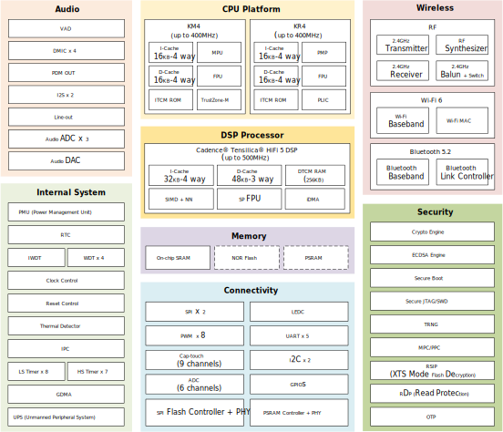

Introduction
-------------------
The |CHIP_NAME| is a low-power single-chip microcontroller integrating dual RISC cores (Arm® Cortex®-M55 compatible instruction set and RISC-V compatible instruction set) and a digital signal processor (Cadence® Tensilica® HiFi 5 DSP).
It is designed for optimized power efficiency, RF performance, and reduced audio transmission latency.
It also encompasses the characteristics of low-power chip, including fine-grained clock gating, multiple power modes, and dynamic power scaling.

The KM4 (also called Real-M300) is a 3-staged pipelined 32-bit processor that bases on Armv8.1-M architecture supporting Cortex-M55 compatible instruction set, running at a frequency of up to 400MHz.
It offers system enhancements such as enhanced debug features, single-precision floating-point unit (FPU), Digital Signal Processing (DSP) extension, TrustZone-M security for hardware-enforced isolation, and a high level of support block integration.

The KR4 is a 32-bit processor that supports RISC-V compatible instruction set RV32IMAFC, running at a frequency of up to 400MHz.
RISC-V is a standard free and open instruction set architecture (ISA) based on RISC, delivering a new level of free, extensible software and hardware freedom on architecture.

The Cadence Tensilica HiFi 5 DSP is a high-performance embedded DSP optimized for high-performance front-end, far-field and near-field audio and voice processing, running at a frequency of up to 500MHz.
It is also designed for enabling efficient implementations of neural network (NN) based speech recognition algorithms.
The HiFi 5 DSP is a five-slot VLIW machine which can execute up to eight 32x32-bit MACs per cycle.
It can issue two 128-bit loads per cycle, or one load and one store of 128-bit per cycle for parallel loads and stores of the operand and results.
The HiFi 5 DSP offers additional floating-point precision support through an optional Single Precision vector floating-point unit (SP FPU), which can perform up to eight single-precision floating-point MACs per cycle.
For supporting neural network-based speech recognition algorithms, the HiFi 5 DSP provides Neural Network Extension option which enables the hardware to perform up to thirty-two 8x16, 4x16 and 8x8-bit MACs per cycle.

The |CHIP_NAME| integrates the latest specifications of Wi-Fi (Wi-Fi 6) and Bluetooth (Bluetooth 5.2).
It supports 802.11 b/g/n/ax wireless LAN (WLAN) network at 2.4GHz with 20MHz bandwidth. It consists of WLAN MAC, a 1T1R capable WLAN baseband, RF, and Bluetooth, providing complete Wi-Fi and Bluetooth functionalities.

A variety of peripheral interfaces, including UART, SPI, I2C, LEDC, etc., as well as sensor controllers (such as ADC, Cap-Touch, and thermal) are integrated into |CHIP_NAME|.
Besides, the |CHIP_NAME| has rich audio features for smart audio applications with dedicated microphone interfaces (DMIC), built-in voice activity detection (VAD), and I2S.
Abundant general-purpose I/O (GPIOs) can be configured to different functions according to different secure IoT (Internet of Things) applications flexibly.
The user-friendly development kits (SDK and HDK) are provided to customers for developing applications.

The |CHIP_NAME| also incorporates high-speed memories with on-chip SRAM and stacked Flash or PSRAM.
A dedicated SPI Flash controller provides a flexible and efficient way to access NOR Flash (e.g., byte and block access).
A multilayer AXI bus interconnect supports internal and external memory access.

Block Diagram
-------------------
The functional block diagram is illustrated below, which provides a view of the chip's major functional components and core complexes.

   Block diagram

.. note::

   For different series of |CHIP_NAME|, the modules, functions and peripherals may differ. Refer to :ref:`Products <products>` for more details.

