.. _audio:

Introduction
----------------
The audio framework is a whole audio architecture aiming to provide different layers of audio interfaces for applications. The interfaces involve Audio HAL and Audio Framework.

- Audio HAL: defines unified audio hardware interfaces. It interacts with audio driver to do audio streaming or audio settings.
- Audio Framework: provides interfaces for audio streaming, volume, and other settings.

The audio framework provides two architectures to meet different needs of audio. Different architectures have different implementations, but the interfaces are the same.

- Audio mixer architecture: supports audio recording, and audio playback. For audio playback, this architecture provides audio mixing functions, and format, rate, channel will be converted to a unified format for mixing.
- Audio passthrough architecture: supports audio recording, and audio playback. This architecture has no audio mixing, only one audio playback is allowed at the same moment.

Mixer Overview
~~~~~~~~~~~~~~~~
The audio interfaces and the entire implementation are shown below.

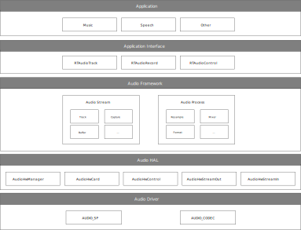

   Audio mixer overview

The whole audio mixer architecture includes the following sub-modules:

- Application Interface

  - **RTAudioTrack** provides interfaces to play sound.
  - **RTAudioRecord** provides interfaces to capture sound.
  - **RTAudioControl** provides interfaces to control sound volumes and so on.

- Audio Framework

  - The audio framework provides audio reformat, resample, volume, and mixer functions for audio stream playback.

- Audio HAL

  - **AudioHwManager** provides interfaces that manage audio cards through a specific card driver program loaded based on the given audio card descriptor.
  - **AudioHwCard** provides interfaces that manage audio card capabilities, including initializing ports, creating stream out and stream in.
  - **AudioHwControl** provides interfaces for RTAudioControl, and set commands to audio driver.
  - **AudioHwStreamOut** provides interfaces that get data from the upper layer and render data to audio driver user interfaces.
  - **AudioHwStreamIn** provides interfaces to capture data from audio driver user interfaces and deliver the data to the upper layer.

- Audio Driver

  - **AUDIO_SP** provides interfaces to configure audio sports.
  - **AUDIO_CODEC** provides interfaces to configure audio codec.

Passthrough Overview
~~~~~~~~~~~~~~~~~~~~~~
The audio interfaces and the entire implementation are shown below.

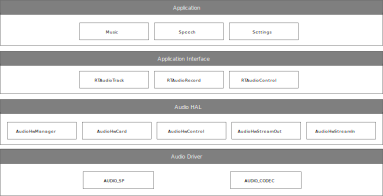

   Audio passthrough overview

The audio passthrough architecture has no Audio Framework layer compared to audio mixer architecture, other layers are nearly the same.

.. _architecture_comparison:

Architecture Comparison
~~~~~~~~~~~~~~~~~~~~~~~~~
The above sections describe two architectures of audio: mixer and passthrough. Users can choose the suitable architecture according to the project's requirements. Here is a comparison table of the two architectures:

.. table::
   :width: 100%
   :widths: auto

   +--------------+------------------+-----------+-------------------+-------------------+-------------------+------------------+
   | Architecture | Memory occupancy | Code size | Playback function                                         | Capture function |
   |              |                  |           +-------------------+-------------------+-------------------+                  |
   |              |                  |           | Basic function    | Mixing function   | Playback latency  |                  |
   +==============+==================+===========+===================+===================+===================+==================+
   | Mixer        | More             | More      | Nearly the same   | Support           | More              | Same             |
   +--------------+------------------+-----------+-------------------+-------------------+-------------------+------------------+
   | Passthrough  | Less             | Less      | Nearly the same   | Not support       | Less              | Same             |
   +--------------+------------------+-----------+-------------------+-------------------+-------------------+------------------+

- For record implementation, the two architectures are the same. Both architectures can meet user's record function needs.
- For playback implements, the two architectures are different. If the user has the requirements to play two sounds together at the same time, choose mixer architecture, because only the mixer architecture can do the mixing.
- The mixer architecture takes more memory and has a bigger code size. If the user wants to save memory and code size and has no requirements of audio mixing, choose the passthrough architecture.

Terminology
----------------------
The meanings of some widely-used audio terms in this chapter are listed below.

.. list-table::
   :header-rows: 1

   * -  Terms
     -  Introduction
   * -  PCM
     -  Pulse Code Modulation, audio data is a raw stream.
   * -  channel
     -  A channel sound is an independent audio signal captured or played in different positions, so the number of
        
        channels is the number of sound sources.
   * -  mono
     -  Mono means only one single channel sound.
   * -  stereo
     -  Stereo means two channels.
   * -  bit depth
     -  Bit depth represents the bits effectively used in the process of audio signals.

        Sampling depth shows the resolution of the sound. The larger the value, the higher the resolution.
   * -  sample
     -  Representing the audio processing at a point in time.
   * -  sample rate
     -  The audio sampling rate refers to the number of frames that the signal is sampled per second.

        The higher the sampling frequency, the higher quality the sound will be.
   * -  frame
     -  A frame is a sound unit whose length is the sample length multiplies the number of channels.
   * -  gain
     -  Audio signal gain control to adjust the signal level.
   * -  interleaved
     -  It is a recording method of audio data. In the interleaved mode, the data is stored in a continuous manner, all the
        
        channels of sample of first frame are first stored, and then the storage of second frame.
   * -  latency
     -  Time delay when a signal passes through the whole system.
   * -  overrun
     -  The buffer is too full to let buffer producer write more data.
   * -  underrun
     -  The buffer producer is too slow to write data to the buffer so that the buffer is empty when the consumer wants

        to consume data.
   * -  xrun
     -  Overrun or underrun.
   * -  volume
     -  Volume, sound intensity and loudness.
   * -  hardware volume
     -  The volume of audio codec.
   * -  software volume
     -  The volume set in software algorithm.
   * -  resample
     -  Convert the sample rate.
   * -  reformat
     -  Convert the bit depth of the sample.
   * -  mix
     -  Mix several audio streaming together. Users can hear several audio streaming playing together.
   * -  Audio codec
     -  The DAC and ADC controller inside the chip.

Data Format
----------------------
This section describes the data format that audio framework and audio HAL supports. The common part of audio framework and audio HAL is described here. And the different parts will be described in their own sections.

Both audio framework and audio HAL support interleaved streaming data.

The two-channel interleaved data is illustrated in :ref:`two_channel_interleaved`, and the four-channel interleaved data is illustrated in :ref:`four_channel_interleaved`.

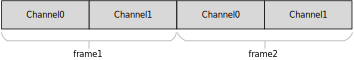

   Two-channel interleaved

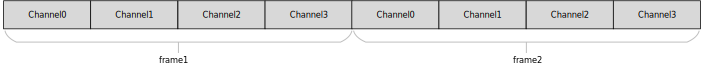

   Four-channel interleaved

Framework Format
~~~~~~~~~~~~~~~~~~~~~~~~~~~~~~~~
This section describes the format that Audio Framework supports. Before playback, or capture, make sure your sound format is supported.

Audio Framework has the following types of bit depth:

- **RTAUDIO_FORMAT_INVALID** - invalid bit depth of audio stream
- **RTAUDIO_FORMAT_PCM_8_BIT** - audio stream has 8-bit depth
- **RTAUDIO_FORMAT_PCM_16_BIT** - audio stream has 16-bit depth
- **RTAUDIO_FORMAT_PCM_32_BIT** - audio stream has 32-bit depth
- **RTAUDIO_FORMAT_PCM_FLOAT** - audio stream has 32-bit float format
- **RTAUDIO_FORMAT_PCM_24_BIT** - audio stream has 24-bit depth
- **RTAUDIO_FORMAT_PCM_8_24_BIT** - audio stream has 24-bit + 8-bit depth

The following table describes the supported formats for playback and recording. ``Y`` means the format is supported; ``N`` means the format is not supported.

.. table::
   :width: 100%
   :widths: auto

   +-----------------------------+----------------+----------------------+-----------------------------+
   | Bit depth                   | Playback-Mixer | Playback-Passthrough | Capture (Mixer/Passthrough) |
   +=============================+================+======================+=============================+
   | RTAUDIO_FORMAT_PCM_8_BIT    | Y              | Y                    | Y                           |
   +-----------------------------+----------------+----------------------+-----------------------------+
   | RTAUDIO_FORMAT_PCM_16_BIT   | Y              | Y                    | Y                           |
   +-----------------------------+----------------+----------------------+-----------------------------+
   | RTAUDIO_FORMAT_PCM_32_BIT   | Y              | N                    | N                           |
   +-----------------------------+----------------+----------------------+-----------------------------+
   | RTAUDIO_FORMAT_PCM_FLOAT    | Y              | N                    | N                           |
   +-----------------------------+----------------+----------------------+-----------------------------+
   | RTAUDIO_FORMAT_PCM_24_BIT   | Y              | Y                    | Y                           |
   +-----------------------------+----------------+----------------------+-----------------------------+
   | RTAUDIO_FORMAT_PCM_8_24_BIT | N              | Y                    | Y                           |
   +-----------------------------+----------------+----------------------+-----------------------------+

The sample rate is another important format of audio streaming. For playback and recording, audio framework supports the following sample rates.
``Y`` means the sample rate is supported; ``N`` means the sample rate is not supported.

.. table::
   :width: 100%
   :widths: auto

   +-------------+------------------------------+-----------------------------+
   | Sample rate | Playback (Mixer/Passthrough) | Capture (Mixer/Passthrough) |
   +=============+==============================+=============================+
   | 8000        | Y                            | Y                           |
   +-------------+------------------------------+-----------------------------+
   | 11025       | Y                            | Y                           |
   +-------------+------------------------------+-----------------------------+
   | 16000       | Y                            | Y                           |
   +-------------+------------------------------+-----------------------------+
   | 22050       | Y                            | Y                           |
   +-------------+------------------------------+-----------------------------+
   | 32000       | Y                            | Y                           |
   +-------------+------------------------------+-----------------------------+
   | 44100       | Y                            | Y                           |
   +-------------+------------------------------+-----------------------------+
   | 48000       | Y                            | Y                           |
   +-------------+------------------------------+-----------------------------+
   | 88200       | Y                            | Y                           |
   +-------------+------------------------------+-----------------------------+
   | 96000       | Y                            | Y                           |
   +-------------+------------------------------+-----------------------------+
   | 192000      | N                            | N                           |
   +-------------+------------------------------+-----------------------------+

To do audio streaming, the channel count parameter setting is necessary, too. For playback and recording, audio framework supports the following channel counts.
``Y`` means the channel count is supported; ``N`` means the channel count is not supported.

.. table::
   :width: 100%
   :widths: auto

   +---------------+-----------------+-----------------------+-----------------------------+
   | Channel count | Playback(Mixer) | Playback(Passthrough) | Capture (Mixer/Passthrough) |
   +===============+=================+=======================+=============================+
   | 1             | Y               | Y                     | Y                           |
   +---------------+-----------------+-----------------------+-----------------------------+
   | 2             | Y               | Y                     | Y                           |
   +---------------+-----------------+-----------------------+-----------------------------+
   | 4             | N               | Y                     | Y                           |
   +---------------+-----------------+-----------------------+-----------------------------+
   | 6             | N               | Y                     | Y                           |
   +---------------+-----------------+-----------------------+-----------------------------+
   | 8             | N               | Y                     | Y                           |
   +---------------+-----------------+-----------------------+-----------------------------+

HAL Format
~~~~~~~~~~~~~~~~~~~~
Mixer and passthrough architecture have the same audio HAL. Audio Hal has the following types of bit depth:

- **AUDIO_HW_FORMAT_INVALID** - invalid bit depth of audio stream
- **AUDIO_HW_FORMAT_PCM_8_BIT** - audio stream has 8-bit depth
- **AUDIO_HW_FORMAT_PCM_16_BIT** - audio stream has 16-bit depth
- **AUDIO_HW_FORMAT_PCM_32_BIT** - audio stream has 32-bit depth
- **AUDIO_HW_FORMAT_PCM_FLOAT** - audio stream has 32-bit float format
- **AUDIO_HW_FORMAT_PCM_24_BIT** - audio stream has 24-bit depth
- **AUDIO_HW_FORMAT_PCM_8_24_BIT** - audio stream has 24-bit + 8-bit depth

If using the Audio HAL interface, please check the bit depth HAL supported for Playback and Capture.
``Y`` means the format is supported; ``N`` means the format is not supported.

.. table::
   :width: 100%
   :widths: auto

   +-------------------------------+----------+---------+
   | Bit depth                     | Playback | Capture |
   +===============================+==========+=========+
   | AUDIO_HW_FORMAT_PCM_8_BIT     | Y        | Y       |
   +-------------------------------+----------+---------+
   | AUDIO_HW_FORMAT_PCM_16_BIT    | Y        | Y       |
   +-------------------------------+----------+---------+
   | AUDIO_HW_FORMAT_PCM_32_BIT    | N        | N       |
   +-------------------------------+----------+---------+
   | AUDIO_HW_FORMAT_PCM_FLOAT     | N        | N       |
   +-------------------------------+----------+---------+
   | AUDIO_HW_FORMAT_PCM_24_BIT    | N        | N       |
   +-------------------------------+----------+---------+
   | AUDIO_HW_FORMAT_PCM_8_24_BIT  | Y        | Y       |
   +-------------------------------+----------+---------+

The sample rate is another important format of HAL audio streaming. For playback and recording, audio HAL supports the following sample rates.
``Y`` means the sample rate is supported; ``N`` means the sample rate is not supported.

.. table::
   :width: 100%
   :widths: auto

   +-------------+----------+---------+
   | Sample rate | Playback | Capture |
   +=============+==========+=========+
   | 8000        | Y        | Y       |
   +-------------+----------+---------+
   | 11025       | Y        | Y       |
   +-------------+----------+---------+
   | 16000       | Y        | Y       |
   +-------------+----------+---------+
   | 22050       | Y        | Y       |
   +-------------+----------+---------+
   | 32000       | Y        | Y       |
   +-------------+----------+---------+
   | 44100       | Y        | Y       |
   +-------------+----------+---------+
   | 48000       | Y        | Y       |
   +-------------+----------+---------+
   | 88200       | Y        | Y       |
   +-------------+----------+---------+
   | 96000       | Y        | Y       |
   +-------------+----------+---------+
   | 192000      | N        | N       |
   +-------------+----------+---------+

To do audio streaming, the channel count parameter setting is necessary, too. For playback and recording, audio HAL supports the following channel counts.
``Y`` means the channel count is supported; ``N`` means the channel count is not supported.

.. table::
   :width: 100%
   :widths: auto

   +---------------+----------------+--------------+---------+
   | Channel count | Codec Playback | I2S Playback | Capture |
   +===============+================+==============+=========+
   | 1             | Y              | Y            | Y       |
   +---------------+----------------+--------------+---------+
   | 2             | Y              | Y            | Y       |
   +---------------+----------------+--------------+---------+
   | 4             | N              | Y            | Y       |
   +---------------+----------------+--------------+---------+
   | 6             | N              | Y            | Y       |
   +---------------+----------------+--------------+---------+
   | 8             | N              | Y            | Y       |
   +---------------+----------------+--------------+---------+

Architecture
----------------
Playback Architecture
~~~~~~~~~~~~~~~~~~~~~~~
The block diagram of audio mixer playback architecture is shown below.

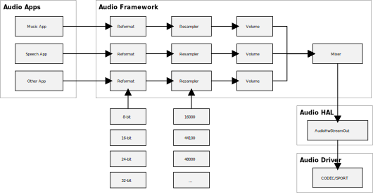

   Playback mixer architecture

The block diagram of audio passthrough playback architecture is shown below.

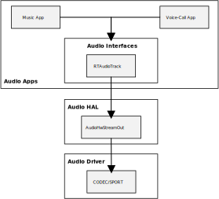

   Playback passthrough architecture

The audio playback architecture includes the following sub-modules:

- Audio Framework (only mixer architecture)

  - Audio framework is responsible for audio playback sound mixing.
  - Audio framework supports at most 32 sound playing together.
  - Before mixing, all sound will be converted to one unified audio format, which is 16-bit, 44100Hz, 2-channel currently. Sub-modules reformat, resampler are responsible to do the conversion. There is also volume sub-module in audio framework to adjust volumes for different audio types, for example, music, speech may have different volumes.
  - Audio framework supports sound rate from 8k-96k, channel mono/stereo, format 8-bit, 16-bit, 24-bit, and 32-bit float.

- Audio HAL

  - Audio HAL gets playback data from audio framework, and sends the data to audio driver.

- Audio Driver

  - Audio Driver gets playback data from audio HAL and sends data to audio hardware.

Record Architecture
~~~~~~~~~~~~~~~~~~~~~
Audio mixer and passthrough have the same record architecture. The block diagram of audio record is shown below.

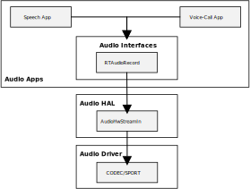

   Record architecture

The audio record architecture includes the following sub-modules:

- **RTAudioRecord**: captures data from Audio HAL, and provides data to audio applications, which want to record data.
- **Audio HAL**: gets record data from Audio driver, and sends the data to RTAudioRecord.
- **Audio Driver**: gets record data from Audio hardware, and sends data to audio HAL.

Control Architecture
~~~~~~~~~~~~~~~~~~~~~
Audio mixer and passthrough have the same control architecture. The block diagram of audio control is shown below.

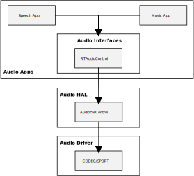

   Control architecture

The audio control architecture includes the following sub-modules:

- **RTAudioControl**: called by Apps, and interacts with HAL to do audio control settings.
- **Audio HAL**: does audio control settings by calling Driver APIs.
- **Audio Driver**: controls audio codec hardware.

Hardware Volume
^^^^^^^^^^^^^^^^^^
RTAudioControl provides interfaces to set and get hardware volume.

.. code-block:: c

   #include "audio/audio_control.h"
   int32_t RTAudioControl_SetHardwareVolume(float left_volume, float right_volume)

Users set the left and right channel volumes to 0.0~1.0, linear maps to -65.625-MAXdb.

Configurations
----------------
MenuConfig
~~~~~~~~~~~
If users want to use audio interfaces, select the following audio configurations, and choose the suitable audio architecture according to Section :ref:`architecture_comparison`.

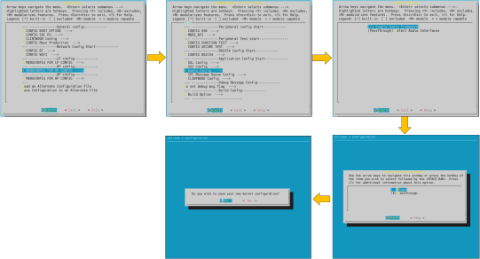

Framework Configuration
~~~~~~~~~~~~~~~~~~~~~~~
Audio Framework configurations lie in ``{SDK}/component/audio/configs/ameba_audio_mixer_usrcfg.cpp``.

If users want to change the audio HAL period buffer size, or audio mixer's buffer policy, change *kPrimaryAudioConfig* according to the description of ``{SDK}/component/audio/configs/include/ameba_audio_mixer_usrcfg.h``.

The *out_min_frames_stage* in *kPrimaryAudioConfig* only supports *RTAUDIO_OUT_MIN_FRAMES_STAGE1* and *RTAUDIO_OUT_MIN_FRAMES_STAGE2*.

- *RTAUDIO_OUT_MIN_FRAMES_STAGE1*: means more data output to audio HAL one time
- *RTAUDIO_OUT_MIN_FRAMES_STAGE2*: means less data output to audio HAL one time.

*RTAUDIO_OUT_MIN_FRAMES_STAGE2* may reduce the framework's latency, but may cause noise. It's the user's choice to set it.

HAL Configuration
~~~~~~~~~~~~~~~~~~~~
Audio hardware configurations lie in ``{SDK}/component/soc/amebasmart/usrcfg/include/ameba_audio_hw_usrcfg.h``.

Different boards have different configurations. For example, some boards need to use an amplifier, while others do not. Different boards may use different devices to enable the amplifier; the start-up time is different for different amplifiers. In addition, the devices used by each board's DMICs may be different, and the stable time of DMICs may be different. All the information needs to be configured in the configuration file.

The :file:`ameba_audio_hw_usrcfg.h` file has the description for each configuration, please set them according to the description.

Interfaces
--------------------
The audio component provides three layers of interfaces shown as below.

.. table::
   :width: 100%
   :widths: auto

   +----------------------------+----------------------------------------------------------------------------------------+
   | Interface layers           | Introduction                                                                           |
   +============================+========================================================================================+
   | Audio Driver Interfaces    | Audio Hardware Interfaces.                                                             |
   +----------------------------+----------------------------------------------------------------------------------------+
   | Audio HAL Interfaces       | Audio Hardware Abstraction Layer Interfaces.                                           |
   +----------------------------+----------------------------------------------------------------------------------------+
   | Audio Framework Interfaces | High-level Interfaces for applications to render/capture stream, set volume and so on. |
   +----------------------------+----------------------------------------------------------------------------------------+

The interfaces layer is shown as below.

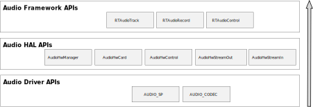

   Audio interfaces

HAL Interfaces
~~~~~~~~~~~~~~~~~
Audio HAL provides AudioHwStreamOut/AudioHwStreamIn/AudioHwControl interfaces to interact with audio hardware. The interfaces lie in ``{SDK}/component/audio/interfaces/hardware/audio``. The interfaces have specific descriptions in them, read them before use.

- **AudioHwStreamOut**: receives PCM data from the upper layer, writes data via audio driver to send PCM data to hardware, and provides information about audio output hardware driver.
- **AudioHwStreamIn**: receives PCM data via audio driver and sends to the upper layer.
- **AudioHwControl**: receives control calling from the upper layer, and sets control information to the driver.

The AudioHwStreamOut/AudioHwStreamIn is managed by AudioHwCard interface. It is responsible for creating/destroying AudioHwStreamOut/ AudioHwStreamIn instance. AudioHwCard is a physical or virtual hardware to process audio stream. It contains a set of ports and devices as shown in following figure.

- **Port** - the stream input of the audio card is called "port".
- **Device** - the output stream of audio card is called "device".

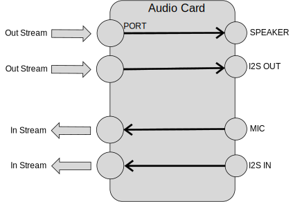

   AudioHwCard example

The AudioHwManager manages system's all AudioHwCards and loads a specific card driver based on the given audio card descriptor.

Using AudioHwStreamOut
^^^^^^^^^^^^^^^^^^^^^^^^
Users can check the example of AudioHwStreamOut in ``{SDK}/component/example/audio/audio_hal_render``.

Here is the description showing how to use audio HAL interfaces to play audio raw data (PCM format):

1. Use :func:`CreateAudioHwManager` to get AudioHwManager instance:

   .. code-block:: c

      struct AudioHwManager *audio_manager = CreateAudioHwManager();

2. Use :func:`GetCards` to get all audio card descriptors:

   .. code-block:: c

      int32_t cards_size = audio_manager->GetCardsCount(audio_manager);
      struct AudioHwCardDescriptor *card_descs = audio_manager->GetCards(audio_manager);

3. Choose a specific card to play (currently audio manager only support primary audio card):

   .. code-block:: c

      struct AudioHwCardDescriptor *audio_card_desc;
      for (int32_t index = 0; index < cards_size; index++) {
         struct AudioHwCardDescriptor *desc = &card_descs[index];
         for (uint32_t port = 0; (desc != NULL && port < desc->port_num); port++) {
            printf("check for audio port \n");
            if (desc->ports[port].role == AUDIO_HW_PORT_ROLE_OUT &&
               (audio_card = audio_manager->OpenCard(audio_manager, desc))) {
               audio_port = desc->ports[port];
               audio_card_desc = desc;
               break;
            }
         }
      }

4. Create AudioHwConfig according to the sample rate, channel, format, and AudioHwPathDescriptor, then use :func:`CreateStreamOut` to create an AudioHwStreamOut based on the specific audio card:

   .. code-block:: c

      struct AudioHwConfig audio_config;
      audio_config.sample_rate = 48000;
      audio_config.channel_count = 2;
      audio_config.format = AUDIO_HW_FORMAT_PCM_16_BIT;
      struct AudioHwPathDescriptor path_desc;
      path_desc.port_index = audio_port.port_index;
      path_desc.devices = AUDIO_HW_DEVICE_OUT_SPEAKER;
      path_desc.flags = AUDIO_HW_INPUT_FLAG_NONE;
      audio_stream_out = audio_card->CreateStreamOut(audio_card, &path_desc, &audio_config);

5. Write PCM data to AudioHwStreamOut repeatly. Buffer size written can be defined by users. Users need to make sure the *size/frame_size* is integer:

   .. code-block:: c

      int32_t bytes = audio_stream_out->Write(audio_stream_out, buffer, size, true);

6. Use :func:`DestroyStreamOut` to close AudioHwStreamOut when finishing playing:

   .. code-block:: c

      audio_card->DestroyStreamOut(audio_card, audio_stream_out);

7. Use :func:`CloseCard` to close the AudioHwCard and finally call :func:`DestoryAudioHwManager` to release AudioHwManager instance:

   .. code-block:: c

      audio_manager->CloseCard(audio_manager, audio_card, audio_card_desc);
      DestoryAudioHwManager(audio_manager);

Using AudioHwStreamIn
^^^^^^^^^^^^^^^^^^^^^^^
Users can check the example of AudioHwStreamOut in ``{SDK}/component/example/audio/audio_hal_capture``.

Here is the description showing how to use audio HAL interfaces to capture audio raw data:

1. Use :func:`CreateAudioHwManager` to get AudioHwManager instance:

   .. code-block:: c

      struct AudioHwManager *audio_manager = CreateAudioHwManager();

2. Use :func:`GetCards` to get all audio card descriptors:

   .. code-block:: c

      int32_t cards_size = audio_manager->GetCardsCount(audio_manager);
      struct AudioHwCardDescriptor *card_descs = audio_manager->GetCards(audio_manager);

3. Choose a specific card to capture(currently audio manager only support primary audio card):

   .. code-block:: c

      struct AudioHwCardDescriptor *audio_card_in_desc = NULL;
      for (int32_t index = 0; index < cards_size; index++) {
         struct AudioHwCardDescriptor *desc = &card_descs[index];
         for (uint32_t port = 0; (desc != NULL && port < desc->port_num); port++) {
            if (desc->ports[port].role == AUDIO_HW_PORT_ROLE_IN &&
               (audio_card_in = audio_manager->OpenCard(audio_manager, desc))) {
               audio_port_in = desc->ports[port];
               audio_card_in_desc = desc;
               break;
            }
         }
      }

4. Construct AudioHwConfig according to the sample rate, channel, format, and AudioHwPathDescriptor, then use :func:`CreateStreamIn` to create an AudioHwStreamIn based on the specific audio card:

   .. code-block:: c

      struct AudioHwConfig audio_config;
      audio_config.sample_rate = 48000;
      audio_config.channel_count = 2;
      audio_config.format = AUDIO_HW_FORMAT_PCM_16_BIT;
      struct AudioHwPathDescriptor path_desc_in;
      path_desc_in.port_index = audio_port_in.port_index;
      path_desc_in.devices = AUDIO_HW_DEVICE_IN_MIC;
      path_desc_in.flags = AUDIO_HW_INPUT_FLAG_NONE;
      audio_stream_in = audio_card_in->CreateStreamIn(audio_card_in, &path_desc_in, &audio_config);

5. Read PCM data from AudioHwStreamIn repeatly. This size can be defined by users. Users need to make sure the *size/frame_size* is integer:

   .. code-block:: c

      audio_stream_in->Read(audio_stream_in, buffer, size);

6. Use :func:`DestroyStreamIn` to close AudioHwStreamIn when finishing recording:

   .. code-block:: c

      audio_card_in->DestroyStreamIn(audio_card_in, audio_stream_in);

7. Use :func:`CloseCard` to destroy the AudioHwCard, and finally call :func:`DestoryAudioHwManager` to release AudioHwManager instance.

   .. code-block:: c

      audio_manager->CloseCard(audio_manager, audio_card_in, audio_card_in_desc);
      DestoryAudioHwManager(audio_manager);

Using AudioHwControl
^^^^^^^^^^^^^^^^^^^^^^
Here is an example showing how to use audio HAL interfaces to control audio codec:

AudioHwCotrol is always thread-safe, and the calling is convenient. To use AudioHwCotrol, the first parameter of the function call should always be :func:`GetAudioHwControl()`. Take the hardware volume setting for example:

.. code-block:: c

   GetAudioHwControl()->SetHardwareVolume(GetAudioHwControl(), left_volume, right_volume);

Framework Interfaces
~~~~~~~~~~~~~~~~~~~~~
Streaming Interfaces
^^^^^^^^^^^^^^^^^^^^^^
Audio Streaming interfaces include RTAudioTrack and RTAudioRecord, which lie in ``{SDK}/component/audio/interfaces/audio``. The interfaces have specific descriptions in them, please read them before using.

- **RTAudioTrack**: initializes the format of playback data streaming in the framework, receives PCM data from the application, and writes data to Audio Framework (mixer) or Audio HAL (passthrough).
- **RTAudioRecord**: initializes the format of record data streaming in the framework, receives PCM data from Audio HAL, and sends data to applications.

Using RTAudioTrack
********************
RTAudioTrack includes support for playing variety of common audio raw format types so that audio can be easily integrated into applications. At most 32 RTAudioTracks can play together.

Audio Framework has the following audio playback stream types. Applications can use the types to initialize RTAudioTrack. Framework gets the streaming type and does the volume mixing according to the types.

- **RTAUDIO_CATEGORY_MEDIA** - if the application wants to play music, then its type is **RTAUDIO_CATEGORY_MEDIA**, it can use this type to init RTAudioTrack. Then audio framework will know its type, and mix it with media's volume.
- **RTAUDIO_CATEGORY_COMMUNICATION** - if the application wants to start a phone call, it can output the phone call's sound, the sound's type should be **RTAUDIO_CATEGORY_COMMUNICATION**.
- **RTAUDIO_CATEGORY_SPEECH** - if the application wants to do voice recognition, and output the speech sound.
- **RTAUDIO_CATEGORY_BEEP** - if the sound is key tone, or other beep sound, then its type is **RTAUDIO_CATEGORY_BEEP**.

The test demo of RTAudioTrack lies in ``{SDK}/component/example/audio/audio_track``.

Here is an example showing how to play audio raw data:

1. Before using RTAudioTrack, RTAudioService should be initialized:

   .. code-block:: c

      RTAudioService_Init();

2. To use RTAudioTrack to play a sound, create it:

   .. code-block:: c

      struct RTAudioTrack* audio_track = RTAudioTrack_Create();

   Apps can use the Audio Configs API to provide detailed audio information about a specific audio playback source, including stream type (type of playback source), format, number of channels, sample rate, and RTAudioTrack ringbuffer size. The syntax is as follows:

   .. code-block:: c

      typedef struct {
         uint32_t category_type;
         uint32_t sample_rate;
         uint32_t channel_count;
         uint32_t format;
         uint32_t buffer_bytes;
      } RTAudioTrackConfig;

   Where

   :category_type: define the stream type of the playback data source.
   :sample_rate: playback source raw data's rate.
   :channel_count: playback source raw data's channel number.
   :format: playback source raw data's bit depth.
   :buffer_bytes: ringbuffer size for RTAudioTrack to avoid xrun.

   .. note::
      The *buffer_bytes* in RTAudioTrackConfig is very important. The buffer size should always be more than the minimum buffer size Audio framework calculated. Otherwise overrun will occur.

3. Use the interface to get minimum RTAudioTrack buffer bytes, and use it as a reference to define RTAudioTrack buffer size, for example, you can use minimum buffer size * 4 as buffer size. The bigger size you use, the smoother playing you will get, yet it may cause more latency. It's your choice to define the size.

   .. code-block:: c

      int track_buf_size = RTAudioTrack_GetMinBufferBytes(audio_track, type, rate, format, channels) * 4;

4. Use this buffer size and other audio parameters to create RTAudioTrackConfig object, here's an example:

   .. code-block:: c

      RTAudioTrackConfig track_config;
      track_config.category_type = RTAUDIO_CATEGORY_MEDIA;
      track_config.sample_rate = rate;
      track_config.format = format;
      track_config.buffer_bytes = track_buf_size;
      track_config.channel_count = channel_count;

   With RTAudioTrackConfig object, we can initialize RTAudioTrack. In this step, a ringbuffer will be created according to the buffer bytes.

   .. code-block:: c

      RTAudioTrack_Init(audio_track, &track_config);

5. When all the preparations are completed, start RTAudioTrack and check if starts success.

   .. code-block:: c

      if(RTAudioTrack_Start(audio_track) != 0){
         //track start fail
         return;
      }

6. The default volume of RTAudioTrack is maximum 1.0, you can change the volume with the following API calling. Users can adjust the volume of track by using

   .. code-block:: c

      RTAudioTrack_SetVolume(audio_track, 1.0, 1.0);

   .. note::
      - In the mixer architecture, this API sets the software volume of the current audio_track.

      - In the passthrough architecture, this API is not supported.

7. Write audio data to the framework. The write_size can be defined by users. Users need to make sure the *write_size/frame_size* is integer.

   .. code-block:: c

      RTAudioTrack_Write(audio_track, buffer, write_size, true);

   - If users want to pause, stop writing data, and then call the following APIs to tell the framework to do pause:

     .. code-block:: c

        RTAudioTrack_Pause(audio_track);
        RTAudioTrack_Flush(audio_track);

   - If users want to stop playing audio, stop writing data, and then call :func:`RTAudioTrack_Stop` API:

     .. code-block:: c

        RTAudioTrack_Stop(audio_track);

8. Delete audio_track pointer when it's not used.

   .. code-block:: c

      RTAudioTrack_Destroy(audio_track);

Using RTAudioRecord
**********************
RTAudioRecord supports variety of common audio raw format types, so that you can easily integrate record into applications.

RTAudioRecord supports the following audio input sources:

- **RTDEVICE_IN_MIC**- if the application wants to capture data from microphone, then choose this input source.
- **RTDEVICE_IN_I2S**- if the application wants to capture data from I2S, then choose this input source.

The test demo of RTAudioRecord lies in ``{SDK}/component/example/audio/audio_record``.

Here is an example showing how to record audio raw data:

1. Create RTAudioRecord first:

   .. code-block:: c

      struct RTAudioRecord *audio_record = RTAudioRecord_Create();

2. Apps can use the Audio Configs API to provide detailed audio information about a specific audio record source, including record device source, format, number of channels, and sample rate. The syntax is as follows:

   .. code-block:: c

      typedef struct {
         uint32_t sample_rate;
         uint32_t channel_count;
         uint32_t format;
         uint32_t device;
         uint32_t buffer_bytes;
      } RTAudioRecordConfig;

   Where

   :sample_rate: record source raw data's rate.
   :channel_count: record source raw data's channel number.
   :format: record source raw data's bit depth.
   :device: audio input device source for data record.
   :buffer_bytes: audio buffer bytes in framework. Set 0 to use default value. User can also set other value, the bigger buffer_bytes means bigger latency.

   Here's an example showing how to create RTAudioRecordConfig object of RTAudioRecord:

   .. code-block:: c

      RTAudioRecordConfig record_config;
      record_config.sample_rate = rate;
      record_config.format = RTAUDIO_FORMAT_PCM_16_BIT;
      record_config.channel_count = channels;
      record_config.device = RTDEVICE_IN_MIC;
      record_config.buffer_bytes = 0;

3. With RTAudioRecordConfig object created, you can initialize RTAudioRecord, in this step, Audio HAL's AudioHwCard will be loaded, according to the audio input device source:

   .. code-block:: c

      RTAudioRecord_Init(audio_record, &record_config);

4. When all the preparations are completed, start audio_record:

   .. code-block:: c

      RTAudioRecord_Start(audio_record);

5. Read audio microphone data. The read size can be defined by users. Users need to make sure *size/frame_size* is integer.

   .. code-block:: c

      RTAudioRecord_Read(audio_record, buffer, size, true);

6. When the record ends, stop the record:

   .. code-block:: c

      RTAudioRecord_Stop(audio_record);

7. When audio_record no use, destroy it to avoid memory leak:

   .. code-block:: c

      RTAudioRecord_Destroy(audio_record);

Control Interfaces
^^^^^^^^^^^^^^^^^^^^
Audio Control interfaces include RTAudioControl to interact with audio control HAL. RTAudioControl provides interfaces to set and get hardware volume, set output device, and so on. The interfaces lie in ``{SDK}/component/audio/interfaces/audio/audio_control.h``. The interfaces have specific descriptions, read them before use.

Using RTAudioControl
*********************
Here is an example of how to use RTAudioControl:

1. Call RTAudioControl to set audio hardware volume of DAC:

   .. code-block:: c

      RTAudioControl_SetHardwareVolume(0.5, 0.5);

For playback and record case, most RTAudioControl APIs can be called at any time, any place, they can work directly. Only RTAudioControl_SetPlaybackDevice can only be called before RTAudioService_Init in mixer architecture, and before RTAudioTrack_Start in passthrough architecture.

Audio Hardware Application
------------------------------
Audio codec supports three input ways: line-in, AMIC-in and DMIC-in; and one output way which can be configured as line-out and headphone out. Microphone array smart voice application is also introduced.

Line-out
~~~~~~~~~~
Line-out supports two output modes: differential and single-ended. Users can select the wanted mode by setting the related registers.

Line-out Differential Mode
^^^^^^^^^^^^^^^^^^^^^^^^^^^
In this mode, both N-end and P-end drive the available analog audio signal. This application is mainly used to provide clean audio for external power amplifiers (Class-AB/Class-D).

   Differential mode connection with audio power amplifiers

Headphone-out Single-ended Mode
^^^^^^^^^^^^^^^^^^^^^^^^^^^^^^^^^
In this mode, the circuit designer needs to place a capacitor to the P-end output path for analog audio signal pick-up. No N-end output is required.

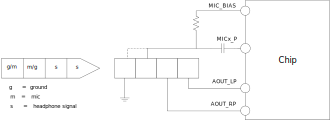

   Single-ended mode connection with headphone jack

Line-in
~~~~~~~~~
Line-in has 0dB gain preamplifier, its input signal often has a large output power. It often connects to the audio output of equipment such as electric guitar, electronic organ, and synthesizer.

Connect the left channel of line-in signal to MICx_P, and the right channel to MICx_P accordingly.

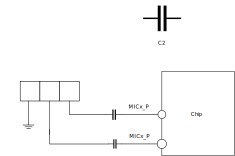

   Line-in mode connection

AMIC-in
~~~~~~~~~
The amplitude of the signal collected by analog microphone (AMIC-in) is very small, a preamplifier is necessary, AMIC-in supports differential mode and single-ended mode.

AMIC-in Single-ended Mode
^^^^^^^^^^^^^^^^^^^^^^^^^^^^
Connect MICx_P with a single-ended analog microphone, while MIC_BIAS provides the microphone bias voltage.

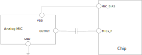

   AMIC-in single-ended mode connection

AMIC-in Differential Mode
^^^^^^^^^^^^^^^^^^^^^^^^^^
Connect MICx_P/MICx_N with a differential analog microphone, while MIC_BIAS provides the microphone bias voltage.

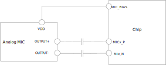

   AMIC-in differential mode connection

DMIC-in
~~~~~~~~
Digital microphone (DMIC) records audio data. It is integrated with ADC internal, and can directly output digital signal. DMIC-in supports mono mode and stereo mode.

DMIC-in Mono Mode
^^^^^^^^^^^^^^^^^^^^^
Tie the L/R of a digital microphone to ground or VDD if only one digital microphone is placed.

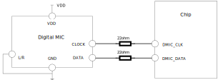

   DMIC-in mono mode connection

For layout design, DMIC_CLK and DMIC_DATA should add ground isolation on both sides of the routing.

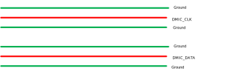

   DMIC-in layout

DMIC-in Stereo Mode
^^^^^^^^^^^^^^^^^^^^^
Tie the L/R of two digital microphones to ground and VDD respectively if a stereo microphone is needed. The two microphones share the DMIC_DATA according to the rising/falling edge. DMIC_CLK and DMIC_DATA layout design refor to :ref:`DMIC-in layout`

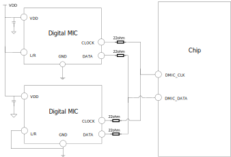

   DMIC-in stereo mode connection

Microphone Array
~~~~~~~~~~~~~~~~~
Two-microphone Smart Voice Application
^^^^^^^^^^^^^^^^^^^^^^^^^^^^^^^^^^^^^^^
In this application, two ADCs are used to collect the speaker's voice, and one ADC is used to collect the reference sound of echo cancellation.

   Two-microphone smart voice application

Four-microphone Smart Voice Application
^^^^^^^^^^^^^^^^^^^^^^^^^^^^^^^^^^^^^^^^^^
In this application, four ADCs are used to collect the speaker's voice, and one ADC is used to collect the reference sound of echo cancellation.

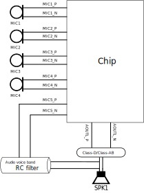

   Four-microphone smart voice application

I2S Data Device
~~~~~~~~~~~~~~~~~
The data paths of SPORT 2/3 are shown in figures below respectively.

- For I2S TDM mode: Only SD_O_0 and SD_I_0 can be used.

- For I2S Multi-IO mode: SD_O_0/1/2/3 and SD_I_0/1/2/3 all can be used. By default, use SD_O_0/1/2/3 and SD_I_0/1/2/3 in order according to the number of channels.

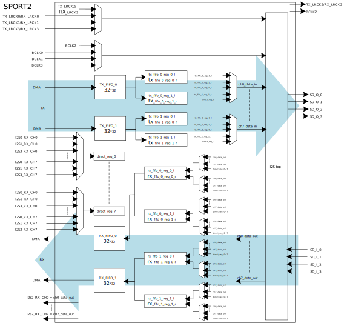

   SPORT2 data path

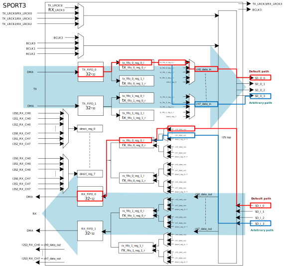

   SPORT3 data path

As shown in :ref:`SPORT2 data path`, the default path is red line and the arbitrary path is blue line. For arbitrary path, default order can be changed by the following interfaces:

- SD_O: ``AUDIO_SP_TXCHNSrcSel(u32 index, u32 fifo_num, u32 NewState)``
- SD_I: ``AUDIO_SP_RXFIFOSrcSel(u32 index, u32 fifo_num, u32 NewState)``

Audio Pad
~~~~~~~~~~~
Audio pad can be used as digital path or analog path, and Audio pad share status can be changed by the interface:

.. code-block:: c

   APAD_InputCtrl(u8 DeviceName, u32 NewState);

- ENABLE: enable digital path
- DISABLE: disable digital path

AOUT Pad
^^^^^^^^^^
If AOUT pad (PB3~PB6) are used as digital I/O functions, HPO should be powered down.

When audio playback is running , HPO will be powered on. Users can call the following interface to power down HPO.

.. code-block:: c

   AUDIO_CODEC_SetHPOPowerMode(u32 channel, u32 powermode)

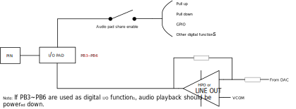

   AOUT pad

MICBIAS Pad
^^^^^^^^^^^^^
If MICBIAS pad (PA30~PA31 and PB0~PB2) are used as digital I/O functions, MICBIAS should be powered down.

When audio record is running , MICBIAS will be powered on. Users can call the following interfaces to power down MICBIAS.

.. code-block:: c

   AUDIO_CODEC_SetMicBiasPowerMode(u32 powermode);
   AUDIO_CODEC_SetMicBiasPCUTMode(u32 amic_num, u32 pcut_mode);

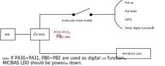

   MICBIAS pad

MIC Pad
^^^^^^^^^
If MIC pad (PA18~PA29) are used as digital I/O functions, MICBST should be mute.

When audio record is running , MICBST will be unmute. Users can call the following interface to mute MICBST.

.. code-block:: c

   AUDIO_CODEC_SetMicBstChnMute(u32 amic_sel, u32 type, u32 newstate);

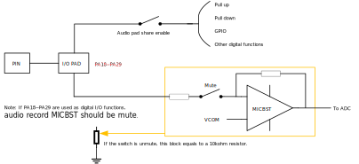

   MIC pad

I2S Layout
~~~~~~~~~~~
Reserve 22ohm resistors on the CLK and DATA paths of I2S. If the layout space allows, increase ground isolation for CLK and DATA as much as possible.

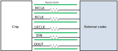

   I2S layout

