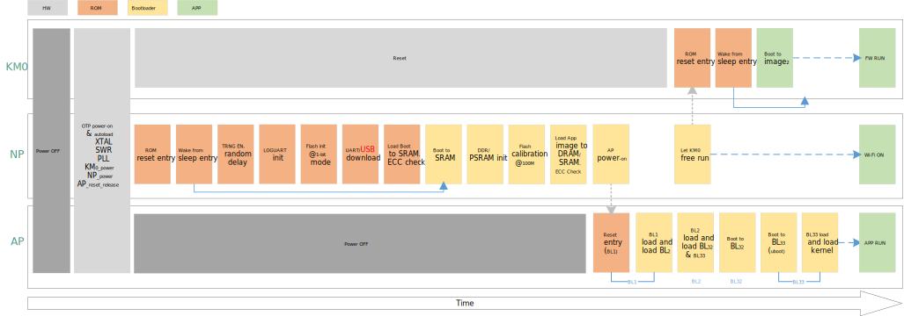

.. _boot_process:

Features
----------------
- On-chip boot ROM

- Contains the bootloader with In-System Programming (ISP) facility

- Secure boot process with multiple cryptographic algorithms of hardware or software engine

- Suspend resume process

- Boot from NAND or NOR Flash

- PSRAM or DDR as memory

Boot Address
------------------------
After reset, CPU will boot from the vector table start address, which is fixed by hardware. KM0, KM4 (NP), and CA32 (AP) all boot from address ``0x0000_0000``, as the following table lists.

.. table:: Boot address
   :width: 100%
   :widths: auto

   +------+-------------+--------------+
   | CPU  | Address     | Type         |
   +======+=============+==============+
   | KM0  | 0x0000_0000 | KM0 ITCM ROM |
   +------+-------------+--------------+
   | KM4  | 0x0000_0000 | KM4 ITCM ROM |
   +------+-------------+--------------+
   | CA32 | 0x0000_0000 | CA32 BUS ROM |
   +------+-------------+--------------+

Pin Description
------------------------------
The |CHIP_NAME| supports ISP (In-System Programming) via LOGUART (``PB23`` and ``PB24``) and USB. The ISP mode is determined by the state of the pin ``PB24`` when boot.

.. table:: ISP mode
   :width: 100%
   :widths: auto

   +-----------+----------------------+-----------------------------------------+
   | Boot mode | PB24 (UART_DOWNLOAD) | Description                             |
   +===========+======================+=========================================+
   | No ISP    | HIGH                 | | ISP bypassed.                         |
   |           |                      | | The IC attempts to boot from Flash.   |
   +-----------+----------------------+-----------------------------------------+
   | ISP       | LOW                  | The IC enters ISP via LOGUART.          |
   +-----------+----------------------+-----------------------------------------+

Boot Flow
------------------
The boot flow of |CHIP_NAME| is illustrated below. After a power-up or hardware reset, hardware will boot NP at clock 200MHz.
The boot process is handled by the on-chip boot ROM and is always executed by the NP core. After the NP bootloader code, the NP will set up the environment for the KM0 and AP.

- NP boots ROM
- NP secure boot (optional)
- NP boots to SRAM
- NP helps KM0 load images and check the signature (optional)
- NP helps AP load images and check the signature (optional)

   Boot flow

The bootloader controls initial operation after reset or power on and also provides the means to program the Flash memory. This could be initial programming of a blank device, erasure and re-programming of a previously programmed device.

Assuming that power supply pins are at their nominal levels when the rising edge on RESET pin is generated, then boot pins are sampled and the decision of whether to continue with user code or ISP handler is made. If the boot pins are sampled LOW, the external hardware request to start the ISP command handler is ignored. If there is no request for the ISP command handler execution, a search is made for a valid user program. If a valid user program is found, then the execution control is transferred to it. If a valid user program is not found, the dead loop is invoked.

Whether boot from NOR or NAND Flash depends on settings in OTP. Also, PSRAM or DDR can be selected to store code and data.

Boot API
----------------
BOOT_Reason
~~~~~~~~~~~~~~~~~~~~~~
Source code: ``{SDK}\component\soc\amebasmart\fwlib\ram_common\ameba_reset.c``

The API used to obtain the cause of the chip boot, and function prototype is as below:

.. code-block:: c

   u32 BOOT_Reason(void);

Default return value of this API is ``0`` when initially powered on, and return vaule of re-boot caused by other reasons can be found in the following table.
Users can found macro-definitions about return value in :file:`sysreg_aon.h`.

.. table::
   :width: 100%
   :widths: auto

   +-----------+---------------------------------------------------------------------+
   | Items     | Description                                                         |
   +===========+=====================================================================+
   | Function  | Get boot reason                                                     |
   +-----------+---------------------------------------------------------------------+
   | Parameter | None                                                                |
   +-----------+---------------------------------------------------------------------+
   | Return    | Boot reason. It can be any of the following values or combinations: |
   |           |                                                                     |
   |           | - AON_SHIFT_RSTF_THM: Thermal reset                                 |
   |           |                                                                     |
   |           | - AON_SHIFT_RSTF_BOR: BOR reset                                     |
   |           |                                                                     |
   |           | - AON_SHIFT_RSTF_DSLP: Wakeup from deep-sleep mode                  |
   |           |                                                                     |
   |           | - AON_RSTF_LPSYS: KM0 system reset                                  |
   |           |                                                                     |
   |           | - AON_RSTF_NPSYS: KM4 system reset                                  |
   |           |                                                                     |
   |           | - AON_RSTF_APSYS: CA32 system reset                                 |
   |           |                                                                     |
   |           | - AON_RSTF_IWDG: KM0 independent watchdog reset                     |
   |           |                                                                     |
   |           | - AON_RSTF_WDG1: KM4 secure watchdog reset                          |
   |           |                                                                     |
   |           | - AON_RSTF_WDG2: KM4 non-secure watchdog reset                      |
   |           |                                                                     |
   |           | - AON_RSTF_WDG3: CA32 secure watchdog reset                         |
   |           |                                                                     |
   |           | - AON__RSTF_WDG4: CA32 non-secure watchdog reset                    |
   +-----------+---------------------------------------------------------------------+

