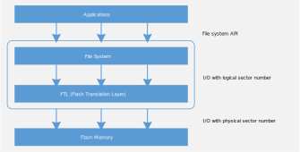
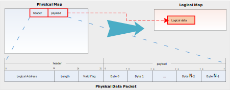

.. _ftl:

Overview
----------------
The NOR Flash is comprised of blocks, which contains pages, and they contain individual cells of data.
Flash read/write operations take place at page level, but erase operations take place at the block level. The Flash needs to be erased before write.
The memory portion for erasing differs in size from that for reading or writing, resulting in the major performance degradation of the overall Flash memory system.

Therefore, a type of system software termed FTL has been introduced, which is provided to make the Flash a friendly medium to store data. The architecture of Flash memory system is shown below.

   Architecture of Flash memory system

The FTL algorithm provides the following functionalities:

- Logical-to-physical address mapping: Convert logical addresses from the file system to physical addresses in Flash memory.
- Power-off recovery: Even when a sudden power-off event occurs during FTL operations, FTL data structures should be preserved and data consistency should be guaranteed.
- Wear-leveling: Wear down memory blocks as evenly as possible.

As the following figure shows, to write data to logical map, FTL would generate a data packet in specified format and store it in Flash.

- To modify data in logical map, a new packet would be generated and appended to the end of physical map. When the physical pages are nearly full, the garbage collection is triggered to recycle the old pages which would be erased.
- To read data from logical map, FTL would search the physical map to find the newest packet, which contains the data of specified address.

   FTL overview

When using FTL, users don't need to care about physical map, which is maintained automatically by FTL.

Features
----------------
- Physical Map

  - Physical page size: 4096  bytes
  - Configurable physical page number
  - Physical map size: 4096 * physical_page_number

- Logical Map: The maximum logical map size determined by physical map size is

  .. math::

     [511 \times  (\rm physical\_page\_number -1)-1] \times  4

- Auto Garbage Collection
- Abnormal Power-off Protection

How to Use FTL
----------------------------
Precautions
~~~~~~~~~~~~~~~~~~~~~~
When using FTL, you must know the precautions below.

- Theoretically, the logical map area can be extended to 64KB; but the maximum usable logical map area limited by the actual physical space is :math:`[511 \times  (\rm physical\_page\_number -1)-1] \times  4`.
- The default physical page number is 3, and it is not recommended to increase, because the default internal implement of FTL will malloc a buffer to cache the content of FTL.

  - For typical BLE application, each connection needs about 256 bytes FTL memory, and SDK will maintain 3 connections' information by default.
  - For BLE mesh, each node needs about 20 bytes FTL memory. The maximum node number can be set by :literal:`dev_key_num`.

The following table lists three typical scenarios of BLE, refer to it to set the appropriate offset of application according to your actual situation.

.. table:: Examples of recommended settings
   :width: 100%
   :widths: auto

   +------------------------------------+----------------------------------------+---------------------------------+---------------------------------------------------------------------------------+
   | Scenario                           | Calculation                            | Start address of application    | Remark                                                                          |
   |                                    |                                        +----------------+----------------+                                                                                 |
   |                                    |                                        | Configurable   | Recommended    |                                                                                 |
   +------------------------------------+----------------------------------------+----------------+----------------+---------------------------------------------------------------------------------+
   | 3 connections                      | | ((3*256 + 20*50) + 1024) bytes       | 1768 ~ 3060    | 2500           | | It is recommended to reserve some memory for system extension.                |
   |                                    | | (< 4084 bytes) are needed totally.   |                |                | | The recommended offset has some reservation for both system and application.  |
   | Less than 50 mesh nodes            |                                        |                |                | | For these two scenarios, 3 physical pages are enough.                         |
   |                                    |                                        |                |                |                                                                                 |
   | 1KB FTL space for application      |                                        |                |                |                                                                                 |
   +------------------------------------+----------------------------------------+----------------+----------------+                                                                                 |
   | 5 connections                      |  | (5*256 + 2048) bytes                | 1280 ~ 2036    | 1600           |                                                                                 |
   |                                    |  | (< 4084 bytes) are needed totally.  |                |                |                                                                                 |
   | 2KB FTL space for application      |                                        |                |                |                                                                                 |
   +------------------------------------+----------------------------------------+----------------+----------------+---------------------------------------------------------------------------------+
   | 5 connections                      | | ((5*256 + 20*60) + 6144) bytes       | _              | _              | | It is not recommended to store so much information in FTL.                    |
   |                                    | | are needed totally.                  |                |                | | Try to find another solution, such as DCT.                                    |
   | Less than 60 mesh   nodes          |                                        |                |                |                                                                                 |
   |                                    |                                        |                |                |                                                                                 |
   | 6KB FTL space for   application    |                                        |                |                |                                                                                 |
   +------------------------------------+----------------------------------------+----------------+----------------+---------------------------------------------------------------------------------+

General Steps
~~~~~~~~~~~~~~~~~~~~~~~~~~
To use FTL, the following steps are necessary.

1. If Bluetooth is enabled in your system, :literal:`CONFIG_FTL_ENABLED` is defined automatically after defining :literal:`CONFIG_BT_EN` in :file:`platform_opts_bt.h`.

   .. code-block:: c

      #if defined(CONFIG_BT) && CONFIG_BT
         #if (defined(CONFIG_BT_NP) && CONFIG_BT_NP) || (defined(CONFIG_BT_SINGLE_CORE) && CONFIG_BT_SINGLE_CORE)
            #define CONFIG_FTL_ENABLED  1
         #endif
      #endif

2. The address range of FTL is defined in :file:`ameba_flashcfg. c`.

   .. code-block::

      Flash_Layout_Nor
      Flash_Layout_Nor_Linux

   .. note::
      The default configurations for logical & physical map is as follows:

      - Three pages allocate for physical map: ``0x08620000~ 0x08622FFF``
      - Logical map size: 4084 bytes

3. Call :func:`ftl_load_from_storage`/ :func:`ftl_save_to_storage` functions to read from/write to logical map.
