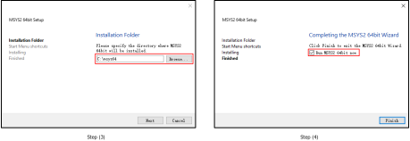
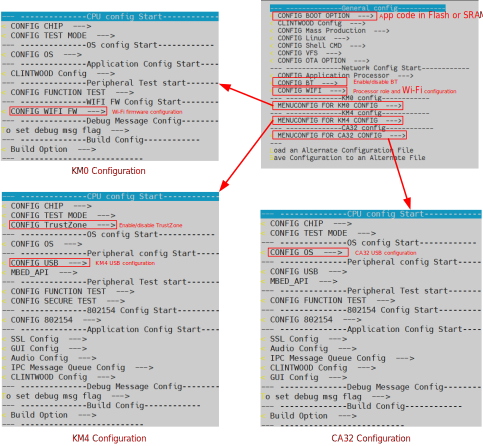
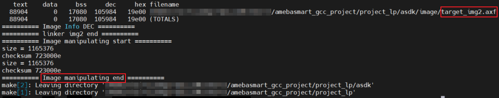
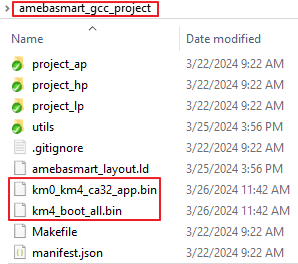
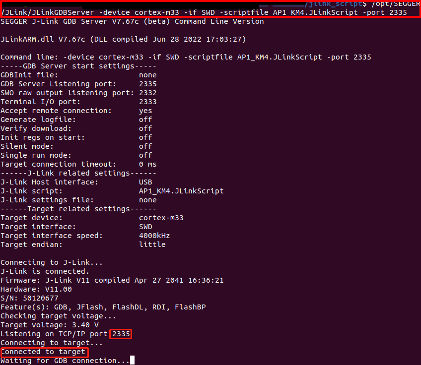
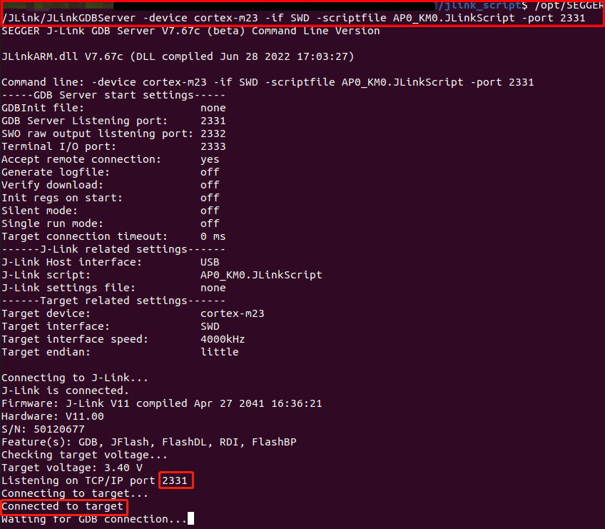
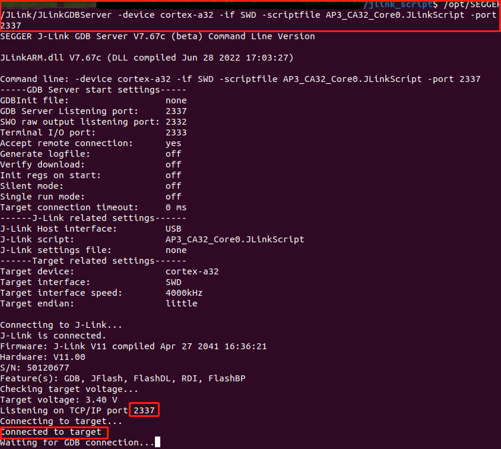
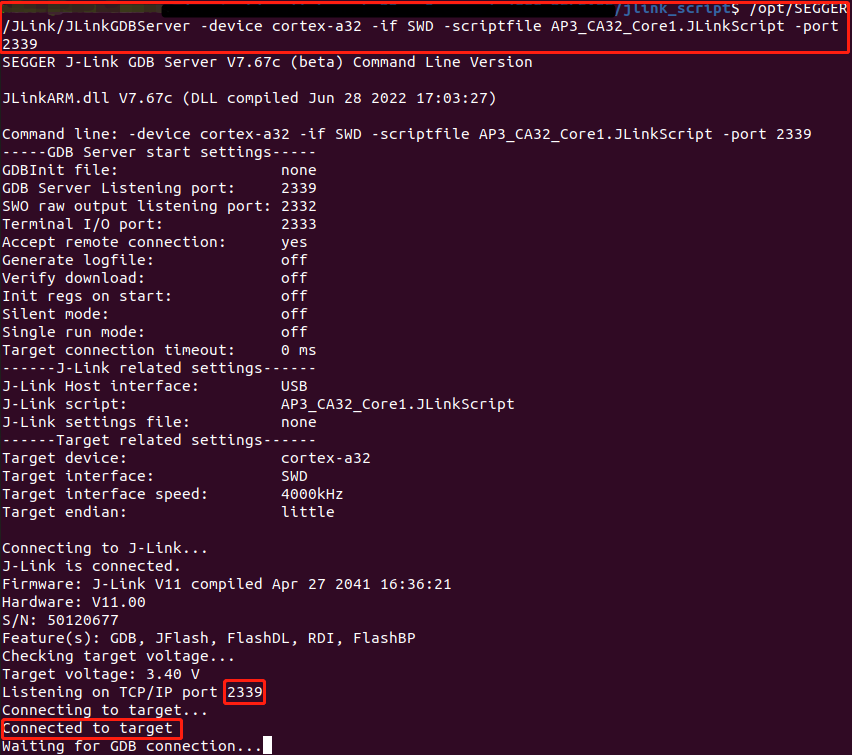
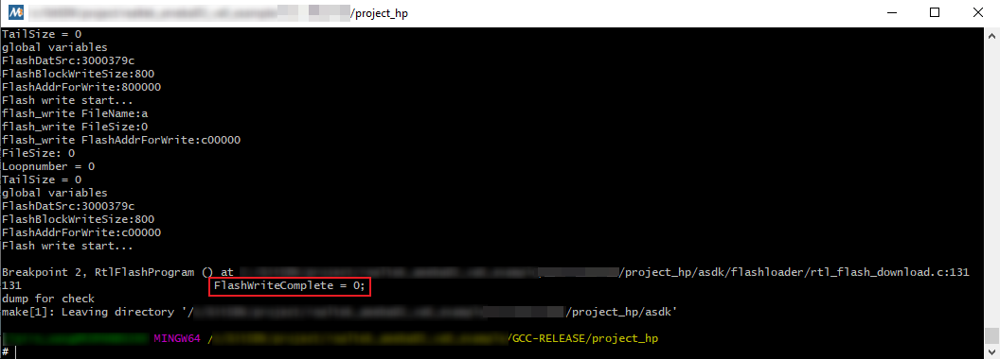
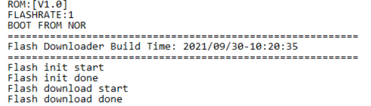

.. _build_environment:

Introduction
------------------------
This chapter illustrates how to build Realtek's SDK under GCC environment. It focuses on both Windows and Linux platform. The build and download procedures are quite similar between Windows and Linux operating systems.

- For Windows, Windows 10 64-bit is used as a platform.
- For Linux, Ubuntu 16.04 64-bit is used as a platform.

Preparing GCC Environment
--------------------------------------------------
.. _windows_gcc_environment:

Windows
~~~~~~~~~~~~~~
On Windows, you can use MSYS2 + MinGW as the GCC environment.

- MSYS2 is a collection of tools and libraries providing you with an easy-to-use environment for building, installing, and running native Windows software.
- MinGW is an advancement of the original mingw.org project, created to support the GCC compiler on Windows system.

The steps to prepare GCC environment are as follows:

1. Download MSYS2 on https://www.msys2.org.

2. Run the installer. MSYS2 requires 64-bit Windows 7 or newer.

.. _windows_preparing_gcc_environment_step_3:

3. Enter your desired ``Installation Folder`` (short ASCII-only path, no accents, spaces, symlinks nor network drives).

4. When done, tick :guilabel:`Run MSYS2 now` and click :guilabel:`Finish`. Now MSYS2 is ready for you and a terminal will launch.

5. Update the package database and core system packages with:

   .. code-block::

      pacman -Syu

   When ``Proceed with installation? [Y/n]`` is displayed, type ``Y`` and continue until the package installation is done.

   .. figure:: ../figures/proceed_with_installation.svg
      :scale: 120%
      :align: center

   .. caution::
      After installation of MSYS2, there will be four start modes:

         - MSYS2 MinGW 32-bit

         - MSYS2 MinGW 64-bit

         - MSYS2 MinGW UCRT 64-bit

         - MSYS2 MSYS

      Because the toolchain release is based on 64-bit MinGW, choose :guilabel:`MSYS2 MinGW 64-bit` when starting the MinGW terminal.

6. Launch :guilabel:`MSYS2 MinGW 64-bit` from  ``Start`` menu. Update the rest with:

   .. code-block::

      pacman -Su

   When ``Proceed with installation? [Y/n]`` is displayed, type ``Y`` and continue until the package installation is done.

   .. figure:: ../figures/proceed_with_installation_y.png
      :scale: 90%
      :align: center

7. Install the necessary software packages with:

   .. code-block::

      pacman –S make
      pacman –S unzip
      pacman –S gcc
      pacman –S python
      pacman –S ncurses-devel
      pacman –S openssl-devel
      pacman -S mingw-w64-x86_64-gcc-libs

   When ``Proceed with installation? [Y/n]`` is displayed, type ``Y`` and continue until each software package installation is done.

8. Remove the file path length limit by editing the registry to allow the file paths longer than 260 characters.

   a. Press :kbd:`Win+R`  keys to open the :guilabel:`Run` dialog box, then type ``regedit`` and press :guilabel:`Enter` to open the ``Registry Editor``.

   b. Navigate to the registry key: ``Computer\HKEY_LOCAL_MACHINE\SYSTEM\CurrentControlSet\Control\FileSystem``.

   c. Search and check if the :guilabel:`LongPathsEnabled` item exists. If not, go to Step :ref:`d <windows_preparing_gcc_environment_step_8_d>`; otherwise, go to Step :ref:`e <windows_preparing_gcc_environment_step_8_e>`.

   .. _windows_preparing_gcc_environment_step_8_d:

   d. Right-click on an empty space in the right pane, then select :menuselection:`New > DWORD (32-bit) Value`, and name it ``LongPathsEnabled``.

   .. _windows_preparing_gcc_environment_step_8_e:

   e. Double-click on :guilabel:`LongPathsEnabled` and set its value to 1, then click :guilabel:`OK` to save.

Linux
~~~~~~~~~~
On Linux, 32-bit Linux is not supported because of the toolchain.

The packages listed below should be installed for the GCC environment:

- ``gcc``
- ``libncurses5``
- ``make``
- ``libssl-dev``
- ``bash``
- ``binutils``

Some of these packages may have been pre-installed in your operating system.
You can either use package manager or type the corresponding version command on terminal to check whether these packages have already existed. If not, make them installed.

- ``$ls -l /bin/sh``

  Starting from Ubuntu 6.10, dash is used by default instead of bash. You can check by using ``$ls -l /bin/sh`` command to check whether the system shell is bash or dash.

  - (Optional) If the system shell is dash, use ``$sudo dpkg-reconfigure dash`` command to switch from dash to bash.

  - If the system shell is bash, continue to do the subsequent operations.

  .. figure:: ../figures/switching_from_dash_to_bash.png
     :scale: 85%
     :align: center

- ``$make -v``

  .. figure:: ../figures/make_v.png
     :scale: 85%
     :align: center

- ``$sudo apt-get install libssl-dev``

  .. figure:: ../figures/libssl_dev.png
     :scale: 75%
     :align: center

- ``binutils``

  Using ``ld -v`` command to check if binutils has been installed. If not, the following error may occur.

  .. figure:: ../figures/binutils.png
     :scale: 70%
     :align: center

Troubleshooting
~~~~~~~~~~~~~~~~
- MSYS2 pacman is responsible for managing and installing software, which is similar to apt-get in ubuntu. When ``bash:XXX:command not found`` appears, you can try instruction ``pacman -S <package_name>`` to install.
- For the detailed information of one package, try ``pacman -Si <package_name>``.
- If the system head files are not found when building tool, ``No such file or directory`` error will show up. You can try ``pacman -Fy <FILE_NAME>`` to check which package is lost, and install the lost package. If too many packages are lost, look for the detailed information about the packages to decide which to install.
- For multi-version python host, command ``update-alternatives --install/usr/bin/python python/usr/bin/python3.x 1`` can be used to select python of specific version 3.x, where x represents a desired version number.
- If the error ``command 'python' not found`` appears during compilation, type command ``ln -s /usr/bin/python3 /usr/bin/python`` first to make sure that python3 is used when running python.

Installing Toolchain
---------------------
Windows
~~~~~~~
This section introduces the steps to prepare the toolchain environment.

1. Acquire the zip files of |CHIP_NAME| toolchain from Realtek.

.. _windows_installing_toolchain_step_2:

2. Create a new directory ``rtk-toolchain`` under the path ``{MSYS2_path}\opt``.

   For example, if your MSYS2 installation path is as set in :ref:`windows_gcc_environment` :ref:`Step 3 <windows_preparing_gcc_environment_step_3>`, the ``rtk-toolchain`` should be in ``C:\msys64\opt``.

   .. figure:: ../figures/windows_rtk_toolchain_1.png
      :scale: 100%
      :align: center

3. Unzip ``asdk-10.3.x-mingw32-newlib-build-xxxx.zip`` and place the toolchain folder ``asdk-10.3.x`` to the folder ``rtk-toolchain`` created in :ref:`Step 2 <windows_installing_toolchain_step_2>`.

   .. figure:: ../figures/windows_rtk_toolchain_2.png
      :scale: 80%
      :align: center

.. note::
   - The unzip folders should stay the same with the figure above and do NOT change them, otherwise you need to modify the toolchain directory in makefile to customize the path.
   - If an error of the toolchain, just like the log ``Error: No Toolchain in \opt\rtk-toolchain\vsdk-10.2.0\mingw32\newlib`` appears when building the project, find out if your toolchain files directory are not the same with the directory in the log. Place the toolchain files correctly and try again.

Linux
~~~~~~
This section introduces the steps to prepare the toolchain environment.

1. Acquire the zip files of |CHIP_NAME| toolchain from Realtek.

2. Create a new directory ``rtk-toolchain`` under ``/opt``.

   .. figure:: ../figures/linux_rtk_toolchain_1.png
      :scale: 80%
      :align: center

3. Unzip :file:`asdk-10.3.x-linux-newlib-build-xxxx.tar.bz2` to ``\opt\rtk-toolchain``, then you can get the directory below:

   .. figure:: ../figures/linux_rtk_toolchain_2.png
      :scale: 75%
      :align: center

.. note::
   The unzip folders should stay the same with the figure above and do NOT change them, otherwise you need to modify the toolchain directory in makefile to customize the path.

.. _configuring_sdk:

Configuring SDK
-----------------
This section illustrates how to change SDK configurations.

Users can configure SDK options for KM0/KM4/CA32 at the same time through ``$make menuconfig`` command.

1. Switch to the directory ``{SDK}\amebasmart_gcc_project``.

2. Run ``$make menuconfig`` command on MSYS2 MinGW 64-bit (Windows) or terminal (Linux)

   .. note::
      ``$make menuconfig`` command is only supported under ``{SDK}\amebasmart_gcc_project``, but not supported under other paths.

The main configurable options are divided into five parts:

- ``General Config``: the shared kernel configurations for KM0/KM4/CA32. The configurations will take effect in all CPUs.
- ``Network Config``: the incompatible kernel configurations for KM4 and CA32. Take Wi-Fi as an example, it can be set to INIC mode (KM4 is NP and CA32 is AP) and single core mode (KM4 is both NP and AP). The configurations will take effect in KM4 and CA32.
- ``KM0 Config``: the configurations will take effect only in KM0.
- ``KM4 Config``: the configurations will take effect only in KM4.
- ``CA32 Config``: the configurations will take effect only in CA32.

The following figure is the menuconfig UI, and the options in red may be used frequently.

   menuconfig UI

.. _building_code:

Building Code
---------------
This section illustrates how to build SDK for both Window and Linux.

.. table:: GCC project directory
   :width: 100%
   :widths: auto

   +-------------+-------------------------------------------+
   | GCC project | Directory                                 |
   +=============+===========================================+
   | CA32        | {SDK}\\amebasmart_gcc_project\\project_ap |
   +-------------+-------------------------------------------+
   | KM4         | {SDK}\\amebasmart_gcc_project\\project_hp |
   +-------------+-------------------------------------------+
   | KM0         | {SDK}\\amebasmart_gcc_project\\project_lp |
   +-------------+-------------------------------------------+

.. note::
   Replace the ``{SDK}`` with your own SDK path.

There are two ways to build the SDK, you can choose either of them.

Build One by One
~~~~~~~~~~~~~~~~~
Follow the steps below to build SDK of all the projects one by one:

1. Use ``$cd`` command to switch to the project directories of SDK.

   - On Windows, open MSYS2 MinGW 64-bit terminal and use ``$cd`` command.
   - On Linux, open its own terminal and use ``$cd`` command.

   For example, you can type ``$cd {SDK}\amebasmart_gcc_project\project_hp`` to switch to the KM4 project directory, the same operation for other projects.

2. Build SDK under the project directory on Windows or Linux.

   - For normal image, simply use ``$make all`` command to build SDK.
   - For MP image, refer to Section :ref:`how_to_build_mp_image` to build SDK.

3. Check the command execution results. If somehow failed, type ``$make clean`` to clean and then redo the make procedure.

   - For KM4 project, if the terminal contains ``target_img2.axf`` and ``Image manipulating end`` messages, it means that the images have been built successfully. You can find them under ``{SDK}\amebasmart_gcc_project\project_hp\asdk\image``, as shown in :ref:`km4_project_make_all` and :ref:`km4_image_generation`.

     .. figure:: ../figures/km4_project_make_all.PNG
        :scale: 90%
        :align: center
        :name: km4_project_make_all

        KM4 project make all

     .. figure:: ../figures/km4_image_generation.PNG
        :scale: 90%
        :align: center
        :name: km4_image_generation

        KM4 image generation

   - For KM0 project, if the terminal contains ``target_img2.axf`` and ``Image manipulating end`` messages, it means that the images have been built successfully. You can find them under ``{SDK}\amebasmart_gcc_project\project_lp\asdk\image``, as shown in :ref:`km0_project_make_all` and :ref:`km0_image_generation`.

     .. figure:: ../figures/km0_project_make_all.PNG
        :scale: 90%
        :align: center
        :name: km0_project_make_all

        KM0 project make all

     .. figure:: ../figures/km0_image_generation.PNG
        :scale: 90%
        :align: center
        :name: km0_image_generation

        KM0 image generation

   - For CA32 project, if the terminal contains ``fip.bin`` and ``Image manipulating end`` messages, it means that the images have been built successfully. You can find them under ``{SDK}\amebasmart_gcc_project\project_ap\asdk\image``, as shown in :ref:`ca32_project_make_all` and :ref:`ca32_image_generation`.

     .. figure:: ../figures/ca32_project_make_all.PNG
        :scale: 90%
        :align: center
        :name: ca32_project_make_all

        CA32 project make all

     .. figure:: ../figures/ca32_image_generation.PNG
        :scale: 90%
        :align: center
        :name: ca32_image_generation

        CA32 image generation

Build Together
~~~~~~~~~~~~~~~
In order to improve the efficiency of building SDK, you can also execute ``$make all`` command once under ``{SDK}\amebasmart_gcc_project``, instead of executing ``$make all`` command separately under each project.

- If the terminal contains ``target_img2.axf`` and ``Image manipulating end`` messages (see :ref:`all_projects_make_all`), it means that the images have been built successfully. The images are generated in ``{SDK}\amebasmart_gcc_project``, as shown in :ref:`km4_km0_ca32_image_generation`. You can also find other generated images under ``\project_hp\asdk\image``, ``\project_lp\asdk\image``, and ``\project_ap\asdk\image``.
- If somehow failed, type ``$make clean`` to clean and then redo the make procedure.

   All projects make all

   KM4 & KM0 & CA32 image generation

.. note::
   If you want to search some ``.map`` files for debug, get them under ``\project_hp\asdk\image``, ``\project_lp\asdk\image``, or ``\project_ap\asdk\image``.

Troubleshooting
~~~~~~~~~~~~~~~~~
If compilation result shows that some files can't be found, like ``fatal error: machine\_default_types.h: No such file or directory 12 | #include <machine/_default_types.h>``, you can check your SDK path. When SDK path is too long, it may be truncated, so the file cannot be found. You can move the SDK to the root path of the disk and try again.

.. _setting_debugger:

Setting Debugger
-----------------
J-Link
~~~~~~~~~~~~
The |CHIP_NAME| supports J-Link debugger. Before setting J-Link debugger, you need to do some hardware configuration and download images to the |CHIP_NAME| device first.

1. Connect J-Link to the SWD of |CHIP_NAME|.

   a. Refer to the following figure to connect SWCLK pin of J-Link to SWD CLK pin of |CHIP_NAME|, and SWDIO pin of J-Link to SWD DATA pin of |CHIP_NAME|.

   b. Connect the |CHIP_NAME| device to PC after finishing these configurations.

   .. figure:: ../figures/wiring_diagram_of_connecting_jlink_to_swd.svg
      :scale: 110%
      :align: center

      Wiring diagram of connecting J-Link to SWD

   .. note::
      For |CHIP_NAME|, the J-Link version must be v9 or higher. If Virtual Machine (VM) is used as your platform, make sure that the USB connection setting between VM host and client is correct, so that the VM host can detect the device.

2. Download images to the |CHIP_NAME| device via Image Tool.

   ImageTool is a software tool provided by Realtek. For more information, refer to :ref:`Image Tool <image_tool>`.

Windows
^^^^^^^^^^^^^^
Besides the hardware configuration, J-Link GDB server is also required to install.

For Windows, click https://www.segger.com/downloads/jlink and download the software in ``J-Link Software and Documentation Pack``, then install it correctly.

.. note::
   The version of J-Link GDB server below is just an example, you can select the latest version to download.

KM4 Setup
******************
1. Execute the :file:`cm4_jlink.bat`

   Double-click the :file:`cm4_jlink.bat` under ``{SDK}\amebasmart_gcc_project\utils\jlink_script``. You may have to change the path of :file:`JLinkGDBServer.exe` in the :file:`cm4_jlink.bat` script according to your own settings.

   The started J-Link GDB server looks like below. This window should NOT be closed if you want to download the image or enter debug mode.

   .. figure:: ../figures/km4_j_link_gdb_server_connection_under_windows.png
      :scale: 90%
      :align: center

      KM4 J-Link GDB server connection under Windows

   .. caution:: Keep this window active to download the images to target.

2. Switch directory to project_hp for KM4

   Use ``$cd`` command to change the directory to project_hp, then you can input commands in section :ref:`command_lists` or :ref:`gdb_command_lists`.

KM0 Setup
******************
1. Execute the :file:`cm0_jlink.bat`

   Double-click the :file:`cm0_jlink.bat` under ``{SDK}\amebasmart_gcc_project\utils\jlink_script``, the same as executing the :file:`cm4_jlink.bat`.

   The started J-Link GDB server looks like below. This window should NOT be closed if you want to download the image or enter debug mode. Because KM4 will download all the images, you don't need to connect J-Link to KM0 when downloading images. J-Link can connect to KM0 when debugging.

   .. figure:: ../figures/km0_j_link_gdb_server_connection_under_windows.png
      :scale: 90%
      :align: center

      KM0 J-Link GDB server connection under Windows

2. Switch directory to project_lp for KM0

   Use ``$cd`` command to change the directory to project_lp, then you can input command in section :ref:`command_lists` or :ref:`gdb_command_lists`.

CA32 Setup
********************
The CA32 has two cores named core0 and core1, which can be debugged separately. By default, :file:`ca32_jlink_core0.bat` is for core0 and :file:`ca32_jlink_core1.bat` is for core1.

1. Double-click the :file:`ca32_jlink_core0.bat` under ``{SDK}\amebasmart_gcc_project\utils\jlink_script``.

   The started J-Link GDB server looks like below. CA32 core0 listens on port 2337 by default. This GDB Server window should NOT be closed if you want to enter debug mode.

   .. figure:: ../figures/ca32_core0_j_link_gdb_server_connection_under_windows.png
      :scale: 90%
      :align: center

      CA32 core0 J-Link GDB server connection under Windows

2. Double click the :file:`ca32_jlink_core1.bat` under ``{SDK}\amebasmart_gcc_project\utils\jlink_script``.

   The started J-Link GDB server looks like below. CA32 core1 listens on port 2339 by default.

   .. figure:: ../figures/ca32_core1_j_link_gdb_server_connection_under_windows.png
      :scale: 90%
      :align: center

      CA32 core1 J-Link GDB server connection under Windows

.. caution::
   - When opening core1 GDB server, core0 and core1 will halt and can't run together. Open this window only when you want to debug two cores together, and you know what you are doing.
   - To debug core0 and core1 separately, make sure that function :func:`EnabelCrossTrigger()` is commented out as below.

     .. code-block::

        void InitTarget(void) {
           Report("******************************************************");
           Report("J-Link script: AmebaSmart (Cortex-A32 CPU0) J-Link script");
           Report("******************************************************");
           …
           //EnabelCrossTrigger();  // comment out if needed
        }

Linux
^^^^^^^^^^
For J-Link GDB server, click https://www.segger.com/downloads/jlink and download the software in ``J-Link Software and Documentation Pack``. It is suggested to use Debian package manager to install the Debian version.

Open a new terminal and type the following command to install GDB server where J-Link version is up to the downloaded software. After the installation of software package, there is a tool named ``JLinkGDBServer`` under the J-Link directory. Take Ubuntu 18.04 as example, the JLinkGDBServer can be found at ``/opt/SEGGER/JLink/``.

.. code-block::

   $dpkg -i jlink_6.0.7_x86_64.deb

.. note::
   The version of J-Link GDB server below is just an example, you can select the latest version to download.

KM4 Setup
******************
1. Open a new terminal under ``{SDK}/amebasmart_gcc_project/utils/jlink_script``.

2. Type ``$/opt/SEGGER/JLink/JLinkGDBServer -device cortex-m33 -if SWD -scriptfile AP1_KM4.JLinkScript -port 2335``. This terminal should NOT be closed if you want to download software or enter GDB debugger mode.

If the connection is successful, the log is shown as below.

   KM4 J-Link GDB server connection success

KM0 Setup
******************
1. Open a new terminal under ``{SDK}/amebasmart_gcc_project/utils/jlink_script``.

2. Type ``$/opt/SEGGER/JLink/JLinkGDBServer -device cortex-m23 -if SWD -scriptfile AP0_KM0.JLinkScript -port 2331``. This terminal should NOT be closed if you want to download software or enter GDB debugger mode.

If the connection is successful, the log is shown as below.

   KM0 J-Link GDB server connection success

CA32 Setup
********************
For CA32 core0:

1. Open a new terminal under ``{SDK}/amebasmart_gcc_project/utils/jlink_script``.

2. Type ``$/opt/SEGGER/JLink/JLinkGDBServer -device cortex-a32 -if SWD -scriptfile AP3_CA32_Core0.JLinkScript -port 2337``. This terminal should NOT be closed if you want to download software or enter GDB debugger mode.

If the connection is successful, the log is shown as below.

   CA32 core0 J-Link GDB server connection

For CA32 core1:

1. Open a new terminal under ``{SDK}/amebasmart_gcc_project/utils/jlink_script``.

2. Type ``$/opt/SEGGER/JLink/JLinkGDBServer -device cortex-a32 -if SWD -scriptfile AP3_CA32_Core1.JLinkScript -port 2339``. This terminal should NOT be closed if you want to download software or enter GDB debugger mode.

If the connection is successful, the log is shown as below.

   CA32 core1 J-Link GDB server connection under Linux

Downloading Image to Flash
-----------------------------
There are two ways to download image to flash:

- Image Tool, a software provided by Realtek. For more information, refer to :ref:`Image Tool <image_tool>`.
- GDB Server, mainly used for GDB debug user case.

This section illustrates the second method to download images to Flash.

To download software into Device Board, make sure steps mentioned in section :ref:`building_code` are done and then type ``$make flash`` command on MSYS2 (Windows) or terminal (Linux).

Images are downloaded only under KM4 by this command. This command downloads the software into Flash and it will take several seconds to finish, as shown in the following figure.

   Downloading Image to Flash

   Download codes success log

To check whether the image is downloaded correctly into memory, you can select "verify download" before downloading images, and during image download process, "verified OK" log will be shown.

.. figure:: ../figures/verify_download.png
   :scale: 75%
   :align: center

   Verify download

After download is successful, press the :guilabel:`Reset` button and you will see that the device boots with the new image.

.. note::
   Only executing command under KM4 project is needed for downloading images, because KM4 will download all the images.

.. _entering_debug_mode:

Entering Debug Mode
--------------------------------------
GDB Server
~~~~~~~~~~~~~~~~~~~~
To enter GDB debugger mode, follow the steps below:

1. Make sure that the steps mentioned in sections :ref:`Configuring_sdk` to :ref:`setting_debugger` are finished, then reset the device.

2. Change directory to target project which can be project_lp, project_hp or project_ap, and type ``$make debug`` command on MSYS2 (Windows) or terminal (Linux).

J-Link
~~~~~~~~~~~~
1. Press :kbd:`Win+R` on your keyboard. Hold down the Windows key on your keyboard, and press the :guilabel:`R` button. This will open the ``Run`` tool in a new pop-up window. Alternatively, you can find and click :guilabel:`Run`  on the Start menu.

2. Type ``cmd`` in the Run window. This shortcut will open the Command Prompt terminal.

3. Click :guilabel:`OK` in the Run window. This will run your shortcut command, and open the ``Command Prompt`` terminal in a new window.

4. Copy the J-Link script commad below for specific target:

   - For KM4:

     .. code-block::

        "{Jlink_path}\JLink.exe" -device Cortex-M33 -if SWD -speed 4000 -autoconnect 1 -JLinkScriptFile {script_path}\AP1_KM4.JLinkScript

   - For KM0:

     .. code-block::

        "{Jlink_path}\JLink.exe" -device Cortex-M23 -if SWD -speed 4000 -autoconnect 1 -JLinkScriptFile {script_path}\AP0_KM0.JLinkScript

   - For CA32 core0:

     .. code-block::

        "{Jlink_path}\JLink.exe" -device Cortex-A32 -if SWD -speed 4000 -autoconnect 1 -JLinkScriptFile {script_path}\AP3_CA32_Core0.JLinkScript

   - For CA32 core1:

     .. code-block::

        "{Jlink_path}\JLink.exe" -device Cortex-A32 -if SWD -speed 4000 -autoconnect 1 -JLinkScriptFile {script_path}\AP3_CA32_Core1.JlinkScript

.. note::

   - `{Jlink_path}`: the path your Segger J-Link installed. The default is ``C:\Program Files (x86)\SEGGER\JLink``.
   - `{script_path}`: ``{SDK}\amebasmart_gcc_project\utils\jlink_script`` of your SDK.

.. _command_lists:

Command Lists
--------------------------
The commands mentioned above are listed in the following list.

.. table:: Command lists
   :width: 100%
   :widths: 10 30 60

   +-------+------------------------------------+---------------------------------------------+
   | Usage | Command                            | Description                                 |
   +=======+====================================+=============================================+
   | all   | ``$make all``                      | Compile the project to generate ram_all.bin |
   +-------+------------------------------------+---------------------------------------------+
   | flash | ``$make flash``                    | Download ram_all.bin to Flash               |
   +-------+------------------------------------+---------------------------------------------+
   | clean | ``$make clean``                    | Remove compile file (.bin, .o, …)           |
   +-------+------------------------------------+---------------------------------------------+
   | debug | ``$make debug``                    | Enter debug mode                            |
   +-------+------------------------------------+---------------------------------------------+

.. _gdb_command_lists:

GDB Debugger Basic Usage
------------------------------------------------
GDB, the GNU project debugger, allows you to examine the program while it executes, and it helps catch bugs. Section :ref:`entering_debug_mode` has described how to enter GDB debugger mode, this section illustrates some basic usages of GDB commands.

For more information about GDB debugger, click https://www.gnu.org/software/gdb/. The following table describes commonly used instructions and their functions, and specific usage can be found in ``GDB User Manual`` of website https://www.sourceware.org/gdb/documentation/.

.. table:: GDB debugger command list
   :width: 100%
   :widths: 20 10 70

   +---------------------------------+------------+---------------------------------------------------------------------------------------------------------------------------------------------------------------------------+
   | Usage                           | Command    | Description                                                                                                                                                               |
   +=================================+============+===========================================================================================================================================================================+
   | Breakpoint                      | $break     | Breakpoints are set with the break command (abbreviated b).                                                                                                               |
   |                                 |            |                                                                                                                                                                           |
   |                                 |            | The usage can be found at ``Setting Breakpoints`` section.                                                                                                                |
   +---------------------------------+------------+---------------------------------------------------------------------------------------------------------------------------------------------------------------------------+
   | Watchpoint                      | $watch     | You can use a watchpoint to stop execution whenever the value of an expression changes. The related commands include watch, rwatch, and awatch.                           |
   |                                 |            |                                                                                                                                                                           |
   |                                 |            | The usage of these commands can be found at ``Setting Watchpoints`` section.                                                                                              |
   |                                 |            |                                                                                                                                                                           |
   |                                 |            | .. note::                                                                                                                                                                 |
   |                                 |            |    Keep the range of watchpoints less than 20 bytes.                                                                                                                      |
   +---------------------------------+------------+---------------------------------------------------------------------------------------------------------------------------------------------------------------------------+
   | Print breakpoints & watchpoints | $info      | To print a table of all breakpoints, watchpoints set and not deleted, use the info command. You can simply type info to know its usage.                                   |
   +---------------------------------+------------+---------------------------------------------------------------------------------------------------------------------------------------------------------------------------+
   | Delete breakpoints              | $delete    | To eliminate the breakpoints, use the delete command (abbreviated d).                                                                                                     |
   |                                 |            |                                                                                                                                                                           |
   |                                 |            | The usage can be found at ``Deleting Breakpoints`` section.                                                                                                               |
   +---------------------------------+------------+---------------------------------------------------------------------------------------------------------------------------------------------------------------------------+
   | Continue                        | $continue  | To resume program execution, use the continue command (abbreviated c).                                                                                                    |
   |                                 |            |                                                                                                                                                                           |
   |                                 |            | The usage can be found at ``Continue and Stepping`` section.                                                                                                              |
   +---------------------------------+------------+---------------------------------------------------------------------------------------------------------------------------------------------------------------------------+
   | Step                            | $step      | To step into a function call, use the step command (abbreviated s). It will continue running your program until the control reaches a different source line.              |
   |                                 |            |                                                                                                                                                                           |
   |                                 |            | The usage can be found at ``Continue and Stepping`` section.                                                                                                              |
   +---------------------------------+------------+---------------------------------------------------------------------------------------------------------------------------------------------------------------------------+
   | Next                            | $next      | To step through the program, use the next command (abbreviated n). The execution will stop when the control reaches a different line of code at the original stack level. |
   |                                 |            |                                                                                                                                                                           |
   |                                 |            | The usage can be found at ``Continue and Stepping`` section.                                                                                                              |
   +---------------------------------+------------+---------------------------------------------------------------------------------------------------------------------------------------------------------------------------+
   | Quit                            | $quit      | To exit GDB debugger, use the quit command (abbreviated q), or type an end-of-file character (usually Ctrl-d). The usage can be found at ``Quitting GDB`` section.        |
   +---------------------------------+------------+---------------------------------------------------------------------------------------------------------------------------------------------------------------------------+
   | Backtrace                       | $backtrace | A backtrace is a summary of how your program got where it is. You can use backtrace command (abbreviated bt) to print a backtrace of the entire stack.                    |
   |                                 |            |                                                                                                                                                                           |
   |                                 |            | The usage can be found a ``Backtraces`` section.                                                                                                                          |
   +---------------------------------+------------+---------------------------------------------------------------------------------------------------------------------------------------------------------------------------+
   | Print source lines              | $list      | To print lines from a source file, use the list command (abbreviated l).                                                                                                  |
   |                                 |            |                                                                                                                                                                           |
   |                                 |            | The usage can be found at ``Printing Source Lines`` section.                                                                                                              |
   +---------------------------------+------------+---------------------------------------------------------------------------------------------------------------------------------------------------------------------------+
   | Examine data                    | $print     | To examine data in your program, you can use print command (abbreviated p). It evaluates and prints the value of an expression.                                           |
   |                                 |            |                                                                                                                                                                           |
   |                                 |            | The usage can be found at ``Examining Data`` section.                                                                                                                     |
   +---------------------------------+------------+---------------------------------------------------------------------------------------------------------------------------------------------------------------------------+

