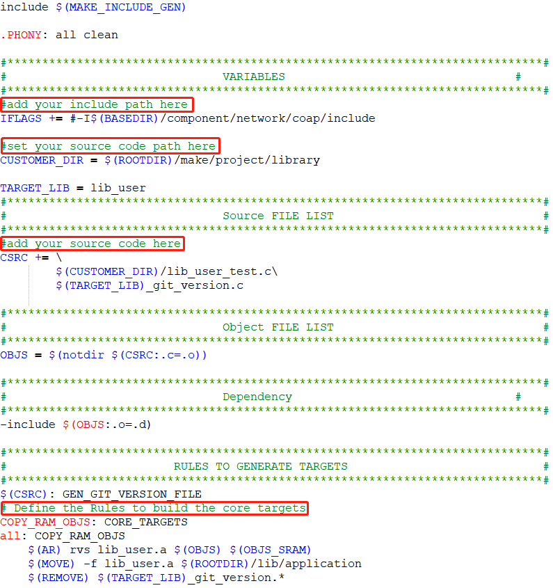

.. _gcc_makefile:

Makefile Architecture
------------------------
The makefile architectures of each project are summarized below.

- CA32 makefile architecture:

  ::

    project_ap\Makefile-->
       project_ap\asdk\Makefile-->
          project_ap\asdk\make\Makefile-->
            project_ap\asdk\make\application\Makefile
            project_ap\asdk\make\at_cmd\Makefile
            project_ap\asdk\make\atf\Makefile
            project_ap\asdk\make\audio\Makefile
            project_ap\asdk\make\bluetooth\Makefile
            project_ap\asdk\make\file_system\Makefile
            project_ap\asdk\make\fwlib\Makefile
            project_ap\asdk\make\hal\Makefile
            project_ap\asdk\make\mbedtls\Makefile
            project_ap\asdk\make\network\Makefile
            project_ap\asdk\make\os\Makefile
            project_ap\asdk\make\project\Makefile
            project_ap\asdk\make\range\Makefile
            project_ap\asdk\make\swlib\Makefile
            project_ap\asdk\make\ui\Makefile
            project_ap\asdk\make\usb_otg\Makefile
            project_ap\asdk\make\utilities\Makefile
            project_ap\asdk\make\utilities_example\Makefile
            project_ap\asdk\make\utils\Makefile
            project_ap\asdk\make\wpan\Makefile
            project_ap\asdk\make\xlat_table\Makefile

- KM4 makefile architecture:

  ::

    project_hp\Makefile-->
       project_hp\asdk\Makefile-->
          project_hp\asdk\make\Makefile-->
            project_hp\asdk\make\application\Makefile
            project_hp\asdk\make\at_cmd\Makefile
            project_hp\asdk\make\audio\Makefile
            project_hp\asdk\make\bluetooth\Makefile
            project_hp\asdk\make\bootloader\Makefile
            project_hp\asdk\make\cmsis\Makefile
            project_hp\asdk\make\cmsis-dsp\Makefile
            project_hp\asdk\make\example\Makefile
            project_hp\asdk\make\file_system\Makefile
            project_hp\asdk\make\flashloader\Makefile
            project_hp\asdk\make\mbedtls\Makefile
            project_hp\asdk\make\media\Makefile
            project_hp\asdk\make\network\Makefile
            project_hp\asdk\make\os\Makefile
            project_hp\asdk\make\project\Makefile
              project_hp\asdk\make\project\sram\Makefile: how to build code into RAM
              project_hp\asdk\make\project\xip\Makefile: how to build code into Flash
              project_hp\asdk\make\project\library\Makefile: how to build library
            project_hp\asdk\make\RT_xmodem\Makefile
            project_hp\asdk\make\target\Makefile
            project_hp\asdk\make\ui\Makefile
            project_hp\asdk\make\usb_otg\Makefile
            project_hp\asdk\make\utilities\Makefile
            project_hp\asdk\make\utilities_example\Makefile
            project_hp\asdk\make\utils\Makefile

- KM0 makefile architecture:

  ::

    project_lp\Makefile-->
        project_lp\asdk\Makefile-->
          project_lp\asdk\make\Makefile-->
            project_lp\asdk\make\applicaiton\Makefile
            project_lp\asdk\make\bootloader\Makefile
            project_lp\asdk\make\cmsis\Makefile
            project_lp\asdk\make\monitor\Makefile
            project_lp\asdk\make\os\Makefile
            project_lp\asdk\make\project\Makefile
            project_lp\asdk\make\target\Makefile
            project_lp\asdk\make\utils\Makefile

How to Build Library
----------------------------------------
The Makefile in path ``{SDK}\amebasmart_gcc_project\project_hp\asdk\make\project\library`` is an example to show how to build user library.
As shown below, ``lib_user.a`` will be generated in ``{SDK}\amebasmart_gcc_project\project_hp\asdk\lib\application``.

How to Add Library
------------------------------------
Open the file ``{SDK}\amebasmart_gcc_project\project_hp\asdk\Makefile``, and add ``lib_user.a`` into ``LINK_APP_LIB``.

.. code-block::

   LINK_APP_LIB += $(ROOTDIR)/lib/application/lib_user.a
