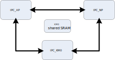
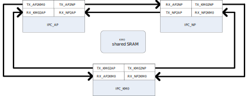

.. _ipc:

Introduction
------------------------
There are multi-CPUs named CA32 (AP), KM4 (NP) and KM0 integrated in |CHIP_NAME|.
The inter-processor communication (IPC) hardware is designed to make these CPUs communicate with each other.
Also, a KM0 shared SRAM is used to transmit information to each other. The block diagram is shown below.

   IPC block diagram

General Principle
----------------------------------
There are 6 directions for 3 cores to communicate with each other: KM0 ←→ NP, NP ←→ AP, KM0 ←→ AP. There are 8 channels for each direction. All the channels are processed independently. That means one core can send different information to another core through different channels at any time, the channels will not affect each other.

Each channel has one transmit side and one receive side, the transmit side and the receive side of the same channel is a pair. For example, KM0 sends an IPC to NP through channel 7, the transmit side is KM0 channel 7, and receive side is NP channel 7, and information is sent from KM0 channel 7 to NP channel 7.

   IPC schematic diagram

How to Use IPC
---------------
IPC Usage Procedure
~~~~~~~~~~~~~~~~~~~~~
For example, KM0 sends an IPC to NP through channel 7.

1. Select IPC channel.

   Uncomment the corresponding channel in :file:`ameba_ipc.h`  and add some description as shown below. This macro is used in the next step. In this case, uncomment the macro `IPC_L2N_Channel7` which means LP to NP channel7.

   .. code-block:: c
      :emphasize-lines: 11

      /** @defgroup IPC_LP_Tx_Channel
      * @{
      */
      #define IPC_L2N_LOGUART_RX_SWITCH   0	/*!<  LP -->  NP Loguart Rx Switch*/
      #define IPC_L2N_WAKE_NP             1
      #define IPC_L2N_FLASHPG_REQ         2	/*!<  LP -->  NP Flash Program REQUEST*/
      //#define IPC_L2N_Channel3          3
      //#define IPC_L2N_Channel4          4
      //#define IPC_L2N_Channel5          5
      //#define IPC_L2N_Channel6          6
      #define IPC_L2N_Channel7            7	/*!<  LP -->  Add your Description Here*/

      #define IPC_L2A_LOGUART_RX_SWITCH   0	/*!<  LP -->  AP Loguart Rx Switch*/
      //#define IPC_L2A_Channel1          1
      //#define IPC_L2A_Channel2          2
      //#define IPC_L2A_Channel3          3
      //#define IPC_L2A_Channel4          4
      //#define IPC_L2A_Channel5          5
      //#define IPC_L2A_Channel6          6
      //#define IPC_L2A_Channel7          7
      /** @} */

2. Register IRQ handler function of the selected channel.

   Add structure ``IPC_INIT_TABLE`` into your code and put this structure in IPC table section by add ``IPC_TABLE_DATA_SECTION``. This structure specifies the direction, channel, mode and IRQ function of IPC as shown below.

   :<USER_MSG_TYPE>: This parameter can be

      | **IPC_USER_DATA**: The contents of this IPC is data.
      | **IPC_USER_POINT**: The contents of this IPC is pointer which points to address of actual data.

   :<RxFunc>: The callback function that CPU executes after receiving IPC.

   :<RxIrqData>: The parameters that are passed into the rx callback function.

   :<TxFunc>: The callback function that CPU executes after sending IPC.

   :<TxIrqData>: The parameters that are passed into the tx callback function

   :<IPC_Direction>: This parameter can be

      | **IPC_LP_TO_NP**: IPC is sent from KM0 to NP.
      | **IPC_LP_TO_AP**: IPC is sent from KM0 to AP.
      | **IPC_NP_TO_LP**: IPC is sent from NP to KM0.
      | **IPC_NP_TO_AP**: IPC is sent from NP to AP.
      | **IPC_AP_TO_LP**: IPC is sent from AP to KM0.
      | **IPC_AP_TO_NP**: IPC is sent from AP to NP.

   :<IPC_L2C_Channel7>: IPC channel used, this macro is selected in the previous step.

   The SDK will automatically enable the IPC interrupt and register the corresponding IRQ handler and data for the channel. In this example, NP will enter :func:`IRQ_function_int` after KM0 send IPC through channel7.

   .. code-block:: c

      void IRQ_function_int(void)
      {
          /* Add your code here*/
      }

      IPC_TABLE_DATA_SECTION
      const IPC_INIT_TABLE ipc_L2N_CH7_table[] = {
          {IPC_USER_DATA, IRQ_function_int, (VOID *) NULL, IPC_TXHandler, (VOID *)NULL, IPC_LP_TO_NP, IPC_L2N_Channel7},
      }

3. Send IPC request.

   When KM0 sends an IPC request to NP through channel 7, it should call :func:`ipc_send_message()` and specify the channel number and message. If no message is needed, just input ``NULL`` for the third parameter of :func:`ipc_send_message()`.

   .. code-block:: c

      IPC_MSG_STRUCT ipc_msg;
      /*init ipc_msg here*/
      ipc_msg.msg_type = IPC_USER_POINT;
      ipc_msg.msg = (u32)&tmp_np_log_buf;
      /*init ipc_msg end*/
      ipc_send_message(IPC_LP_TO_NP, IPC_L2N_Channel7, &ipc_msg);

4. Get IPC message if needed.

   After receiving IPC from KM0 channel7, NP will enter IPC interrupt handler and the corresponding receive IRQ handler will be executed, call ``ipc_get_message()`` to get the message if needed.

   .. code-block:: c

      PIPC_MSG_STRUCT ipc_msg_temp = (PIPC_MSG_STRUCT)ipc_get_message(IPC_LP_TO_NP, IPC_L2N_Channel7);

.. note::
   Several channels are already used by Realtek, you can use the remaining channels.

Suggested Usage of ipc_get_message()
~~~~~~~~~~~~~~~~~~~~~~~~~~~~~~~~~~~~~
- Use :func:`ipc_get_message()` in IPC interrupt handle or user interrupt handler.

  .. code-block:: c

     void IPC_CHANNEL8_ipc_int(void *Data, u32 IrqStatus, u32 ChanNum)
     {
         /* To avoid gcc warnings */
         (void) Data;
         (void) IrqStatus;
         (void) ChanNum;

         PIPC_MSG_STRUCT  ipc_msg_temp = (PIPC_MSG_STRUCT)ipc_get_message(IPC_LP_TO_NP, IPC_L2N_Channel8);
     
         u32 addr = ipc_msg_temp->msg;
     }

  .. code-block:: c

     IPC_TABLE_DATA_SECTION
     const IPC_INIT_TABLE ipc_channel8_table[] = {
         {IPC_USER_DATA, IPC_CHANNEL8_ipc_int, (VOID *)NULL, IPC_TXHandler, (VOID *)NULL, IPC_LP_TO_NP, IPC_L2N_Channel8},
     };

- ``IPC_MSG_STRUCT`` is no need to do cache invalidation any more after :func:`ipc_get_message()`.

  .. figure:: ../figures/not_do_cache_invalid.png
     :scale: 50%
     :align: center

- Forcing ``IPC_MSG_STRUCT`` type conversion has risks.

  .. figure:: ../figures/not_do_conver.png
     :scale: 50%
     :align: center

- Using :func:`ipc_get_message()` in task also has risks.

  .. figure:: ../figures/not_use_in_task.png
     :scale: 50%
     :align: center

- If :func:`ipc_get_message()` needs to be used in task, do as follows:

  a. Task takes the semaphore.

  b. In IPC Rx user interrupt handler, using :func:`ipc_get_message()` to get a message.

  c. Copy the message to another memory after getting message in the same Rx user interrupt handle.

  d. Give the semaphore.

  Then task can use the message.

Troubleshooting
------------------------------
If ``Channel Conflict for CPU xx Channel xx!`` log shows up, it means two IRQ functions are registered in the same channel. For example, if IRQFunc1 and IRQFunc2 are both registered in KM4 for KM0 to KM4 channel1, the log will show up as below.

.. code-block::

   [MODULE_IPC-LEVEL_ERROR]: Channel Conflict for Channel 25!
