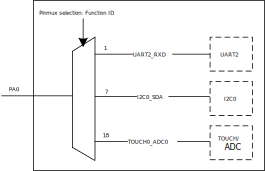

.. _pinmux:

Introduction
------------------------
The |CHIP_NAME| provides a pin multiplexing (pinmux) circuit to maximize the user's freedom under limited pin-out conditions.
Each pin can be connected to different internal IP circuits through configuration.
For the specific correspondence between each pin and IP circuit, refer to the provided pinmux table.

Before using the chip for further development, pay attention to the following precautions about pinmux to avoid inconvenience to your use due to unexpected behavior.

Trap Pins
------------------
During the process of power on, the internal circuit will latch the conditions of trap pins to decide to enter different modes. The trap pins and descriptions are listed in the following table.

Table 1-1 Description of trap pins

.. table:: Description of trap pins
   :width: 100%
   :widths: auto

   +----------+---------------+--------------+--------------------------------------------------------------------------------+
   | I/O name | Trap pin name | Active level | Description                                                                    |
   +==========+===============+==============+================================================================================+
   | PB22     | TM_DIS        | Low          | Test Mode Disable, default internal pull up.                                   |
   |          |               |              |                                                                                |
   |          |               |              | It is for internal test only and should be logical high for normal operation.  |
   |          |               |              |                                                                                |
   |          |               |              | - 1: Normal operation mode                                                     |
   |          |               |              | - 0: Test mode                                                                 |
   +----------+---------------+--------------+--------------------------------------------------------------------------------+
   | PB24     | UD_DIS        | Low          | UART Download Disable, default internal pull up                                |
   |          |               |              |                                                                                |
   |          |               |              | - 1: Enter into normal boot mode                                               |
   |          |               |              | - 0: Enter into UART download mode                                             |
   +----------+---------------+--------------+--------------------------------------------------------------------------------+

.. note::
   The trap pins need to select the external pull-up and pull-down voltages according to the I/O power supply.

Wake Pins
------------------
The pins PB21, PB22, PB23, PB24 are directly connected to the wake up circuit which is used to wake up system from deep-sleep mode.
If you want to use other functions on these pins, disable the wake up function first.

SWD Pins
----------------
The pins PA13 and PA14 are forced to SWD function by default.
If you want to multiplex these two pins to other functions, call :func:`sys_jtag_off()` or :func:`Pinmux_Swdoff()` before switching.

Function Multiplexing
------------------------------------------
Each pin can only be connected to a fixed signal of a certain IP.
Take PA0 as an example, if configuring function ID of PA0 to 1, the pin will be directly connected to the *UART2_RXD* signal of the UART2 via pinmux.

Refer to the pinmux table for the specific function distribution available on each pin.

   Schematic diagram of pinmux connection of PA0

.. note::
   - If PA9~PA16 and PB25~PB31 are used, the I/O power can be set to 1.8V or 3.3V. PA20~PB6 are audio functions by default.
   - If PA20~PB6 are used as other functions, it's necessary to pay attention to the I/O power, which can only be set to 1.8V. For more information about I/O power, refer to pinmux table.

Audio Function
----------------------------
If the pins PA20 to PB6 are used as audio function and digital function simultaneously, pay attention to the layout of digital function as far as possible from the trace of audio function to avoid interference.
It's not suggested to use PA18 ~ PB6 as normal digital functions.

ADC/Cap-Touch Function
--------------------------------------------
If the pins PA0 to PA8 are used as ADC or Cap-Touch functions, pay attention to the layout especially for Cap-Touch.
The performance is related to parasitic capacitance, refer to ADC/CTC layout guide for more information.

Pinmux Signal Description
------------------------------------------------------------------------
For all signal description, refer to *UM0602_RTL8730E_pinmux.xlsx*  for details.
   
