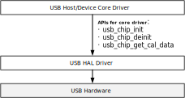
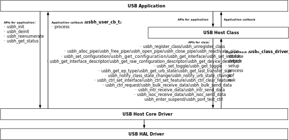
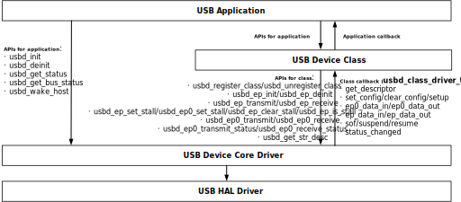
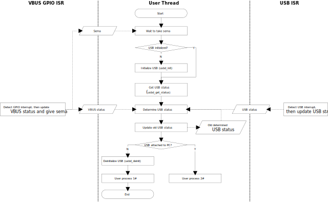
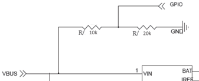

.. _usb_otg:

Introduction
-------------
Features
~~~~~~~~~
The features of Realtek USB stack are listed below:

- Compatible with USB 2.0 specification
- Unified HAL API for all Realtek Ameba SoC series
- Host-specific API and device-specific API for class and application development
- Device mode: CDC ACM, Composite, HID and MSC classes, full device descriptor customizable
- Host mode: CDC ACM, CDC ECM, MSC and UVC classes
- NOT supported: OTG mode, hub devices, low-speed device mode

Architecture
~~~~~~~~~~~~~
The software architecture of USB stack is as below:

   USB stack architecture

The functions of each layer:

- **USB HAL driver**: implements the SoC-specific USB functions and provides unified USB HAL API for USB host/device core drivers.
- **USB host core driver**: implements the USB host-specific functions and provides unified USB host API for USB host classes.
- **USB device core driver**: implements the USB device-specific functions and provides unified USB device API for USB device classes.
- **USB class**: implements the USB classes as per USB IF specifications.
- **USB application**: implements the USB applications corresponding with the USB classes.

Implementation
~~~~~~~~~~~~~~~
The USB stack is implemented as following files:

.. table::
   :width: 100%
   :widths: auto

   +--------+-----------+--------------------------------+-----------------------------------+-----------------------------------------+
   | Stack  | Class     | Transfer                       | Class directory                   | Application directory                   |
   +========+===========+================================+===================================+=========================================+
   | Host   | CDC ACM   | CTRL, BULK IN/ OUT             | component\\usb\\host\\cdc_acm     | component\\example\\usb\\usbh_cdc_acm   |
   |        +-----------+--------------------------------+-----------------------------------+-----------------------------------------+
   |        | CDC ECM   | CTRL, BULK IN/ OUT, INTR IN    | component\\usb\\host\\cdc_ecm     | component\\example\\usb\\usbh_cdc_ecm   |
   |        +-----------+--------------------------------+-----------------------------------+-----------------------------------------+
   |        | MSC       | CTRL, BULK IN OUT              | component\\usb\\host\\msc         | component\\example\\usb\\usbh_msc       |
   |        +-----------+--------------------------------+-----------------------------------+-----------------------------------------+
   |        | UVC       | CTRL, ISO IN/OUT               | component\\usb\\host\\uvc         | component\\example\\usb\\usbh_uvc       |
   +--------+-----------+--------------------------------+-----------------------------------+-----------------------------------------+
   | Device | CDC ACM   | CTRL, BULK IN/OUT, INTR IN/OUT | component\\usb\\device\\cdc_acm   | component\\example\\usb\\usbd_cdc_acm   |
   |        +-----------+--------------------------------+-----------------------------------+-----------------------------------------+
   |        | Composite | CTRL, BULK IN/OUT, INTR IN/OUT | component\\usb\\device\\composite | component\\example\\usb\\usbd_composite |
   |        +-----------+--------------------------------+-----------------------------------+-----------------------------------------+
   |        | HID       | CTRL, INTR IN                  | component\\usb\\device\\hid       | component\\example\\usb\\usbd_hid       |
   |        +-----------+--------------------------------+-----------------------------------+-----------------------------------------+
   |        | MSC       | CTRL, BULK IN/OUT              | component\\usb\\device\\msc       | component\\example\\usb\\usbd_msc       |
   +--------+-----------+--------------------------------+-----------------------------------+-----------------------------------------+

Configuration
--------------
USB stack can be enabled on either AP or HP.

Configuration for AP
~~~~~~~~~~~~~~~~~~~~~
1. Type ``make menuconfig`` command under ``amebasmart_gcc_project``, then select :menuselection:`MENUCONFIG FOR AP CONFIG > CONFIG USB`.

   .. figure:: ../figures/usb_configuration_menu_entry_for_ap.png
      :scale: 90%
      :align: center

      USB configuration menu entry for AP
   
.. _usb_implementation_configuration_for_ap_step_2:

2. Select :menuselection:`Enable USB`, then select the desired USB mode and classes.

   .. figure:: ../figures/usb_configuration_for_ap.png
      :scale: 90%
      :align: center

      USB configuration for AP

3. Type ``make all EXAMPLE=<example>`` command under ``amebasmart_gcc_project`` to build the image with USB application.

   .. note::
      - The ``<example>`` is the folder name under ``component\example\usb``, and shall correspond to the mode and class configuration in step :ref:`2 <usb_implementation_configuration_for_ap_step_2>`.
      - The images will be available under ``amebasmart_gcc_project``.

Configuration for HP
~~~~~~~~~~~~~~~~~~~~~~~~~~~~~~~~~~~~~~~~
1. Type ``make menuconfig`` command under ``amebasmart_gcc_project``, then select :menuselection:`MENUCONFIG FOR HP CONFIG > CONFIG USB`.

   .. figure:: ../figures/usb_configuration_menu_entry_for_hp.png
      :scale: 90%
      :align: center

      USB configuration menu entry for HP

2. Select :menuselection:`Enable USB`, then select the desired USB mode and classes.

   .. figure:: ../figures/usb_configuration_for_hp.png
      :scale: 90%
      :align: center

      USB configuration for HP

3. Type ``make all`` command under amebasmart_gcc_project.

4. Type ``make EXAMPLE=<example>`` command under ``amebasmart_gcc_project\project_hp`` to build the image with USB application.

   .. note::
      The images will be available under ``project_hp\asdk\image``.

USB HAL APIs
--------------
Overview
~~~~~~~~~
The USB HAL APIs provide unified interfaces for upper layer USB host/device core drivers to access SoC-specific USB hardware.

   USB HAL APIs

APIs for Core Driver
~~~~~~~~~~~~~~~~~~~~
Header file: ``{SDK}\component\soc\amebasmart\fwlib\include\ameba_usb.h``

.. table::
   :width: 100%
   :widths: auto

   +-----------------------+---------------------------------------+
   | API                   | Description                           |
   +=======================+=======================================+
   | usb_chip_init         | Initialize SoC-specific USB           |
   +-----------------------+---------------------------------------+
   | usb_chip_deinit       | De-initialize SoC-specific USB        |
   +-----------------------+---------------------------------------+
   | usb_chip_get_cal_data | Get SoC-specific USB calibration data |
   +-----------------------+---------------------------------------+

USB Host APIs
---------------
Overview
~~~~~~~~~~~~~~~~

   USB host APIs

Core APIs
~~~~~~~~~~~~
Header file: ``{SDK}\component\usb\host\core\usbh.h``

APIs for Class
^^^^^^^^^^^^^^^^
.. table::
   :width: 100%
   :widths: auto

   +---------------------------------------+-------------------------------------------------------------------------------------+
   | API                                   | Description                                                                         |
   +=======================================+=====================================================================================+
   | usbh_register_class                   | Register a class driver, the class driver is defined by type usbh_class_driver_t,   |
   |                                       | refer to Section :ref:`usb_host_core_api_class_callback` for details                |
   +---------------------------------------+-------------------------------------------------------------------------------------+
   | usbh_unregister_class                 | Un-register a class driver                                                          |
   +---------------------------------------+-------------------------------------------------------------------------------------+
   | usbh_alloc_pipe                       | Allocate a pipe for the specified endpoint address                                  |
   +---------------------------------------+-------------------------------------------------------------------------------------+
   | usbh_free_pipe                        | Free a pipe                                                                         |
   +---------------------------------------+-------------------------------------------------------------------------------------+
   | usbh_open_pipe                        | Open a pipe as per specified pipe number and endpoint info                          |
   +---------------------------------------+-------------------------------------------------------------------------------------+
   | usbh_close_pipe                       | Close a pipe                                                                        |
   +---------------------------------------+-------------------------------------------------------------------------------------+
   | usbh_reactivate_pipe                  | Reactivate the request in a specific pipe                                           |
   +---------------------------------------+-------------------------------------------------------------------------------------+
   | usbh_get_configuration                | Get the configuration index against subclass                                        |
   +---------------------------------------+-------------------------------------------------------------------------------------+
   | usbh_set_configuration                | Set the configuration index for ``bNumConfigurations>1`` in device descriptor       |
   +---------------------------------------+-------------------------------------------------------------------------------------+
   | usbh_get_interface                    | Get the interface index for a specific class                                        |
   +---------------------------------------+-------------------------------------------------------------------------------------+
   | usbh_set_interface                    | Set current interface                                                               |
   +---------------------------------------+-------------------------------------------------------------------------------------+
   | usbh_get_interface_descriptor         | Get the interface descriptor                                                        |
   +---------------------------------------+-------------------------------------------------------------------------------------+
   | usbh_get_raw_configuration_descriptor | Get the raw configuration descriptor data                                           |
   +---------------------------------------+-------------------------------------------------------------------------------------+
   | usbh_get_device_descriptor            | Get device descriptor                                                               |
   +---------------------------------------+-------------------------------------------------------------------------------------+
   | usbh_get_interval                     | Get the actual interval value as per endpoint type and bInterval                    |
   +---------------------------------------+-------------------------------------------------------------------------------------+
   | usbh_set_toggle                       | Set toggle for a specific pipe                                                      |
   +---------------------------------------+-------------------------------------------------------------------------------------+
   | usbh_get_toggle                       | Get the current toggle of a specific pipe                                           |
   +---------------------------------------+-------------------------------------------------------------------------------------+
   | usbh_get_ep_type                      | Get the endpoint type of a specific pipe                                            |
   +---------------------------------------+-------------------------------------------------------------------------------------+
   | usbh_get_urb_state                    | Get the URB state of a specific pipe                                                |
   +---------------------------------------+-------------------------------------------------------------------------------------+
   | usbh_notify_class_state_change        | Notify host core that class state has been changed                                  |
   +---------------------------------------+-------------------------------------------------------------------------------------+
   | usbh_notify_urb_state_change          | Notify host core that URB state has been changed                                    |
   +---------------------------------------+-------------------------------------------------------------------------------------+
   | usbh_ctrl_set_interface               | Set the device interface                                                            |
   +---------------------------------------+-------------------------------------------------------------------------------------+
   | usbh_ctrl_set_feature                 | Set the device feature, e.g. remote wakeup feature                                  |
   +---------------------------------------+-------------------------------------------------------------------------------------+
   | usbh_ctrl_clear_feature               | Clear/Disable the device feature                                                    |
   +---------------------------------------+-------------------------------------------------------------------------------------+
   | usbh_ctrl_request                     | Send control request to device                                                      |
   +---------------------------------------+-------------------------------------------------------------------------------------+
   | usbh_bulk_receive_data                | Receive BULK IN data from device                                                    |
   +---------------------------------------+-------------------------------------------------------------------------------------+
   | usbh_bulk_send_data                   | Send BULK OUT data to device                                                        |
   +---------------------------------------+-------------------------------------------------------------------------------------+
   | usbh_intr_receive_data                | Receive INTR IN data from device                                                    |
   +---------------------------------------+-------------------------------------------------------------------------------------+
   | usbh_intr_send_data                   | Send INTR OUT data to device                                                        |
   +---------------------------------------+-------------------------------------------------------------------------------------+
   | usbh_isoc_receive_data                | Receive ISOC IN data from device                                                    |
   +---------------------------------------+-------------------------------------------------------------------------------------+
   | usbh_isoc_send_data                   | Send ISOC OUT data to device                                                        |
   +---------------------------------------+-------------------------------------------------------------------------------------+
   | usbh_get_current_frame                | Get the current frame number                                                        |
   +---------------------------------------+-------------------------------------------------------------------------------------+
   | usbh_get_last_transfer_size           | Get the data size of last transfer                                                  |
   +---------------------------------------+-------------------------------------------------------------------------------------+
   | usbh_enter_suspend                    | Enter/Exit suspend state                                                            |
   +---------------------------------------+-------------------------------------------------------------------------------------+
   | usbh_port_test_ctrl                   | Port test control, only for CTS test                                                |
   +---------------------------------------+-------------------------------------------------------------------------------------+

.. _usb_host_core_api_class_callback:

Class Callback
^^^^^^^^^^^^^^^^^^^^^^^^^^^^
USB host class driver is defined by type ``usbh_class_driver_t`` as a group of callbacks:

.. code-block:: c

   typedef struct {
      u8 class_code;    /* Class code assigned by USB Org */
      u8(*attach)(struct _usb_host_t *host);
      u8(*detach)(struct _usb_host_t *host);
      u8(*setup)(struct _usb_host_t *host);
      u8(*process)(struct _usb_host_t *host);
      u8(*sof)(struct _usb_host_t *host);
      u8(*nak)(struct _usb_host_t *host, u8 pipe_num);
   } usbh_class_driver_t;

Here is the description of the callbacks:

.. table::
   :width: 100%
   :widths: auto

   +---------+------------------------------------------------------------------------+
   | API     | Description                                                            |
   +=========+========================================================================+
   | attach  | Called after setting configuration                                     |
   +---------+------------------------------------------------------------------------+
   | detach  | Called when device is disconnected                                     |
   +---------+------------------------------------------------------------------------+
   | setup   | Called after class attached to process class standard control requests |
   +---------+------------------------------------------------------------------------+
   | process | Called after class setup to process class specific transfers           |
   +---------+------------------------------------------------------------------------+
   | sof     | Called at SOF interrupt                                                |
   +---------+------------------------------------------------------------------------+
   | nak     | Called at NAK interrupt of specific channel                            |
   +---------+------------------------------------------------------------------------+

APIs for Application
^^^^^^^^^^^^^^^^^^^^
.. table::
   :width: 100%
   :widths: auto

   +------------------+------------------------------+
   | API              | Description                  |
   +==================+==============================+
   | usbh_init        | Initialize USB host stack    |
   +------------------+------------------------------+
   | usbh_deinit      | De-initialize USB host stack |
   +------------------+------------------------------+
   | usbh_reenumerate | Redo enumeration             |
   +------------------+------------------------------+
   | usbh_get_status  | Get device connection status |
   +------------------+------------------------------+

Application Callback
^^^^^^^^^^^^^^^^^^^^^
.. table::
   :width: 100%
   :widths: auto

   +---------+------------------------------------------------------+
   | API     | Description                                          |
   +=========+======================================================+
   | process | Allow user to handle USB events in application level |
   +---------+------------------------------------------------------+

Class APIs
~~~~~~~~~~~
CDC ACM
^^^^^^^^^^^^^^
Header file: ``{SDK}\component\usb\host\cdc_acm\usbh_cdc_acm.h``

APIs for Application
*********************
.. table:: 
   :width: 100%
   :widths: auto

   +------------------------------+-----------------------------------------------------------------------+
   | API                          | Description                                                           |
   +==============================+=======================================================================+
   | usbh_cdc_acm_init            | Initialize the class with application callback,                       |
   |                              | refer to :ref:`usb_host_class_api_cdc_acm_callback` for details       |
   +------------------------------+-----------------------------------------------------------------------+
   | usbh_cdc_acm_deinit          | De-initialize the class                                               |
   +------------------------------+-----------------------------------------------------------------------+
   | usbh_cdc_acm_set_line_coding | Set line coding                                                       |
   +------------------------------+-----------------------------------------------------------------------+
   | usbh_cdc_acm_get_line_coding | Get line coding                                                       |
   +------------------------------+-----------------------------------------------------------------------+
   | usbh_cdc_acm_transmit        | Send BULK OUT data to device                                          |
   +------------------------------+-----------------------------------------------------------------------+
   | usbh_cdc_acm_receive         | Receive BULK IN data from device                                      |
   +------------------------------+-----------------------------------------------------------------------+

.. _usb_host_class_api_cdc_acm_callback:

Application Callback
***********************
CDC ACM class provides callbacks for user application, the callbacks are defined by type ``usbh_cdc_acm_cb_t``:

.. code-block:: c

   typedef struct {
      u8(* init)(void);
      u8(* deinit)(void);
      u8(* attach)(void);
      u8(* detach)(void);
      u8(* setup)(void);
      u8(* receive)(u8 *buf, u32 len);
      u8(* transmit)(usbh_urb_state_t state);
      u8(* line_coding_changed)(usbh_cdc_acm_line_coding_t *line_coding);
   } usbh_cdc_acm_cb_t;

Here is the description of the callbacks:

.. table::
   :width: 100%
   :widths: auto

   +---------------------+---------------------------------------------+
   | API                 | Description                                 |
   +=====================+=============================================+
   | init                | Called after class initialized              |
   +---------------------+---------------------------------------------+
   | deinit              | Called before class de-initialized          |
   +---------------------+---------------------------------------------+
   | attach              | Called after class attach callback          |
   +---------------------+---------------------------------------------+
   | detach              | Called before class detach callback         |
   +---------------------+---------------------------------------------+
   | setup               | Called after class setup callback           |
   +---------------------+---------------------------------------------+
   | receive             | Called after BULK IN data received          |
   +---------------------+---------------------------------------------+
   | transmit            | Called after BULK OUT data transmitted      |
   +---------------------+---------------------------------------------+
   | line_coding_changed | Called when device line coding data changed |
   +---------------------+---------------------------------------------+

Example
**************
An example is provided for user to use CDC ACM host class. The example turns |CHIP_NAME| into a USB host which can communicate with CDC ACM compatible device, such as a USB virtual serial port device.

Refer to the :file:`readme.txt` file of the example for details.

CDC ECM
^^^^^^^^^^^^^^
Header file: :file:`{SDK}\component\usb\host\cdc_acm\usbh_cdc_acm_hal.h`

APIs for Application
***********************
.. table::
   :width: 100%
   :widths: auto

   +---------------------------------+----------------------------------------------------------------------+
   | API                             | Description                                                          |
   +=================================+======================================================================+
   | usbh_cdc_ecm_do_init            | Initialize the class with application callback,                      |
   |                                 | refer to :ref:`usb_host_class_api_cdc_ecm_callback` for details      |
   +---------------------------------+----------------------------------------------------------------------+
   | usbh_cdc_ecm_do_deinit          | De-initialize the class                                              |
   +---------------------------------+----------------------------------------------------------------------+
   | usbh_cdc_ecm_process_mac_str    | Get the ecm device mac string                                        |
   +---------------------------------+----------------------------------------------------------------------+
   | usbh_cdc_ecm_senddata           | Send the data out                                                    |
   +---------------------------------+----------------------------------------------------------------------+
   | usbh_cdc_ecm_get_sendflag       | Get the send data success flag                                       |
   +---------------------------------+----------------------------------------------------------------------+
   | usbh_cdc_ecm_get_connect_status | Get the device connect status                                        |
   +---------------------------------+----------------------------------------------------------------------+
   | usbh_cdc_ecm_get_receive_mps    | Get the receive package maximum size                                 |
   +---------------------------------+----------------------------------------------------------------------+

.. _usb_host_class_api_cdc_ecm_callback:

Application Callback
**********************
CDC ECM class provides callback to report the received data for LWIP application, the callback is defined by type ``usb_report_usbdata``:

.. code-block:: c

   typedef void (*usb_report_usbdata)(
     u8 *buf,
     u32 len
   );

Example
**************
An example is provided for user to use CDC ECM host class. The example turns |CHIP_NAME| into a USB host which can communicate with CDC ECM compatible device, such as an Ethernet device.

Refer to the :file:`readme.txt` file of the example for details.

MSC
^^^^^^
Header file: ``{SDK}\component\usb\host\msc\usbh_msc.h``

APIs for Application
**********************
.. table::
   :width: 100%
   :widths: auto

   +-----------------+-------------------------------------------------------------+
   | API             | Description                                                 |
   +=================+=============================================================+
   | usbh_msc_init   | Initialize the class with application callback,             |
   |                 | refer to :ref:`usb_host_class_api_msc_callback` for details |
   +-----------------+-------------------------------------------------------------+
   | usbh_msc_deinit | De-initialize the class                                     |
   +-----------------+-------------------------------------------------------------+

.. _usb_host_class_api_msc_callback:

Application Callback
*********************
MSC class provides callbacks for user application, the callbacks are defined by type ``usbh_msc_cb_t``:

.. code-block:: c

   typedef struct {
      u8(* attach)(void);
      u8(* detach)(void);
      u8(* setup)(void);
   } usbh_msc_cb_t;

Here is the description of the callbacks:

.. table:: 
   :width: 100%
   :widths: auto

   +--------+-------------------------------------+
   | API    | Description                         |
   +========+=====================================+
   | attach | Called after class attach callback  |
   +--------+-------------------------------------+
   | detach | Called before class detach callback |
   +--------+-------------------------------------+
   | setup  | Called after class setup callback   |
   +--------+-------------------------------------+

File System Callback
*********************
MSC class provides a USB disk driver for FATFS, so that user can access the FATFS data through USB interface. The USB disk driver provides the following callbacks:

.. table::
   :width: 100%
   :widths: auto

   +-------------------+--------------------------------+
   | API               | Description                    |
   +===================+================================+
   | disk_initialize   | Initialize USB disk            |
   +-------------------+--------------------------------+
   | disk_deinitialize | De-initialize USB disk         |
   +-------------------+--------------------------------+
   | disk_status       | Get the status of USB disk     |
   +-------------------+--------------------------------+
   | disk_read         | Read data from USB disk        |
   +-------------------+--------------------------------+
   | disk_write        | Write data to USB disk         |
   +-------------------+--------------------------------+
   | disk_ioctl        | Send IOCTL request to USB disk |
   +-------------------+--------------------------------+

Example
**************
An example is provided for user to use MSC host class. The example turns |CHIP_NAME| into a USB host which can communicate with MSC compatible devices, such as an USB disk.

Refer to the ``readme.txt`` file of the example for details.

UVC
^^^^^^
Header file: ``{SDK}\component\usb\host\uvc\usbh_uvc_intf.h``

APIs for Application
*********************
.. table::
   :width: 100%
   :widths: auto

   +-----------------------+--------------------------------------------------------------+
   | API                   | Description                                                  |
   +=======================+==============================================================+
   | usbh_uvc_init         | Initialize the class with application callback,              |
   |                       | refer to :ref:`usb_host_class_api_uvc_callback` for details  |
   +-----------------------+--------------------------------------------------------------+
   | usbh_uvc_deinit       | De-initialize the class                                      |
   +-----------------------+--------------------------------------------------------------+
   | usbh_uvc_stream_on    | Enable video streaming                                       |
   +-----------------------+--------------------------------------------------------------+
   | usbh_uvc_stream_off   | Disable video streaming                                      |
   +-----------------------+--------------------------------------------------------------+
   | usbh_uvc_stream_state | Get video streaming state                                    |
   +-----------------------+--------------------------------------------------------------+
   | usbh_uvc_set_param    | Set video parameters                                         |
   +-----------------------+--------------------------------------------------------------+
   | usbh_uvc_get_frame    | Get a frame from video streaming                             |
   +-----------------------+--------------------------------------------------------------+
   | usbh_uvc_put_frame    | Put frame buffer to video streaming                          |
   +-----------------------+--------------------------------------------------------------+

.. _usb_host_class_api_uvc_callback:

Application Callback
***********************
UVC class provides callbacks for user application, the callbacks are defined by type ``usbh_uvc_cb_t``:

.. code-block:: c

   typedef struct {
      int(* init)(void);
      int(* deinit)(void);
      int(* attach)(void);
      int(* detach)(void);
   } usbh_uvc_cb_t;

Here is the description of the callbacks:

.. table::
   :width: 100%
   :widths: auto

   +--------+-------------------------------------+
   | API    | Description                         |
   +========+=====================================+
   | init   | Called after class initialized      |
   +--------+-------------------------------------+
   | deinit | Called before class de-initialized  |
   +--------+-------------------------------------+
   | attach | Called after class attach callback  |
   +--------+-------------------------------------+
   | detach | Called before class detach callback |
   +--------+-------------------------------------+

Example
**************
An example is provided for user to use UVC host class. The example turns |CHIP_NAME| into a USB host which can communicate with UVC compatible devices, such as an USB camera.

Refer to the ``readme.txt`` file of the example for details.

USB Device APIs
-----------------
Overview
~~~~~~~~~~~~~~~~

   USB device APIs

Core APIs
~~~~~~~~~~
Header file: ``{SDK}\component\usb\device\core\usbd.h``

APIs for Class
^^^^^^^^^^^^^^^^
.. table::
   :width: 100%
   :widths: auto

   +--------------------------+----------------------------------------------------------------------------------------+
   | API                      | Description                                                                            |
   +==========================+========================================================================================+
   | usbd_register_class      | Register a class, the class is defined by type usbd_class_driver_t,                    |
   |                          | refer to :ref:`usb_device_core_api_class_callback` for details                         |
   +--------------------------+----------------------------------------------------------------------------------------+
   | usbd_unregister_class    | Un-register a class                                                                    |
   +--------------------------+----------------------------------------------------------------------------------------+
   | usbd_ep_init             | Initialize an endpoint                                                                 |
   +--------------------------+----------------------------------------------------------------------------------------+
   | usbd_ep_deinit           | De-initialize an endpoint                                                              |
   +--------------------------+----------------------------------------------------------------------------------------+
   | usbd_ep_transmit         | Transmit data to an endpoint                                                           |
   +--------------------------+----------------------------------------------------------------------------------------+
   | usbd_ep_receive          | Prepare to receive data from an endpoint                                               |
   +--------------------------+----------------------------------------------------------------------------------------+
   | usbd_ep_set_stall        | Set an endpoint to STALL state                                                         |
   +--------------------------+----------------------------------------------------------------------------------------+
   | usbd_ep_clear_stall      | Clear the STALL state of an endpoint                                                   |
   +--------------------------+----------------------------------------------------------------------------------------+
   | usbd_ep_is_stall         | Check whether the endpoint is in STALL state                                           |
   +--------------------------+----------------------------------------------------------------------------------------+
   | usbd_ep0_set_stall       | Set endpoint 0 to STALL state                                                          |
   +--------------------------+----------------------------------------------------------------------------------------+
   | usbd_ep0_transmit        | Transmit data to endpoint 0, i.e. control endpoint                                     |
   +--------------------------+----------------------------------------------------------------------------------------+
   | usbd_ep0_receive         | Prepare to receive data from endpoint 0, i.e. control endpoint                         |
   +--------------------------+----------------------------------------------------------------------------------------+
   | usbd_ep0_transmit_status | Transmit status to endpoint 0, i.e. control endpoint                                   |
   +--------------------------+----------------------------------------------------------------------------------------+
   | usbd_ep0_receive_status  | Prepare to receive status from endpoint 0, i.e. control endpoint                       |
   +--------------------------+----------------------------------------------------------------------------------------+
   | usbd_get_str_desc        | Used for class to transfer ASCII string to USB string descriptor format in UNICODE 16  |
   +--------------------------+----------------------------------------------------------------------------------------+

.. _usb_device_core_api_class_callback:

Class Callback
^^^^^^^^^^^^^^^^^
The USB device class is defined by type ``usbd_class_driver_t`` as a group of callbacks:

.. code-block:: c

   typedef struct _usbd_class_driver_t {
      u8 *(*get_descriptor)(usb_dev_t *dev, usb_setup_req_t *req,
         usb_speed_type_t speed, u16 *len);
      u8(*set_config)(usb_dev_t *dev, u8 config);
      u8(*clear_config)(usb_dev_t *dev, u8 config);
      u8(*setup)(usb_dev_t *dev, usb_setup_req_t *req);
      u8(*sof)(usb_dev_t *dev);
      u8(*suspend)(usb_dev_t *dev);
      u8(*resume)(usb_dev_t *dev);
      u8(*ep0_data_in)(usb_dev_t *dev, u8 status);
      u8(*ep0_data_out)(usb_dev_t *dev);
      u8(*ep_data_in)(usb_dev_t *dev, u8 ep_addr, u8 status);
      u8(*ep_data_out)(usb_dev_t *dev, u8 ep_addr, u16 len);
      void (*status_changed)(usb_dev_t *dev, u8 status);
   } usbd_class_driver_t;

Here is the description of the callbacks:

.. table::
   :width: 100%
   :widths: auto

   +----------------+--------------------------------------------------------------------------------------------------------------------------------------+
   | API            | Description                                                                                                                          |
   +================+======================================================================================================================================+
   | get_descriptor | Get device descriptor                                                                                                                |
   +----------------+--------------------------------------------------------------------------------------------------------------------------------------+
   | set_config     | Called when device core sets configuration, e.g. *SET_CONFIGURATION* request received at addressed state                             |
   +----------------+--------------------------------------------------------------------------------------------------------------------------------------+
   | clear_config   | Called when device core clears configuration, e.g. *SET_CONFIGURATION* request with a new configuration received at configured state |
   +----------------+--------------------------------------------------------------------------------------------------------------------------------------+
   | setup          | Called at setup phase of a control transfer, used for class-specific request handling                                                |
   +----------------+--------------------------------------------------------------------------------------------------------------------------------------+
   | ep_data_in     | Called at data in phase of a transfer, used to inform the class that the data transmit is done                                       |
   +----------------+--------------------------------------------------------------------------------------------------------------------------------------+
   | ep_data_out    | Called at data out phase of a transfer, used to inform the class to handle the received data                                         |
   +----------------+--------------------------------------------------------------------------------------------------------------------------------------+
   | ep0_data_in    | Called at data in phase of a control transfer, used to inform the class that the control data transmit is done                       |
   +----------------+--------------------------------------------------------------------------------------------------------------------------------------+
   | ep0_data_out   | Called at data out phase of a control transfer, used to inform the class to handle the received control data                         |
   +----------------+--------------------------------------------------------------------------------------------------------------------------------------+
   | sof            | Called at SOF interrupt, used for class-specific SOF handling                                                                        |
   +----------------+--------------------------------------------------------------------------------------------------------------------------------------+
   | suspend        | Called at suspend interrupt, used for class-specific suspend handling                                                                |
   +----------------+--------------------------------------------------------------------------------------------------------------------------------------+
   | resume         | Called at resume interrupt, used for class-specific resume handling                                                                  |
   +----------------+--------------------------------------------------------------------------------------------------------------------------------------+
   | status_changed | Called at USB attach status changed                                                                                                  |
   +----------------+--------------------------------------------------------------------------------------------------------------------------------------+

APIs for Application
^^^^^^^^^^^^^^^^^^^^^^

.. code-block:: c

   typedef struct {
      u8 speed;               /* USB speed:
                              USB_SPEED_FULL: full speed only */
      u8 dma_enable;          /* Enable USB internal DMA mode,
                              0-Disable, 1-Enable */
      u8 isr_priority;        /* USB ISR thread priority */
      u8 intr_use_ptx_fifo;   /* Use Periodic TxFIFO for INTR IN
                              transfer */
      u32 rx_fifo_depth;      /* Rx FIFO depth */
      u32 nptx_fifo_depth;    /* Non-Periodical Tx FIFO depth */
      u32 ptx_fifo_depth;     /* Periodical Tx FIFO depth */
      u32 ext_intr_en;        /* Enable extra USB interrupts:
                                 BIT0: USBD_SOF_INTR, GINTSTS.bit3
                                 BIT1: USBD_EOPF_INTR, GINTSTS.bit15
                                 BIT2: USBD_EPMIS_INTR, GINTSTS.bit17
                                 BIT3: USBD_ICII_INTR, GINTSTS.bit20
                              */
      u8 nptx_max_epmis_cnt;  /* Max Non-Periodical TX transfer EPMIS
                              interrupt count allowed, EPMIS
                              interrupt will be handled only if the
                              EPMIS interrupt count is higher than
                              this value and USBD_EPMIS_INTR is
                              enabled in ext_intr_en */
      u8 nptx_max_err_cnt[USB_MAX_ENDPOINTS];   /* Max Non-Periodical
                                                TX transfer error count allowed for
                                                each endpoint, if endpoint transfer
                                                error count is higher than this value,
                                                the transfer status will be determined
                                                as failed */
   } usbd_config_t;

.. table:: 
   :width: 100%
   :widths: auto

   +---------------------+---------------------------------------------------------------------------------------------------------------------------------------------------+
   | API                 | Description                                                                                                                                       |
   +=====================+===================================================================================================================================================+
   | usbd_init           | Initialize USB device stack with configuration defined by type ``usbd_config_t``:                                                                 |
   |                     |                                                                                                                                                   |
   |                     | For DFIFO configuration, only two options are suggested:                                                                                          |
   |                     |                                                                                                                                                   |
   |                     | - RX FIFO sacrifice, only if the periodic ISOC/INTR packet size has to be 1024 byte                                                               |
   |                     |                                                                                                                                                   |
   |                     |   - rx_fifo_depth = 504                                                                                                                           |
   |                     |                                                                                                                                                   |
   |                     |   - nptx_fifo_depth = 256                                                                                                                         |
   |                     |                                                                                                                                                   |
   |                     |   - ptx_fifo_depth = 256                                                                                                                          |
   |                     |                                                                                                                                                   |
   |                     | - PTX FIFO sacrifice, for all other situations                                                                                                    |
   |                     |                                                                                                                                                   |
   |                     |   - rx_fifo_depth = 512                                                                                                                           |
   |                     |                                                                                                                                                   |
   |                     |   - nptx_fifo_depth = 256                                                                                                                         |
   |                     |                                                                                                                                                   |
   |                     |   - ptx_fifo_depth = 248                                                                                                                          |
   +---------------------+---------------------------------------------------------------------------------------------------------------------------------------------------+
   | usbd_deinit         | De-initialize USB device stack                                                                                                                    |
   +---------------------+---------------------------------------------------------------------------------------------------------------------------------------------------+
   | usbd_get_status     | Get attach status, the return value is defined by type ``usbd_attach_status_t``:                                                                  |
   |                     |                                                                                                                                                   |
   |                     | .. code-block:: c                                                                                                                                 |
   |                     |                                                                                                                                                   |
   |                     |    typedef enum {                                                                                                                                 |
   |                     |      USBD_ATTACH_STATUS_INIT      = 0U,  // Initialized                                                                                           |
   |                     |      USBD_ATTACH_STATUS_ATTACHED = 1U,   // Attached to host                                                                                      |
   |                     |      USBD_ATTACH_STATUS_DETACHED = 2U    // Detached from host                                                                                    |
   |                     |    } usbd_attach_status_t;                                                                                                                        |
   +---------------------+---------------------------------------------------------------------------------------------------------------------------------------------------+
   | usbd_get_bus_status | Get USB bus status, the status argument returns the bit combined value of type ``usbd_bus_state_t`` when the function return value is ``HAL_OK``. |
   |                     |                                                                                                                                                   |
   |                     | .. code-block:: c                                                                                                                                 |
   |                     |                                                                                                                                                   |
   |                     |    typedef enum {                                                                                                                                 |
   |                     |      USBD_BUS_STATUS_DN       = BIT0,  // D-                                                                                                      |
   |                     |      USBD_BUS_STATUS_DP       = BIT1,  // D+                                                                                                      |
   |                     |      USBD_BUS_STATUS_SUSPEND  = BIT2,  // suspend indication                                                                                      |
   |                     |      } usbd_bus_state_t;                                                                                                                          |
   +---------------------+---------------------------------------------------------------------------------------------------------------------------------------------------+
   | usbd_wake_host      | Send a remote wakeup signal to USB host                                                                                                           |
   +---------------------+---------------------------------------------------------------------------------------------------------------------------------------------------+

Application Callback
^^^^^^^^^^^^^^^^^^^^^^^
None.

Class APIs
~~~~~~~~~~~
CDC ACM
^^^^^^^^^^^^^^
Header file: ``{SDK}\component\usb\device\cdc_acm\usbd_cdc_acm.h``

APIs for Application
***********************
.. table::
   :width: 100%
   :widths: auto

   +----------------------------------+-------------------------------------------------------------------------------------------------------+
   | API                              | Description                                                                                           |
   +==================================+=======================================================================================================+
   | usbd_cdc_acm_init                | Initialize the class with parameters:                                                                 |
   |                                  |                                                                                                       |
   |                                  | - *Rx buffer length* (``rx_buf_len``): BULK OUT buffer length                                         |
   |                                  |                                                                                                       |
   |                                  | - *Tx buffer length* (``tx_buf_len``): BULK IN buffer length                                          |
   |                                  |                                                                                                       |
   |                                  | - *Application callback* (``cb``): refer to :ref:`usb_device_class_api_cdc_acm_callback` for details  |
   +----------------------------------+-------------------------------------------------------------------------------------------------------+
   | usbd_cdc_acm_deinit              | De-initialize the class                                                                               |
   +----------------------------------+-------------------------------------------------------------------------------------------------------+
   | usbd_cdc_acm_transmit            | Transmit BULK IN data to host, the data length shall not be larger than the Tx buffer length          |
   +----------------------------------+-------------------------------------------------------------------------------------------------------+
   | usbd_cdc_acm_notify_serial_state | Send INTR IN data to notify device serial state to host                                               |
   +----------------------------------+-------------------------------------------------------------------------------------------------------+

.. _usb_device_class_api_cdc_acm_callback:

Application Callback
***********************
CDC ACM class provides callbacks for user application, the callbacks are defined by type ``usbd_cdc_acm_cb_t``:

.. code-block:: c

   typedef struct {
      u8(* init)(void);
      u8(* deinit)(void);
      u8(* setup)(usb_setup_req_t *req, u8 *buf);
      u8(* received)(u8 *buf, u32 len);
      void(* transmitted)(u8 status);
      void (*status_changed)(u8 status);
   } usbd_cdc_acm_cb_t;

Here is the description of the callbacks:

.. table:: 
   :width: 100%
   :widths: auto

   +----------------+------------------------------------------------------------------------------------------------------------+
   | API            | Description                                                                                                |
   +================+============================================================================================================+
   | init           | Called at the end of class initialization flow, for application-specific initialization                    |
   +----------------+------------------------------------------------------------------------------------------------------------+
   | deinit         | Called at the beginning of class de-initialization flow, for application-specific de-initialization        |
   +----------------+------------------------------------------------------------------------------------------------------------+
   | setup          | Called at setup phase or data out phase of class-specific control requests, for application-specific setup |
   +----------------+------------------------------------------------------------------------------------------------------------+
   | received       | Called when BULK OUT transfer completed, for application to handle the received data                       |
   +----------------+------------------------------------------------------------------------------------------------------------+
   | transmitted    | Called when BULK IN transfer completed, indicates application the transfer status                          |
   +----------------+------------------------------------------------------------------------------------------------------------+
   | status_changed | Called when USB attach status changed, for application to support hot plug                                 |
   +----------------+------------------------------------------------------------------------------------------------------------+

Example
**************
An example is provided for user to use CDC ACM device class. The example turns |CHIP_NAME| into a virtual serial port for PC, common serial port tools such as Tera Term can be used to communicate with |CHIP_NAME|, and |CHIP_NAME| will echo back the message sent to it.

Refer to the ``readme.txt`` file of the example for details.

Composite
^^^^^^^^^^^^^^^^^^
Header files:

- :file:`{SDK}\component\usb\device\composite\usbd_composite.h`

- :file:`{SDK}\component\usb\device\composite\usbd_composite_cdc_acm.h`

- :file:`{SDK}\component\usb\device\composite\usbd_composite_hid.h`

APIs for Application
***********************
General APIs:

.. table:: 
   :width: 100%
   :widths: auto

   +-----------------------+---------------------------------------------------------------------------------------------------------------+
   | API                   | Description                                                                                                   |
   +=======================+===============================================================================================================+
   | usbd_composite_init   | Initialize the class with parameters:                                                                         |
   |                       |                                                                                                               |
   |                       | - *cdc_bulk_out_xfer_size*: CDC ACM BULK OUT transfer length                                                  |
   |                       |                                                                                                               |
   |                       | - *cdc_bulk_in_xfer_size*: CDC ACM BULK IN transfer length                                                    |
   |                       |                                                                                                               |
   |                       | - *cdc_cb*: CDC ACM application callback, refer to :ref:`usb_device_class_api_composite_callback` for details |
   |                       |                                                                                                               |
   |                       | - *hid_intr_in_xfer_size*: HID INTR IN transfer length                                                        |
   |                       |                                                                                                               |
   |                       | - *hid_cb*: HID application callback, refer to :ref:`usb_device_class_api_composite_callback` for details     |
   |                       |                                                                                                               |
   |                       | - *cb*: Composite application callback, refer to :ref:`usb_device_class_api_composite_callback` for details   |
   +-----------------------+---------------------------------------------------------------------------------------------------------------+
   | usbd_composite_deinit | De-initialize the class                                                                                       |
   +-----------------------+---------------------------------------------------------------------------------------------------------------+

CDC ACM interface APIs:

.. table::
   :width: 100%
   :widths: auto

   +--------------------------------------------+----------------------------------------------------------------------------------------------+
   | API                                        | Description                                                                                  |
   +============================================+==============================================================================================+
   | usbd_composite_cdc_acm_transmit            | Transmit BULK IN data to host, the data length shall not be larger than the TX buffer length |
   +--------------------------------------------+----------------------------------------------------------------------------------------------+
   | usbd_composite_cdc_acm_notify_serial_state | Send INTR IN data to notify device serial state to host                                      |
   +--------------------------------------------+----------------------------------------------------------------------------------------------+

HID interface API:

.. table::
   :width: 100%
   :widths: auto

   +------------------------------+----------------------------------------------------------------------------------------------+
   | API                          | Description                                                                                  |
   +==============================+==============================================================================================+
   | usbd_composite_hid_send_data | Transmit INTR IN data to host, the data length shall not be larger than the Tx buffer length |
   +------------------------------+----------------------------------------------------------------------------------------------+

.. _usb_device_class_api_composite_callback:

Application Callback
***********************
Composite class provides callbacks for user application, and the callbacks are defined by the following two types:

usbd_cdc_acm_cb_t
*******************

.. code-block:: c

   typedef struct {
      u8(* init)(void);
      u8(* deinit)(void);
      u8(* setup)(usb_setup_req_t *req, u8 *buf);
      u8(* received)(u8 *buf, u32 len);
   } usbd_cdc_acm_cb_t;

Here is the description of the callbacks:

.. table:: 
   :width: 100%
   :widths: auto

   +----------+------------------------------------------------------------------------------------------------------------+
   | API      | Description                                                                                                |
   +==========+============================================================================================================+
   | init     | Called at the end of class initialization flow, for application-specific initialization                    |
   +----------+------------------------------------------------------------------------------------------------------------+
   | deinit   | Called at the beginning of class de-initialization flow, for application-specific de-initialization        |
   +----------+------------------------------------------------------------------------------------------------------------+
   | setup    | Called at setup phase or data out phase of class-specific control requests, for application-specific setup |
   +----------+------------------------------------------------------------------------------------------------------------+
   | received | Called at data out phase of BULK OUT transfer, for application to handle the received data                 |
   +----------+------------------------------------------------------------------------------------------------------------+

usbd_hid_usr_cb_t
*********************

.. code-block:: c

   typedef struct {
      u8(* init)(void);
      void(* deinit)(void);
      u8(* setup)(usb_setup_req_t *req, u8 *buf);
      void(* transmitted)(u8 status);
   } usbd_hid_usr_cb_t;

Here is the description of the callbacks:

.. table:: 
   :width: 100%
   :widths: auto

   +-------------+------------------------------------------------------------------------------------------------------------+
   | API         | Description                                                                                                |
   +=============+============================================================================================================+
   | init        | Called at the end of class initialization flow, for application-specific initialization                    |
   +-------------+------------------------------------------------------------------------------------------------------------+
   | deinit      | Called at the beginning of class de-initialization flow, for application-specific de-initialization        |
   +-------------+------------------------------------------------------------------------------------------------------------+
   | setup       | Called at setup phase or data out phase of class-specific control requests, for application-specific setup |
   +-------------+------------------------------------------------------------------------------------------------------------+
   | transmitted | Called at data in phase of INTR IN transfer to inform the application that the INTR IN transfer is done    |
   +-------------+------------------------------------------------------------------------------------------------------------+

usbd_composite_cb_t
*********************

.. code-block:: c

   typedef struct {
      void (*status_changed)(u8 status);
   } usbd_composite_cb_t;

Description of the callbacks:

.. table::
   :width: 100%
   :widths: auto

   +----------------+----------------------------------------------------------------------------+
   | API            | Description                                                                |
   +================+============================================================================+
   | status_changed | Called when USB attach status changed, for application to support hot plug |
   +----------------+----------------------------------------------------------------------------+

Example
**************
An example is provided for user to use Composite device class. The example turns |CHIP_NAME| into a CDC ACM and HID composite device. Refer to the ``readme.txt`` file of the example for details.

HID
^^^^^^
Header file: ``{SDK}\component\usb\device\hid\usbd_hid.h``

APIs for Application
***********************
.. table::
   :width: 100%
   :widths: auto

   +--------------------+----------------------------------------------------------------------------------------------+
   | API                | Description                                                                                  |
   +====================+==============================================================================================+
   | usbd_hid_init      | Initialize the class with parameters:                                                        |
   |                    |                                                                                              |
   |                    | - Tx buffer length (tx_buf_len): INTR IN buffer length                                       |
   |                    |                                                                                              |
   |                    | - Application callback (cb): refer to 1.5.3.3.2 for details                                  |
   +--------------------+----------------------------------------------------------------------------------------------+
   | usbd_hid_deinit    | De-initialize the class                                                                      |
   +--------------------+----------------------------------------------------------------------------------------------+
   | usbd_hid_send_data | Transmit INTR IN data to host, the data length shall not be larger than the Tx buffer length |
   +--------------------+----------------------------------------------------------------------------------------------+

.. _usb_device_class_api_hid_callback:

Application Callback
*********************
HID class provides callbacks for user application, the callbacks are defined by type ``usbd_hid_usr_cb_t``:

.. code-block:: c

   typedef struct {
      void(* init)(void);
      void(* deinit)(void);
      void(* setup)(void);
      void(* transmitted)(u8 status);
   #if HID_DEVICE_TYPE == HID_KEYBOARD_DEVICE
      void(* received)(u8 *buf, u32 len);
   #endif
      void (*status_changed)(u8 status);
   } usbd_hid_usr_cb_t;

Here is the description of the callbacks:

.. table:: 
   :width: 100%
   :widths: auto

   +----------------+------------------------------------------------------------------------------------------------------------+
   | API            | Description                                                                                                |
   +================+============================================================================================================+
   | init           | Called at the end of class initialization flow, for application-specific initialization                    |
   +----------------+------------------------------------------------------------------------------------------------------------+
   | deinit         | Called at the beginning of class de-initialization flow, for application-specific de-initialization        |
   +----------------+------------------------------------------------------------------------------------------------------------+
   | setup          | Called at setup phase or data out phase of class-specific control requests, for application-specific setup |
   +----------------+------------------------------------------------------------------------------------------------------------+
   | transmitted    | Called at data in phase of INTR IN transfer to inform the application that the INTR IN transfer is done    |
   +----------------+------------------------------------------------------------------------------------------------------------+
   | received       | Called at data out phase of INTR OUT transfer to inform the application that the INTR OUT data is received |
   +----------------+------------------------------------------------------------------------------------------------------------+
   | status_changed | Called when USB attach status changed, for application to support hot plug                                 |
   +----------------+------------------------------------------------------------------------------------------------------------+

Example
**************
An example is provided for user to use HID device class. The example turns |CHIP_NAME| into a mouse for PC, simulates the mouse move, scroll, button pressed events.

Refer to the ``readme.txt`` file of the example for details.

MSC
^^^^^^
Header file: ``{SDK}\component\usb\device\msc\usbd_msc.h``

APIs for Application
***********************
.. table:: 
   :width: 100%
   :widths: auto

   +-----------------+-------------------------+
   | API             | Description             |
   +=================+=========================+
   | usbd_msc_init   | Initialize the class    |
   +-----------------+-------------------------+
   | usbd_msc_deinit | De-initialize the class |
   +-----------------+-------------------------+

Application Callback
***********************
MSC class provides callbacks for user application, the callbacks are defined by type ``usbd_hid_usr_cb_t``:

.. code-block:: c

   typedef struct {
      void (*status_changed)(u8 status);
   } usbd_msc_cb_t;

Description of the callbacks:

.. table:: 
   :width: 100%
   :widths: auto

   +----------------+----------------------------------------------------------------------------+
   | API            | Description                                                                |
   +================+============================================================================+
   | status_changed | Called when USB attach status changed, for application to support hot plug |
   +----------------+----------------------------------------------------------------------------+

Example
**************
An example is provided for user to use MSC device class. The example turns |CHIP_NAME| into a mass storage device, with SD card as storage media just like a SD card reader.

Refer to the ``readme.txt`` file of the example for details.

Design Suggestions
---------------------

For constant powered USB devices (e.g. battery powered devices), hot plug events shall be properly processed to avoid malfunction or memory leak.

USB device stack provides following API to get USB device status for the detection of hot plug events:

.. code-block:: c

   u8 usbd_get_status(void)

And USB device examples (e.g. CDC ACM) provide examples of how to use this API to support hot plug, please refer to the corresponding configuration (e.g. ``CONFIG_USDB_CDC_ACM_CHECK_USB_STATUS`` for CDC ACM example) for details.

However, it is not recommended to support hot plug by SW in this way for final products. Instead, it is suggested to check the USB status via hardware VBUS GPIO interrupt along with the usbd_get_status API, and the strategy is described as below:

.. table:: USB status detection strategy
   :width: 100%
   :widths: auto

   +---------------------+---------------------+------------------+-------------+-------------------------+
   | Event               | usbd_get_status     | GPIO interrupt   | VBUS status | Detected USB status     |
   +=====================+=====================+==================+=============+=========================+
   | Reset (detached)    | USB_STATUS_INIT     | -                | OFF         | Initial detached status |
   +---------------------+---------------------+------------------+-------------+-------------------------+
   | Attach to PC        | USB_STATUS_ATTACHED | Y (rising edge)  | ON          | Attached to PC          |
   +---------------------+---------------------+------------------+-------------+-------------------------+
   | Detach from PC      | USB_STATUS_DETACHED | Y (falling edge) | OFF         | Detached                |
   +---------------------+---------------------+------------------+-------------+-------------------------+
   | Attach to charger   | USB_STATUS_INIT or  | Y (rising edge)  | ON          | Attached to charger     |
   |                     |                     |                  |             |                         |
   |                     | USB_STATUS_DETACHED |                  |             |                         |
   +---------------------+---------------------+------------------+-------------+-------------------------+
   | Detach from charger | USB_STATUS_DETACHED | Y (falling edge) | OFF         | Detached                |
   +---------------------+---------------------+------------------+-------------+-------------------------+

By comparing the new detected USB status with the old determined USB status, the exact USB status can be determined. The detailed USB status detect flow is shown in :ref:`usb_status_detection_flow`, only for reference.

   USB status detection flow

The example of VBUS GPIO detect circuit is shown in :ref:`vbus_gpio_detect_circuit`, only for reference.

   VBUS GPIO detect circuit

